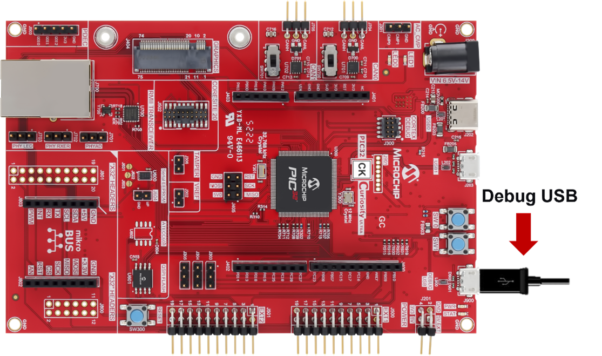
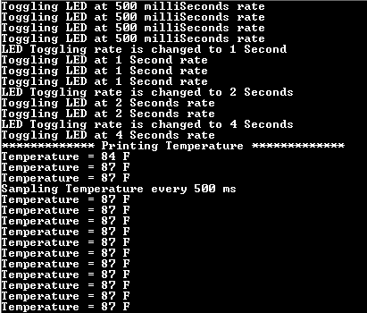

# Getting Started Application on PIC32CK GC01 Curiosity Ultra Development Board
<h2 align="center"> <a href="https://github.com/Microchip-MPLAB-Harmony/reference_apps/releases/latest/download/pic32ck_gc01_getting_started.zip" > Download </a> </h2>

-----
## Description

>  This application demonstrates an LED toggle (LED0 toggles when the switch SW0 is pressed) on a timeout basis and print the LED toggling rate on the serial terminal. The periodicity of the timeout will change from 500 milliseconds to one second, two seconds, four seconds, and back to 500 milliseconds every time you press the switch SW0 on the PIC32CK GC01 Curiosity Ultra Development Board.

> The demo application has an extended functionality to read and print the current room temperature periodically when the extension header (EXT1) is plugged with the I/O1 Xplained Pro Extension Kit. The temperature reading is displayed on a serial console periodically.

## Modules/Technology Used:

- Peripheral Modules      
	- EIC
	- RTC
	- GPIO
	- SERCOM (I2C)
	- SERCOM (UART)
	- DMA
- System Services
	- STDIO
	

## Hardware Used:

- [PIC32CK GC01 Curiosity Ultra Development Board](https://www.microchip.com/en-us/development-tool/ev44p93a)   
- [I/O1 Xplained Pro Extension Kit](https://www.microchip.com/Developmenttools/ProductDetails/ATIO1-XPRO)

## Software/Tools Used:
 This project has been verified to work with the following versions of software tools:  

Refer [Project Manifest](./firmware/src/config/pic32ck_gc01_cult/harmony-manifest-success.yml) present in harmony-manifest-success.yml under the project folder *firmware/src/config/pic32ck_gc01_cult*  
- Refer the [Release Notes](../../../release_notes.md#microchip-mplab-harmony-3-release-notes) to know the **MPLAB X IDE** and **MCC** Plugin version. Alternatively, [Click Here](https://github.com/Microchip-MPLAB-Harmony/reference_apps/blob/master/release_notes.md#microchip-mplab-harmony-3-release-notes).  
- Any Serial Terminal application like Tera Term terminal application.

 Because Microchip regularly update tools, occasionally issue(s) could be discovered while using the newer versions of the tools. If the project doesn’t seem to work and version incompatibility is suspected, It is recommended to double-check and use the same versions that the project was tested with.  To download original version of MPLAB Harmony v3 packages, refer to document [How to Use the MPLAB Harmony v3 Project Manifest Feature](https://ww1.microchip.com/downloads/en/DeviceDoc/How-to-Use-the-MPLAB-Harmony-v3-Project-Manifest-Feature-DS90003305.pdf)

## Setup 1:
- Connect the Type-A male to Micro-B USB cable to Micro-B DEBUG USB port (J900) to program and debug the PIC32CK GC Curiosity Ultra Development Board.
  
  

## Setup 2:  
- Connect the PIC32CK GC01 Curiosity Ultra Development Board to the Host PC as a USB Device through a Type-A male to micro-B USB cable connected to Micro-B Debug USB (J900) port.
- To test the extended functionality, connect the I/O1 Xplained Pro Extension Kit (Temperature Sensor) to J500 (Extension Header 1 (EXT1)) on the PIC32CK GC01 Curiosity Ultra Development Board 

## Programming hex file:
The pre-built hex file can be programmed by following the below steps

### Steps to program the hex file
- Open MPLAB X IDE
- Close all existing projects in IDE, if any project is opened.
- Go to File -> Import -> Hex/ELF File
- In the "Import Image File" window, Step 1 - Create Prebuilt Project, click the "Browse" button to select the prebuilt hex file.
- Select Device has "PIC32CK2051GC01144"
- Ensure the proper tool is selected under "Hardware Tool"
- Click on "Next" button
- In the "Import Image File" window, Step 2 - Select Project Name and Folder, select appropriate project name and folder
- Click on "Finish" button
- In MPLAB X IDE, click on "Make and Program Device" Button. The device gets programmed in sometime.
- Follow the steps in "Running the Demo" section below

## Programming/Debugging Application Project:
- Open the project (pic32ck_gc01_cult_getting_started\firmware\getting_started_pic32ck_gc01_cult.X) in MPLAB X IDE
- Ensure "PIC32CK GC01 Curiosity Ultra" is selected as hardware tool to program/debug the application
- Build the code and program the device by clicking on the "Make and Program Device" button in MPLAB X IDE tool bar
- Follow the steps in "Running the Demo" section below  

**Note:** This application is programmed using the PKOB4 tool pack v1.14.1168. If the user sees issues with programming, please install this tool pack version and use it accordingly.

## Running the Demo:
- Open the Tera Term terminal application on your PC (from the Windows® Start menu by pressing the Start button).
- Set the baud rate to 115200.
- Reset or power cycle the device.
- An LED0 on the PIC32CK GC01 Curiosity Ultra Development Board toggles on every timeout basis and the default periodicity of the timeout is 500 milliseconds.
- And also, the LED toggling rate is displayed on the serial terminal.
- Press the switch SW0 on the PIC32CK GC01 Curiosity Ultra Development Board to change the periodicity of the timeout to one second.
- Every subsequent pressing of the switch SW0 on the PIC32CK GC01 Curiosity Ultra Development Board changes the periodicity of the timeout to 2 seconds, 4 seconds, 500 milliseconds, and back to 1 second in cyclic order.
- **Testing Extended functionality:**
	- Press the switch SW1 on the PIC32CK GC01 Curiosity Ultra Development Board to read and print the Temperature from the Temperature Sensor.
	- The temperature read is displayed on a serial console on a periodical basis.
	- Press the switch SW0 (toggles LED0) on the PIC32CK GC01 Curiosity Ultra Development Board to change the periodicity of the temperature values displayed on the serial console. The periodicity will be changed between 500 milliseconds, one second, two seconds, four seconds and back to 500 milliseconds every time the user presses the switch SW0 on the PIC32CK GC01 Curiosity Ultra Development Board.

- Below diagram shows the sample output log displayed on command prompt.  

     
	
## Comments:
- Reference Training Module on PIC32CX SG61 (with Trustzone): [Arm® TrustZone® Technology Getting Started Application on PIC32CK SG01 (Cortex®-M33) MCUs](https://developerhelp.microchip.com/xwiki/bin/view/software-tools/harmony/pic32ck-trustzone-getting-started-training-module/)
- This application demo builds and works out of box by following the instructions above in "Running the Demo" section. If you need to enhance/customize this application demo, you need to use the MPLAB Harmony v3 Software framework. Refer links below to setup and build your applications using MPLAB Harmony.
	- [How to Setup MPLAB Harmony v3 Software Development Framework](https://ww1.microchip.com/downloads/aemDocuments/documents/MCU32/ProductDocuments/SupportingCollateral/How-to-Setup-MPLAB-Harmony-v3-Software-Development-Framework-DS90003232.pdf)	
	- [Video - How to Set up the Tools Required to Get Started with MPLAB® Harmony v3 and MCC](https://www.youtube.com/watch?v=0rNFSlsVwVw)	
	- [Create a new MPLAB Harmony v3 project using MCC](https://developerhelp.microchip.com/xwiki/bin/view/software-tools/harmony/getting-started-training-module-using-mcc/)
	- [Update and Configure an Existing MHC-based MPLAB Harmony v3 Project to MCC-based Project](https://developerhelp.microchip.com/xwiki/bin/view/software-tools/harmony/update-and-configure-existing-mhc-proj-to-mcc-proj/)
	- [How to Build an Application by Adding a New PLIB, Driver, or Middleware to an Existing MPLAB Harmony v3 Project](https://ww1.microchip.com/downloads/aemDocuments/documents/MCU32/ProductDocuments/SupportingCollateral/How-to-Build-an-Application-by-Adding-a-New-PLIB-Driver-or-Middleware-to-an-Existing-MPLAB-Harmony-v3-Project-DS90003253.pdf)

## Revision:
- v1.7.0 - Released demo application
