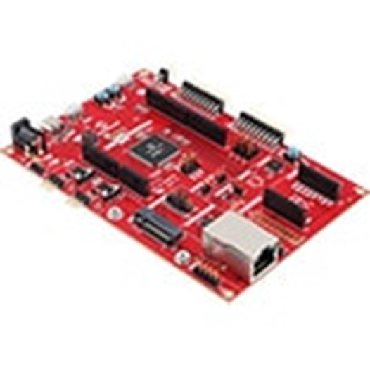

---

title: PIC32CK SG01 Curiosity Ultra Development Board
parent: 32-bit MCU Reference Applications
has_children: true
has_toc: false
nav_order: 8

---

# PIC32CK SG01 Curiosity Ultra Development Board

<h4 align="left">  </h4>

This folder contains the MPLAB® Harmony 3 reference applications developed on [PIC32CK SG01 Curiosity Ultra Development Board](https://www.microchip.com/en-us/development-tool/ea14v17a).

| SI No | Demo Name | Download Link |
| --- | --- | -- |
| 1 | [TrustZone Getting Started on PIC32CK SG01 Curiosity Ultra Development Board](./pic32ck_sg01_cult_tz_getting_started/readme.md) | [Click Here](https://github.com/Microchip-MPLAB-Harmony/reference_apps/releases/latest/download/pic32ck_sg01_cult_tz_getting_started.zip) |

### More Application Demos

For more application demos on **PIC32CK SG01 Curiosity Ultra Development Board** and other Development Boards/Kits having the same part number **(PIC32CK2051SG01144)** <a href="https://mplab-discover.microchip.com/v1/itemtype/com.microchip.ide.project?s0=PIC32CK2051SG01144" target="_blank"> CLICK HERE </a>
