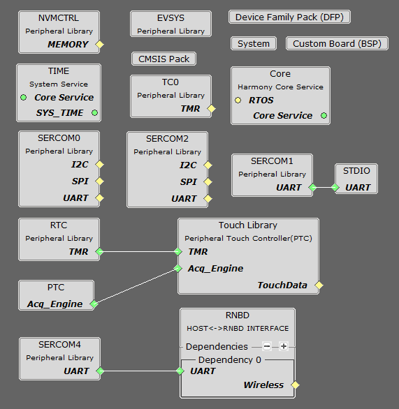
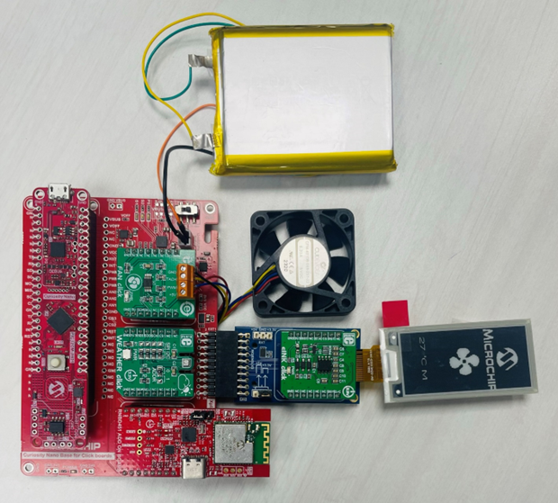
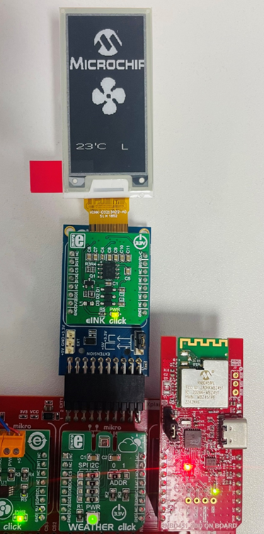
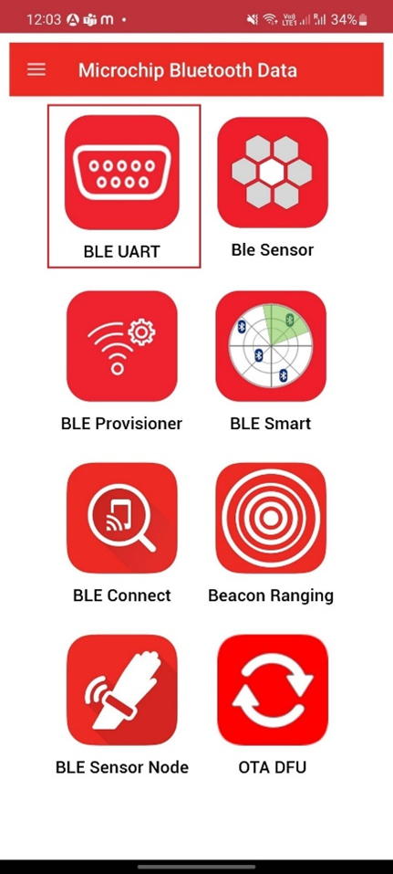
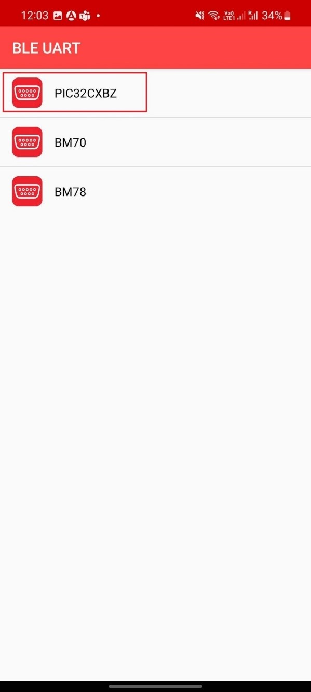
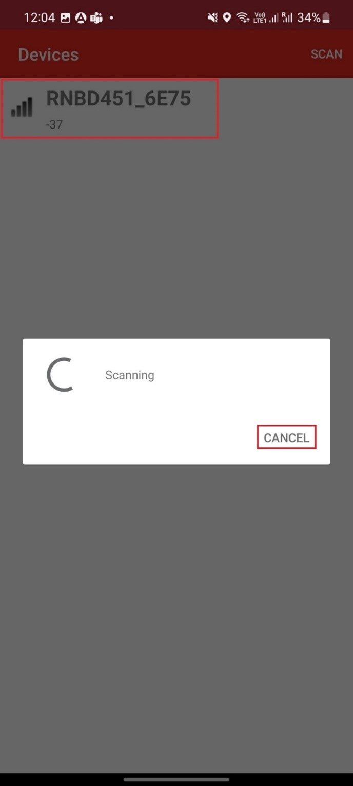
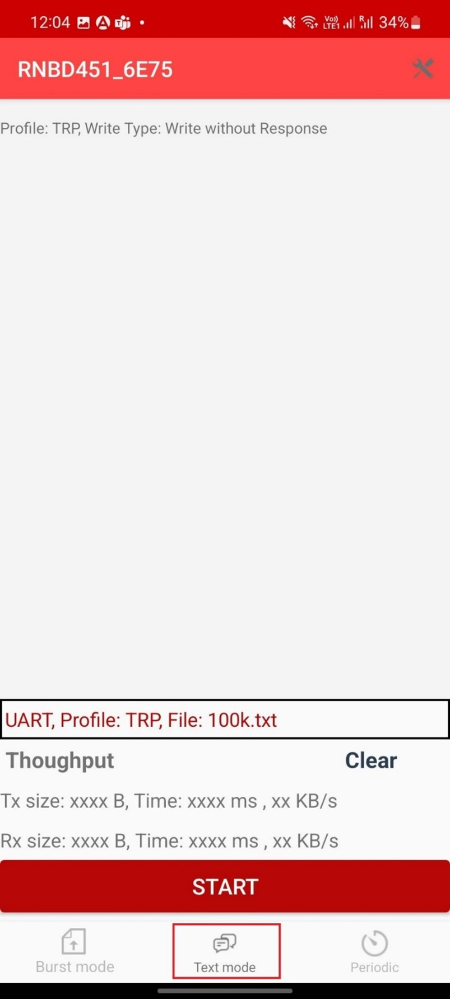
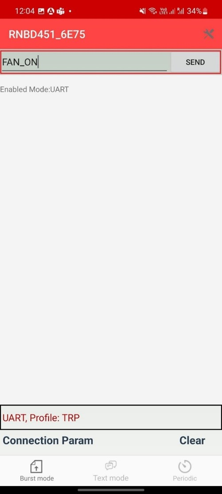
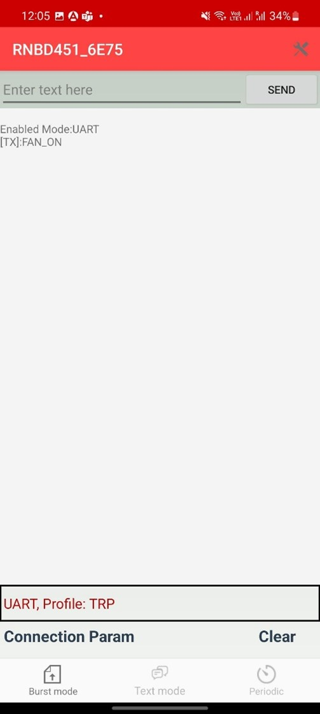

# Smart Appliance Control on PIC32CM JH01 Curiosity Nano+ Touch Evaluation Kit
<h2 align="center"> <a href="https://github.com/Microchip-MPLAB-Harmony/reference_apps/releases/latest/download/pic32cm_jh01_cnano_smart_appliance_control.zip " > Download </a> </h2>

-----
## Description:

> This application demonstrates a smart fan control system that operates in two distinct modes:  
  Temperature control mode and BLE control mode.  
  Users can switch between these modes using the touch sensor built into the Curiosity Nano board. Upon initialization, the application defaults to Temperature control mode. A single press on the touch sensor activates BLE control mode, while a subsequent press reverts the system to Temperature control mode. Furthermore, once the device is in BLE control mode, users can revert to Temperature control mode by either employing the touch sensor or issuing a BLE command.  

1.	**Temperature Control Mode** - Automatically controls the DC fan based on the temperature measurement from Weather Click. Both the temperature value and fan speed are displayed on e-paper display. The temperature ranges for the respective fan speed are;

	a. Temperature between 18 (64 F) to 25 (77 F) degree Celsius, the fan rotates at LOW speed.  
	b. Temperature between 26 (78 F) to 30 (86 F) degree Celsius, the fan rotates at MEDIUM speed.  
	c. Temperature is greater than 30 degree Celsius (86 F), the fan rotates at HIGH speed.  
	d. Temperature is less than 18 (64 F), the fan is switched OFF.  
	

2.	**BLE Control Mode** - Control the DC fan based on BLE commands from Microchip Bluetooth Data (MBD) app in smartphone. Also, the user will be able to switch back to Temperature control mode. The available commands for use are;

	a.	FAN_ON - Turns ‘ON’ the fan at LOW speed  
	b.	FAN_OFF - Turns ‘OFF’ the fan  
	c.	FAN_LOW - Runs the fan at LOW speed  
	d.	FAN_MID - Runs the fan at MEDIUM speed  
	e.	FAN_HIGH - Runs the fan at HIGH speed  
	f.	TEMP_MODE- Switches to Temperature Control mode

## Modules/Technology Used:
- Peripheral Modules
	- SYSTICK
	- Timer
	- SERCOM (I2C)
	- SERCOM (USART)
	- SERCOM (SPI)
	- PTC
	- RTC
	- Wireless RNBD Driver
	- STDIO Library
	- Touch Library

	The MCC Harmony project graph with all the components would look like this; 

	
 

## Hardware Used:

- [PIC32CM JH01 Curiosity Nano+ Touch Evaluation Kit](https://www.microchip.com/en-us/development-tool/EV29G58A)
- [Curiosity Nano Base for click boards](https://www.microchip.com/Developmenttools/ProductDetails/AC164162)
- [Fan Click](https://www.mikroe.com/fan-click)
- [WEATHER CLICK](https://www.mikroe.com/weather-click)
- [RNBD451 Add On Board](https://www.microchip.com/en-us/development-tool/ev25f14a) 
- [MIKROBUS XPLAINED PRO](https://www.microchip.com/en-us/development-tool/atmbusadapter-xpro) 
- [MikroElektronika Eink Click Without Display](https://www.mikroe.com/eink-click-without-display)
- [MikroElektronika E-Paper display 2,9" 296x128 dots display](https://www.mikroe.com/e-paper-display-29-inches)
- [5V DC Fan](https://www.digikey.in/en/products/detail/cui-devices/cfm-4010b-065-251-22/16582006)
- [Lipo Rechargeable Battery](https://www.amazon.in/dp/B0CBHK6Y1X?_encoding=UTF8&psc=1&ref_=cm_sw_r_cp_ud_dp_ZGXMN7B02WBTWNW4XHMS)

## Software/Tools Used:
This project has been verified to work with the following versions of software tools:

Refer [Project Manifest](./firmware/src/config/pic32cm_jh01_cnano/harmony-manifest-success.yml) present in mcc-manifest-generated-success.yml under the project folder *firmware\pic32cm_jh01_cnano.X*

Refer the [Release Notes](https://github.com/Microchip-MPLAB-Harmony/reference_apps/blob/master/release_notes.md) to know the **MPLAB X IDE** and **MCC** Plugin version. Alternatively, [Click Here](https://github.com/Microchip-MPLAB-Harmony/reference_apps/blob/master/release_notes.md)

-    Install [Microchip Bluetooth Data Android App](https://play.google.com/store/apps/details?id=com.microchip.bluetooth.data&hl=en_IN&gl=US) in your Android mobile **or**
-    Install [Microchip Bluetooth Data iOS App](https://apps.apple.com/in/app/microchip-bluetooth-data/id1319166097) in your iOS mobile

Because Microchip regularly updates tools, occasionally issue(s) could be discovered while using the newer versions of the tools. If the project doesn’t seem to work and version incompatibility is suspected, it is recommended to double-check and use the same versions that the project was tested with. https://ww1.microchip.com/downloads/en/DeviceDoc/How-to-Use-the-MPLAB-Harmony-v3-Project-Manifest-Feature-DS90003305.pdf)

## Hardware Setup:
- Mount PIC32CM JH01 Curiosity Nano Evaluation Kit on "CNANO56_HOST_CONN"(U3) connector of Curiosity Nano Base board
- First connect the 4 wires from the Fan Click to the Fan *(Red wire to +5V, Black wire to GND, Blue wire to PWM and Yellow wire to TACH of the Fan Click)* and then mount the Fan Click board onto mikroBUS socket 1 connector of Curiosity Nano Base. The fan click uses the SERCOM0 I2C interface
- Mount the Weather Click board onto mikroBUS socket 2 connector of Curiosity Nano Base. This Weather Click uses the SERCOM0 I2C interface
- Connect the RNBD451 Add On Board to the mikroBUS socket 3 connector of Curiosity Nano Base. The RNBD module uses the SERCOM4 USART interface
- Connect the mikroBUS Xplained Pro to EXT 1 connector of Curiosity Nano Base board and mount the eINK Click and e-paper display onto the mikroBUS Xplained Pro. The e-paper display uses the SERCOM2 SPI interface
- Connect the Lipo Battery to J1 connector of PIC32CM JH01 Curiosity Nano Evaluation Kit and make sure battery switch is toggled to Battery ON position
- Connect the PIC32CM JH01 Curiosity Nano Evaluation Kit to the Host PC as a USB Device, through a Type-A male to micro-B USB cable connected to Micro-B USB (Debug USB) port

 

## Programming hex file:
The pre-built hex file can be programmed by following the below steps.  

### Steps to program the hex file
- Open MPLAB X IDE
- Close all existing projects in IDE, if any project is opened
- Go to File -> Import -> Hex/ELF File
- In the "Import Image File" window, Step 1 - Create     Prebuilt Project, Click the "Browse" button to select the     prebuilt hex file
- Select Device has "PIC32CM5164JH01048"
- Ensure the proper tool is selected under "Hardware Tool"
- Click on Next button
- In the "Import Image File" window, Step 2 - Select Project     Name and Folder, select appropriate project name and folder
- Click on Finish button
- In MPLAB X IDE, click on "Make and Program Device" Button.     The device gets programmed in sometime
- Follow the steps in "Running the Demo" section below

## Programming/Debugging Application Project:
- Open the project *pic32cm_jh01_cnano_smart_appliance_control/firmware/pic32cm_jh01_cnano.X*    in MPLAB X IDE
- Ensure "PIC32CM JH01 Curiosity Nano" is selected as     hardware tool to program/debug the application
- Build the code and program the device by clicking on the "Make     and Program" button in MPLAB X IDE tool bar
- Follow the steps in "Running the Demo" section below

## Running the Demo:
**Temperature Control Mode:**

- The demo initializes working in Temperature Control Mode. Based on the temperature measurement from Weather click, the fan speed will be controlled automatically. The LED1 on the Curiosity Nano is turned ON to indicate that the application is in Temperature Control Mode

- The temperature reading in degree Celsius, and the fan speed will be displayed on the e-paper display. The fan speed will be indicated as follows:

  o  Fan Low speed – ‘L’

  o  Fan High speed – ‘H’

  o  Fan Medium speed – ‘M’

  o  Fan Off – ‘OFF’

 
  

- To switch to BLE Control Mode, press the touch button once. LED1 turns OFF indicating that the application has switched to BLE Control Mode.

- Once the device switches to BLE Control Mode, the user can control the fan by following the steps mentioned below

Note: Users should wait for the e-paper display to stabilize before pressing the touch button

**BLE Control Mode:**

- Enable Bluetooth and Location from Smartphone settings

- Open the "**Microchip Bluetooth Data” (MBD)** application on your smartphone and tap on the “BLE UART" icon on the dashboard. If prompted, allow the application to turn on Bluetooth

  

- Now, scan for Bluetooth devices by tapping "PIC32CXBZ" -> "SCAN" -> "SCAN" options on the MBD app

  

 

- The RNBD device should appear as **RNBD451_XXXX** in the list of Bluetooth devices

- Once you see the " **RNBD451_XXXX** " device, click on the "CANCEL" button to cancel the device scanning

 

- Tap on the " **RNBD451_XXXX**" device to connect to the device

 

- Once the device is connected, tap on the "Text mode” to transfer data to device to build the communication interface between demo application and MBD app

 

- Now send the command FAN_ON and click send to turn on the fan

 

 

- User can provide the available BLE commands for this application to control the fan as desired

- In order to return to Temperature Control Mode again, user can either press the touch button again or send the BLE command 'TEMP_MODE'. LED1 turns on again, indicating that the application has switched to Temperatue Control Mode

## Comments:
- This application demo builds and works out of box by following the instructions above in [Running the Demo](#running-the-demo) section. If you need to enhance/customize this application demo, you need to use the MPLAB Code Configurator. Refer the below link to create your application using MCC Harmony.
  
  - [Create a new MPLAB Harmony v3 project using MCC](https://microchipdeveloper.com/harmony3:getting-started-training-module-using-mcc)
	- [How to Set up the Tools Required to Get Started with MPLAB® Harmony v3 and MCC](https://www.youtube.com/watch?v=0rNFSlsVwVw)
	- [Creating the First Application on PIC32CM JH01 Microcontrollers Using MPLAB Harmony v3 with MPLAB Code Configurator (MCC)](https://www.microchip.com/content/dam/mchp/documents/MCU32/ProductDocuments/SupportingCollateral/Creating-the-First-Application-on-PIC32CM-JH01-Microcontrollers-Using-MPLAB-Harmony-v3-with-MCC-DS90003353.pdf)	

## Revision:
- v1.7.0 - Released demo application
