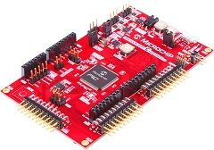

# PIC32CM JH01 Curiosity Pro Development Board
<h4 align="left">  </h4>

This folder contains the MPLAB® Harmony 3 reference applications developed on [PIC32CM JH01 Curiosity Pro Development Board](https://www.microchip.com/DevelopmentTools/ProductDetails/PartNO/EV81X90A).

|SI No| Demo Name | Download Link |
| --- | --- | -- |
| 1 | [Getting Started](./pic32cm_jh01_cpro_getting_started/readme.md) | [Click Here](https://github.com/Microchip-MPLAB-Harmony/reference_apps/releases/latest/download/pic32cm_jh01_cpro_getting_started.zip) |

### More Application Demos

For more application demos on **PIC32CM JH01 Curiosity Pro Development Board** and other Development Boards/Kits having the same part number **(PIC32CM5164JH01100)** <a href="https://mplab-discover.microchip.com/v1/itemtype/com.microchip.ide.project?s0=PIC32CM5164JH01100" target="_blank"> CLICK HERE </a>
