# Low Power Application on PIC32CM LE00 Curiosity Pro Evaluation Kit
<h2 align="center"> <a href="https://github.com/Microchip-MPLAB-Harmony/reference_apps/releases/latest/download/pic32cm_le00_cpro_low_power.zip" > Download </a> </h2>

-----
## Description

> The application demonstrates low power application on PIC32CM LE00 Curiosity Pro Evaluation Kit. On power-up, the device is set to Standby Sleep mode. The device wakes up from Standby mode and enters Active mode when you cover the light sensor (by placing a hand over it, for example) on the I/O1 Xplained Pro Extension kit. The application periodically prints room temperature on a serial terminal while the light sensor is covered. The device goes back to Standby mode when you uncover the light sensor. LED0 on the PIC32CM LE00 Curiosity Pro evaluation kit is toggled every time the temperature is displayed on the serial console. When you press the switch button SW1, the application switches Sleep mode from Standby mode to Idle mode.

## Modules/Technology Used:

- Peripheral Modules
	- I2C
	- RTC
	- USART
	- DMAC
	- ADC
	- PM
	- SUPC
	- EIC
	- EVSYS

## Hardware Used:

- [PIC32CM LE00 Curiosity Pro Evaluation Kit](https://www.microchip.com/en-us/development-tool/ev80p12a)
- [I/O1 Xplained Pro Extension Kit](https://www.microchip.com/Developmenttools/ProductDetails/ATIO1-XPRO)  

 **Note**: The application is being developed on a PIC32CM LE00 CPRO - Revision 04 Evaluation Kit. Ensure that you use the same revision on the evaluation Kit before going further, else you could face issues with power consumption values.  

## Software/Tools Used:
 This project has been verified to work with the following versions of software tools:  

Refer [Project Manifest](./firmware/src/config/pic32cm_le00_cpro/harmony-manifest-success.yml) present in harmony-manifest-success.yml under the project folder *firmware/src/config/pic32cm_le00_cpro*  
- Refer the [Release Notes](../../../release_notes.md#development-tools) to know the **MPLAB X IDE** and **MCC** Plugin version. Alternatively, [Click Here](https://github.com/Microchip-MPLAB-Harmony/reference_apps/blob/master/release_notes.md#development-tools)  
- Any Serial Terminal application like Tera Term terminal application.

 Because Microchip regularly update tools, occasionally issue(s) could be discovered while using the newer versions of the tools. If the project doesn’t seem to work and version incompatibility is suspected, It is recommended to double-check and use the same versions that the project was tested with.  To download original version of MPLAB Harmony v3 packages, refer to document [How to Use the MPLAB Harmony v3 Project Manifest Feature](https://ww1.microchip.com/downloads/en/DeviceDoc/How-to-Use-the-MPLAB-Harmony-v3-Project-Manifest-Feature-DS90003305.pdf)

## Setup:
- Connect the I/O1 Xplained Pro Extension kit to the Extension Header 1 (EXT1) of the PIC32CM LE00 Curiosity Pro Evaluation Kit
- Connect a USB cable to the DEBUG USB port for programming  
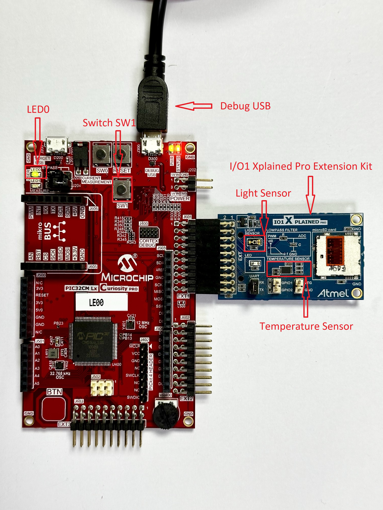
## Programming hex file:
The pre-built hex file can be programmed by following the below steps.  

### Steps to program the hex file
- Open MPLAB X IDE
- Close all existing projects in IDE, if any project is opened.
- Go to File -> Import -> Hex/ELF File
- In the "Import Image File" window, Step 1 - Create Prebuilt Project, Click the "Browse" button to select the prebuilt hex file.
- Select Device has "PIC32CM5164LE00100"
- Ensure the proper tool is selected under "Hardware Tool"
- Click on Next button
- In the "Import Image File" window, Step 2 - Select Project Name and Folder, select appropriate project name and folder
- Click on Finish button
- In MPLAB X IDE, click on "Make and Program Device" Button. The device gets programmed in sometime
- Follow the steps in "Running the Demo" section below

## Programming/Debugging Application Project:
- Open the project (pic32cm_le00_cpro_low_power\firmware\pic32cm_le00_cpro.X) in MPLAB X IDE.
- Ensure "PIC32CM LE00 Curiosity Pro (EDBG)" is selected as hardware tool to program/debug the application.
- Build the code and program the device by clicking on the "make and program" button in MPLAB X IDE tool bar.
- Follow the steps in "Running the Demo" section below.  

## Running the Demo:
- Open Tera Term, connect to serial console. If there is any connection issue on tera terminal, unplug the USB cable
connected to Micro-B port, and reconnect it back.
- Change the baud rate to 115200
- Perform a reset by pressing the "RESET" switch
- Verify the application title message is displayed  
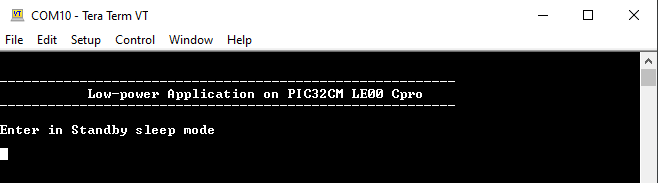  
- Cover the light sensor on the I/O1 Xplained Pro Extension Kit by placing your hand over it (or another element to put the light sensor in a dark environment) to print the temperature and message on the terminal. You should see the following messages (containing the temperature value in °F) on the terminal every 500 milliseconds for the duration the light sensor is covered  
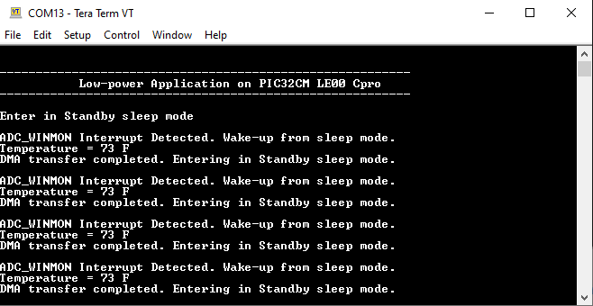  
- Observe Current Consumption on Data Visualizer  
 **Note**:The Data Visualizer is a program to process and visualize data. The Data Visualizer can receive data from various sources such as the Embedded Debugger Data Gateway Interface (EDBG DGI) and COM ports. It is possible to track an application in run-time using a terminal graph or oscilloscope. It analyzes the power consumption of an application through correlation of code execution and power consumption when used together with a supported probe or board.
- Open the Data Visualizer application from your PC and select the connected PIC32CM LE00 Curiosity Pro Revision - 04 Evaluation Kit on the DGI Control Panel, then click on Connect. The Data Visualizer will then start searching for protocols from the PIC32CM LE00 Curiosity Pro Evaluation Kit through the EDBG  
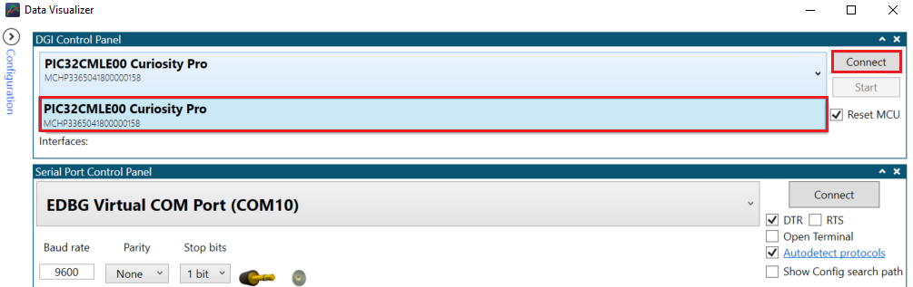
- Once the Data Visualizer is connected to the PIC32CM LE00 EDBG, different interfaces will appear. Select the Power interface and click on the Start button to start measuring the power consumption of the device  
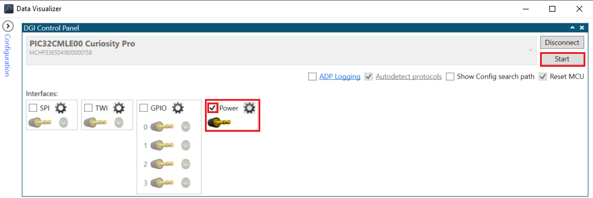
- Ensure that the jumpers for Current Measurement on the PIC32CM LE00 Curiosity Pro are set to MEASURE for the MCU and BYPASS for the I/Os  
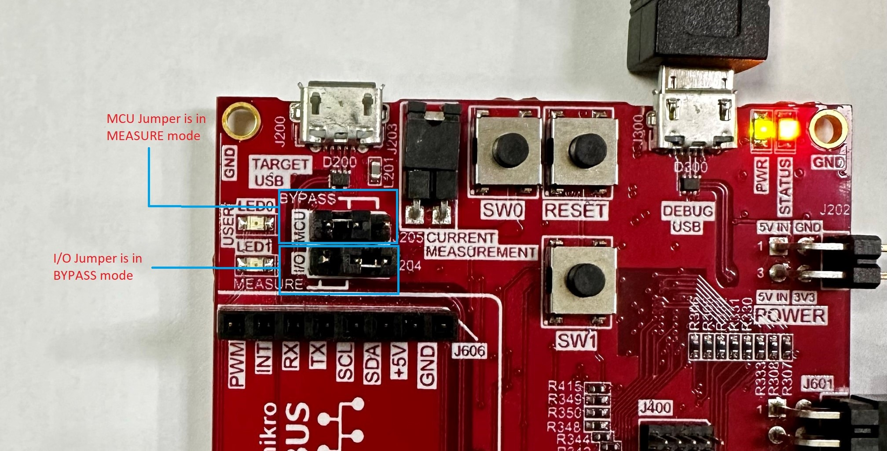
- The Power Analysis window will appear on the Data Visualizer tool interface  
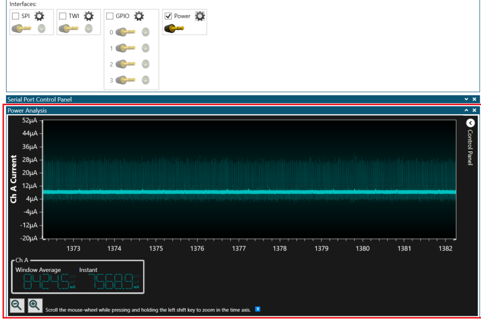  
- The image shows the device in Standby mode with its measured power consumption.  

  
 **Note**: The average value is considered when measuring the power consumption of the device because the instant value is not stable. Then, the power consumption of the device in Standby mode is 8.45 µA.  
- Cover the light sensor on the I/O1 Xplained Pro Extension Kit by placing your hand over it (or another element) to print the temperature on the terminal and observe the power consumption of the device. And notice 500ms RTC timer expiry when light sensor is covered. 
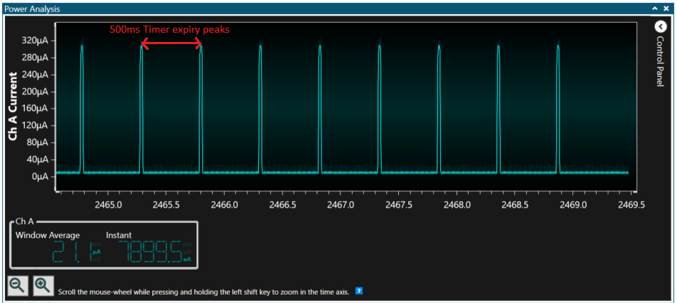
- Press the SW1 button to switch from Standby mode to Idle mode. The following image shows the transition of the power consumption from Standby mode to Idle mode  
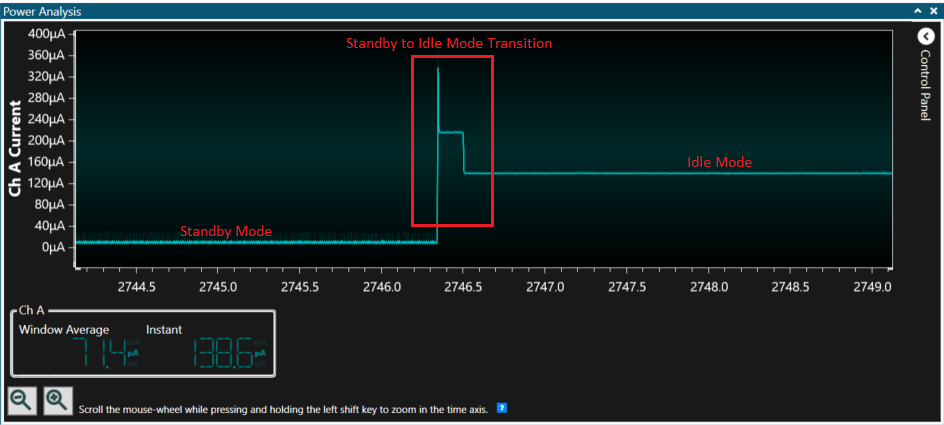
- The following image shows the device in Idle mode with a measured power consumption of 138 µA  
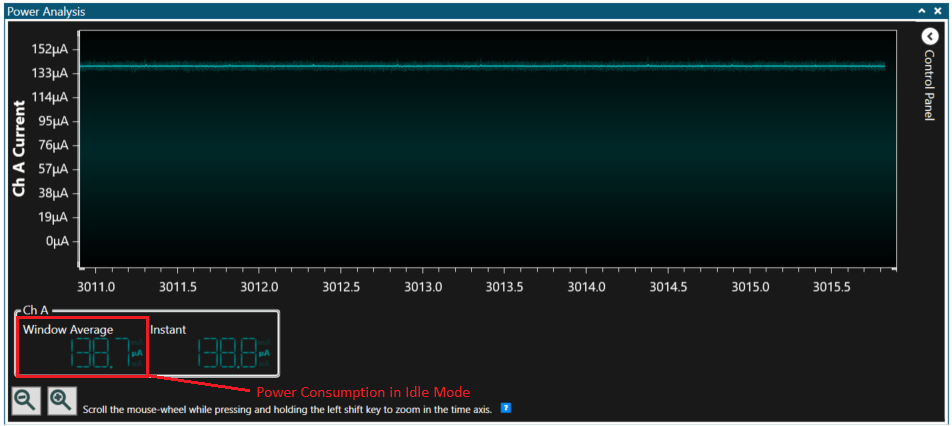  
- Place your hand over the light sensor. The device will wake up on the next ADC window monitor interrupt, read and print data on serial and then re-enter Standby mode. The following image shows the transition of the power consumption by switching from Idle mode to Standby mode  
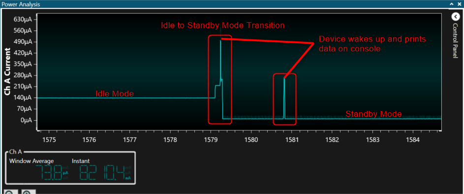

## Comments:
- Reference Training Module: [Low Power Application on SAML21 (Cortex M0+) MCUs Using MPLAB Harmony v3 Peripheral Libraries](https://microchipdeveloper.com/harmony3:low-power-application-on-saml21#Steps_anchor)
- This application demo builds and works out of box by following the instructions above in "Running the Demo" section. If you need to enhance/customize this application demo, you need to use the MPLAB Harmony v3 Software framework. Refer links below to setup and build your applications using MPLAB Harmony.
	- [How to Setup MPLAB Harmony v3 Software Development Framework](https://ww1.microchip.com/downloads/en/DeviceDoc/How_to_Setup_MPLAB_%20Harmony_v3_Software_Development_Framework_DS90003232C.pdf)
	- [How to Build an Application by Adding a New PLIB, Driver, or Middleware to an Existing MPLAB Harmony v3 Project](http://ww1.microchip.com/downloads/en/DeviceDoc/How_to_Build_Application_Adding_PLIB_%20Driver_or_Middleware%20_to_MPLAB_Harmony_v3Project_DS90003253A.pdf)  	
	-  **MPLAB Harmony v3 is also configurable through MPLAB Code Configurator (MCC). Refer to the below links for specific instructions to use MPLAB Harmony v3 with MCC.**
		- [Create a new MPLAB Harmony v3 project using MCC](https://microchipdeveloper.com/harmony3:getting-started-training-module-using-mcc)
		- [Update and Configure an Existing MHC-based MPLAB Harmony v3 Project to MCC-based Project](https://microchipdeveloper.com/harmony3:update-and-configure-existing-mhc-proj-to-mcc-proj)
		- [Getting Started with MPLAB Harmony v3 Using MPLAB Code Configurator](https://www.youtube.com/watch?v=KdhltTWaDp0)
		- [MPLAB Code Configurator Content Manager for MPLAB Harmony v3 Projects](https://www.youtube.com/watch?v=PRewTzrI3iE)

## Revision:
- v1.7.0 - Released demo application

