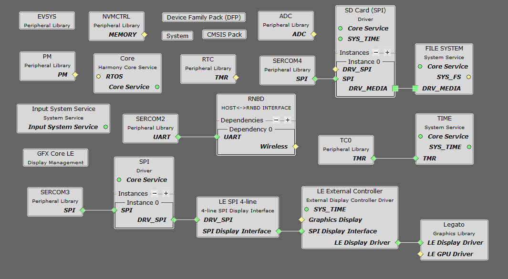
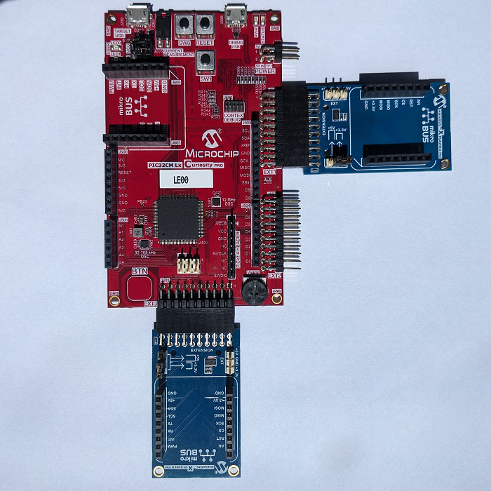
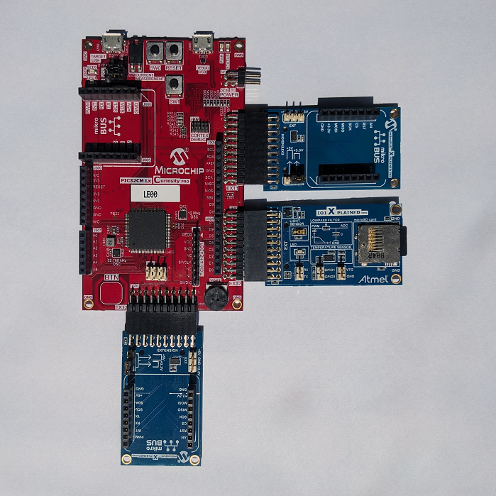
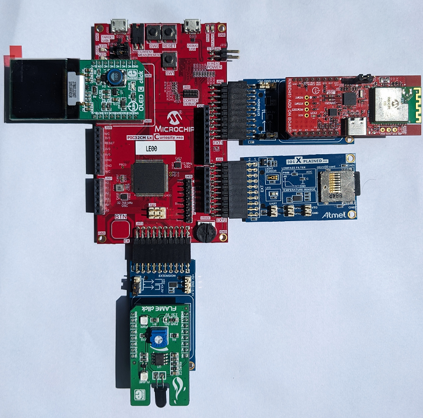
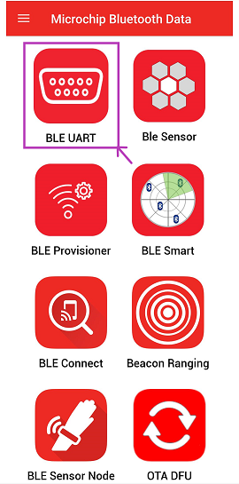
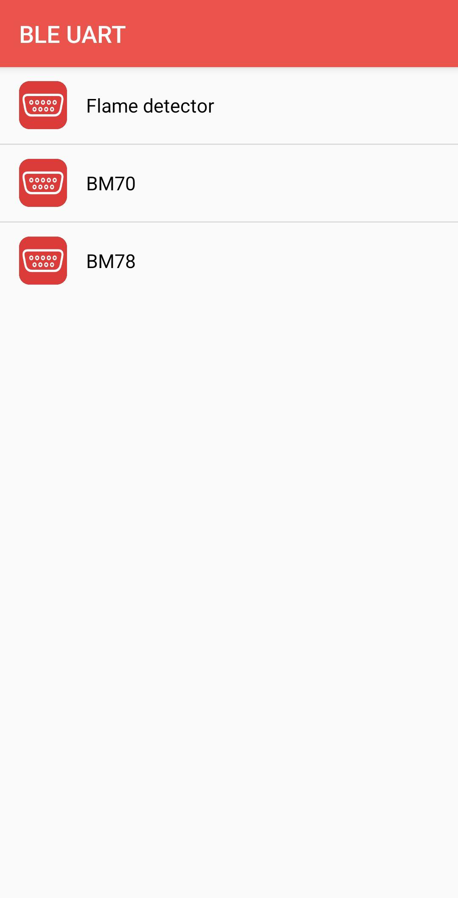
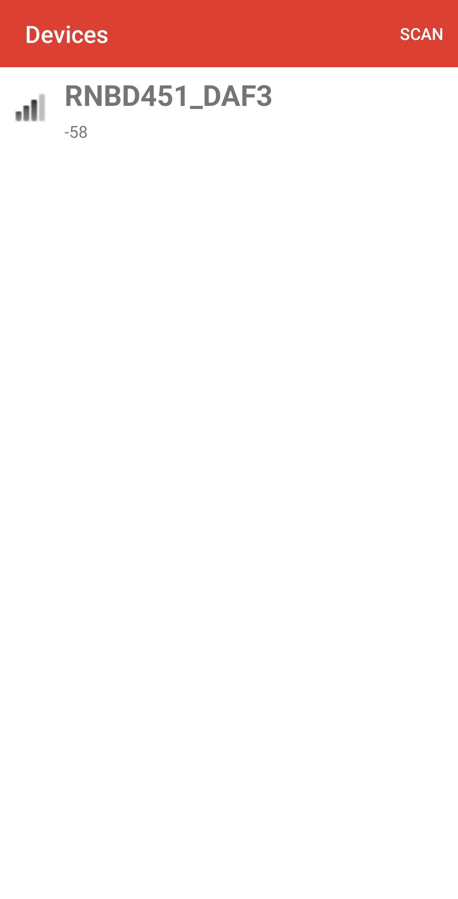
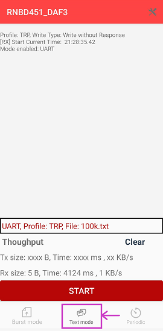
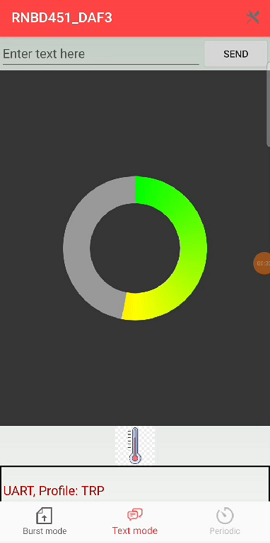

# Smart Flame Detector Application Demonstration on PIC32CM LE00 Curiosity Pro Evaluation Kit
<h2 align="center"> <a href="https://github.com/Microchip-MPLAB-Harmony/reference_apps/releases/latest/download/pic32cm_le00_cpro_smart_smoke_detector.zip" > Download </a> </h2>

## Description:
> This application demonstrates detection of flame using Flame Click, and if the flame has been detected, it alerts through the Microchip Bluetooth Data (MDB App) and on the OLED Display.

> Further, the flame detection data is also logged with the help of SD Card (Along RTC Timestamp). Additionally, user can reset the RTC timestamp by pressing SW0 switch.

## Modules/Technology Used:
- Peripheral Modules
    - ADC
    - SERCOM (USART)
    - SERCOM (SPI)
    - GPIO
    - RTC
    - TC
    - NVMCTRL
    - PM
- Drivers Modules
    - SD Card (SPI)
    - Wireless RNBD
    - Graphics Interface (LE SPI 4-line)
    - Graphics Driver (LE External Controller)
    - Graphics Middleware (Legato)
- System Services
    - Time
    - File System

    The MCC Harmony project graph with all the components would look like this;
 
    
 

## Hardware Used:
| Hardware                                                                                                  | Nos. Required |
| --------------------------------------------------------------------------------------------------------- | ------------- |
| [PIC32CM LE00 Curiosity Pro Evaluation Kit](https://www.microchip.com/en-us/development-tool/EV80P12A)    | 1 |
| [I/O1 Xplained Pro Extension Kit](https://www.microchip.com/Developmenttools/ProductDetails/ATIO1-XPRO)   | 1 |
| [RNBD451 Add On Board](https://www.microchip.com/en-us/development-tool/ev25f14a)                         | 1 |
| [OLED C CLICK](https://www.mikroe.com/oled-c-click)                                                       | 1 |
| [FLAME CLICK](https://www.mikroe.com/flame-click)                                                         | 1 |
| [mikroBUS Xplained Pro](https://www.microchip.com/en-us/development-tool/atmbusadapter-xpro)              | 2 |
| SD Card                                                                                                   | 1 |
## Software/Tools Used:
This project has been verified to work with the following versions of software/development tools:
- Refer [Project Manifest](./firmware/src/config/pic32cm_le00_cpro/harmony-manifest-success.yml) present in harmony-manifest-success.yml under the project folder *firmware/src/config/pic32cm_le00_cpro*

 Because Microchip regularly update tools, occasionally issue(s) could be discovered while using the newer versions of the tools. If the project doesn’t seem to work and version incompatibility is suspected, It is recommended to double-check and use the same versions that the project was tested with.  To download original version of MPLAB® Harmony v3 packages, refer to the document [How to Use the MPLAB® Harmony v3 Project Manifest Feature](https://ww1.microchip.com/downloads/en/DeviceDoc/How-to-Use-the-MPLAB-Harmony-v3-Project-Manifest-Feature-DS90003305.pdf)

## Hardware Setup:
- Connect the two **mikroBUS Xplained Pro** boards to the **Extension Header EXT1 (J601)** and **Extension Header EXT3 (J603)** of the **PIC32CM LE00 Curiosity Pro Evaluation Kit**, as shown below:
  
 
- Connect the **I/O1 Xplained Pro Extension Kit** to the **Extension Header EXT2 (J602)** of the **PIC32CM LE00 Curiosity Pro Evaluation Kit** and plug the SD Card into the **microSD Card Connector** of the **I/O1 Xplained Pro Extension Kit**, as shown below:
  
 
- Mount the **FLAME CLICK** on the **mikroBUS Xplained Pro** which has been connected to the **Extension Header EXT3 (J603)**, and mount the  **RNBD451 Add On Board** on the **mikroBUS Xplained Pro** which has been connected to the **Extension Header EXT1 (J601)** of the **PIC32CM LE00 Curiosity Pro Evaluation Kit**, as shown below:
  
 
- Mount the **OLED C CLICK** on the **mikroBUS Header Connector** of the **PIC32CM LE00 Curiosity Pro Evaluation Kit**, as shown below:
  
  
- The overall hardware set-up of the demo is as shown below:
  
 
- Using a **Type-A USB-Micro-B USB cable**, connect the **Type-A Male** to your PC, and **Micro-B USB Male** to your **Micro-B DEBUG USB port (J300)** of the **PIC32CM LE00 Curiosity Pro Evaluation Kit** to power it, and to program and debug the application.

## RNBD Setup:
Follow these instructions to setup the RNBD before running the demo:
- Connect the **RNBD451 Add On Board** as a standalone to your host microcontroller or PC, using a **USB Type-C Cable**. To power this standalone module, change the **Power Supply Selection (J7)** jumper
- Open a serial terminal application (such as Tera Term) on your PC
- To enter command mode, send the charaters **$$$** as instruction
- Set the baud rate to 9600 using SB command and the instruction is **SB,03**
- Enable pin UART Transparent mode and Bluetooth Status LED using SR command and the instruction is **SR,0101**
- Reboot the module to save the changes using R command with the instruction **R,1**
- Reposition the **Power Supply Selection (J2)** jumper to power from the host board and mount the **RNBD451 Add On Board** on the hardware setup 

## Programming hex file:
The pre-built hex file can be programmed by following the below steps:
### Steps to program the hex file:
- Open MPLAB® X IDE
- Close all existing projects in IDE, if any project is opened.
- Go to **File** -> **Import** -> **Hex/ELF** File
- In the "**Import Image File" window**, Step 1 - Create **Prebuilt Project**, click the "**Browse**" button to select the prebuilt hex file.
- Select Device has "**PIC32CM5164LE00100**"
- Ensure the proper tool is selected under "**Hardware Tool**"
- Click on "**Next**" button
- In the "**Import Image File**" window, Step 2 - Select Project Name and Folder, select appropriate project name and folder
- Click on "**Finish**" button
- In MPLAB® X IDE, click on "**Make and Program Device**" Button. The device gets programmed in sometime.
- Follow the steps in the [Running the Demo](#running-the-demo) section below
## Programming/Debugging Application Project:
- Open the project (**pic32cm_le00_cpro_smart_smoke_detector/firmware/pic32cm_le00_cpro.X**) in MPLAB® X IDE
- Ensure **"PIC32CM LE00 Curiosity Pro"** is selected as hardware tool to program/debug the application
- Build the code and program the device by clicking on the **"Make and Program Device"** button in MPLAB® X IDE tool bar
- Once programming is complete and successful, **perform a power cycle of the board**.
  - **Note:** A power cycle is mandatory because only upon power-on-reset (POR), does the SPI_SCK pin which is shared between OLED and RNBD reinstates as expected. Else, the OLED may not start-up properly.
- Follow the steps in [Running the demo](#running-the-demo) section below
## Running the Demo:
- Perform [Hardware Setup](#hardware-setup) and [Programming/Debugging Application Project](#programmingdebugging-application-project) steps mentioned above, if not done already.
- For demonstration, the **Flame Click** is used to detect the flame. Shining a flashlight on the flame click sensor should be good enough to trigger it, for demo purposes.
- If the flame has been detected, the **Flame** Labeled LED(Flame Presence LED Indicator) in the **Flame Click** will glow.
- The OLED display shows the ADC result values of the Flame sensor periodically as shown here:
  
 
- The SD Card log the flame detection message along with the Timestamp (RTC).
- To get the fire alarm detection in the mobile app, please proceed the following steps:
  - Install the Microchip Bluetooth Data Android App in your Android Smartphone using the **MicrochipBluetoothData_Smartsmoke.apk** file under the project folder *Android_App*. Alternatively, [Click here](https://github.com/Microchip-MPLAB-Harmony/reference_apps/releases/latest/download/MicrochipBluetoothData_Smartsmoke.apk) to download it.
  - Enable and allow Bluetooth and location from Smartphone settings
  - Open the "**Microchip Bluetooth Data (MBD)**" android app from your smartphone and tap on "**BLE UART**" icon on the dashboard. If prompted, allow the application to turn on Bluetooth, as shown:
    
   
	- Click on flame detector option from the list, as shown:  
	
   
	- Now, scan for RNBD451 Bluetooth device under the Device window and connect it. The RNBD device should appear as **RNBD451_XXXX (deviceId)** in the list of Bluetooth devices. After, click on it. *Note, for your setup, the deviceId may vary*
    
   
	- Select the **"Text Mode option"**, as shown:  
    
   
	- Then, the GUI of the mobile app, displays the fire detection data, as shown:
    
 

## Comments:
- Reference Material:
  - [Getting Started With the PIC32CM LE00 Curiosity Pro Evaluation Kit](https://youtu.be/Z5cWjyYZa5g?si=-j7fUB_kQp6PpTFr)
  - [Low Power Application on PIC32CM LE00 (Cortex M23) MCUs Using MPLAB® Harmony v3 Peripheral Libraries](https://microchipdeveloper.com/xwiki/bin/view/software-tools/harmony/low-power-application-on-pic32cm-le00)
- This application demo builds and works out of box by following the instructions above in [Running the Demo](#running-the-demo) section. If you need to enhance/customize this application demo, you need to use the MPLAB® Harmony v3 Software framework. Refer links below to setup and build your applications using MPLAB® Harmony v3.
	- [How to Setup MPLAB Harmony v3 Software Development Framework](https://ww1.microchip.com/downloads/aemDocuments/documents/MCU32/ProductDocuments/SupportingCollateral/How-to-Setup-MPLAB-Harmony-v3-Software-Development-Framework-DS90003232.pdf)	
	- [Video - How to Set up the Tools Required to Get Started with MPLAB® Harmony v3 and MCC](https://www.youtube.com/watch?v=0rNFSlsVwVw)	
	- [Create a new MPLAB Harmony v3 project using MCC](https://developerhelp.microchip.com/xwiki/bin/view/software-tools/harmony/getting-started-training-module-using-mcc/)
	- [Update and Configure an Existing MHC-based MPLAB Harmony v3 Project to MCC-based Project](https://developerhelp.microchip.com/xwiki/bin/view/software-tools/harmony/update-and-configure-existing-mhc-proj-to-mcc-proj/)
	- [How to Build an Application by Adding a New PLIB, Driver, or Middleware to an Existing MPLAB Harmony v3 Project](https://ww1.microchip.com/downloads/aemDocuments/documents/MCU32/ProductDocuments/SupportingCollateral/How-to-Build-an-Application-by-Adding-a-New-PLIB-Driver-or-Middleware-to-an-Existing-MPLAB-Harmony-v3-Project-DS90003253.pdf)	
## Revision
- v1.7.0 Initial Release of the demo.