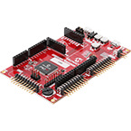

# PIC32CM LE00 Curiosity Pro Evaluation Kit
<h4 align="left">  </h4>

This folder contains the MPLAB® Harmony 3 reference applications developed on [PIC32CM LE00 Curiosity Pro Evaluation Kit](https://www.microchip.com/en-us/development-tool/EV80P12A).

|SI No| Demo Name | Download Link |
| --- | --- | -- |
| 1 | [Getting Started Extended](./pic32cm_le00_cpro_getting_started_ext/readme.md) | [Click Here](https://github.com/Microchip-MPLAB-Harmony/reference_apps/releases/latest/download/pic32cm_le00_cpro_getting_started_ext.zip) |
| 2 | [Low Power](./pic32cm_le00_cpro_low_power/readme.md) | [Click Here](https://github.com/Microchip-MPLAB-Harmony/reference_apps/releases/latest/download/pic32cm_le00_cpro_low_power.zip) |

### More Application Demos

For more application demos on **PIC32CM LE00 Curiosity Pro Evaluation Kit** and other Development Boards/Kits having the same part number **(PIC32CM5164LE00100)** <a href="https://mplab-discover.microchip.com/v1/itemtype/com.microchip.ide.project?s0=PIC32CM5164LE00100" target="_blank"> CLICK HERE </a>
