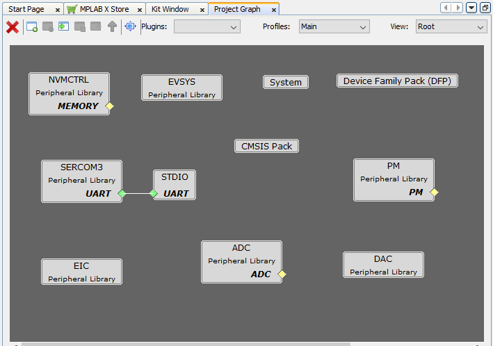
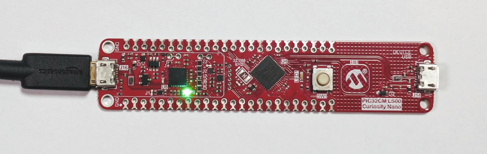
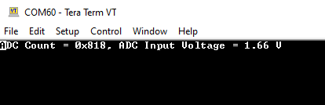

# Example of ADC Sample on PIC32CM LS00 Curiosity Nano+ Touch Evaluation Kit
<h2 align="center"> <a href="https://github.com/Microchip-MPLAB-Harmony/reference_apps/releases/latest/download/adc_sample.zip" > Download </a> </h2>

-----
## Description:
	
>  The application demonstrates how the DAC output is fed to an analog input for the ADC conversion. An analog input is converted by a software trigger and the converted value is displayed on the serial terminal. DAC output is changed by 0.1 V upon switch press (SW1).
	
	
## Modules/Technology Used:
- Peripheral Modules
	- EVSYS
	- NVMCTRL
	- PM
	- ADC
	- DAC
	- EIC
	- SERCOM (UART)
	- SYSTICK
	- PORT

	The MCC Harmony project graph with all the components would look like this; 

    

## Hardware Used:

- [PIC32CM LS00 Curiosity Nano+ Touch Evaluation Kit](https://www.microchip.com/DevelopmentTools/ProductDetails/PartNO/EV41C56A)

## Software/Tools Used:
 This project has been verified to work with the following versions of software tools:  

Refer [Project Manifest](./firmware/adc/src/config/pic32cm_ls00_cnano/harmony-manifest-success.yml) present in harmony-manifest-success.yml under the project folder *firmware\adc\src\config\pic32cm_ls00_cnano*  
- Refer the [Release Notes](../../../../../release_notes.md#development-tools) to know the **MPLAB X IDE** and **MCC** Plugin version. Alternatively, [Click Here](https://github.com/Microchip-MPLAB-Harmony/reference_apps/blob/master/release_notes.md#development-tools).
- Any Serial Terminal application like Tera Term/PuTTY terminal application.

 Because Microchip regularly update tools, occasionally issue(s) could be discovered while using the newer versions of the tools. If the project doesn’t seem to work and version incompatibility is suspected, It is recommended to double-check and use the same versions that the project was tested with.  To download original version of MPLAB Harmony v3 packages, refer to document [How to Use the MPLAB Harmony v3 Project Manifest Feature](https://ww1.microchip.com/downloads/en/DeviceDoc/How-to-Use-the-MPLAB-Harmony-v3-Project-Manifest-Feature-DS90003305.pdf)

## Setup:
- Connect the PIC32CM LS00 Curiosity Nano+ Touch Evaluation Kit to the Host PC as a USB Device through a Type-A male to micro-B USB cable connected to Micro-B USB (Debug USB) port  

  
## Programming hex file:
The pre-built hex file can be programmed by following the below steps.  

### Steps to program the hex file
- Open MPLAB X IDE
- Close all existing projects in IDE, if any project is opened.
- Go to File -> Import -> Hex/ELF File
- In the "Import Image File" window, Step 1 - Create Prebuilt Project, Click the "Browse" button to select the prebuilt hex file.
- Select Device has "PIC32CM5164LS00048"
- Ensure the proper tool is selected under "Hardware Tool"
- Click on Next button
- In the "Import Image File" window, Step 2 - Select Project Name and Folder, select appropriate project name and folder
- Click on Finish button
- In MPLAB X IDE, click on "Make and Program Device" Button. The device gets programmed in sometime
- Follow the steps in "Running the Demo" section below

## Programming/Debugging Application Project:
- Open the project (adc_sample\firmware\adc\pic32cm_ls00_cnanogroup) in MPLAB X IDE
- Ensure "PIC32CM LS00 Curiosity Nano" is selected as hardware tool to program/debug the application
- Build the code and program the device by clicking on the "make and program" button in MPLAB X IDE tool bar
- Follow the steps in "Running the Demo" section below

## Running the Demo:
- Open the Tera Term/PuTTY terminal application on your PC (from the Windows® Start menu by pressing the Start button)
- Set the baud rate to 115200

## Tera Term Output:
- Observe the output message on console (Tera Term).

   

## Comments:
- Reference Training Module: [Arm TrustZone Getting Started Application on PIC32CM LS60 (Arm Cortex-M23) MCUs](https://developerhelp.microchip.com/xwiki/bin/view/software-tools/harmony/pic32cm-trustzone-getting-started-training-module/)
- This application demo builds and works out of box by following the instructions above in "Running the Demo" section. If you need to enhance/customize this application demo, you need to use the MPLAB Harmony v3 Software framework. Refer links below to setup and build your applications using MPLAB Harmony.
	- [How to Setup MPLAB Harmony v3 Software Development Framework](https://ww1.microchip.com/downloads/aemDocuments/documents/MCU32/ProductDocuments/SupportingCollateral/How-to-Setup-MPLAB-Harmony-v3-Software-Development-Framework-DS90003232.pdf)	
	- [Video - How to Set up the Tools Required to Get Started with MPLAB® Harmony v3 and MCC](https://www.youtube.com/watch?v=0rNFSlsVwVw)	
	- [Create a new MPLAB Harmony v3 project using MCC](https://developerhelp.microchip.com/xwiki/bin/view/software-tools/harmony/getting-started-training-module-using-mcc/)
	- [Update and Configure an Existing MHC-based MPLAB Harmony v3 Project to MCC-based Project](https://developerhelp.microchip.com/xwiki/bin/view/software-tools/harmony/update-and-configure-existing-mhc-proj-to-mcc-proj/)
	- [How to Build an Application by Adding a New PLIB, Driver, or Middleware to an Existing MPLAB Harmony v3 Project](https://ww1.microchip.com/downloads/aemDocuments/documents/MCU32/ProductDocuments/SupportingCollateral/How-to-Build-an-Application-by-Adding-a-New-PLIB-Driver-or-Middleware-to-an-Existing-MPLAB-Harmony-v3-Project-DS90003253.pdf)	

## Revision:
- v1.7.0 - Released demo application