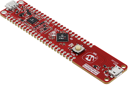

# PIC32CM LS00 Curiosity Nano + Touch Evaluation Kit 
<h4 align="left">  </h4>

This folder contains the MPLAB® Harmony 3 reference applications developed on [PIC32CM LS00 Curiosity Nano + Touch Evaluation Kit](https://www.microchip.com/DevelopmentTools/ProductDetails/PartNO/EV41C56A).

|SI No| Demo Name | Download Link |
| --- | --- | -- |
| 1 | [Getting Started](./pic32cm_ls00_tz_getting_started/readme.md) | [Click Here](https://github.com/Microchip-MPLAB-Harmony/reference_apps/releases/latest/download/pic32cm_ls00_tz_getting_started.zip)|
| 2 | [MIcrochip Academic Program example applications](./pic32cm_ls00_map_examples/readme.md) | |

### More Application Demos

For more application demos on **PIC32CM LS00 Curiosity Nano + Touch Evaluation Kit** and other Development Boards/Kits having the same part number **(PIC32CM5164LS00048)** <a href="https://mplab-discover.microchip.com/v1/itemtype/com.microchip.ide.project?s0=PIC32CM5164LS00048" target="_blank"> CLICK HERE </a>
