# TrustZone Getting Started on PIC32CM LS00 Curiosity Pro Evaluation Kit
<h2 align="center"> <a href="https://github.com/Microchip-MPLAB-Harmony/reference_apps/releases/latest/download/pic32cm_ls00_cpro_tz_getting_started.zip" > Download </a> </h2>

-----
## Description

> This application demonstrates the TrustZone feature on the PIC32CM LS00 microcontroller (MCU). The application has two projects pertaining to Secure and Non-Secure modes of PIC32CM LS00 that work together on the same MCU and offers security isolation between the trusted and the non-trusted resources in the device.

- The application includes Basic and Extended functionalites.

- **Basic application:**
    - The Secure mode application toggles an LED (LED0 toggles when the switch SW0 is pressed) on a timeout basis and the periodicity of the timeout will change from 500 milliseconds to one second, two seconds, four seconds, and back to 500 milliseconds every time you press the switch SW0 on the PIC32CM LS00 Curiosity Pro Evaluation Kit.
    - The Non-secure application requests the Secure mode application, reads the LED toggling rate and prints on the serial terminal. The LED toggling rate data is transferred to the Non-secure mode application when it requests to Secure application through Non-Secure Callables (NSC).

- **Extended application:**
    - The Secure mode application reads the current room temperature from the temperature sensor on the I/O1 Xplained Pro Extension Kit every 500 milliseconds. Further, the application writes the temperature readings to EEPROM and reads when a request is received from the Non-secure mode application. Also, a green LED (LED0) is toggled every time the temperature display request is received from the Non-secure mode application. The periodicity of the temperature values reading can be changed to 1 second, 2 seconds, 4 seconds, and back to 500 milliseconds whenever the user presses the switch SW0 on the PIC32CM LS00 Curiosity Pro Evaluation Kit. The temperature readings are transferred to the Non-secure mode application when it requests to Secure application through Non-Secure Callables (NSC).

    - The Non-secure mode application requests the Secure mode application the temperature values and prints them on a serial console once it receives from the Secure mode application. Further, when it gets a request from the user (in the form of a key press on the serial console), it will request the Secure mode application to retrieve the last five stored temperature values in the EEPROM. The Non-secure application prints the last five stored temperature values on the console. Also, a red LED (LED1) is toggled every time the temperature values are read from EEPROM.

## Modules/Technology Used:

- Peripheral Modules
	- Secure PORT Pins (All pins by default are secure)
	- Secure I2C
	- Secure RTC
	- Secure EIC
	- Non-secure USART
	- Non-secure DMAC
	- Non-secure PORT Pins (USART Pins only)

## Hardware Used:

- [PIC32CM LS00 Curiosity Pro Evaluation Kit](https://www.microchip.com/en-us/development-tool/EV12U44A)
- [I/O1 Xplained Pro Extension Kit](https://www.microchip.com/Developmenttools/ProductDetails/ATIO1-XPRO)

## Software/Tools Used:
 This project has been verified to work with the following versions of software tools:  

Refer Manifest for [Secure](./firmware/Secure/firmware/src/config/pic32cm_ls00_cpro/harmony-manifest-success.yml) and [NonSecure](./firmware/NonSecure/firmware/src/config/pic32cm_ls00_cpro/harmony-manifest-success.yml) projects present in harmony-manifest-success.yml under the project folder *firmware/{Secure or NonSecure}/firmware/src/config/pic32cm_ls00_cpro*
- Refer the [Release Notes](../../../release_notes.md#development-tools) to know the **MPLAB X IDE** and **MCC** Plugin version. Alternatively, [Click Here](https://github.com/Microchip-MPLAB-Harmony/reference_apps/blob/master/release_notes.md#development-tools).  
- Any Serial Terminal application like Tera Term terminal application.

 Because Microchip regularly update tools, occasionally issue(s) could be discovered while using the newer versions of the tools. If the project doesn’t seem to work and version incompatibility is suspected, It is recommended to double-check and use the same versions that the project was tested with.  To download original version of MPLAB Harmony v3 packages, refer to document [How to Use the MPLAB Harmony v3 Project Manifest Feature](https://ww1.microchip.com/downloads/en/DeviceDoc/How-to-Use-the-MPLAB-Harmony-v3-Project-Manifest-Feature-DS90003305.pdf)

## Hardware Setup 1: 
- The PIC32CM LS00 Curiosity Pro Evaluation Kit allows the Embedded Debugger (EDBG) to be used for debugging.
- Connect the Type-A male to Micro-B USB cable to Micro-B DEBUG USB port (J300) to power and debug the PIC32CM LS00 Curiosity Pro Evaluation Kit  
  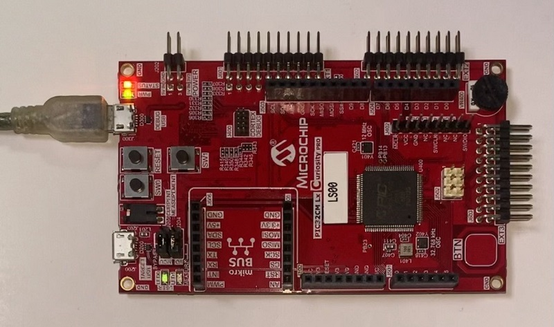
- The PIC32CM LS00 Curiosity Pro Evaluation Kit allows the Embedded Debugger (EDBG) to be used for debugging. Connect the Type-A male to micro-B USB cable to the micro-B DEBUG USB port to power and debug the PIC32CM LS00 Curiosity Pro Evaluation Kit.

## Hardware Setup 2: 
- The PIC32CM LS00 Curiosity Pro Evaluation Kit allows the Embedded Debugger (EDBG) to be used for debugging.
- Connect the Type-A male to Micro-B USB cable to Micro-B DEBUG USB port (J300) to power and debug the PIC32CM LS00 Curiosity Pro Evaluation Kit  
- To test the extended functionality, connect the [I/O1 Xplained Pro Extension Kit](https://www.microchip.com/Developmenttools/ProductDetails/ATIO1-XPRO) to the extension header EXT1 (J601) on the PIC32CM LS00 Curiosity Pro Evaluation Kit.  
  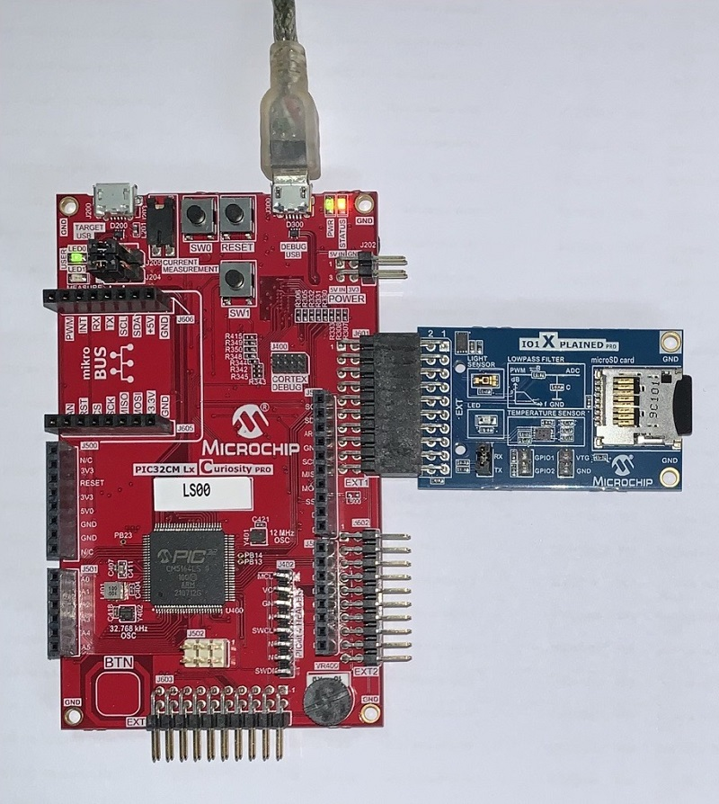

## TrustZone Application Development Use Cases
- There are two use cases:

    - **Single Developer** (This application demonstrates a single developer use case)
    - **Dual Developer**

- **1. Single Developer**
  - A single developer develops both Secure and Non-Secure applications.
  - The following steps are automatically taken care of by the MCC.
      - MCC generates both Secure and Non-Secure projects and Sets the Secure project as a loadable project to the Non-Secure project

      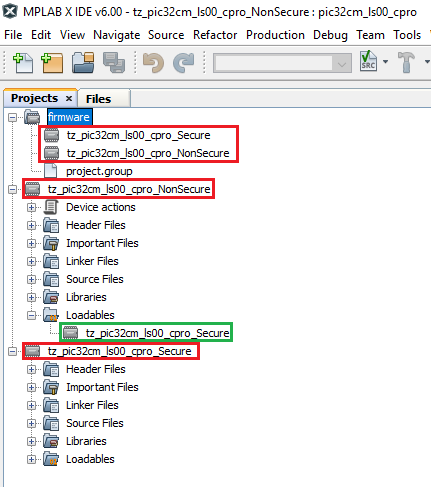

      - Configures the Secure project to generate the veneer library in the Non-Secure project path (NonSecure/firmware/tz_pic32cm_ls00_cpro_NonSecure.X/tz_pic32cm_ls00_cpro_Secure_sg_veneer.lib)

      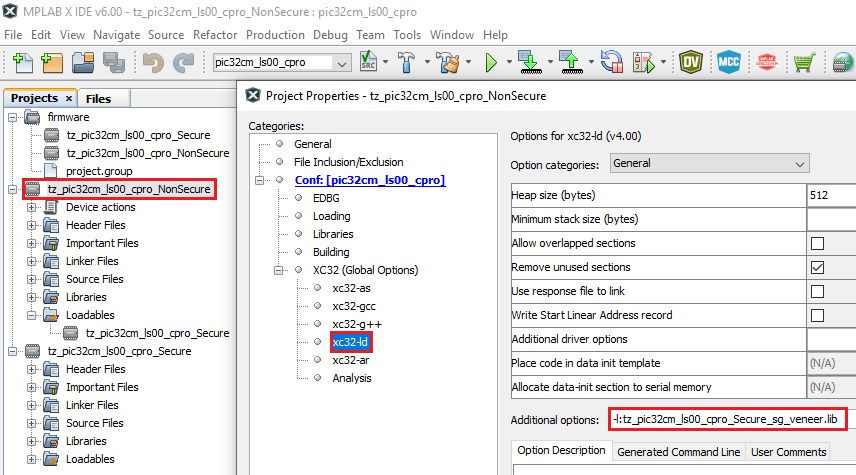

      - Configures the Non-Secure project to link the veneer library.

      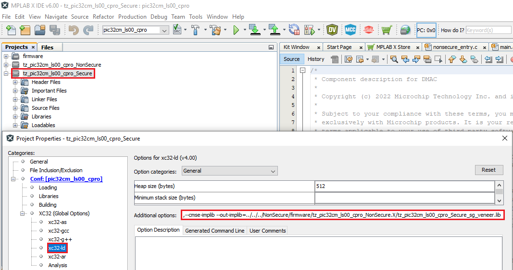

- **2. Dual Developer**
    - The dual developer use case involves two developers.
    - Initially, Developer A is responsible for developing the Secure application; then, Developer B is responsible for developing the Non-Secure application.
        - Refer [Comments](#Comments) for more details on the **"Dual Developer Application Development Use Case"**

## Programming Methods:
- The device can be programmed in two ways
    - Refer [Method 1](#ProgrammingHex): Programming using the prebuilt hex file.
    - Refer [Method 2](#ApplicationProject): Programming by opening and building the application project.

## Method 1: Steps for Programming prebuilt hex file: 
- The TrustZone project will have Secure and Non-Secure pre-built hex files
- Program Secure hex file first followed by the Non-Secure hex file
- The following are the steps to program these hex files
- Download and extract the [pic32cm_ls00_cpro_tz_getting_started](https://github.com/Microchip-MPLAB-Harmony/reference_apps/releases/latest/download/pic32cm_ls00_cpro_tz_getting_started.zip) project, if not done already.
- Open MPLAB X IDE
- Close all existing projects in IDE, if any project is opened

### Step 1: Program the Secure Project hex file
- Go to File -> Import -> Hex/ELF File
- In the **"Import Image File"** window,
    - Step 1 - Create Prebuilt Project,
        - Click the **"Browse"** button to select the prebuilt **"tz_pic32cm_ls00_cpro_Secure.X.production.hex"** file from project path **"pic32cm_ls00_cpro_tz_getting_started/hex"**
        - Select Device as **"PIC32CM5164LS00100"**
        - Ensure **"PIC32CM LS00 Curiosity Pro"** is selected under **"Hardware Tool"** and click **"Next"** button
    - Step 2 - Select Project Name and Folder,
        - Select appropriate project name and folder and click **"Finish"** button
- Once the project opens, set the **"tz_pic32cm_ls00_cpro_Secure.X.prebuilt"** project as Main Project by right clicking on the project.

    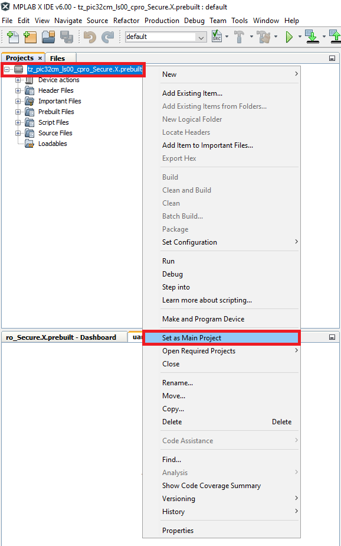

- Go to project properties and set Program Options under EDBG categories to erase and program only Secure memory region.

    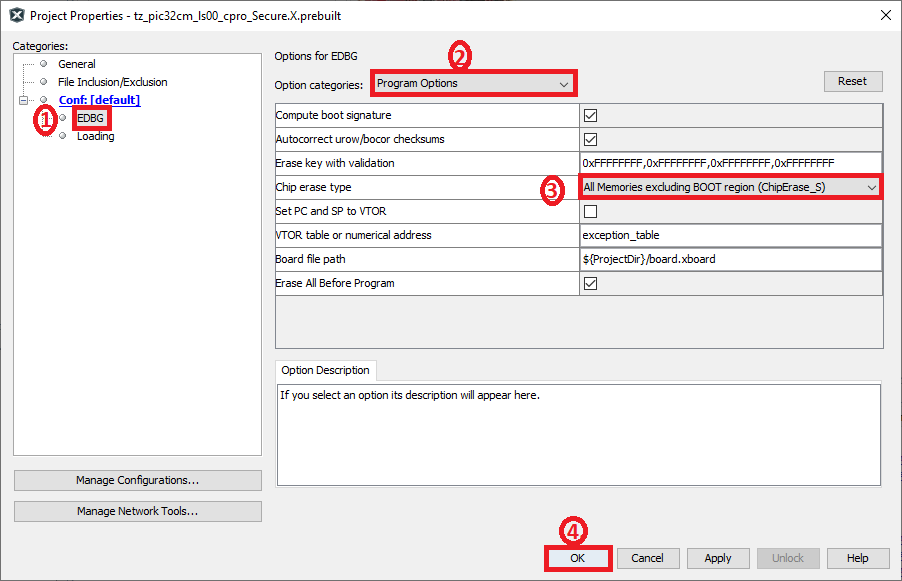

- In MPLAB X IDE, click on **"Make and Program Device"** Button. The device gets programmed in sometime.

### Step 2: Program the Non-Secure Project hex file
- Go to File -> Import -> Hex/ELF File
- In the **"Import Image File"** window,
    - Step 1 - Create Prebuilt Project,
        - Click the **"Browse"** button to select the prebuilt **"tz_pic32cm_ls00_cpro_NonSecure.X.production.hex"** file from project path **"pic32cm_ls00_cpro_tz_getting_started/hex"**
        - Select Device as **"PIC32CM5164LS00100"**
        - Ensure **"PIC32CM LS00 Curiosity Pro"** is selected under **"Hardware Tool"** and click **"Next"** button
    - Step 2 - Select Project Name and Folder,
        - Select appropriate project name and folder and click **"Finish"** button
- Once the project opens, set the **"tz_pic32cm_ls00_cpro_NonSecure.X.prebuilt"** project as Main Project by right clicking on the project.

    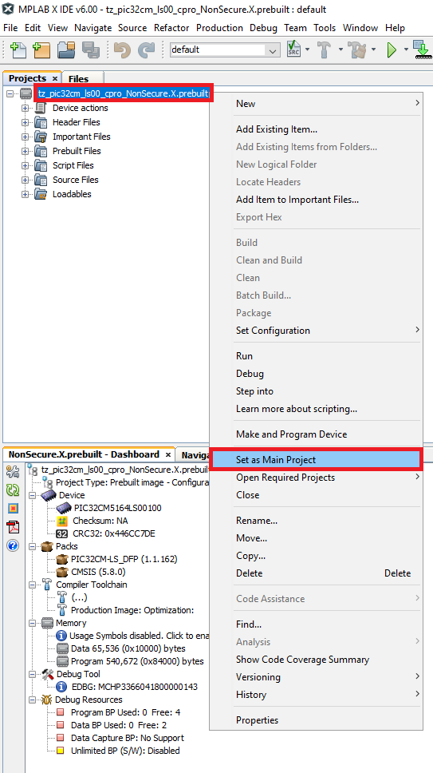

- In the **"tz_pic32cm_ls00_cpro_NonSecure.X.prebuilt"** project, right click on Loadables folder and click on **"Add Loadable File"** to add Secure Gateway veneer library as shown below.

    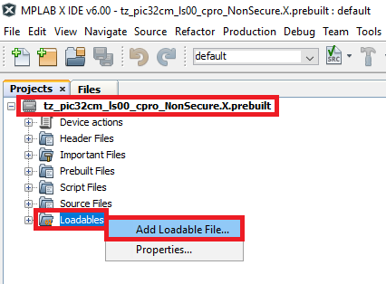

- Select **"tz_pic32cm_ls00_cpro_Secure_sg_veneer.lib"** veneer library.

    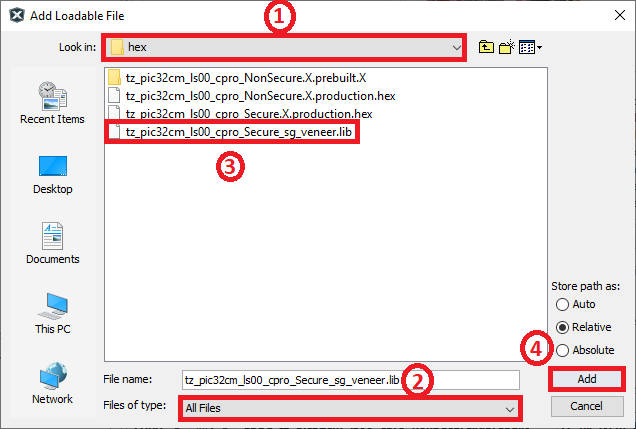

- Expand Loadables folder to confirm that the veneer library is added to the Non-Secure project.

    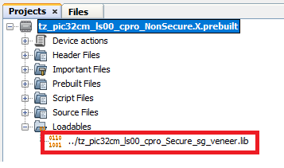

- Go to project properties and set Program Options under EDBG categories to erase and program only Non-Secure memory region.

    

- In MPLAB X IDE, click on **"Make and Program Device"** Button. The device gets programmed in sometime.
- Follow the steps in **[Running the Demo](#RunningDemo)** section below

## Method 2: Programming/Debugging Application Project: 
- The Trustzone project can be opened in two ways.
  - Procedure 1:
    - Open MPLAB X IDE
    - Close all existing projects in IDE (if any project is opened)
    - Go to File -> Open Project
    - Go to **reference_apps** repo path and navigate to following path
        - `<reference_apps_path>/apps/pic32cm_ls00_curiosity_pro/pic32cm_ls00_cpro_tz_getting_started`
    - Select "firmware" folder, enable "Open Required Projects" and click on "Open Project" button  

    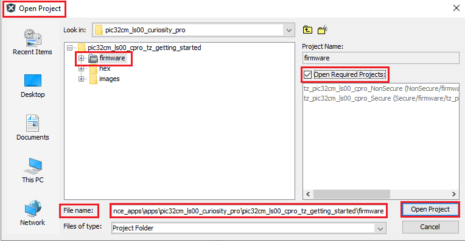

    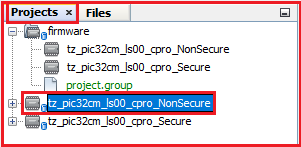

    - Once the project opens, set the "tz_pic32cm_ls00_cpro_NonSecure" project as Main Project by right clicking on the project.  

    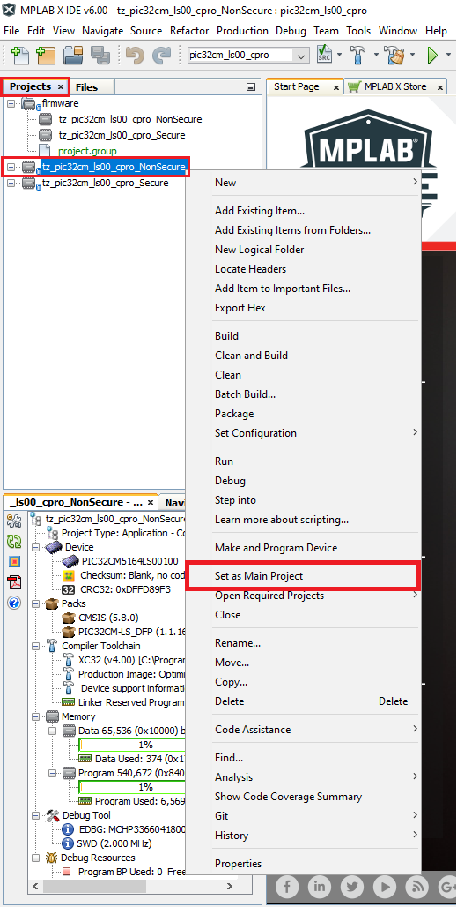

  - Procedure 2:
    - Open MPLAB X IDE
    - Close all existing projects in IDE (if any project is opened)
    - Open the project (../pic32cm_ls00_cpro_tz_getting_started/firmware/NonSecure/firmware/tz_pic32cm_ls00_cpro_NonSecure.X) in MPLAB X IDE.

        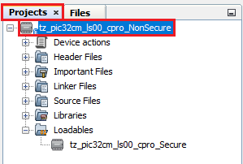
- Ensure "PIC32CM LS00 Curiosity Pro" is selected as hardware tool to program/debug the application.
- Build the code and program the device by clicking on the "Make and Program Device" button in MPLAB X IDE tool bar
- Follow the steps in "Running the Demo" section below.  

## Running the Demo: 
- **Basic functionality** 
    - Perform [Hardware Setup 1](#Setup1) steps mentioned above, if not done already.
    - Open the Tera Term terminal application on your PC (from the Windows® Start menu by pressing the Start button).
    - Set the baud rate to 115200.
    - Reset or power cycle the device. LED0 toggles for every 500 milliseconds during power cycle.
    - An LED (LED0) on the PIC32CM LS00 Curiosity Pro Evaluation Kit toggles on every timeout basis and the default periodicity of the timeout is 500 milliseconds.
    - And also, the LED toggling rate is displayed on the serial terminal.
    - Press the switch SW0 on the PIC32CM LS00 Curiosity Pro Evaluation Kit to change the periodicity of the timeout to one second.
    - Every subsequent pressing of the switch SW0 on the PIC32CM LS00 Curiosity Pro Evaluation Kit changes the periodicity of the timeout to 2 seconds, 4 seconds, 500 milliseconds, and back to 1 second in cyclic order.
    - See the following figure for the output.  
      

- **Extended functionality using [I/O1 Xplained Pro Extension Kit](https://www.microchip.com/Developmenttools/ProductDetails/ATIO1-XPRO):** 
    - Perform [Hardware Setup 2](#Setup2) steps mentioned above, if not done already.

    - Open the Tera Term terminal application on your PC (from the Windows® Start menu by pressing the Start button)
    - Change the baud rate to 115200
    - Press **SW1** to start the running the extended functionality.
    - You should see the temperature values (in °F) being displayed on the terminal every 500 milliseconds, as shown below  
      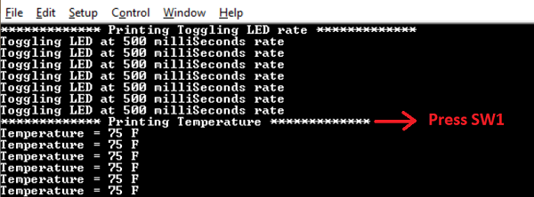
    - Also, notice the LED0 blinking at 500 millisecond rate
    - You may vary the temperature by placing your finger on the temperature sensor (for a few seconds)  
      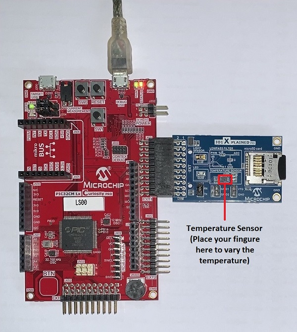
    - Press the switch **SW0** on PIC32CM LS00 Curiosity Pro Evaluation Kit to change the default sampling rate to 1 second.  
      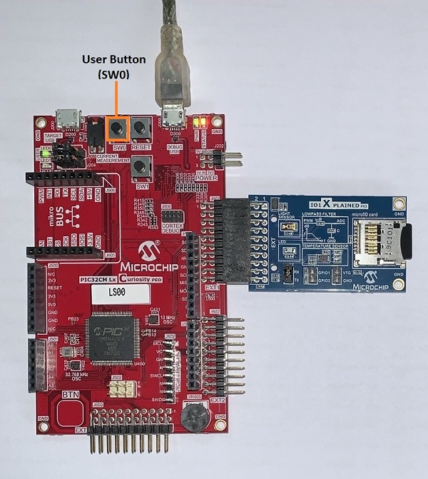  
      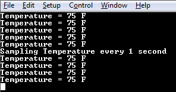
    - Every subsequent pressing of switch **SW0** on PIC32CM LS00 Curiosity Pro Evaluation Kit changes the default sampling
      rate to 2 seconds, 4 seconds, and 500 ms and back to 1 second in cyclic order as shown below.  
      
    - While the temperature sampling rate changes on every switch **SW0** press, notice the LED0 toggling at the same sampling rate
    - Press any character on the terminal to display the last five values written to the EEPROM. Notice that a red LED (LED1) will be toggled when a key is pressed in the serial console to read the temperature values from the **secure EEPROM**.  
      
    - Anytime press **SW1** to start running basic functionality shown in [Basic functionality](#BasicDemo)

## Comments: 
- [Getting Started with the PIC32CM LE00/LS00/LS60 Curiosity Pro Board](https://ww1.microchip.com/downloads/aemDocuments/documents/MCU32/ApplicationNotes/ApplicationNotes/AN4511-Getting-Started-with-the-PIC32CM-LE00-LS00-LS60-Curiosity-Pro-Board-DS00004511.pdf)
- [ Dual Developer Application Development Use Case with TrustZone on SAM L11 Using MPLAB Harmony v3](https://ww1.microchip.com/downloads/en/DeviceDoc/Dual-Developer-Application-Development-Use-Case-with-TrustZone-on-SAM-L11-Using-MPLAB-Harmony-DS90003306.pdf)
    - **Note:** Though this technical brief is on SAM L11 MCUs, the TrustZone concepts it describes also applies to PIC32CM MC LS00 MCUs.
- This application demo builds and works out of box by following the instructions above in "Running the Demo" section. If you need to enhance/customize this application demo, you need to use the MPLAB Harmony v3 Software framework. Refer links below to setup and build your applications using MPLAB Harmony.
	- [How to Setup MPLAB Harmony v3 Software Development Framework](https://ww1.microchip.com/downloads/en/DeviceDoc/How_to_Setup_MPLAB_%20Harmony_v3_Software_Development_Framework_DS90003232C.pdf)
	- [How to Build an Application by Adding a New PLIB, Driver, or Middleware to an Existing MPLAB Harmony v3 Project](http://ww1.microchip.com/downloads/en/DeviceDoc/How_to_Build_Application_Adding_PLIB_%20Driver_or_Middleware%20_to_MPLAB_Harmony_v3Project_DS90003253A.pdf)  
	-  **MPLAB Harmony v3 is also configurable through MPLAB Code Configurator (MCC). Refer to the below links for specific instructions to use MPLAB Harmony v3 with MCC.**
		- [Create a new MPLAB Harmony v3 project using MCC](https://microchipdeveloper.com/harmony3:getting-started-training-module-using-mcc)
		- [Update and Configure an Existing MHC-based MPLAB Harmony v3 Project to MCC-based Project](https://microchipdeveloper.com/harmony3:update-and-configure-existing-mhc-proj-to-mcc-proj)
		- [Getting Started with MPLAB Harmony v3 Using MPLAB Code Configurator](https://www.youtube.com/watch?v=KdhltTWaDp0)
		- [MPLAB Code Configurator Content Manager for MPLAB Harmony v3 Projects](https://www.youtube.com/watch?v=PRewTzrI3iE)

## Revision:
- v1.6.0 - Released demo application
