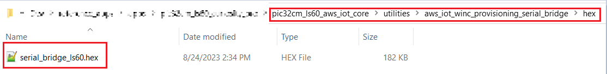

# ATWINC1510 Firmware upgrade

## Description:

> The application's functioning requires the ATWINC1500 module to have firmware compatible with the WiFi software stack running on the PIC32CMLS60 microcontroller(EV76R77A Development Kit). To enable this compatibility, the  ATWINC1500 module is updated with the firmware compatible with WiFi software running in the latest released demo.  

## Running the utility

- Connect the **WINC1500-Xpro** to **EXT3** of the PIC32CMLS60-Cpro(**EV76R77A** Development Kit).Flash the ***serial_bridge_ls60.hex*** inside ***utilities/aws_iot_winc_provisioning_serial_bridge/hex***
  
  
  
  **Programming hex file:**
  
  The pre-built hex file can be programmed by following the below steps
  
  ###### Steps to program the hex file
  
  - Open MPLAB X IDE
  - Close all existing projects in IDE, if any project is opened
  - Go to File -> Import -> Hex/ELF File
  - In the "Import Image File" window, Step 1 - Create Prebuilt Project, click the "Browse" button to select the prebuilt hex file in "aws_iot_provisioning_serial_bridge/hex" folder.
  - Select Device has "**PIC32CM5164LS60100**"
  - Ensure the proper tool is selected under "Hardware Tool"
  - Click on "Next" button
  - In the "Import Image File" window, Step 2 - Select Project Name and Folder, select appropriate project name and folder
  - Click on "Finish" button
  - In MPLAB X IDE, click on "Make and Program Device" Button. The device gets programmed in sometime.
  - Follow the steps in "Running the Demo" section below

- If LED0(Green) lights up it indicates the WINC has the latest firmware i.e Ver.19.7.7,In case of RED LED indication go ahead with below steps.

- Download and extract [pic32cmls60_aws_iot_winc_provisioning](https://github.com/Microchip-MPLAB-Harmony/reference_apps/releases/latest/download/pic32cmls60_aws_iot_winc_provisioning.zip ) into utilities folder

- Open command prompt and navigate to **"utilities/pic32cmls60_aws_iot_winc_provisioning"**
  
  The following command line will generate a device programming file winc1500_19.7.7.prog.

- **image_tool.exe -c winc1500_19.7.7/config.txt -o winc1500_19.7.7.prog -of prog**  
  
  

- The following command line will program a WINC1500 device via the serial port   
    **winc_programmer -p COMxx -d winc1500 -i winc1500_19.7.7.prog -if prog -w -r -pfw winc1500_19.7.7/firmware/programmer_firmware.bin**
  
    **NOTE** : Replace the xx with the device COM PORT in the above command and all    other serial terminal application should be closed
  
  

- Wait till **verify passed** message comes up as shown below.After sucessful upgrade the Green LED (LED0) lights up.
  
  

### Revision:

- v1.6.0 released utility
