# Secure Boot on PIC32CM LS60 Curiosity Pro Evaluation Kit
<h2 align="center"> <a href="https://github.com/Microchip-MPLAB-Harmony/reference_apps/releases/latest/download/pic32cm_ls60_cpro_secure_boot.zip" > Download </a> </h2>

-----
## Description

>
This application demonstrates the Secure Boot feature on the PIC32CM LS60 microcontroller (MCU). The application has two projects;
- A Secure Bootloader
- An Application

Following are the steps to demonstrate the secure boot:

**[Step 1](#RunningDemoStep1): Secure Boot Configuration | Provisioning | Secure Booting**
1. The PIC32CM LS60 MCU is configured to run in secure boot mode with ATECC608B-based boot protection verification method and SHA-based NVM boot configuration (BOOTOPT=5).
2. Program the Secure Bootloader code using Microchip's Trust Platform Design Suite [(TPDS)](https://www.microchip.com/en-us/product/SW-TPDSV2#Software).
3. The successful running of the Secure Bootloader is indicated by turning the green LED0 ON.
4. Receive the application image over UART from a PC by running a python script. The successful receiving of the application is indicated by toggling the red LED.
5. Red LED1 starts toggling indicating secure and successful application booting.

**[Step 2](#RunningDemoStep2): Impersonating Bootloader**
1. Generate a .hex file (say an impersonating bootloader) in MPLAB X IDE.
2. Program the hex file using MPLAB X IDE (Ensure the bootloader is programmed at 0x00)
3. Since the bootloader image in NVM is an impersonated one, it doesn't have the digest matching the ATECC608 B-based authentication and integrity checks. The application fails to Boot. Both LED's are OFF state.

**[Step 3](#RunningDemoStep3): Restoring the Secure Bootloader and Validation**
1. Generate the Secure Bootloader .hex file in MPLAB X IDE.
2. Use the Private/Public key used in Step 1 in TPDS and create the signed .hex file.
3. Program the signed.hex file using the TPDS. The successful running of the Secure Bootloader is indicated by turning the green LED0 ON.
4. Receive the application image over UART from a PC by running a python script. The successful receiving of the application is indicated by toggling the red LED.
5. Since the Secure Bootloader is restored and the Secure Bootloader and application work as expected. Red LED1 starts toggling indicating secure and successful application booting.

## Modules/Technology Used:

- Peripheral Modules
    - Secure PORT Pins (All pins by default are secure)
    - Secure I2C
    - Secure RTC
    - Secure EIC
    - Secure USART

- System Modules
    - Bootloader (UART)

## Hardware Used:

- [PIC32CM LS60 Curiosity Pro Evaluation Kit](https://www.microchip.com/en-us/development-tool/EV76R77A)
- [MikroElektronika USB UART Click](https://www.mikroe.com/usb-uart-click)

## Software/Tools Used:
 This project has been verified to work with the following versions of software tools:

Refer Manifest file for [Secure Bootloader](./firmware/secure_bootloader/Secure/firmware/src/config/pic32cm_ls60_cpro/harmony-manifest-success.yml) project present in harmony-manifest-success.yml under the project folder *firmware/secure_bootloader/Secure/firmware/src/config/pic32cm_ls60_cpro*

- **Note:** Ignore NonSecure project(*firmware/secure_bootloader/NonSecure/firmware/pic32cm_ls60_cpro_NonSecure.X*) as it is a dummy project.

Refer Manifest file for the application project under [Secure](./firmware/test_app/Secure/firmware/src/config/pic32cm_ls60_cpro/harmony-manifest-success.yml) and [Non Secure](./firmware/test_app/NonSecure/firmware/src/config/pic32cm_ls60_cpro/harmony-manifest-success.yml) parts of the project present in harmony-manifest-success.yml under the folder *firmware/test_app/{Secure or NonSecure}/firmware/src/config/pic32cm_ls60_cpro*

- Refer the [Release Notes](../../../release_notes.md#development-tools) to know the **MPLAB X IDE** and **MCC** Plugin version. Alternatively, [Click Here](https://github.com/Microchip-MPLAB-Harmony/reference_apps/blob/master/release_notes.md#development-tools).
- [Trust Platform Design Suite V2](https://www.microchip.com/en-us/product/SW-TPDSV2)
- Any Serial Terminal application like Tera Term terminal application.
- Python - v3 and above

 Because Microchip regularly update tools, occasionally issue(s) could be discovered while using the newer versions of the tools. If the project doesn’t seem to work and version incompatibility is suspected, It is recommended to double-check and use the same versions that the project was tested with.  To download original version of MPLAB Harmony v3 packages, refer to document [How to Use the MPLAB Harmony v3 Project Manifest Feature](https://ww1.microchip.com/downloads/en/DeviceDoc/How-to-Use-the-MPLAB-Harmony-v3-Project-Manifest-Feature-DS90003305.pdf)

## Hardware Setup: 
- The following diagram shows a detailed picture of the setup.

  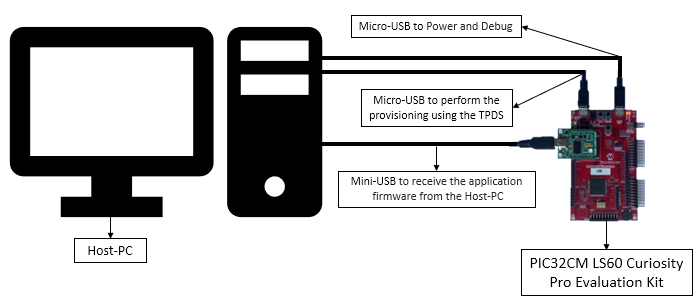

- The PIC32CM LS60 Curiosity Pro Evaluation Kit allows the Embedded Debugger (EDBG) to be used for debugging.
- Connect the Type-A male to Micro-B USB cable to Micro-B DEBUG USB port (J300) to power and debug the PIC32CM LS60 Curiosity Pro Evaluation Kit
- Connect the Type-A male to Micro-B USB cable to Target USB port (J200) to perform the provisioning using the TPDS tool on PIC32CM LS60 Curiosity Pro Evaluation Kit
- Mount MikroElektronika USB UART Click on microBus connector and connect the Type-A male to Mini-B USB cable to Mini-B USB-UART Cick onboard to receive the application firmware from the host.

  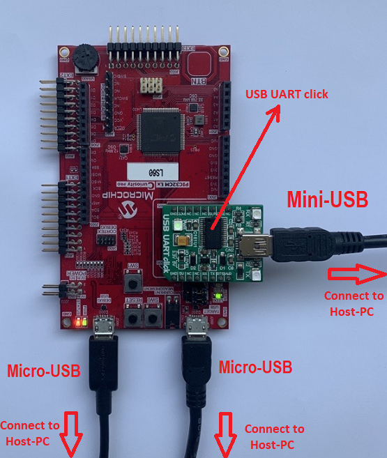

## Prerequisites: 
- Install [Trust Platform Design Suite V2](https://www.microchip.com/en-us/product/SW-TPDSV2) software.
    - Refer to [Installing the Trust Platform Design Suite v2](https://microchipdeveloper.com/authentication:trust-platform-v2).
- Generate Application's Unified Binary. A Unified Binary is a single executable file generated by MPLAB X IDE using the Secure and NonSecure hex files. This can be used to program both Secure and Non-Secure regions together.
    - **Note:** The pre-built application hex and unified binary is kept in the [hex](./hex/test_app) folder. You can **ignore the following steps** if you have not modified the application project.

    - Open and Build the Application's NonSecure project in the MPLAB X IDE, i.e., `reference_apps/apps/pic32cm_ls60_curiosity_pro/pic32cm_ls60_cpro_secure_boot/firmware/test_app/NonSecure/firmware/pic32cm_ls60_cpro_NonSecure.X`
    - This will also build the mandatory Secure project.
- Steps to generate the PIC32CM LS60 User Row Configurations (Fuse Configurations) for Application project.
    - The pre-generated [application_user_configurations_out.txt](./scripts/application_user_configurations_out.txt) configuration file will be used by the [btl_host.py](./scripts/btl_host.py) script to update the fuse configurations while programming the application.
    - **Note:** The following steps shows how the [application_user_configurations_out.txt](./scripts/application_user_configurations_out.txt) file was generated based on the device and project configurations. You can **ignore the following steps** if you have not modified the project configurations.
        - If modified then the input file [application_user_configurations_in.txt](./scripts/application_user_configurations_in.txt) needs to be generated based on the new device and project configuration and then passed to [btl_dev_cfg_gen.py](./scripts/btl_dev_cfg_gen.py) script file to generate the output file [application_user_configurations_out.txt](./scripts/application_user_configurations_out.txt).
        - The [application_user_configurations_in.txt](./scripts/application_user_configurations_in.txt) file consists of only the User Row Fuse configurations for the Non-Secure application project i.e., **app_pic32cm_ls60_cpro_NonSecure** project and it is generated by looking at the applications device and project configurations.
        - To know how this file is generated, open the above **app_pic32cm_ls60_cpro_NonSecure** project in MCC and check the **Device & Project Configuration** under **System** module. For example, the Memory Configurations of the application can be seen as below.

            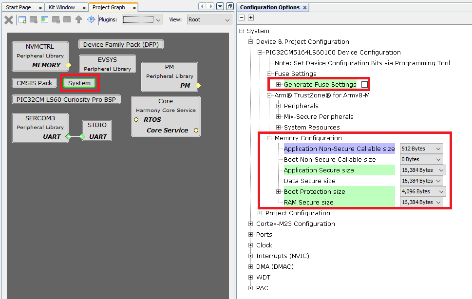

        - For more information on [application_user_configurations_in.txt](./scripts/application_user_configurations_in.txt) generation check the link [Bootloader Device Input Configuration](https://microchip-mplab-harmony.github.io/bootloader/GUID-BBAB9FD3-D0BF-4D72-9123-216AB245DB39.html).

        - Go to the [scripts](./scripts/) folder and execute the following command show help menu for the script.
            - `python btl_dev_cfg_gen.py --help`

                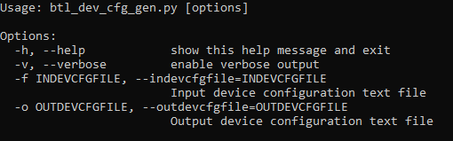

        - The syntax for generating the device configuration output file is:
            - `python btl_dev_cfg_gen.py -v -f <device_config_input_file.txt> -o <device_config_output_file.txt>`

            - To know more about [btl_dev_cfg_gen.py](./scripts/btl_dev_cfg_gen.py) - Refer [Device Configuration Generation Script Help](https://microchip-mplab-harmony.github.io/bootloader/GUID-F2ED5D46-155A-4F5C-95BE-24BE4E6E3F24.html) in [Harmony UART Bootloader Library](file:///C:/gitHub/bootloader/docs/GUID-7EF4113C-BB31-47A2-96E8-2965EC312340.html).

        - Now, to generate the CRC for the fuse settings, execute the following command:
            - `python btl_dev_cfg_gen.py -v -f application_user_configurations_in.txt -o application_user_configurations_out.txt`

                

        - The [application_user_configurations_out.txt](./scripts/application_user_configurations_out.txt) configuration file will be used later by the [btl_host.py](./scripts/btl_host.py) to update the fuse configurations while programming the application using Secure Bootloader.

## Running the Demo: 
- Perform [Hardware Setup](#Setup1) steps mentioned above, if not done already.
- Perform [Prerequisites](#prerequisites) steps mentioned above, if not done already.

### Step-1: Secure Boot Configuration | Provisioning | Secure Booting
1.   PIC32CM LS60 MCU is configured to run in secure boot mode with ATECC608B-based boot protection verification method and SHA-based NVM boot configuration (BOOTOPT=5).
    - Open and Build the Secure Bootloader project in the MPLAB X IDE, i.e., `reference_apps/apps/pic32cm_ls60_curiosity_pro/pic32cm_ls60_cpro_secure_boot/firmware/secure_bootloader/Secure/firmware/pic32cm_ls60_cpro_Secure.X`

2.  Program the Secure Bootloader code using Mirochip's Trust Platform Design Suite [(TPDS)](https://www.microchip.com/en-us/product/SW-TPDSV2#Software).
    - Open the TPDS application and select the TrustFlex usecase, i.e., **Secure Boot-PIC32CMLS60**.
        - This usecase will sign an application hex file to support secure boot in combination with the ATECC608 embedded into the PIC32CM LS60. The application that is to be signed must be generated as per the current data sheet for secure boot.

            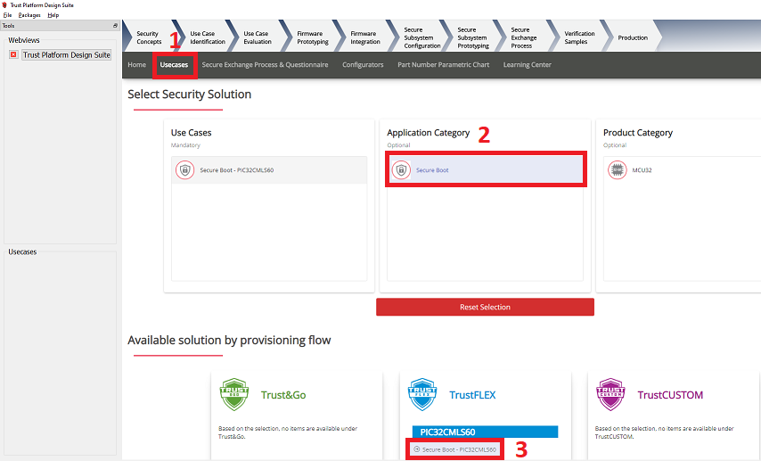

    - And click on **Option 1** to Generate Private/Public key pair to perform the factory programming of default binary and wait for the response OK.

    - Press the reset button on the PIC32CM LS60 Curiosity Pro Evaluation Kit to sync with TPDS.

    - Again press **Option 1** - Generate Private/Public key. In this step, the public key required to verify the SecureBoot is stored in Slot 15. This time a pop-up apears to Generate Private/Public key, as shown below.

      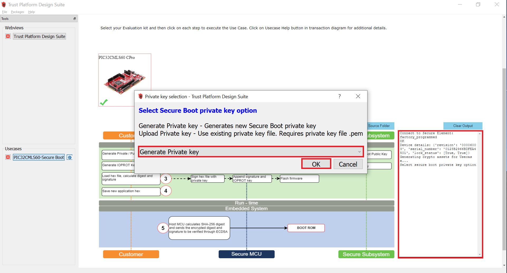

    - After successful execution of **Option 1**, a green tick mark appears in the **Option 1** as shown below and check the log window for message **"Executed Step-1 Successfully"**.

      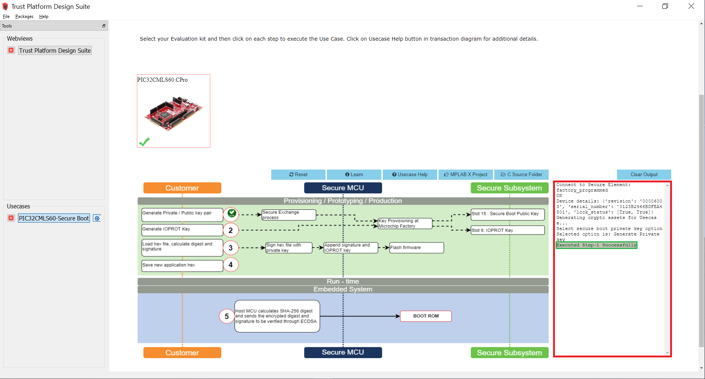

    - Select **Option 2** to Generate the IOPROT Key.
        - The communication between the PIC32CM LS60 microcontroller and the ATECC608B is encrypted using an I/O Protection Key (IOPROTKEY). This unique key is initially provisioned in both the ATECC608B Slot 6 and the microcontroller BOCOR NVM Configuration Row (IOPROTKEY).

    - After successful execution of **Option 2**, a green tick mark appears in the **Option 2** as shown below and check the log window for message **"Executed Step-2 Successfully"**.

       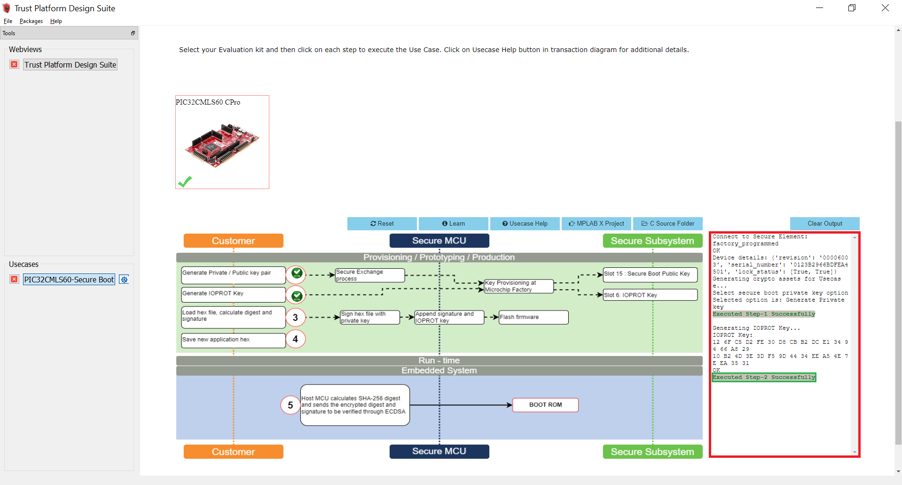

    - Copy the **pic32cm_ls60_cpro_Secure.X.production.hex** file from `reference_apps/apps/pic32cm_ls60_curiosity_pro/pic32cm_ls60_cpro_secure_boot/hex/secure_bootloader/pic32cm_ls60_cpro_Secure.X.production.hex` to `<user_path>/.trustplatform/pic32cmls60_secure_boot` to load hex file, calculate digest, and signature.

    - Select **Option 3** to load the Secure Bootloader hex file from the TPDS trustplatform folder i.e., `<user_path>/.trustplatform/pic32cmls60_secure_boot` to calculate the digest and signature. In this step, the digest and signature will be generated for the loaded Secure Bootloader hex file.

       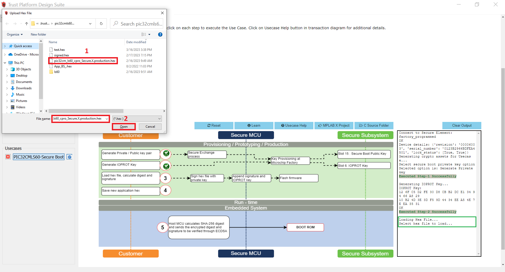

    - After successful execution of **Option 3**, a green tick mark appears in the **Option 3** as shown below and check the log window for message **"Executed Step-3 Successfully"**.

       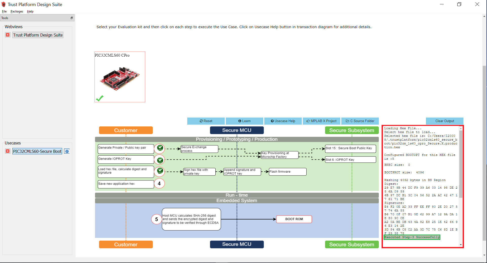

    - Select **Option 4** to save the new application hex. i.e, the TPDS generates a new hex file with the name **signed.hex** which has the digest and the Elliptic Curve Digital Signature Algorithm (ECDSA) signature stored at the end of the BOOT region Secure Bootloader hex file.

    - After successful execution of **Option 4**, a green tick mark appears in the **Option 4** as shown below and check the log window for message **"Executed Step-4 Successfully"**.

       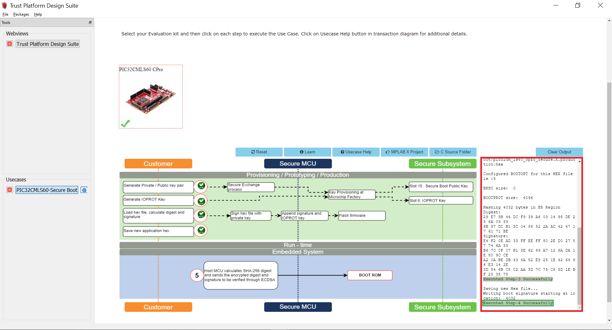

    - Select **Option 5** to program the **signed.hex** on to PIC32CM LS60 Curiosity Pro Evaluation Kit. In this step, the Host MCU calculates the SHA-256 digest and sends the encrypted digest and signatures to be verified through ECDSA. Then Secure Boot execution will authenticate the application code.

    - After successful execution of **Option 5**, a green tick mark appears in the **Option 5** as shown below and check the log window for message **"Executed Step-5 Successfully"**.

       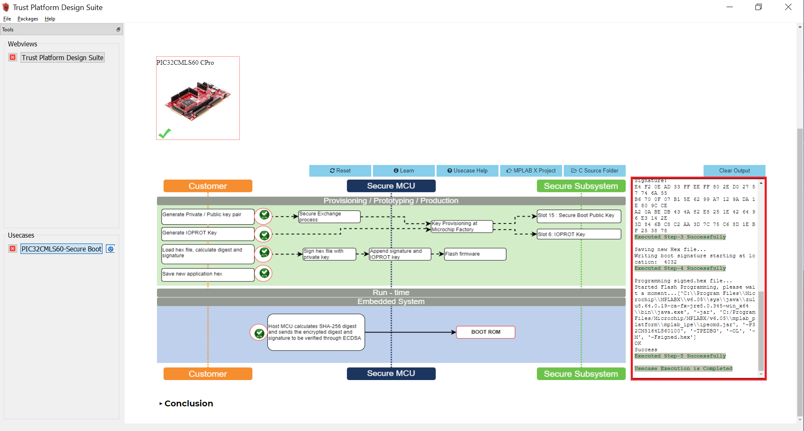

    - This completes the usecase execution. i.e., the provisioning flow of PIC32CM LS60 MCU.

    - Reset or power cycle the device.
3.  The successful running of the Secure bootloader is indicated by turning the green LED (**LED0**) ON.
    - A green LED (**LED0**) on the PIC32CM LS60 Curiosity Pro Evaluation Kit turns **ON** when the Secure Bootloader is running.
    - Open MPLAB X IDE and you can check the **Configuration Bits** by going to Window->Target Memory Views->Configuration Bits in the MPLAB X IDE
    - The Secure Bootloader fuse configuration bits are stored in the [secure_bootloader_with_tpds.c](./scripts/secure_bootloader_with_tpds.c) file.
        - Here, you can see that the BOOTROM_BOOTOPT value is set to 0x5, which enables the secure boot.
        - Also check the BOOTKEY which is set by the user and IOPROTKEY which is stored by the TPDS.
4.  Receive the application image over UART from a PC by running a python script. The successful receiving of the application is indicated by toggling the red LED.
    - Open the Virtual Debug COM port and set the baud rate to 115200.
    - Connect the Type-A male to Mini-B USB cable to Mini-B USB-UART Cick onboard to receive the application firmware from the Host-PC.
    - Go to the [Secure Bootloader Scripts](./scripts/) path, and open Command prompt to run the bootloader host script [btl_host.py](./scripts/btl_host.py) and device fuse configuration bits generation script [btl_dev_cfg_gen.py](./scripts/btl_dev_cfg_gen.py).
        - [btl_host.py](./scripts/btl_host.py) - Sends the Application's Unified (Secure and NonSecure) binary from Host-PC to Target device over UART.
        `<reference_apps>/apps/pic32cm_ls60_curiosity_pro/pic32cm_ls60_cpro_secure_boot/scripts` and execute the following command. Change the COM port number based on its enumeration in the Host-PC.
        - [btl_dev_cfg_gen.py](./scripts/btl_dev_cfg_gen.py) - Generates the device fuse configuration bits.
        - To show help menu for the script enter `btl_host.py --help` in the command prompt.

            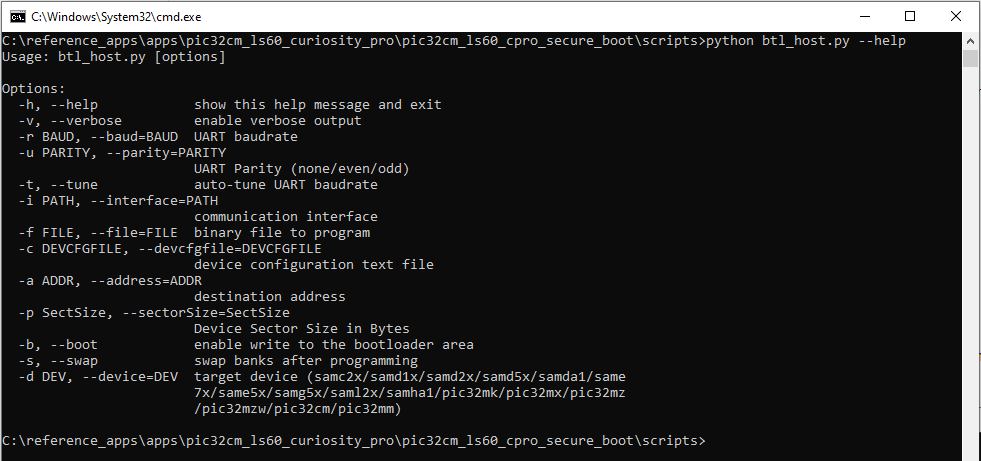

    - The following command sends the Application's Unified binary from Host-PC to the PIC32CM LS60 Curiosity Pro Evaluation Kit and updates the User row fuse configurations bits. See the following output on the command prompt.

        - `python btl_host.py -v -u even -i COM27 -d PIC32CM -a 0x1000 -f ../hex/test_app/pic32cm_ls60_cpro_NonSecure.X.production.unified.bin -c application_user_configurations_out.txt`

            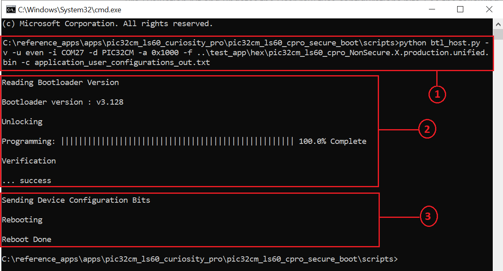

        - Observe the LED1 (Red-LED) blinking while receiving the application.
    - After receiving the application's unified binary and update of device configuration bits, remove the Mini-USB from the USB-UART Click board and reset the device.

5.  Red LED1 starts toggling indicating secure and successful application booting.

    - Now the LED1 (Red-LED) toggles and prints a message in the Virtual COM as shown below, indicating the application is loaded from Secure bootloader.

      

    - Press and Hold the Switch **SW0** key to trigger the Secure Bootloader to program the application once again or with the new application.

      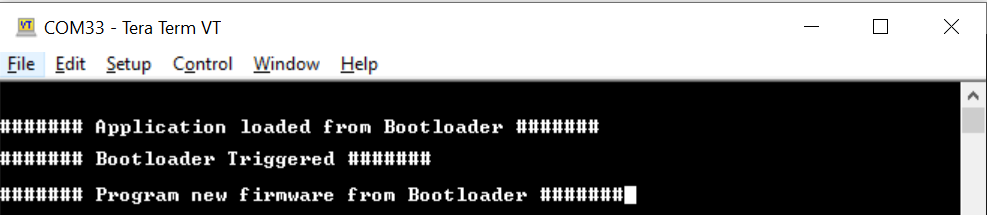

    - Notice that the green LED0 turns ON when the Secure Bootloader is triggered.
        - Now open MPLAB X IDE and to check the **Device Fuse Configuration Bits** after programming the application. Go to Window->Target Memory Views->Configuration Bits in the MPLAB X IDE. The configuration bits are saved in the [secure_bootloader_with_tpds_and_application.c](./scripts/secure_bootloader_with_tpds_and_application.c) file.
        - In this file, notice only User Row configurations (i.e., USER WORD) are updated based on the application's configuration, whereas the Boot Configuration Row (i.e., BOCOR WORD) are not modified.
        - You can check the diff of the [secure_bootloader_with_tpds.c](./scripts/secure_bootloader_with_tpds.c) and [secure_bootloader_with_tpds_and_application.c](./scripts/secure_bootloader_with_tpds_and_application.c) present in the [scripts](./scripts/) folder to see which user configuration bitfields are updated by the Bootloader script based on the application's project configuration.

### Step-2: Impersonating Bootloader
1. Open and Build the Secure Bootloader project in the MPLAB X IDE, i.e., `reference_apps/apps/pic32cm_ls60_curiosity_pro/pic32cm_ls60_cpro_secure_boot/firmware/secure_bootloader/Secure/firmware/pic32cm_ls60_cpro_Secure.X`
2. Program the hex file using MPLAB X IDE.
3. Since the Secure Bootloader image does not have the signature appended at the end of the Bootloader image when flashing using the MPLAB X IDE, the ATECC608 B-based authentication and integrity checks fails.
4. The Secure Bootloader application fails to Boot. LEDs will go to the OFF state.

### Step-3: Restoring the Secure Bootloader and Validation
1. Perform [Hardware Setup](#Setup1) steps mentioned above to restore the Secure Bootloader.
2. Generate the Secure Bootloader .hex file in MPLAB X IDE as mentioned in the [Step 1.1](#RunningDemoStep1_1).
3. Use the Private/Public key used in [Step 1.2](#RunningDemoStep1_2) in TPDS and create the signed .hex file.
4. Follow the [Step 1.3](#RunningDemoStep1_3) to program the signed.hex file using the TPDS. Then press the **Reset** button and observe that the green LED0 is turned ON. This indicates the successful running of the Secure Bootloader.
5. Follow the [Step 1.4](#RunningDemoStep1_4) to receive the application image over UART from a PC by running a python script. The successful receiving of the application is indicated by toggling the red LED.
6. Since the Secure Bootloader is restored and the Secure Bootloader and application work as expected. Red LED1 starts toggling indicating secure and successful application booting.

**Note:**
- Modifying the security configurations by (re)-programming the different NVM Configuration rows (using the NVMCTRL peripheral) is possible but the changes done on these NVM Configuration rows will always be applied only after a new reset sequence happens (through a new Boot ROM execution).
- The Security Configuration Lock bit i.e., **SECCFGLOCK** is set to **1** by default. This means, after exiting the Boot ROM:
    - The security configurations are locked so that no code (even secure) can change them before next reset sequence.
    - The only way to update the security configurations is to (re)-program the NVM Configuration rows then reset the device.
    - For more information check the **PIC32CM LS00/LS60 Specific Security Features** section of [PIC32CM LE00/LS00/LS60 Family Data Sheet](https://ww1.microchip.com/downloads/aemDocuments/documents/MCU32/ProductDocuments/DataSheets/PIC32CM-LE00-LS00-LS60-Family-Data-Sheet-DS60001615.pdf).

## Comments: 
- [Getting Started with the PIC32CM LE00/LS60/LS60 Curiosity Pro Board](https://ww1.microchip.com/downloads/aemDocuments/documents/MCU32/ApplicationNotes/ApplicationNotes/AN4511-Getting-Started-with-the-PIC32CM-LE00-LS00-LS60-Curiosity-Pro-Board-DS00004511.pdf)
- [Trust Platform Design Suite v2](https://www.microchip.com/en-us/product/SW-TPDSV2)
- [PIC32CM LS00/LS60 Security Reference Guide](https://ww1.microchip.com/downloads/aemDocuments/documents/MCU32/ApplicationNotes/ApplicationNotes/00003992B.pdf)
- [Dual Developer Application Development Use Case with TrustZone on SAM L11 Using MPLAB Harmony v3](https://ww1.microchip.com/downloads/en/DeviceDoc/Dual-Developer-Application-Development-Use-Case-with-TrustZone-on-SAM-L11-Using-MPLAB-Harmony-DS90003306.pdf)
    - **Note:** Though this technical brief is on SAM L11 MCUs, the TrustZone concepts it describes also applies to PIC32CM MC LS60 MCUs.
- This application demo builds and works out of the box by following the instructions above in "Running the Demo" section. If you need to enhance/customize this application demo, you need to use the MPLAB Harmony v3 Software framework. Refer links below to setup and build your applications using MPLAB Harmony.
	- [How to Setup MPLAB Harmony v3 Software Development Framework](https://ww1.microchip.com/downloads/en/DeviceDoc/How_to_Setup_MPLAB_%20Harmony_v3_Software_Development_Framework_DS90003232C.pdf)
	- [How to Build an Application by Adding a New PLIB, Driver, or Middleware to an Existing MPLAB Harmony v3 Project](http://ww1.microchip.com/downloads/en/DeviceDoc/How_to_Build_Application_Adding_PLIB_%20Driver_or_Middleware%20_to_MPLAB_Harmony_v3Project_DS90003253A.pdf)
	-  **MPLAB Harmony v3 is also configurable through MPLAB Code Configurator (MCC). Refer to the below links for specific instructions to use MPLAB Harmony v3 with MCC.**
		- [Create a new MPLAB Harmony v3 project using MCC](https://microchipdeveloper.com/harmony3:getting-started-training-module-using-mcc)
		- [Update and Configure an Existing MHC-based MPLAB Harmony v3 Project to MCC-based Project](https://microchipdeveloper.com/harmony3:update-and-configure-existing-mhc-proj-to-mcc-proj)
		- [Getting Started with MPLAB Harmony v3 Using MPLAB Code Configurator](https://www.youtube.com/watch?v=KdhltTWaDp0)
		- [MPLAB Code Configurator Content Manager for MPLAB Harmony v3 Projects](https://www.youtube.com/watch?v=PRewTzrI3iE)

## Revision:
- v1.6.0 - Released demo application
