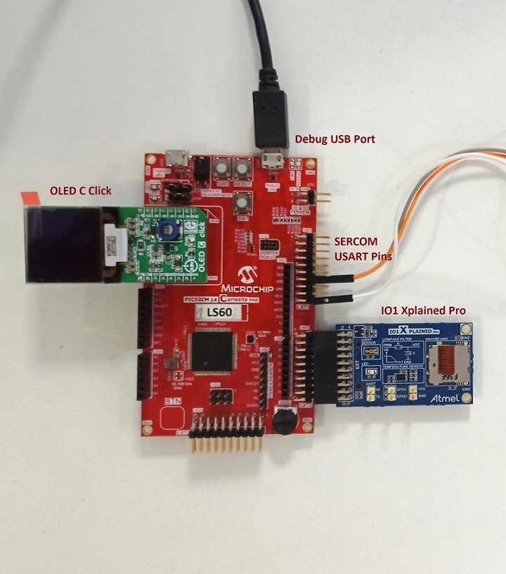
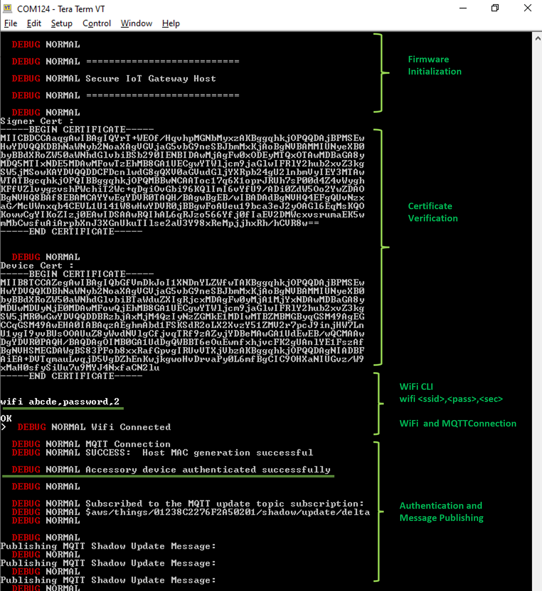
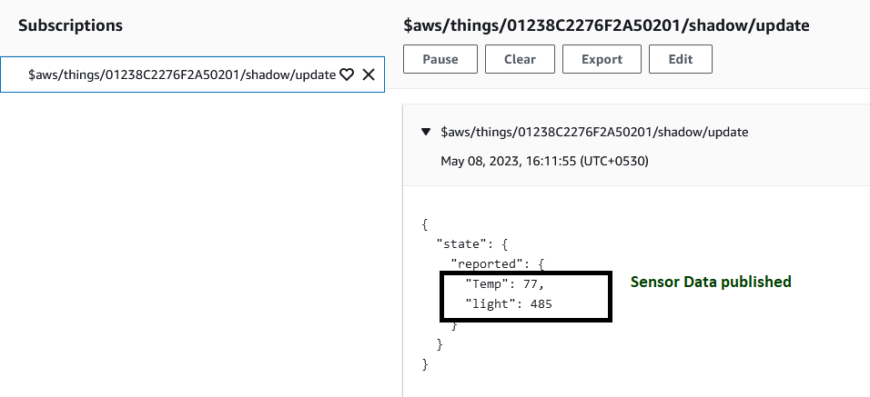

# Secure IoT Gateway application client on PIC32CM LS60 Curiosity Pro Evaluation Kit
<h2 align="center"> <a href="https://github.com/Microchip-MPLAB-Harmony/reference_apps/releases/latest/download/pic32cm_ls60_secure_iot_gateway.zip" > Download </a> </h2>

-----
## Description:

> This  project demonstrates the good-client side implementation of the secure IoT gateway application.

> The PIC32CM LS60 Client reads the sensor data from the temperature and light sensors on the I/O1 Xplained Pro board connected to the EXT2 Xpro connector. The client waits for the host to initiate the authentication process. Once the authentication is completed successfully, the sensor data is sent to the host through the USART. The MAC calculation and SERCOM transmission are placed securely in the secure region of the PIC32CM LS60.

## Modules/Technology Used:
- Peripheral Modules
    - Non-Secure SERCOM0 (SPI)
    - Non-Secure SERCOM3 (SPI)
    - Non-Secure SERCOM1 (I2C-ATECC608)
    - Non-Secure SERCOM5 (I2C-IO1 Xplained Pro)
    - Secure SERCOM2 (USART)
    - Non-Secure TC0
    - Non-Secure DMAC
    - Non-Secure RTC
    - Non-Secure ADC
    - NVMCTRL
    - EVSYS
    - Systick
    - EIC
    - GPIO
    - PM
    - TC1
- Harmony Core
- Drivers
    - SPI
    - WINC
    - LE SPI 4-line
    - Crypto
        - ATECC608
- System Services
    - Time
    - Input
- Graphics
    - GFX Core Legato

## Hardware Used:

- [PIC32CM LS60 Curiosity Pro Evaluation Kit](https://www.microchip.com/en-us/development-tool/EV76R77A)
- [I/O1 Xplained Pro Extension Kit](https://www.microchip.com/Developmenttools/ProductDetails/ATIO1-XPRO)
- [MIKROE OLED C Click](https://www.mikroe.com/oled-c-click)

## Software/Tools Used:
 This project has been verified to work with the following versions of software tools:  

- **For LS60 Client**, Refer Manifest for [Secure](./Secure/firmware/src/config/pic32cm_ls60/harmony-manifest-success.yml) and [NonSecure](./NonSecure/firmware/src/config/pic32cm_ls60/harmony-manifest-success.yml) projects present in harmony-manifest-success.yml under the project folder *firmware/pic32cm_ls60_cpro_sg_client/{Secure or NonSecure}/firmware/src/config/pic32cm_ls60*
- Refer the [Release Notes](../../../../../release_notes.md#development-tools) to know the **MPLAB X IDE** and **MCC** Plugin version. Alternatively, [Click Here](https://github.com/Microchip-MPLAB-Harmony/reference_apps/blob/master/release_notes.md#development-tools).
- Any Serial Terminal application like Tera Term terminal application.

- Trust Platform Design Suite v2.3.5 or above [Click Here](https://www.microchip.com/en-us/product/SW-TPDSV2)

 Because Microchip regularly update tools, occasionally issue(s) could be discovered while using the newer versions of the tools. If the project doesn’t seem to work and version incompatibility is suspected, It is recommended to double-check and use the same versions that the project was tested with.  To download original version of MPLAB Harmony v3 packages, refer to document [How to Use the MPLAB Harmony v3 Project Manifest Feature](https://ww1.microchip.com/downloads/en/DeviceDoc/How-to-Use-the-MPLAB-Harmony-v3-Project-Manifest-Feature-DS90003305.pdf)

## Hardware Setup:
- Connect the MIKROE OLED C Click to the mikroBUS extension in the PIC32CM LS60 Curiosity Pro Evaluation Kit
- Connect the I/O1 Xplained Pro Extension Kit to the EXT2 in the PIC32CM LS60 Curiosity Pro Evaluation Kit
- Connect the jumper wires from **PA22/PA23** for SERCCOM UART RX/TX to communicate with the host
- Connect the PIC32CM LS60 Curiosity Pro Evaluation Kit to the Host PC as a USB Device through a Type-A male to micro-B USB cable connected to Micro-B USB (Debug USB) port

#### PIC32CM LS60 Client

#### Demo Setup
For complete "Secure IoT Gateway application" demo setup, refer to demo **readme.md** inside the project directory **(pic32cm_ls60_secure_iot_gateway)**

## Programming hex file:
The pre-built hex file can be programmed by following the below steps.  

### Steps to program the hex file
- Open MPLAB X IDE
- Close all existing projects in IDE, if any project is opened.
- Go to File -> Import -> Hex/ELF File
- In the "Import Image File" window, Step 1 - Create Prebuilt Project, Click the "Browse" button to select the prebuilt hex file.
- Select Device has "PIC32CM5164LS60100"
- Ensure the proper tool is selected under "Hardware Tool"
- Click on Next button
- In the "Import Image File" window, Step 2 - Select Project Name and Folder, select appropriate project name and folder
- Click on Finish button
- In MPLAB X IDE, click on "Make and Program Device" Button. The device gets programmed in sometime
- Follow the steps in [Running the Demo](#Running_Demo) section below

## Programming/Debugging Application Project:
- Open the project (pic32cm_ls60_secure_iot_gateway/firmware/pic32cm_ls60_cpro_sg_client) in MPLAB X IDE
- Open both Secure and NonSecure projects inside the project group and set the NonSecure as the main project.
- Ensure "PIC32CM LS60 Curiosity Pro" is selected as hardware tool to program/debug the application
- Build the code and program the device by clicking on the "Make and Program Device" button in MPLAB X IDE tool bar
- Follow the steps in [Running the Demo](#Running_Demo) section below

## Running the Demo: 
- Once the device is programmed, the I/O1 Xplained Pro Extension Kit sensor values will be read and displayed in the MIKROE OLED C Click display board.
- The client will wait for the the random number from the host side. The MAC digest will be sent to the host
- Once authentication success is acknowledged, the sensor values will be sent through the USART.
- Successful authentication is ensured if the Host device gets the values displayed in the MIKROE OLED C Click

#### Host MIKROE OLED C Click After Successful Authentication

#### Host Teraterm Output After Successful Authentication

#### AWS Cloud MQTT Messages After Successful Authentication

## Comments:
- Reference Document: [PIC32CM LS00/LS60 Security Reference Guide](https://ww1.microchip.com/downloads/aemDocuments/documents/MCU32/ApplicationNotes/ApplicationNotes/AN3992-PIC32CM-LS00-LS60-Security-Reference-Guide-DS00003992.pdf)
- This application demo builds and works out of box by following the instructions above in [Running the Demo](#Running_Demo) section. If you need to enhance/customize this application demo, you need to use the MPLAB Harmony v3 Software framework. Refer links below to setup and build your applications using MPLAB Harmony.
	- [How to Setup MPLAB Harmony v3 Software Development Framework](https://ww1.microchip.com/downloads/en/DeviceDoc/How_to_Setup_MPLAB_%20Harmony_v3_Software_Development_Framework_DS90003232C.pdf)
	- [How to Build an Application by Adding a New PLIB, Driver, or Middleware to an Existing MPLAB Harmony v3 Project](http://ww1.microchip.com/downloads/en/DeviceDoc/How_to_Build_Application_Adding_PLIB_%20Driver_or_Middleware%20_to_MPLAB_Harmony_v3Project_DS90003253A.pdf)  
	-  **MPLAB Harmony v3 is also configurable through MPLAB Code Configurator (MCC). Refer to the below links for specific instructions to use MPLAB Harmony v3 with MCC.**
		- [Create a new MPLAB Harmony v3 project using MCC](https://microchipdeveloper.com/harmony3:getting-started-training-module-using-mcc)
		- [Update and Configure an Existing MHC-based MPLAB Harmony v3 Project to MCC-based Project](https://microchipdeveloper.com/harmony3:update-and-configure-existing-mhc-proj-to-mcc-proj)
		- [Getting Started with MPLAB Harmony v3 Using MPLAB Code Configurator](https://www.youtube.com/watch?v=KdhltTWaDp0)
		- [MPLAB Code Configurator Content Manager for MPLAB Harmony v3 Projects](https://www.youtube.com/watch?v=PRewTzrI3iE)

## Revision:
- v1.6.0 released demo application good-client