# Secure IoT Gateway application host on PIC32CM LS60 Curiosity Pro Evaluation Kit
<h2 align="center"> <a href="https://github.com/Microchip-MPLAB-Harmony/reference_apps/releases/latest/download/pic32cm_ls60_secure_iot_gateway.zip" > Download </a> </h2>

-----
## Description:

> This  project demonstrates the host side implementation of the secure IoT gateway application.

> The host project initiates the symmetric authentication process of the client connected to it. The host also connects to the AWS IoT cloud. Once the SW0 button on the host device is pressed, the random number from the inbuilt ATECC608B is sent across the USART pins to the client and awaits the result. Once the client is authenticated, the sensor data is received and displayed on the MIKROE OLED C Click board. The data is also published to the AWS IoT Core at timely intervals. The LED0 on the host toggles each time the data is published to the cloud. The host's connection to the PIC32CM LS60 client would be successful as the authentication (through the ATECC608B) would be successful. However, the PIC32CM LE00 client would fail the authentication process as there is no inbuilt ATECC608B. If the authentication fails, the data is not displayed on the host side or published to the cloud.

## Modules/Technology Used:
- Peripheral Modules
    - Non-Secure SERCOM0 (SPI)
    - Non-Secure SERCOM3 (SPI)
    - Non-Secure SERCOM1 (I2C)
    - Non-Secure SERCOM2 (USART)
    - Non-Secure SERCOM5 (System Console)
    - Non-Secure TC2
    - Non-Secure DMAC
    - Non-Secure RTC
    - NVMCTRL
    - EVSYS
    - Systick
    - EIC
    - GPIO
    - PM
- BSP
    - PIC32 CM LS60 Curiosity Pro
- Harmony Core
- Drivers
    - SPI
    - WINC
    - LE SPI 4-line
    - Crypto
- System Services
    - Console
    - Time
    - Input
    - CryptoAuthlib
        - Core
        - Trust&Go
- Graphics
    - GFX Core Legato

## Hardware Used:

- [PIC32CM LS60 Curiosity Pro Evaluation Kit](https://www.microchip.com/en-us/development-tool/EV76R77A)
- [ATWINC1500-XPRO](https://www.microchip.com/en-us/development-tool/ATWINC1500-XPRO)
- [MIKROE OLED C Click](https://www.mikroe.com/oled-c-click)

## Software/Tools Used:
 This project has been verified to work with the following versions of software tools:  

- **For Host**, Refer Manifest for [Secure](./Secure/firmware/src/config/pic32cm_ls60/harmony-manifest-success.yml) and [NonSecure](./NonSecure/firmware/src/config/pic32cm_ls60/harmony-manifest-success.yml) projects present in harmony-manifest-success.yml under the project folder *firmware/pic32cm_ls60_cpro_sg_host/{Secure or NonSecure}/firmware/src/config/pic32cm_ls60*
- Refer the [Release Notes](../../../../../release_notes.md#development-tools) to know the **MPLAB X IDE** and **MCC** Plugin version. Alternatively, [Click Here](https://github.com/Microchip-MPLAB-Harmony/reference_apps/blob/master/release_notes.md#development-tools).
- Any Serial Terminal application like Tera Term terminal application.

- Trust Platform Design Suite v2.3.5 or above [Click Here](https://www.microchip.com/en-us/product/SW-TPDSV2)

 Because Microchip regularly update tools, occasionally issue(s) could be discovered while using the newer versions of the tools. If the project doesn’t seem to work and version incompatibility is suspected, It is recommended to double-check and use the same versions that the project was tested with.  To download original version of MPLAB Harmony v3 packages, refer to document [How to Use the MPLAB Harmony v3 Project Manifest Feature](https://ww1.microchip.com/downloads/en/DeviceDoc/How-to-Use-the-MPLAB-Harmony-v3-Project-Manifest-Feature-DS90003305.pdf)

## AWS Account Setup

  
 Click here for details

  
In order to run this application an AWS account is required. This section describes the steps required to obtain and configure an AWS account for the demo.
  
  
Amazon Web Services (AWS) provides computing services for a fee. Some are offered for free on a trial or small-scale basis. By signing up for your own AWS account, you are establishing an account to gain access to a wide range of computing services.
  
  
Think of your AWS account as your root account to AWS services. It is very powerful and gives you complete access. Be sure to protect your username and password. You control access to your AWS account by creating individual users and groups using the Identity and Access Management (IAM) Console. From the IAM Console, you also assign policies (permissions) to the group from IAM Console.

<h3>Create your own AWS account</h3>

1. Create AWS account
    - Go to [Amazon AWS](https://aws.amazon.com/) and follow instructions to create your own AWS account
    - Additional details can be found at [Create and activate a new AWS account](https://aws.amazon.com/premiumsupport/knowledge-center/create-and-activate-aws-account)

2. Secure root account with MFA (multi-factor authentication)
    - This is an important step to better secure your root account against attackers. Anyone logging in not only needs to know the password, but also a constantly changing code generated by an MFA device.
    - AWS recommends a number of MFA device options at the link [Multi-Factor Authentication (MFA) for IAM](https://aws.amazon.com/iam/details/mfa/)
    - The quickest solution is a virtual MFA device running on a phone. These apps provide the ability to scan the QR code AWS will generate to set up the MFA device.
        - Return to [Amazon AWS](https://aws.amazon.com/) and click the Sign In to the Console.
        - If it asks for an IAM user name and password, select the Sign-in using root account credentials link.
        - Enter the email and password for your AWS account.
        - Under Find Services search for IAM and select it to bring up the Identity and Access Management options.
        - Click on Activate MFA (Multi-factor Authentication) on your root account

3. Create an admin IAM user AWS best practices recommend not using your root account for standard administrative tasks, but to create a special admin user for those tasks. See [lock-away-credentials](https://docs.aws.amazon.com/IAM/latest/UserGuide/best-practices.html#lock-away-credentials)

4. Follow the instructions at [Create an administrative user](https://docs.aws.amazon.com/IAM/latest/UserGuide/getting-started_create-admin-group.html) for creating an admin user.

5. Enable MFA (multi-factor authentication) for the admin user. See [Require multi-factor authentication (MFA)](https://docs.aws.amazon.com/IAM/latest/UserGuide/best-practices.html#enable-mfa-for-privileged-users)

## Configuring the account using CloudFormation Templates
The usage of a custom PKI with TrustFLEX devices uses the Just-In-Time Registration (JITR) feature of AWS IoT Core. This feature requires a number of resources setup with an AWS account to work. The creation of these resources is automated through the AWS CloudFormation service.

1. Sign into the AWS console [Amazon AWS](https://aws.amazon.com/) using the admin user created in the previous section.
2. Change to region to ***US East (Ohio) (a.k.a. us-east-2)***. This is done from a dropdown in the top right of the console webpage after logging in.
3. Under ***Find Services*** search for ***CloudFormation*** and select it to bring up that service.
4. Click ***Create Stack*** button.
5. Select Upload a template file from the page of the stack creation.
6. Click Choose file and upload the ***aws-zero-touch-full-setup.yaml file***. Note, if running from a China region, you’ll need to select the aws-zero-touch-full-setup-cn.yaml instead. These files are available in ~/.trustplatform folder.
7. Click ***Next*** to move on to the stack details.
8. Enter ***TrustFLEX*** as the stack name. Actual name isn’t important, just has to be unique.
9. Enter a password for the user that will be created to run the demo under UserPassword.
10. Click ***Next*** to move on to the stack options. Nothing needs to be changed here.
11. Click ***Next*** to move on to the stack review.
12. Check the acknowledgement box regarding IAM resources at the bottom of the page.
13. Click ***Create Stack*** to start the resource creation.
14. Wait until the stack creation completes. This can take a few minutes. Once done, the stack your created will show as CREATE_COMPLETE.
15. Save demo credentials. Click the Outputs tab for the stack to see the credentials to be saved.
17. Save the credentials to ***aws_credentials.yaml*** file in ~/.trustplatform folder.

<h3> AWS Cloud IoT Provisioning Guide </h3>  

***If this is the first time you are building/running this version of the demo, you must complete this step before proceeding further. Otherwise, you may skip this step.***  

1. Install Trust Platform Design Suite version 2 [TPDSv2](https://www.microchip.com/en-us/product/SW-TPDSV2#Software)

2. Launch Trust Platform Design Suite v2 from windows search bar, a window launches as shown below  
	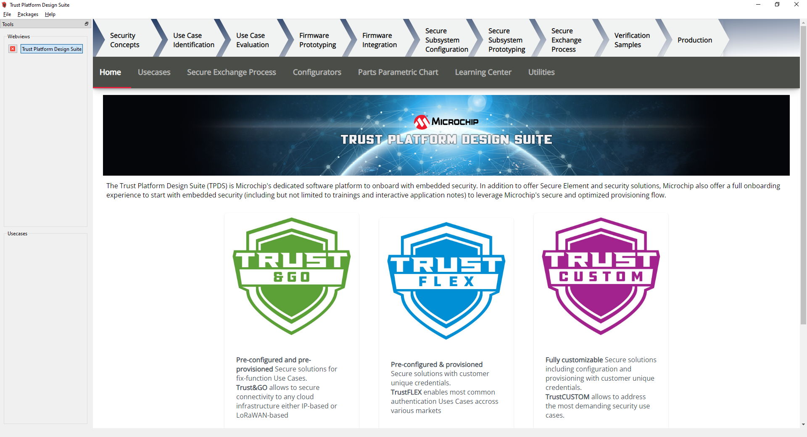
3. Select "Trust Platform Design Suite" in **webviews** and Click on **Usecases**  
	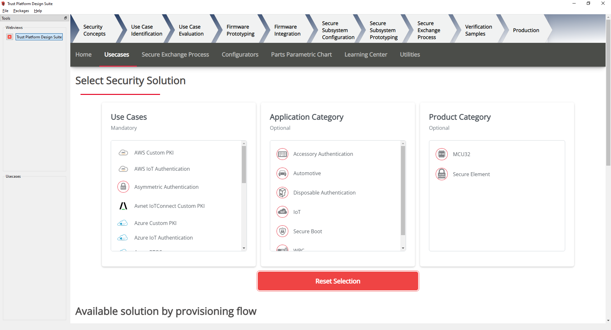
4. In **Select Security Solution**, Under **Use Cases** select **AWS IoT Authentication**
	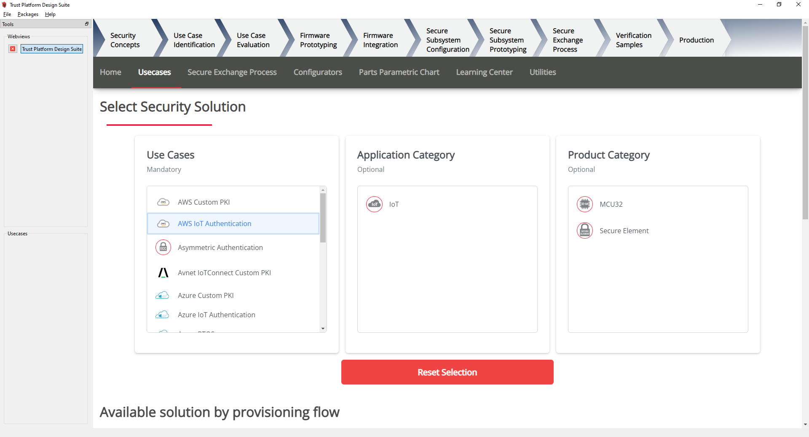
5. Scroll Down and in **Available solution by provisioning flow** select **AWS IoT Authentication** under **PIC32CMLS60**  
	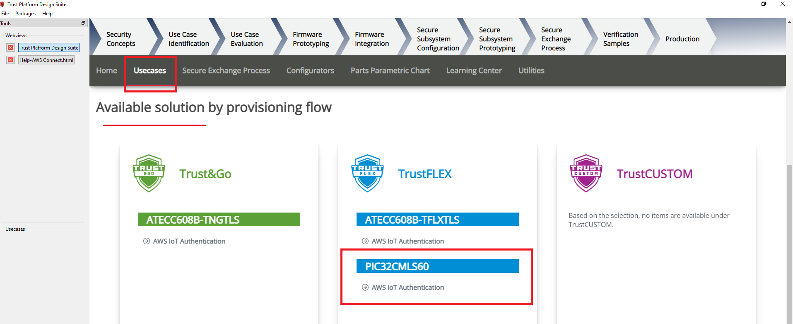
6. A Usecase gets launched. click on **PIC32CMLS60_AWSIoTAuth-TFLEX** from the **Usescases**  
	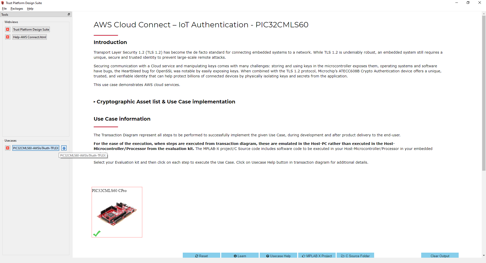  
7. AWS Cloud Connect – IoT Authentication - PIC32CMLS60 page launches as shown below  
	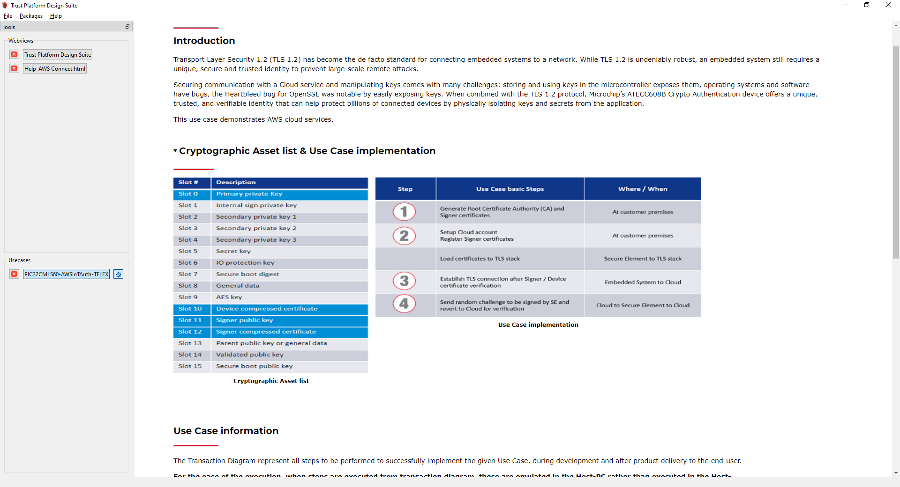
8. Scroll down and select PIC32CMLS60 CPro Development board if not selected  
	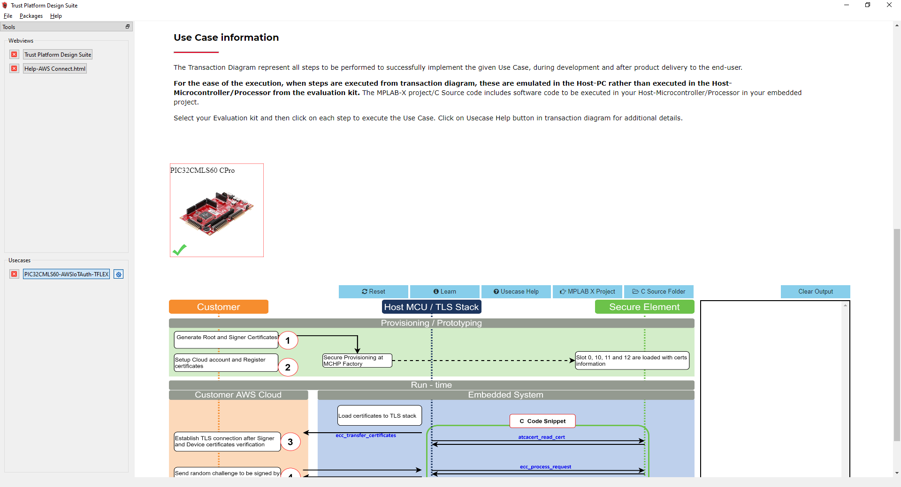
9. Connect PIC32CMLS60 CPro Development Board to PC running Trust Platform Design Suite

10. Ensure MPLAB X Path is set in File -> Preference under System Settings in TPDS. This helps to program the provisioner kit firmware to the PIC32CMLS60 CPro Development Board

11. Scroll down to transaction diagram  
	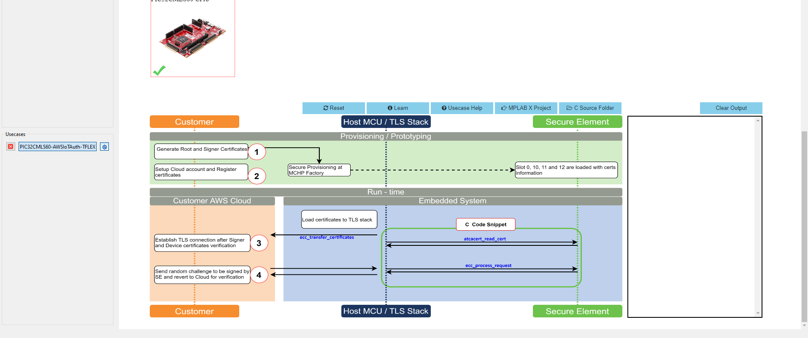
12. Click on Icon **1** and wait till a green right mark appears.  
	
13. Sequentially Click on Icon **2**, **3** and **4**  
	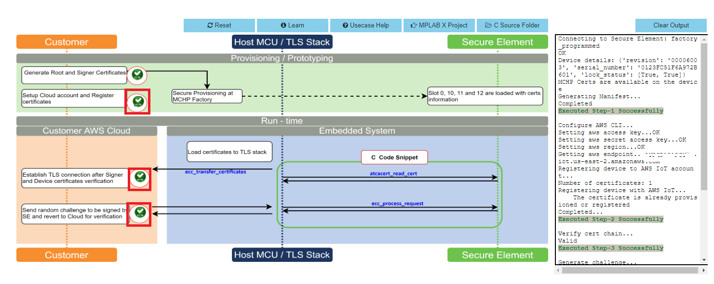  
13. Note the output in the output window on the right side
14. Once the usecase steps are executed successfully, click on **C Source Files** and copy the **aws_config.h** file to the ls60_host folder(pic32cm_ls60_secure_iot_gateway\firmware\pic32cm_ls60_cpro_sg_host).

<h2>  </h2>

<h2> ATWINC1510 Wi-Fi Controller Module Firmware and AWS Root Certificates Upgrade Guide </h2>

  
 Details

- Navigate to the **utilities** folder inside the project directory **(pic32cm_ls60_secure_iot_gateway\firmware\pic32cm_ls60_cpro_sg_host)**  
  
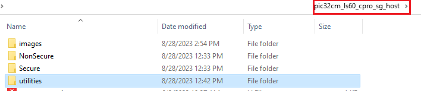

- Follow the steps in readme.md file inside the folder to do the WINC firmware upgrade.

## Hardware Setup:
- Connect the MIKROE OLED C Click to the mikroBUS extension in the PIC32CM LS60 Curiosity Pro Evaluation Kit
- Connect the ATWINC1500-XPRO to the EXT3 of the PIC32CM LS60 Curiosity Pro Evaluation Kit
- Connect the jumper wires from **PA22/PA23** for SERCOM UART RX/TX to communicate with the client
- Connect the PIC32CM LS60 Curiosity Pro Evaluation Kit to the Host PC as a USB Device through a Type-A male to micro-B USB cable connected to Micro-B USB (Debug USB) port

#### PIC32CM LS60 Host 
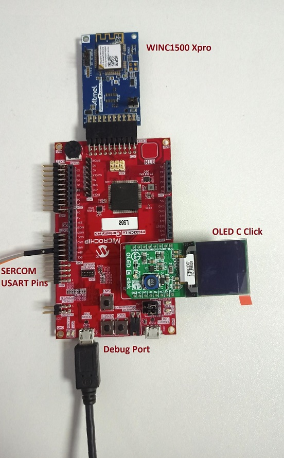

#### Demo Setup

For complete "Secure IoT Gateway application" demo setup, refer to demo **readme.md** inside the project directory **(pic32cm_ls60_secure_iot_gateway)**

## Prerequisites 
- Ensure PIC32CM LS60 host is provisioned on AWS cloud as mentioned under the heading **"AWS Cloud IoT Provisioning Guide"**

## Programming hex file:
The pre-built hex file can be programmed by following the below steps.  

### Steps to program the hex file
- Perform [Prerequisites](Prerequisites) steps mentioned above, if not done already.
- Open MPLAB X IDE
- Close all existing projects in IDE, if any project is opened.
- Go to File -> Import -> Hex/ELF File
- In the "Import Image File" window, Step 1 - Create Prebuilt Project, Click the "Browse" button to select the prebuilt hex file.
- Select Device has "PIC32CM5164LS60100"
- Ensure the proper tool is selected under "Hardware Tool"
- Click on Next button
- In the "Import Image File" window, Step 2 - Select Project Name and Folder, select appropriate project name and folder
- Click on Finish button
- In MPLAB X IDE, click on "Make and Program Device" Button. The device gets programmed in sometime
- Follow the steps in [Running the Demo](#Running_Demo) section below

## Programming/Debugging Application Project:
- Open the project (pic32cm_ls60_secure_iot_gateway/firmware/pic32cm_ls60_cpro_sg_host) in MPLAB X IDE
- Open both Secure and NonSecure project inside the project group and set the cloud_connect_NonSecure as the main project.
- Ensure "PIC32CM LS60 Curiosity Xpro" is selected as hardware tool to program/debug the application
- Build the code and program the device by clicking on the "Make and Program Device" button in MPLAB X IDE tool bar
- Follow the steps in [Running the Demo](#Running_Demo) section below

## Wi-Fi configuration through CLI:  

- Open a terminal application on the host PC for the virtual COM port of the connected PIC32CMLS60 Curiossity pro evaluation kit, with 115200-8-None-1 settings.  

- Just enter the below command to set the Wi-Fi credentials. 
  
    ***`wifi < SSID >,< PASSWORD >,< SECURITY TYPE >`***  
    example : ***`wifi MCHP_test_,Asdfghjk,2`***  
  
  **Note:**No need of repeating this step every time while running the demo, Device remembers last used WiFi credentials and try to connect to it. If WiFi credentials changes, this step should be performed.
  
## Running the Demo: 
- Open the Tera Term terminal application on your PC (from the Windows® Start menu by pressing the Start button)
- Change the baud rate to 115200
- The MIKROE OLED C Click board doesn't display any value yet. 
- The **LED(LED1) will be on if there is no active WiFi connection. Once the certificate verification is done, follw the steps in section [Wi-Fi configuration through CLI](#Wi-Fi_CLI) to enter the WiFi credentials.
- Once WiFi and MQTT connection is successful, the **LED1** will be **Off** and **LED0** will be **On**
- Press **SW0** on the PIC32CM LS60 Curiosity Pro Evaluation Kit to start the authentication process
- Once authentication is successful, the MIKROE OLED C Click will display the sensor values and the cloud will be updated with the sensor values periodically
- An **LED (LED0)** on the PIC32CM LS60 Curiosity Pro Evaluation Kit toggles on every time the sensor values are published
- The WINC1500 Initialization messages and MQTT connection details would be displayed in the terminal

#### Host MIKROE OLED C Click After Successful Authentication
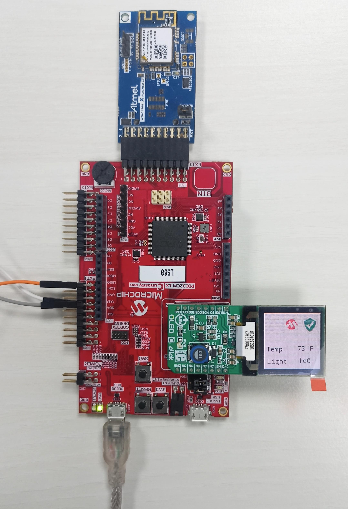

#### Host Teraterm Output After Successful Authentication

#### AWS Cloud MQTT Messages After Successful Authentication
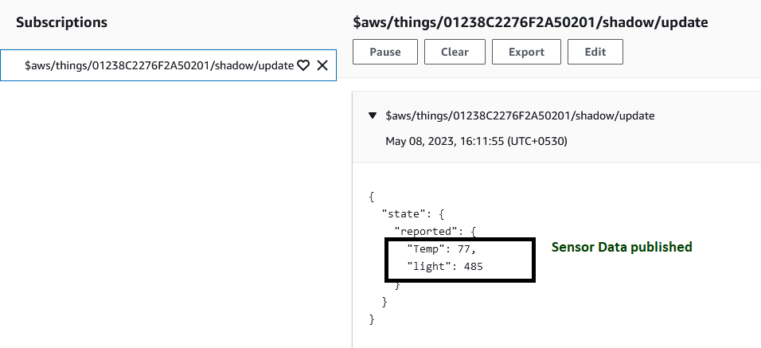

## Comments:
- Reference Document: [PIC32CM LS00/LS60 Security Reference Guide](https://ww1.microchip.com/downloads/aemDocuments/documents/MCU32/ApplicationNotes/ApplicationNotes/AN3992-PIC32CM-LS00-LS60-Security-Reference-Guide-DS00003992.pdf)
- This application demo builds and works out of box by following the instructions above in [Running the Demo](#Running_Demo) section. If you need to enhance/customize this application demo, you need to use the MPLAB Harmony v3 Software framework. Refer links below to setup and build your applications using MPLAB Harmony.
	- [How to Setup MPLAB Harmony v3 Software Development Framework](https://ww1.microchip.com/downloads/en/DeviceDoc/How_to_Setup_MPLAB_%20Harmony_v3_Software_Development_Framework_DS90003232C.pdf)
	- [How to Build an Application by Adding a New PLIB, Driver, or Middleware to an Existing MPLAB Harmony v3 Project](http://ww1.microchip.com/downloads/en/DeviceDoc/How_to_Build_Application_Adding_PLIB_%20Driver_or_Middleware%20_to_MPLAB_Harmony_v3Project_DS90003253A.pdf)  
	-  **MPLAB Harmony v3 is also configurable through MPLAB Code Configurator (MCC). Refer to the below links for specific instructions to use MPLAB Harmony v3 with MCC.**
		- [Create a new MPLAB Harmony v3 project using MCC](https://microchipdeveloper.com/harmony3:getting-started-training-module-using-mcc)
		- [Update and Configure an Existing MHC-based MPLAB Harmony v3 Project to MCC-based Project](https://microchipdeveloper.com/harmony3:update-and-configure-existing-mhc-proj-to-mcc-proj)
		- [Getting Started with MPLAB Harmony v3 Using MPLAB Code Configurator](https://www.youtube.com/watch?v=KdhltTWaDp0)
		- [MPLAB Code Configurator Content Manager for MPLAB Harmony v3 Projects](https://www.youtube.com/watch?v=PRewTzrI3iE)

## Revision:
- v1.6.0 released demo application host