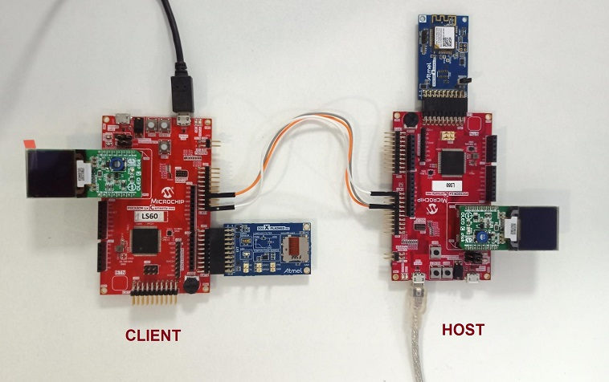
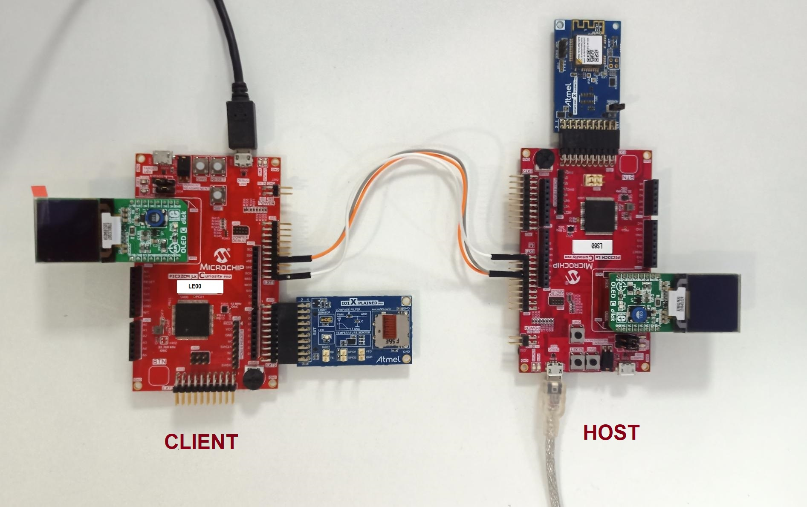
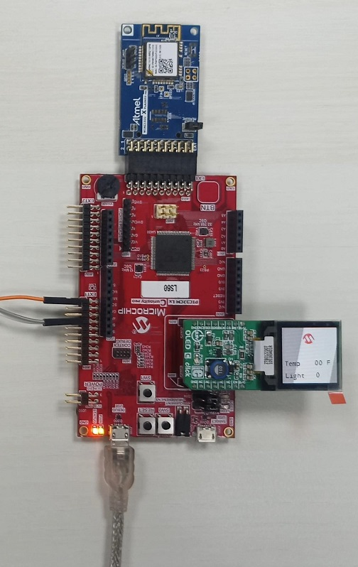
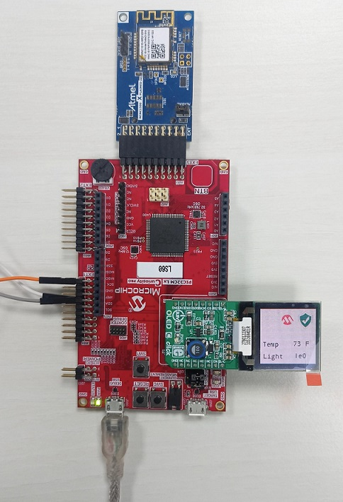
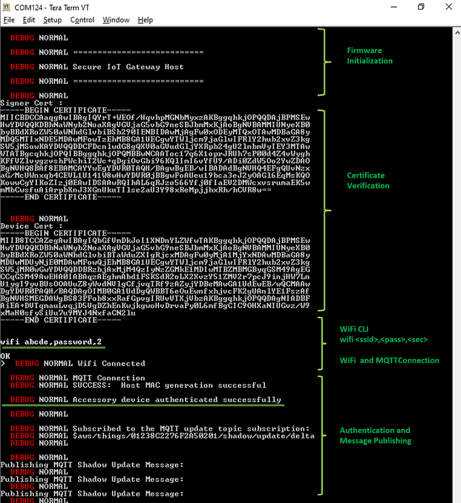
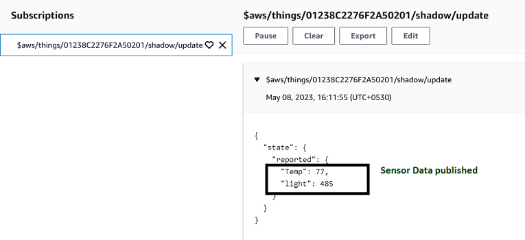
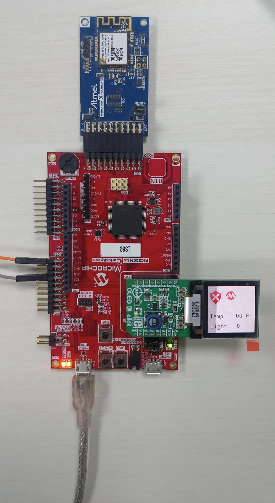
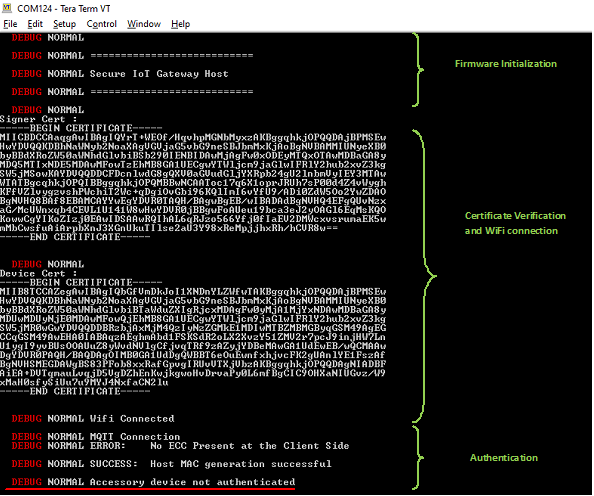

# Secure IoT Gateway on PIC32CM LS60 Curiosity Pro Evaluation Kit
<h2 align="center"> <a href="https://github.com/Microchip-MPLAB-Harmony/reference_apps/releases/latest/download/pic32cm_ls60_secure_iot_gateway.zip" > Download </a> </h2>

-----
## Description

> This application demonstrates the anti-cloning feature on the PIC32CM LS60 microcontroller (MCU). The application has three projects pertaining to Secure and Non-Secure modes of PIC32CM LS60 that work between the Host and Client devices (PIC32CM LS60/LE00) and offers security isolation between the trusted and the non-trusted resources in the device.

- The application includes host and client projects.

- **PIC32CM LS60 Host application:**
    - The host project initiates the symmetric authentication process of the client connected to it. The host also connects to the AWS IoT cloud. Once the SW0 button on the host device is pressed, the random number from the inbuilt ATECC608B is sent across the USART pins to the client and awaits the result. Once the client is authenticated, the sensor data is received and displayed on the MIKROE OLED C Click board. The data is also published to the AWS IoT Core at timely intervals. The LED0 on the host toggles each time the data is published to the cloud. The host's connection to the PIC32CM LS60 client would be successful as the authentication (through the ATECC608B) would be successful. However, the PIC32CM LE00 client would fail the authentication process as there is no inbuilt ATECC608B. If the authentication fails, the data is not displayed on the host side or published to the cloud.

- **PIC32CM LS60 Client application:**
    - The PIC32CM LS60 Client reads the sensor data from the temperature and light sensors on the I/O1 Xplained Pro board connected to the EXT2 Xpro connector. The client waits for the host to initiate the authentication process. Once the authentication is completed successfully, the sensor data is sent to the host through the USART. The MAC calculation and SERCOM transmission are placed securely in the secure region of the PIC32CM LS60.

- **PIC32CM LE00 Client application:**
    - The PIC32CM LE00 Client reads the sensor data from the temperature and light sensors on the I/O1 Xplained Pro board connected to the EXT2 XPRO connector. The client waits for the host to initiate the authentication process. Since the authentication fails, the sensor data is not sent across the host through USART.

## Modules/Technology Used:

- For PIC32CM LS60 Host [Click Here](./firmware/pic32cm_ls60_cpro_sg_host/readme.md)
- For PIC32CM LS60 Client [Click Here](./firmware/pic32cm_ls60_cpro_sg_client/readme.md)
- For PIC32CM LE00 Client [Click Here](./firmware/pic32cm_le00_cpro_sg_client/readme.md)

## Hardware Used:

- [PIC32CM LS60 Curiosity Pro Evaluation Kit](https://www.microchip.com/en-us/development-tool/EV76R77A)
- [PIC32CM LE00 Curiosity Pro Evaluation Kit](https://www.microchip.com/en-us/development-tool/EV80P12A)
- [I/O1 Xplained Pro Extension Kit](https://www.microchip.com/Developmenttools/ProductDetails/ATIO1-XPRO)
- [ATWINC1500-XPRO](https://www.microchip.com/en-us/development-tool/ATWINC1500-XPRO)
- [MIKROE OLED C Click](https://www.mikroe.com/oled-c-click)

## Software/Tools Used:
 This project has been verified to work with the following versions of software tools:  

- **For Host**, Refer Manifest for [Secure](./firmware/pic32cm_ls60_cpro_sg_host/Secure/firmware/src/config/pic32cm_ls60/harmony-manifest-success.yml) and [NonSecure](./firmware/pic32cm_ls60_cpro_sg_host/NonSecure/firmware/src/config/pic32cm_ls60/harmony-manifest-success.yml) projects present in harmony-manifest-success.yml under the project folder *firmware/pic32cm_ls60_cpro_sg_host/{Secure or NonSecure}/firmware/src/config/pic32cm_ls60*

- **For LS60 Client**, Refer Manifest for [Secure](./firmware/pic32cm_ls60_cpro_sg_client/Secure/firmware/src/config/pic32cm_ls60/harmony-manifest-success.yml) and [NonSecure](./firmware/pic32cm_ls60_cpro_sg_client/NonSecure/firmware/src/config/pic32cm_ls60/harmony-manifest-success.yml) projects present in harmony-manifest-success.yml under the project folder *firmware/pic32cm_ls60_cpro_sg_host/{Secure or NonSecure}/firmware/src/config/pic32cm_ls60*

- **For LE00 Client**, Refer [Manifest](./firmware/pic32cm_le00_cpro_sg_client/firmware/src/config/pic32cm_le00/harmony-manifest-success.yml) for project present in harmony-manifest-success.yml under the project folder *firmware/pic32cm_le00_cpro_sg_client/firmware/src/config/pic32cm_le00*

- Refer the [Release Notes](../../../release_notes.md#development-tools) to know the **MPLAB X IDE** and **MCC** Plugin version. Alternatively, [Click Here](https://github.com/Microchip-MPLAB-Harmony/reference_apps/blob/master/release_notes.md#development-tools).  
- Any Serial Terminal application like Tera Term terminal application.

- Trust Platform Design Suite v2.3.5 or above [Click Here](https://www.microchip.com/en-us/product/SW-TPDSV2)

 Because Microchip regularly update tools, occasionally issue(s) could be discovered while using the newer versions of the tools. If the project doesn’t seem to work and version incompatibility is suspected, It is recommended to double-check and use the same versions that the project was tested with.  To download original version of MPLAB Harmony v3 packages, refer to document [How to Use the MPLAB Harmony v3 Project Manifest Feature](https://ww1.microchip.com/downloads/en/DeviceDoc/How-to-Use-the-MPLAB-Harmony-v3-Project-Manifest-Feature-DS90003305.pdf)

## Hardware Setup 1: 
### PIC32CM LS60 Host to PIC32CM LS60 Client

#### PIC32CM LS60 Host 
- Connect the MIKROE OLED C Click to the mikroBUS extension in the PIC32CM LS60 Curiosity Pro Evaluation Kit
- Connect the ATWINC1500-XPRO to the EXT3 of the PIC32CM LS60 Curiosity Pro Evaluation Kit
- Connect the jumper wires from **PA22/PA23** for SERCOM UART RX/TX to communicate with the client
- Connect the PIC32CM LS60 Curiosity Pro Evaluation Kit to the Host PC as a USB Device through a Type-A male to micro-B USB cable connected to Micro-B USB (Debug USB) port
- The PIC32CM LS60 Curiosity Pro Evaluation Kit allows the Embedded Debugger (EDBG) to be used for debugging

#### PIC32CM LS60 Client
- Connect the MIKROE OLED C Click to the mikroBUS extension in the PIC32CM LS60 Curiosity Pro Evaluation Kit
- Connect the I/O1 Xplained Pro Extension Kit to the EXT2 in the PIC32CM LS60 Curiosity Pro Evaluation Kit
- Connect the jumper wires from **PA22/PA23** for SERCCOM UART RX/TX to communicate with the host
- Connect the PIC32CM LS60 Curiosity Pro Evaluation Kit to the Host PC as a USB Device through a Type-A male to micro-B USB cable connected to Micro-B USB (Debug USB) port

#### Demo Setup

**Note:** Connect the USART RX/TX of the Host to the USART TX/RX of the client

## Hardware Setup 2: 
### PIC32CM LS60 Host to PIC32CM LE00 Client

#### PIC32CM LS60 Host
- Same setup as mentioned in [PIC32CM LS60 Host](#PIC32CM_LS60_Host_HwSetup) under **Harware Setup 1**

#### PIC32CM LE00 Client
- Connect the MIKROE OLED C Click to the mikroBUS extension in the PIC32CM LE00 Curiosity Pro Evaluation Kit
- Connect the I/O1 Xplained Pro Extension Kit to the EXT2 in the PIC32CM LE00 Curiosity Pro Evaluation Kit
- Connect the jumper wires from **PA22/PA23** for SERCCOM UART RX/TX to communicate with the host
- Connect the PIC32CM LE00 Curiosity Pro Evaluation Kit to the Host PC as a USB Device through a Type-A male to micro-B USB cable connected to Micro-B USB (Debug USB) port

#### Demo Setup

**Note:** Connect the USART RX/TX of the Host to the USART TX/RX of the client

## Prerequisites 
- Ensure PIC32CM LS60 host is provisioned on AWS cloud as mentioned under the heading **"AWS Cloud IoT Provisioning Guide"** in the PIC32CM LS60 Host project's [readme.md](./firmware/pic32cm_ls60_cpro_sg_host/readme.md).

## Programming Methods:
- The device can be programmed in two ways
    - Refer [Method 1](#ProgrammingHex): Programming using the prebuilt hex file.
    - Refer [Method 2](#ApplicationProject): Programming by building the application project.

## Method 1: Steps for Programming prebuilt hex file: 
### Steps to program the hex file
- Perform [Prerequisites](#Prerequisites) steps mentioned above, if not done already.
- Open MPLAB X IDE
- Close all existing projects in IDE, if any project is opened.
- Go to File -> Import -> Hex/ELF File
- In the "Import Image File" window, Step 1 - Create Prebuilt Project, Click the "Browse" button to select the prebuilt hex file.
- Select Device has "PIC32CM5164LS60100"
- Ensure the proper tool is selected under "Hardware Tool"
- Click on Next button
- In the "Import Image File" window, Step 2 - Select Project Name and Folder, select appropriate project name and folder
- Click on Finish button
- In MPLAB X IDE, click on "Make and Program Device" Button. The device gets programmed in sometime
- Follow the steps in [Running the Demo](#Running_Demo) under **PIC32CM LS60 Host** section below

## Method 2: Steps for Programming by building the application project:
## Programming/Debugging Application Project:
#### PIC32CM LS60 Host
- Open the project (pic32cm_ls60_secure_iot_gateway/firmware/pic32cm_ls60_cpro_sg_host) in MPLAB X IDE
- Open both Secure and NonSecure project inside the project group and set the NonSecure as the main project.
- Ensure "PIC32CM LS60 Curiosity Xpro" is selected as hardware tool to program/debug the application
- Build the code and program the device by clicking on the "Make and Program Device" button in MPLAB X IDE tool bar
- Follow the steps in [Running the Demo](#Running_Demo) under **PIC32CM LS60 Host** section below

#### PIC32CM LS60 Client 

- Open the project (pic32cm_ls60_secure_iot_gateway/firmware/pic32cm_ls60_cpro_sg_client) in MPLAB X IDE
- Open both Secure and NonSecure project inside the project group and set the NonSecure as the main project
- Ensure "PIC32CM LS60 Curiosity Pro" is selected as hardware tool to program/debug the application
- Build the code and program the device by clicking on the "Make and Program Device" button in MPLAB X IDE tool bar
- Follow the steps in [Running the Demo](#Running_Demo_LS60_Client) under **PIC32CM LS60 Client** section below

#### PIC32CM LE00 Client 
- Open the project (pic32cm_ls60_secure_iot_gateway/firmware/pic32cm_le00_cpro_sg_client) in MPLAB X IDE
- Ensure "PIC32CM LE00 Curiosity Pro" is selected as hardware tool to program/debug the application
- Build the code and program the device by clicking on the "Make and Program Device" button in MPLAB X IDE tool bar
- Follow the steps in [Running the Demo](#Running_Demo_LE00_Client) under **PIC32CM LE00 Client** section below

## Wi-Fi configuration through CLI:   

- Open a terminal application on the host PC for the virtual COM port of the connected PIC32CMLS60 Curiossity pro evaluation kit, with 115200-8-None-1 settings.  

- Just enter the below command to set the Wi-Fi credentials. 
  
    ***`wifi < SSID >,< PASSWORD >,< SECURITY TYPE >`***  
    example : ***`wifi MCHP_test_,Asdfghjk,2`***  
  
  **Note:**No need of repeating this step every time while running the demo, Device remembers last used WiFi credentials and try to connect to it. If WiFi credentials changes, this step should be performed.
  
## Running the Demo: 
#### PIC32CM LS60 Host
- Open the Tera Term terminal application on your PC (from the Windows® Start menu by pressing the Start button)
- Change the baud rate to 115200
- The MIKROE OLED C Click board doesn't display any value yet
- Press **SW0** on the PIC32CM LS60 Curiosity Pro Evaluation Kit to start the authentication process
- The **LED(LED1) will be on if there is no active WiFi connection. Once the certificate verification is done, follw the steps in section [Wi-Fi configuration through CLI](#Wi-Fi_CLI) to enter the WiFi credentials.
- Once WiFi and MQTT connection is successful, the **LED1** will be **Off** and **LED0** will be **On**
- Once authentication is successful, the MIKROE OLED C Click will display the sensor values and the cloud will be updated with the sensor values periodically
- An **LED (LED0)** on the PIC32CM LS60 Curiosity Pro Evaluation Kit toggles every time the sensor values are published
- The WINC1500 Initialization messages and MQTT connection details would be displayed in the terminal

#### Host MIKROE OLED C Click Before Authentication

#### PIC32CM LS60 Client 
- Perform Programming/Debugging Application Project steps under [PIC32CM LS60 Client](#Program_PIC32CM_LS60_Client) mentioned above, if not done already
- After the device is successfuly programmed and authenticated, the display on OLED C board at the **Host** indicates successful authentication as shown below

#### Host MIKROE OLED C Click After Successful Authentication

#### Host Teraterm Output After Successful Authentication

#### AWS Cloud MQTT Messages After Successful Authentication

#### PIC32CM LE00 Client
- Perform Programming/Debugging Application Project steps under [PIC32CM LE00 Client](#Program_PIC32CM_LE00_Client) mentioned above, if not done already
- After the device is successfuly programmed and authentication procedure completes, the display on OLED C board at **Host** indicates unsuccessful authentication as shown below

#### Host MIKROE OLED C Click After Unsuccessful Authentication

#### Host Teraterm Output After Unsuccessful Authentication

## Comments: 
- [Getting Started with the PIC32CM LE00/LS60/LS60 Curiosity Pro Board](https://ww1.microchip.com/downloads/aemDocuments/documents/MCU32/ApplicationNotes/ApplicationNotes/AN4511-Getting-Started-with-the-PIC32CM-LE00-LS00-LS60-Curiosity-Pro-Board-DS00004511.pdf)
- [ Dual Developer Application Development Use Case with TrustZone on SAM L11 Using MPLAB Harmony v3](https://ww1.microchip.com/downloads/en/DeviceDoc/Dual-Developer-Application-Development-Use-Case-with-TrustZone-on-SAM-L11-Using-MPLAB-Harmony-DS90003306.pdf)
    - **Note:** Though this technical brief is on SAM L11 MCUs, the TrustZone concepts it describes also applies to PIC32CM MC LS60 MCUs.
- This application demo builds and works out of box by following the instructions above in "Running the Demo" section. If you need to enhance/customize this application demo, you need to use the MPLAB Harmony v3 Software framework. Refer links below to setup and build your applications using MPLAB Harmony.
    - [How to Setup MPLAB Harmony v3 Software Development Framework](https://ww1.microchip.com/downloads/en/DeviceDoc/How_to_Setup_MPLAB_%20Harmony_v3_Software_Development_Framework_DS90003232C.pdf)
    - [How to Build an Application by Adding a New PLIB, Driver, or Middleware to an Existing MPLAB Harmony v3 Project](http://ww1.microchip.com/downloads/en/DeviceDoc/How_to_Build_Application_Adding_PLIB_%20Driver_or_Middleware%20_to_MPLAB_Harmony_v3Project_DS90003253A.pdf)
    -  **MPLAB Harmony v3 is also configurable through MPLAB Code Configurator (MCC). Refer to the below links for specific instructions to use MPLAB Harmony v3 with MCC.**
        - [Create a new MPLAB Harmony v3 project using MCC](https://microchipdeveloper.com/harmony3:getting-started-training-module-using-mcc)
        - [Update and Configure an Existing MHC-based MPLAB Harmony v3 Project to MCC-based Project](https://microchipdeveloper.com/harmony3:update-and-configure-existing-mhc-proj-to-mcc-proj)
        - [Getting Started with MPLAB Harmony v3 Using MPLAB Code Configurator](https://www.youtube.com/watch?v=KdhltTWaDp0)
        - [MPLAB Code Configurator Content Manager for MPLAB Harmony v3 Projects](https://www.youtube.com/watch?v=PRewTzrI3iE)

## Revision:
- v1.6.0 - Released demo application