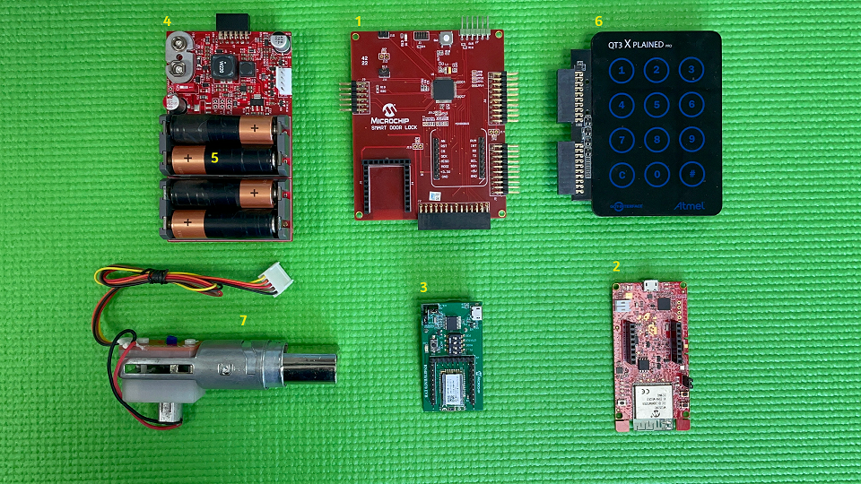
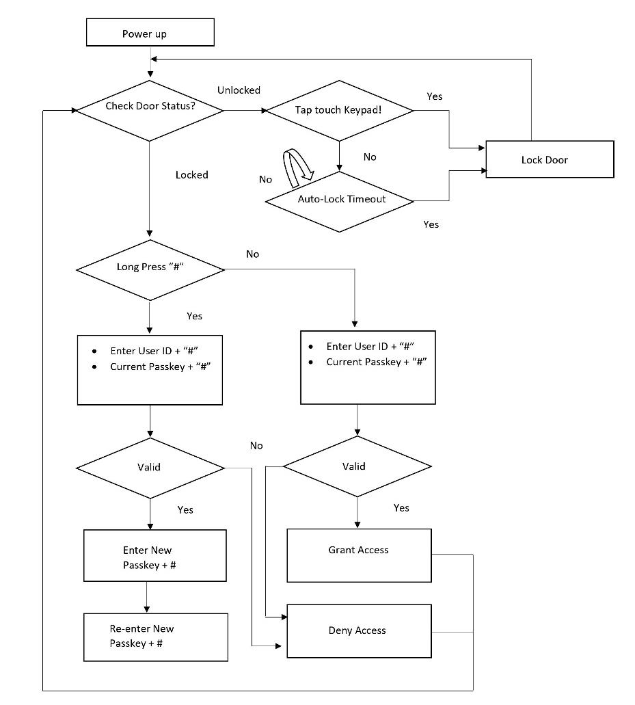

 

 

# Smart Lock Application on PIC32CM LS60 Smart Lock Reference Board
<h2 align="center"> <a href="https://github.com/Microchip-MPLAB-Harmony/reference_apps/releases/latest/download/pic32cm_ls60_rd_smart_lock.zip" > Download </a> </h2>

 

-----

## Description

The application showcases key-less secure access control and monitoring of a deadbolt through multiple methods:
  - ### Capacitive Touch keypad
	* Multiple unique user passkeys
  - ### Smartphone App
	* Secure bluetooth control
	* Remote access control using WiFi with AWS cloud
	
	
## Modules/Technology Used:
- Peripheral Modules
	- ADC
	- EIC
	- EVSYS
	- NVMCTRL
	- PTC
	- RTC
	- SERCOM (SPI)
	- SERCOM (USART)
	- SERCOM (I2C)
	- TC
- Drivers
	- ATECC608
- System service
  - TIME	
- Tools
	- Secure STDIO
- Libraries
	- Touch Library
	- Crypto Authentication Library

## Hardware Used:

1. PIC32CM LS60 Smart Lock Reference Board(1)
2. [WFI32-IoT Development Board: EV36W50A](https://www.microchip.com/en-us/development-tool/ev36w50a)(2)
3. [BM70 Compact Demo Board: BM-70-CDB](https://www.microchip.com/en-us/development-tool/BM-70-CDB)(2)
4. Power and Motor Control Board(1)
5. Four AA 1.5V alkaline batteries(2)
6. [QT3 XPLAINED PRO EXTENSION KIT: ATQT3-XPRO](https://www.microchip.com/en-us/development-tool/atqt3-xpro)(1)
7. Schlage Deadbolt with motor and custom printed interface for limit switch(1)

Note:
 1) Contact [Microchip technical support](https://www.microchip.com/en-us/support) or local Microchip FAE for purchasing the Smart Door Lock kit bundle
 2) Not provided as part of the Smart Door Lock kit bundle. Should be procured separately (through Microchip Direct or any thirdparty vendor)

## Software/Tools Used:
 This project has been verified to work with the following versions of software tools:

Refer [Project Manifest](./firmware/NonSecure/firmware/src/config/default/harmony-manifest-success.yml) present in harmony-manifest-success.yml under the project folder *firmware/src/config/default*
- Refer the [Release Notes](../../../release_notes.md#development-tools) to know the **MPLAB X IDE** and **MCC** Plugin version. Alternatively, [Click Here](https://github.com/Microchip-MPLAB-Harmony/reference_apps/blob/master/release_notes.md#development-tools)
- Any Serial Terminal application like Tera Term terminal application.

 Because Microchip regularly update tools, occasionally issue(s) could be discovered while using the newer versions of the tools. If the project doesn’t seem to work and version incompatibility is suspected, It is recommended to double-check and use the same versions that the project was tested with.  To download original version of MPLAB Harmony v3 packages, refer to document [How to Use the MPLAB Harmony v3 Project Manifest Feature](https://ww1.microchip.com/downloads/en/DeviceDoc/How-to-Use-the-MPLAB-Harmony-v3-Project-Manifest-Feature-DS90003305.pdf)

## Setup:

The demo can be run in three different modes:
1. Standalone Touch keypad entry
2. Bluetooth control using [BM70 Compact Demo Board](https://www.microchip.com/en-us/development-tool/BM-70-CDB) and Smartphone application
3. WiFi control using [WFI32-IoT Development Board](https://www.microchip.com/en-us/development-tool/ev36w50a) and AWS cloud

### Standalone Touch keypad entry
Connect the QT3 Xplained pro, Power board and the deadbolt to the PIC32CM LS60 Smart Lock Reference Board as seen below:

On powering the kit, the Smart Door Lock becomes functional and waits for the user input through the Touch Keypad to control the entry access. This kit allows up to five user-authenticated entries through the door lock, and each user has a user ID (1, 2, 3 , 4 & 5). Each user would require a passkey to enter through the Touch Keypad to open the lock.

#### User Entry/Passkey Authentication
1) Select a user ID (press any number from 2 to 5)(1) and press "#".
2) Enter the 5-digit passkey(2) corresponding to the selected user and then press "#".
3) If the passkey is valid, the door opens.
4) The door automatically relocks after 10 seconds.

#### *Note:* 
(1) User ID 1 is for the temporary passkey generated using the Mobile app. This user ID cannot be used without provisioning the mobile app 
(2) By default, all users (2, 3, 4 and 5) have the same passkey - '12345' 

#### Passkey Modification
The passkey of each user can be altered through the touch keypad using the steps outlined below.
1. Long press “#” button until all the touch LEDs blink in the Touch Keypad.
2. Enter the corresponding user ID which needs to be changed and press “#” (1)
3. Enter the current passkey, and press ‘#’ to authenticate the user (2)
4. Once authenticated, enter the new passkey and press “#”
5. To reconfirm, enter the new passkey again and press “#”
6. This configures the lock with the new Passkey

#### *Note:* 
(1) User ID 1 is for the temporary passkey generated using the Mobile app. 
(2) If this is the first-time configuration, enter the default passkey (12345) for validation and press “#” 
• Activate the touchpad using your palm. 
• Only 5-digit passcodes can be stored, but any number of digits can be entered on the touch keypad; only the final 5 before pressing '#' will be accepted. 

 

### Bluetooth and WiFi control using Smartphone
A custom Android application must be installed in the smartphone to control the door lock module. [Click here](https://github.com/Microchip-MPLAB-Harmony/reference_apps/releases/latest/download/MicrochipBluetoothData_SmartLock.apk) to download the .apk file for the app. After installing the app, it needs to be provisioned so that the mobile and the door lock device can be securely connected. Create a. Create a [Microchip Technical Support](https://www.microchip.com/en-us/support) case for provisioning your smartphone with your bluetooth module.
Add the following details to the support case: 
	*Case Reason: Hardware/Firmware Support 
	Subject: Smart Door Lock: Primary provisioning token request 
	Primary Target Device: PIC32CM5164LS60064 
	Case Description: < share BLE MAC ID of your BM70 board >  *

## Programming hex file:
Connect Atmel ICE or PICKIT4 or any other programmer that supports SWD programming to the J1 header on the PIC32CM LS60 Smart Lock Reference Board.
The pre-built hex file can then be programmed by following the below steps:

### Steps to program the hex file
- Open MPLAB X IDE
- Close all existing projects in IDE, if any project is opened.
- Go to File -> Import -> Hex/ELF File
- In the "Import Image File" window, Step 1 - Create Prebuilt Project, click the "Browse" button to select the prebuilt hex file.
- Select Device as "PIC32CM5164LS60064"
- Ensure the proper tool is selected under "Hardware Tool"
- Click on "Next" button
- In the "Import Image File" window, Step 2 - Select Project Name and Folder, select appropriate project name and folder
- Click on "Finish" button
- In MPLAB X IDE, click on "Make and Program Device" Button. The device gets programmed in sometime.
- Follow the steps in "Running the Demo" section below

## Programming/Debugging Application Project:
- Open the project (pic32cm_ls60_rd_smart_lock/NonSecure/firmware/pic32cm_ls60_sdl_NonSecure.X) in MPLAB X IDE
- Ensure proper tool is selected to program/debug the application
- Build the code and program the device by clicking on the "make and program" button in MPLAB X IDE tool bar
- Follow the steps in "Running the Demo" section below

## Running the Demo:
- Upon completion of programming, you should see the QT3 keypad light up and go back to sleep
- Activate the touchpad using your palm
- Select a user and enter the default passkey '12345' to open the deadbolt

Note: This shows a custom passkey being entered. By default all users (2, 3, 4 and 5) have the same passkey - '12345' 

## Reference:
- For more details on the application usage, functionality and other details, refer to the [PIC32CM LS60 Smart Door Lock User Guide]()

## Comments: 
- [Getting Started with the PIC32CM LE00/LS60/LS60 Curiosity Pro Board](https://ww1.microchip.com/downloads/aemDocuments/documents/MCU32/ApplicationNotes/ApplicationNotes/AN4511-Getting-Started-with-the-PIC32CM-LE00-LS00-LS60-Curiosity-Pro-Board-DS00004511.pdf)
- [ Dual Developer Application Development Use Case with TrustZone on SAM L11 Using MPLAB Harmony v3](https://ww1.microchip.com/downloads/en/DeviceDoc/Dual-Developer-Application-Development-Use-Case-with-TrustZone-on-SAM-L11-Using-MPLAB-Harmony-DS90003306.pdf)
    - **Note:** Though this technical brief is on SAM L11 MCUs, the TrustZone concepts it describes also applies to PIC32CM MC and PIC32CM LS60 MCUs.
- This application demo builds and works out of box by following the instructions above in "Running the Demo" section. If you need to enhance/customize this application demo, you need to use the MPLAB Harmony v3 Software framework. Refer links below to setup and build your applications using MPLAB Harmony.
	- [How to Setup MPLAB Harmony v3 Software Development Framework](https://ww1.microchip.com/downloads/en/DeviceDoc/How_to_Setup_MPLAB_%20Harmony_v3_Software_Development_Framework_DS90003232C.pdf)
	- [How to Build an Application by Adding a New PLIB, Driver, or Middleware to an Existing MPLAB Harmony v3 Project](http://ww1.microchip.com/downloads/en/DeviceDoc/How_to_Build_Application_Adding_PLIB_%20Driver_or_Middleware%20_to_MPLAB_Harmony_v3Project_DS90003253A.pdf)  
	-  **MPLAB Harmony v3 is also configurable through MPLAB Code Configurator (MCC). Refer to the below links for specific instructions to use MPLAB Harmony v3 with MCC.**
		- [Create a new MPLAB Harmony v3 project using MCC](https://microchipdeveloper.com/harmony3:getting-started-training-module-using-mcc)
		- [Update and Configure an Existing MHC-based MPLAB Harmony v3 Project to MCC-based Project](https://microchipdeveloper.com/harmony3:update-and-configure-existing-mhc-proj-to-mcc-proj)
		- [Getting Started with MPLAB Harmony v3 Using MPLAB Code Configurator](https://www.youtube.com/watch?v=KdhltTWaDp0)
		- [MPLAB Code Configurator Content Manager for MPLAB Harmony v3 Projects](https://www.youtube.com/watch?v=PRewTzrI3iE)

## Revision:
- v1.6.0 - Released demo application