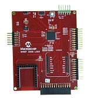

# PIC32CM LS60 Smart Lock Reference Board
<h4 align="left">  </h4>

This folder contains the MPLAB® Harmony 3 reference applications developed on [PIC32CM LS60 Smart Lock Reference Board]().

|SI No| Demo Name | Download Link |
| --- | --- | -- |
| 1 | [Smart Lock Application on PIC32CM LS60](./pic32cm_ls60_rd_smart_lock/readme.md) | [Click Here](https://github.com/Microchip-MPLAB-Harmony/reference_apps/releases/latest/download/pic32cm_ls60_rd_smart_lock.zip) |

### More Application Demos

For more application demos on **PIC32CM LS60 Smart Lock Reference Board** and other Development Boards/Kits having the same part number **(PIC32CM5164LS60064)** <a href="https://mplab-discover.microchip.com/v1/itemtype/com.microchip.ide.project?s0=PIC32CM5164LS60064" target="_blank"> CLICK HERE </a>

