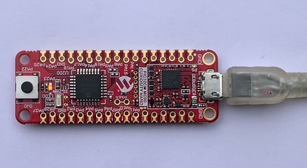

# Getting Started Application on PIC32CM MC00 Curiosity Nano Evaluation Kit
<h2 align="center"> <a href="https://github.com/Microchip-MPLAB-Harmony/reference_apps/releases/latest/download/pic32cmmc_getting_started.zip" > Download </a> </h2>

-----
## Description:

> This application demonstrates an LED (LED0) toggle on a timeout basis and prints the LED toggling rate on the serial terminal. The periodicity of the timeout will change from 500 milliseconds to one second, two seconds, four seconds, and back to 500 milliseconds every time you press the switch SW0 on the PIC32CM MC00 Curiosity Nano Evaluation Kit.

## Modules/Technology Used:
- Peripheral Modules
	- EIC
	- RTC       
	- GPIO
	- SERCOM(USART)

## Hardware Used:

- [PIC32CM MC00 Curiosity Nano Evaluation Kit](https://www.microchip.com/DevelopmentTools/ProductDetails/PartNO/EV10N93A)   

## Software/Tools Used:
 This project has been verified to work with the following versions of software tools:  

Refer [Project Manifest](./firmware/src/config/default/harmony-manifest-success.yml) present in harmony-manifest-success.yml under the project folder *firmware/src/config/default*  
- Refer the [Release Notes](../../../release_notes.md#development-tools) to know the **MPLAB X IDE** and **MCC** Plugin version. Alternatively, [Click Here](https://github.com/Microchip-MPLAB-Harmony/reference_apps/blob/master/release_notes.md#development-tools).
- Any Serial Terminal application like Tera Term terminal application.

 Because Microchip regularly update tools, occasionally issue(s) could be discovered while using the newer versions of the tools. If the project doesn’t seem to work and version incompatibility is suspected, It is recommended to double-check and use the same versions that the project was tested with.  To download original version of MPLAB Harmony v3 packages, refer to document [How to Use the MPLAB Harmony v3 Project Manifest Feature](https://ww1.microchip.com/downloads/en/DeviceDoc/How-to-Use-the-MPLAB-Harmony-v3-Project-Manifest-Feature-DS90003305.pdf)

## Setup:
- Connect the PIC32CM MC00 Curiosity Nano Evaluation Kit to the Host PC as a USB Device through a Type-A male to micro-B USB cable connected to Micro-B USB (Debug USB) port

## Programming hex file:
The pre-built hex file can be programmed by following the below steps.  

### Steps to program the hex file
- Open MPLAB X IDE
- Close all existing projects in IDE, if any project is opened.
- Go to File -> Import -> Hex/ELF File
- In the "Import Image File" window, Step 1 - Create Prebuilt Project, Click the "Browse" button to select the prebuilt hex file.
- Select Device has "PIC32CM1216MC00032"
- Ensure the proper tool is selected under "Hardware Tool"
- Click on Next button
- In the "Import Image File" window, Step 2 - Select Project Name and Folder, select appropriate project name and folder
- Click on Finish button
- In MPLAB X IDE, click on "Make and Program Device" Button. The device gets programmed in sometime
- Follow the steps in "Running the Demo" section below

## Programming/Debugging Application Project:
- Open the project (pic32cmmc_getting_started/firmware/pic32cm_mc_cnano.X) in MPLAB X IDE
- Ensure "PIC32CM MC00 Curiosity Nano" is selected as hardware tool to program/debug the application
- Build the code and program the device by clicking on the "Make and Program Device" button in MPLAB X IDE tool bar
- Follow the steps in "Running the Demo" section below

## Running the Demo:
- Open the Tera Term terminal application on your PC (from the Windows® Start menu by pressing the Start button)
- Change the baud rate to 115200
- An LED (LED0) on the PIC32CM MC00 Curiosity Nano Evaluation Kit toggles on every timeout basis and the default periodicity of the timeout is 500 milliseconds
- And also, the LED toggling rate is displayed on the serial terminal
- Press the switch SW0 on the PIC32CM MC00 Curiosity Nano Evaluation Kit to change the default periodicity of the timeout to one second
- Every subsequent pressing of the switch SW0 on the PIC32CM MC00 Curiosity Nano Evaluation Kit changes the periodicity of the timeout to 2 seconds, 4 seconds, 500 milliseconds, and back to 1 second in cyclic order

## Comments:
- Reference Training Module: [Getting Started with Harmony v3 Peripheral Libraries on SAMC2x MCUs](https://microchipdeveloper.com/harmony3:samc21-getting-started-training-module)
- This application demo builds and works out of box by following the instructions above in "Running the Demo" section. If you need to enhance/customize this application demo, you need to use the MPLAB Harmony v3 Software framework. Refer links below to setup and build your applications using MPLAB Harmony.
	- [How to Setup MPLAB Harmony v3 Software Development Framework](https://ww1.microchip.com/downloads/en/DeviceDoc/How_to_Setup_MPLAB_%20Harmony_v3_Software_Development_Framework_DS90003232C.pdf)
	- [How to Build an Application by Adding a New PLIB, Driver, or Middleware to an Existing MPLAB Harmony v3 Project](http://ww1.microchip.com/downloads/en/DeviceDoc/How_to_Build_Application_Adding_PLIB_%20Driver_or_Middleware%20_to_MPLAB_Harmony_v3Project_DS90003253A.pdf)  

## Revision:
- v1.5.0 Removed MHC support, Regenerated and tested application.
- v1.4.0 Updated the hardware setup image, Added MCC support, Regenerated and tested application.
- v1.3.0 regenerated and tested the application
- v1.2.0 released demo application
