# Smart Appliance Control on PIC32CM MC00 Curiosity Nano Evaluation kit
<h2 align="center"> <a href="https://github.com/Microchip-MPLAB-Harmony/reference_apps/releases/latest/download/pic32cmmc_smart_appliance_control.zip" > Download </a> </h2>

-----
## <a id="description"> </a>
## Description:

> This application demonstrates  a smart control fan using BLE. The application connects
  through BM71 XPRO to Microchip Bluetooth Data (MBD) android mobile application via BLE
  (Bluetooth Low Energy). The BM71 XPRO uses a transparent service for data exchange with
  the android MBD mobile application.

> Based on the mobile application's commands, the fan connected to Fan click via the I2C
  interface is controlled. The BLE commands has two different modes, one mode is temperature
  based fan control and another is BLE based command. The BM71 XPRO interfaces to the MCU
  over SERCOM - USART interface.

> A fan is controlled by following below commands:  
  1. **TEMP_CTRL** - Fan will be ran based on the environmental temperature. When the user chooses temperature based fan control mode, application reads the temperature values from a weather sensor displays on Eink display and controls a DC fan as mentioned below.  
    a.	Temperature between 18 (64 F) to 25 (77 F) degree Celsius, the fan rotates at LOW speed.  
    b.	Temperature between 26 (78 F) to 30 (86 F) degree Celsius, the fan rotates at MEDIUM speed.  
    c.	Temperature is greater than 30 degree Celsius (86 F), the fan rotates at HIGH speed.  
    d.	Temperature is less than 18 (64 F), the fan is switched OFF.  
    The application also prints the temperature values on a serial terminal using USART peripheral library  
  2. User can control the fan from the BLE based MBD app running on the connected smartphone by sending below commands.  
    a. **BLE_CTRL:FAN_ON**   - Turns "On" the fan with LOW speed.  
    b. **BLE_CTRL:FAN_OFF**  - Turns "Off" the fan.  
    c. **BLE_CTRL:FAN_LOW**  - Runs the fan with LOW speed.  
    d. **BLE_CTRL:FAN_MID**  - Runs the fan with MEDIUM speed.  
    e. **BLE_CTRL:FAN_HIGH**	- Runs the fan with HIGH speed.

## Modules/Technology Used:
- Peripheral Modules
	- SYS Time
	- SYSTICK
	- Timer
	- SERCOM(I2C)
	- SERCOM(USART)
	- SERCOM(SPI)
	- EIC
- Driver Modules
	- BM71 Driver
- STDIO Library

## Hardware Used:

- [PIC32CM MC00 Curiosity Nano Evaluation Kit](https://www.microchip.com/DevelopmentTools/ProductDetails/PartNO/EV10N93A)
- [Curiosity Nano Base for click boards](https://www.microchip.com/Developmenttools/ProductDetails/AC164162)
- [BM71-XPRO](https://www.microchip.com/Developmenttools/ProductDetails/DM164146)
- [Fan Click](https://www.mikroe.com/fan-click)
- [WEATHER CLICK](https://www.mikroe.com/weather-click)
- [MikroElektronika Eink Click Bundle](https://www.mikroe.com/eink-click)
-	[5V DC Fan](https://www.amazon.com/PartsCollection-Fan-50MM-4-Wire-Function/dp/B01M17DB6Y)
- [Lipo Rechargeable Battery](https://www.electronicscomp.com/3.7v-5000mah-lipo-battery-model-kp-508085-india?gclid=EAIaIQobChMIscaP2Prv7QIVjnwrCh2lKA3NEAQYASABEgJgAvD_BwE)

## Software/Tools Used:
<span style="color:blue"> This project has been verified to work with the following versions of software tools:</span>  

Refer [Project Manifest](./firmware/src/config/pic32cm_mc00_cnano/harmony-manifest-success.yml) present in harmony-manifest-success.yml under the project folder *firmware/src/config/pic32cm_mc00_cnano*  
- Refer the [Release Notes](../../../release_notes.md#development-tools) to know the **MPLAB X IDE** and **MHC/MCC** Plugin version.  
- Install [Microchip Bluetooth Data Android App](https://play.google.com/store/apps/details?id=com.microchip.bluetooth.data&hl=en_IN&gl=US) in your android mobile

<span style="color:blue"> Because Microchip regularly update tools, occasionally issue(s) could be discovered while using the newer versions of the tools. If the project doesn’t seem to work and version incompatibility is suspected, It is recommended to double-check and use the same versions that the project was tested with. </span> To download original version of MPLAB Harmony v3 packages, refer to document [How to Use the MPLAB Harmony v3 Project Manifest Feature](https://microchip.com/DS90003305)

## Adding private characteristics to BM71:
#### Hardware Setup
- In BM71-XPRO, Change jumper J2 to select USB
- In BM71-XPRO, Configure DIP switch SW2 with the below configurations
  - All DIP switch ON
- Power the BM71-XPRO from a Host PC through a Type-A male to Micro-B USB cable connected to Micro-B port (J1)
- Perform reset by pressing switch SW1 on BM71-XPRO and check blue LD1 is ON  


#### Programming private characteristics
- Download the manual configuration tool from [BM70/71 Firmware & Software Tools v1.11](https://ww1.microchip.com/downloads/en/DeviceDoc/Firmware%20&%20Software%20Tools%20v1.11.zip)
- Extract and locate configuration tool from below location
 	- Your_downloaded_folder ```\Firmware & Software Tools v1.11\ConfigurationTool\IS187x_102_BLEDK3v1.11_UI1.00```
- Double click on "`IS187x_102_BLEDK3v1.11_UI1.00.exe` "
- Click on "Load" button and select "Load Text File"  
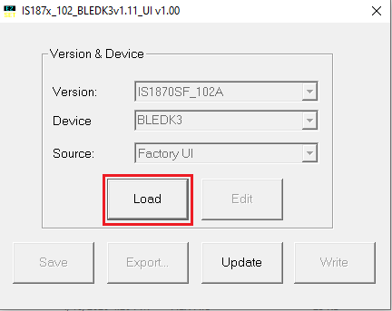 
- Select **“IS1871SF_102_BLEDK3v1.11_UI v1.00(BM71)_default.txt”** from your_downloaded_folder ```\Firmware & Software Tools v1.11\ConfigurationTool\IS187x_102_BLEDK3v1.11_UI1.00```  
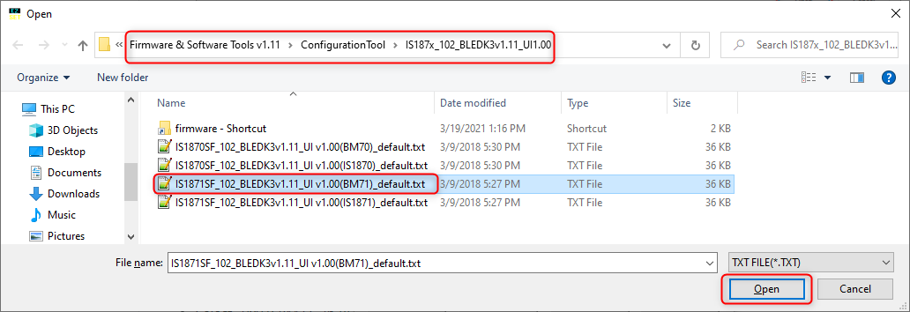  
- Click on "EDIT" option  
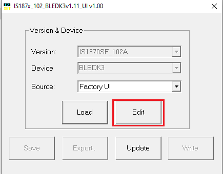

- Select "0x01: BM71" in BLEDK and click ok

  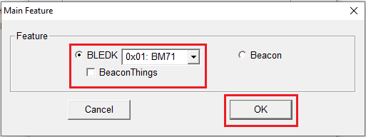

- Update the **Operation Mode Setting** from **Auto Pattern** to **Manual Pattern**  
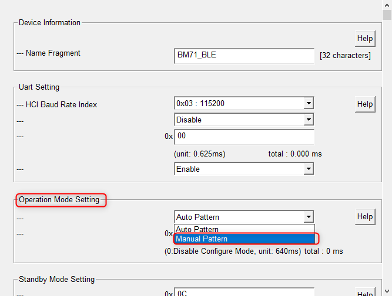

- Confirm **OK** to disable the "Flow Control and LE Connection Parameter Update Request"  
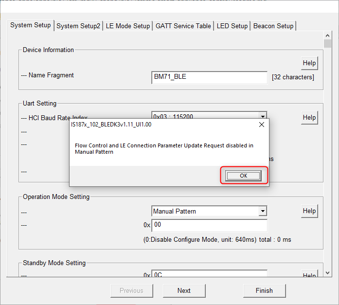

- Click on "Finish"  
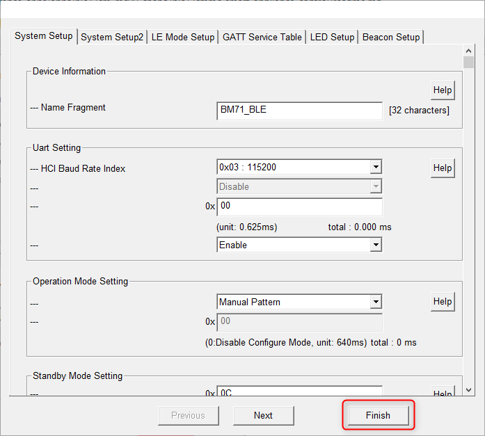

- Click on “Write”  
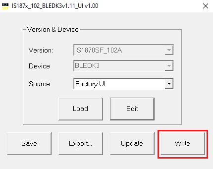

- Select respective COM Port and set baud rate to 115200 then click on Write  


- Click on Yes to successfully update the private characteristics on to BM71 module  


- After successful update, click OK and remove the power from BM71-XPRO and change jumper J2 to select EXT  


- Turn OFF DIP 1 switch

## Setup:
- Mount PIC32CM MC00 Curiosity Nano Evaluation Kit on "CNANO56_HOST_CONN"(U3) connector of Curiosity Nano Base board  
- Connect the BM71-XPRO on to EXT 1 connector of Curiosity Nano Base board  
- Mount the eINK click bundle (eINK click + eINK dispaly) on the mikro bus 1 connector of Curiosity Nano Base board
- Mount Fan click board on mikro bus click 2 connector of Curiosity Nano Base and connect 4 fan wires to the fan click  
- Mount Weather Click board on mikroBUS click 3 connector of Curiosity Nano Base
- Connect Li-ion or Lipo Battery on J1 connector and make sure SW1 slider switch is moved to Battery on position in Curiosity Nano Base board  
- Connect the PIC32CM MC00 Curiosity Nano Evaluation Kit to the Host PC as a USB Device through a Type-A male to micro-B USB cable connected to Micro-B USB (Debug USB) port  

  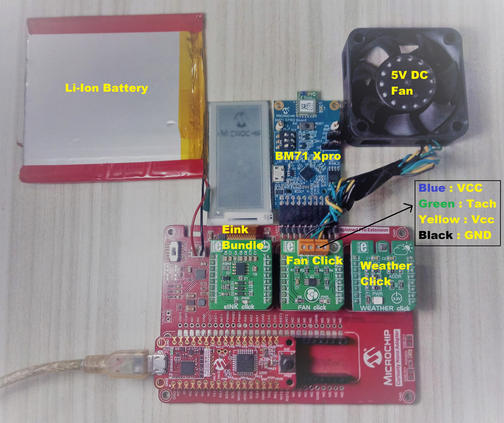

## Programming hex file:
The pre-built hex file can be programmed by following the below steps.  

### Steps to program the hex file
- Open MPLAB X IDE
- Close all existing projects in IDE, if any project is opened.
- Go to File -> Import -> Hex/ELF File
- In the "Import Image File" window, Step 1 - Create Prebuilt Project, Click the "Browse" button to select the prebuilt hex file.
- Select Device has "PIC32CM1216MC00032"
- Ensure the proper tool is selected under "Hardware Tool"
- Click on Next button
- In the "Import Image File" window, Step 2 - Select Project Name and Folder, select appropriate project name and folder
- Click on Finish button
- In MPLAB X IDE, click on "Make and Program Device" Button. The device gets programmed in sometime
- Follow the steps in "Running the Demo" section below


## Programming/Debugging Application Project:
- Open the project (pic32cmmc_smart_appliance_control/firmware/pic32cm_mc_cnano.X) in MPLAB X IDE
- Ensure "PIC32CM MC00 Curiosity Nano" is selected as hardware tool to program/debug the application
- Build the code and program the device by clicking on the "make and program" button in MPLAB X IDE tool bar
- Follow the steps in "Running the Demo" section below

## Running the Demo:
<span style="color:red"> *Before proceeding, install the [**Microchip Bluetooth Data**](https://play.google.com/store/apps/details?id=com.microchip.bluetooth.data) android app in an Android Smartphone.* </span>

 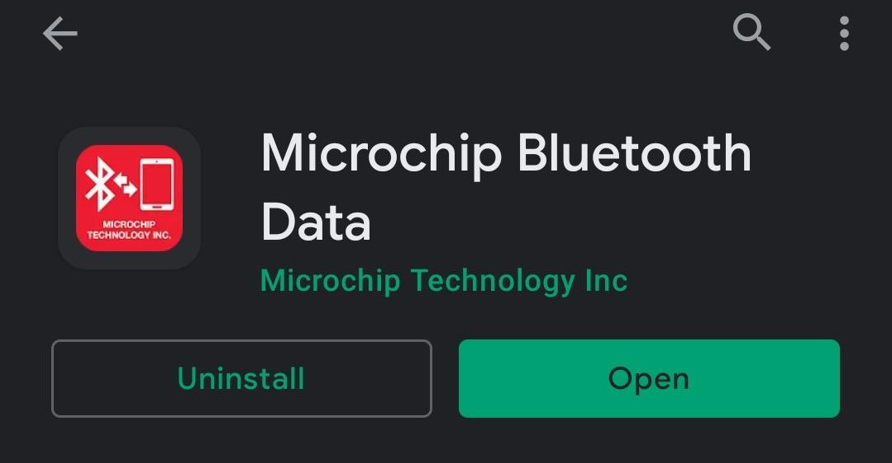

- Enable Bluetooth and location from Smartphone settings
- Perform reset by unplugging and re-plugging the power cable of SAM E51 Curiosity Nano
- Open the "**Microchip Bluetooth Data (MBD)**" android app from your smartphone
  and tap on "BLE UART" icon on the dashboard. If prompted, allow the application to turn on Bluetooth.  
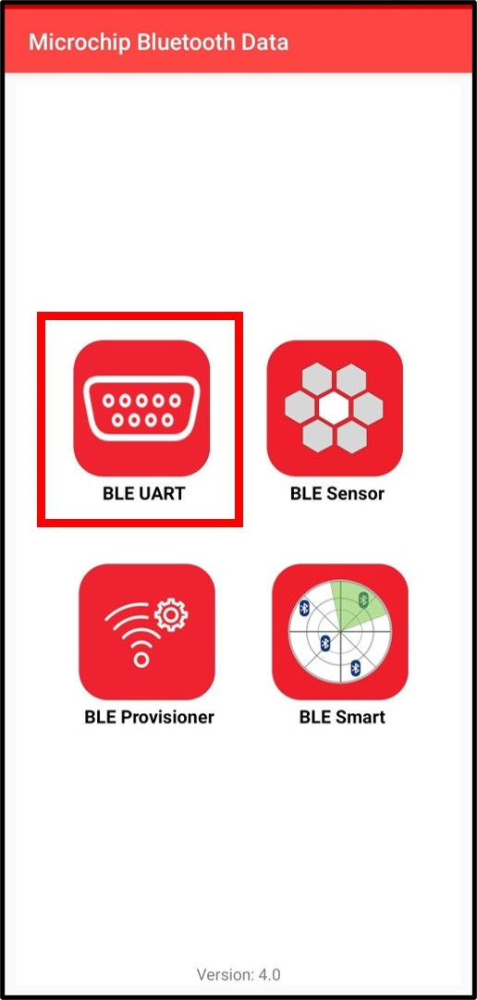

-  Now, scan for Bluetooth devices by tapping "BM70" -> "SCAN" -> "SCAN" options on the MBD APP.
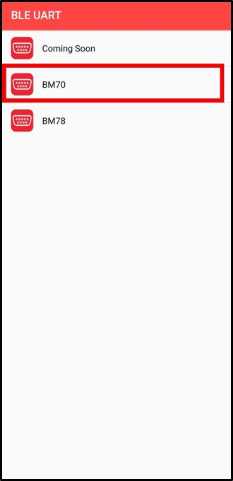
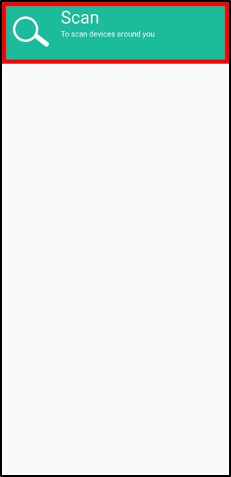
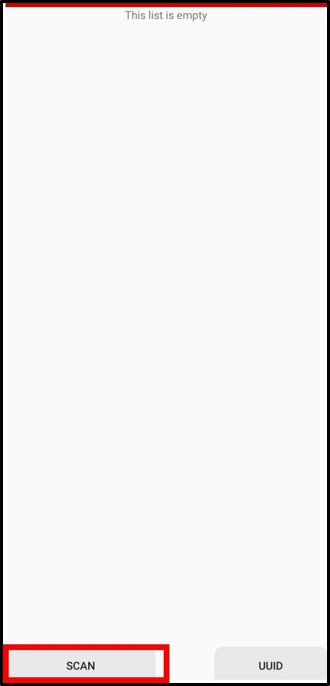

-  The BM71 device should appear as **TransparentUARTDemo** in the list of Bluetooth devices.  
  Once you see the "TransparentUARTDemo" device, click on the "CANCEL" button to cancel the device scanning.  
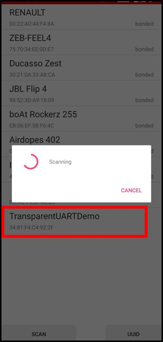
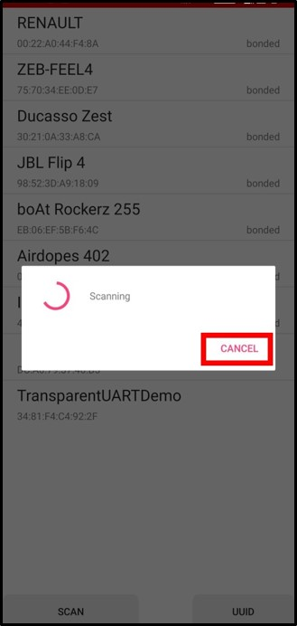

-  Tap on the "TransparentUARTDemo" device to connect to the device.
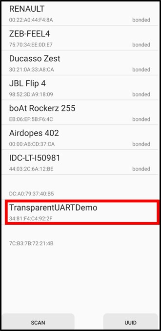
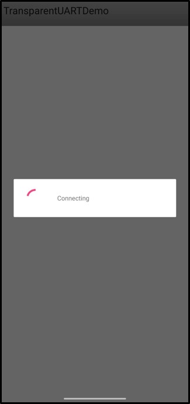

-  Once the device is connected, tap on the "Transfer data to device" to build
  the communication interface between Demo application and MBD App.
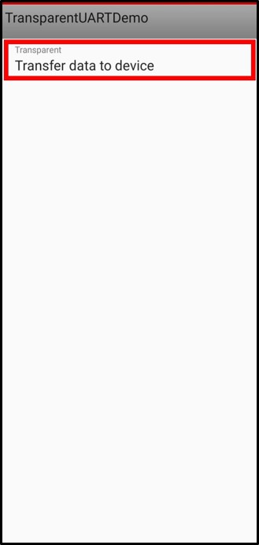

-  Enable the "Write with Response" by clicking on "OFF" button at the bottom of the MBD APP screen.
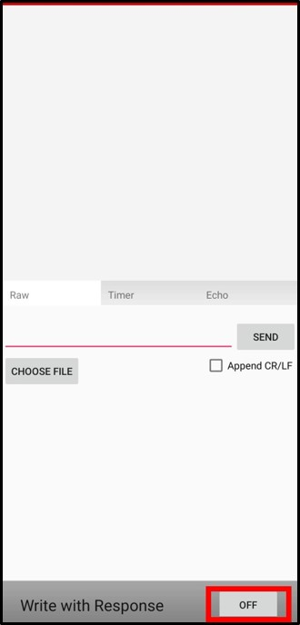
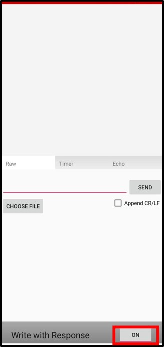

-  Send the commands mentioned in the demo [description](#description) to control the fan.
  The commands mentioned in the demo description are not case sensitive.
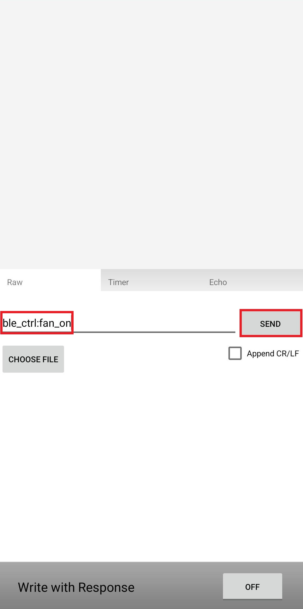
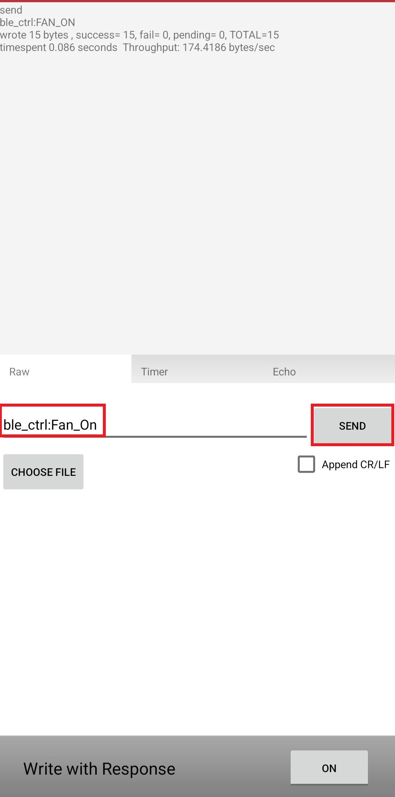
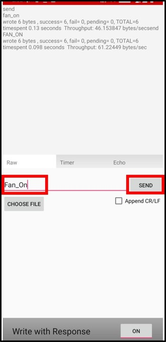

-  Based on the command received from the MBD application, the fan will be controlled.
-   When the user chooses temperature based fan control mode, application reads the temperature values from a weather sensor displays on EInk display and controls a DC fan

## Comments:
- This application demo builds and works out of box by following the instructions above in "Running the Demo" section. If you need to enhance/customize this application demo, you need to use the MPLAB Harmony v3 Software framework. Refer links below to setup and build your applications using MPLAB Harmony.
	- [How to Setup MPLAB Harmony v3 Software Development Framework](https://www.microchip.com/mymicrochip/filehandler.aspx?ddocname=en1000821)
	- [How to Build an Application by Adding a New PLIB, Driver, or Middleware to an Existing MPLAB Harmony v3 Project](http://ww1.microchip.com/downloads/en/DeviceDoc/How_to_Build_Application_Adding_PLIB_%20Driver_or_Middleware%20_to_MPLAB_Harmony_v3Project_DS90003253A.pdf)  

## Revision:
- v1.4.0 Added display capability
- v1.3.0 Released demo application
