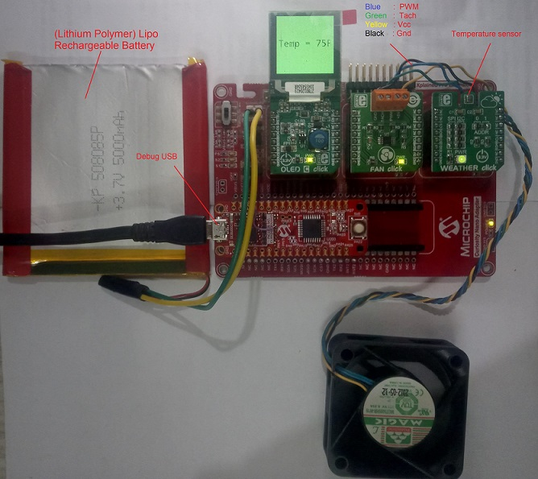

# Temperature based Fan Speed Control with OLED C click display on PIC32CM MC00 Curiosity Nano Evaluation kit
<h2 align="center"> <a href="https://github.com/MicrochipTech/MPLAB-Harmony-Reference-Apps/releases/latest/download/pic32cmmc_temp_based_fan_control_oled_c.zip" > Download </a> </h2>

-----
## Description:

> This application demonstrates temperature based fan control and displaying the temperature value on OLED C display. The environmental temperature is read from the weather click board interfaced over I2C. Based on the value read, the fan connected to Fan click via the I2C interface is controlled. At the same time, the temperature is displayed on the OLED C Click interfaced over SPI.

> Speed of the fan in the application is controlled as below :  
	1. Temperature is less than or equal to 20 degree Celsius (68 F), fan is turned off  
	2. Temperature is greater than or equal to 27 degree Celsius (80 F), fan rotates at full speed  
	3. Temperature between 21 (70 F) to 26 (79 F) degree Celsius, fan rotates at low speed

## Modules/Technology Used:
- Peripheral Modules
	- SYS Time
	- Timer       
	- SERCOM(I2C)
	- SERCOM(SPI)
- Drivers
	- LE External controller
- Middleware
	- Legato graphics

## Hardware Used:

- [PIC32CM MC00 Curiosity Nano Evaluation Kit](https://www.microchip.com/DevelopmentTools/ProductDetails/PartNO/EV10N93A)
- [Curiosity Nano Base for click boards](https://www.microchip.com/Developmenttools/ProductDetails/AC164162)
- [Weather Click](https://www.mikroe.com/weather-click)
- [Fan Click](https://www.mikroe.com/fan-click)
- [OLED C Click](https://www.mikroe.com/oled-c-click)
-	[5V DC Fan](https://www.amazon.com/PartsCollection-Fan-50MM-4-Wire-Function/dp/B01M17DB6Y)
- [Lipo Rechargeable Battery](https://www.electronicscomp.com/3.7v-5000mah-lipo-battery-model-kp-508085-india?gclid=EAIaIQobChMIscaP2Prv7QIVjnwrCh2lKA3NEAQYASABEgJgAvD_BwE)

## Software/Tools Used:
 This project has been verified to work with the following versions of software tools:  

Refer [Project Manifest](./firmware/src/config/default/harmony-manifest-success.yml) present in harmony-manifest-success.yml under the project folder *firmware/src/config/{configurtion name}*  
- Refer the [Release Notes](../../../release_notes.md#development-tools) to know the **MPLAB X IDE** and **MHC/MCC** Plugin version.  
- Any Serial Terminal application like Tera Term terminal application.

 Because Microchip regularly update tools, occasionally issue(s) could be discovered while using the newer versions of the tools. If the project doesn’t seem to work and version incompatibility is suspected, It is recommended to double-check and use the same versions that the project was tested with.  To download original version of MPLAB Harmony v3 packages, refer to document [How to Use the MPLAB Harmony v3 Project Manifest Feature](https://microchip.com/DS90003305)

## Setup:
- Mount PIC32CM MC00 Curiosity Nano Evaluation Kit on "CNANO56_HOST_CONN"(U3) connector of Curiosity Nano Base board
- Mount OLED C Click board on mikro bus click 1 connector of Curiosity Nano Base
- Mount Fan click board on mikro bus click 2 connector of Curiosity Nano Base and connect 4 fan wires to the fan click
- Mount Weather Click board on mikro bus click 3 connector of Curiosity Nano Base
-Connect Li-ion or Lipo Battery on J1 connector and make sure SW1 slider switch is moved to Battery on position in Curiosity Nano Base board
- Connect the PIC32CM MC00 Curiosity Nano Evaluation Kit to the Host PC as a USB Device through a Type-A male to micro-B USB cable connected to Micro-B USB (Debug USB) port

## Programming hex file:
The pre-built hex file can be programmed by following the below steps.  

### Steps to program the hex file
- Open MPLAB X IDE
- Close all existing projects in IDE, if any project is opened.
- Go to File -> Import -> Hex/ELF File
- In the "Import Image File" window, Step 1 - Create Prebuilt Project, Click the "Browse" button to select the prebuilt hex file.
- Select Device has "PIC32CM1216MC00032"
- Ensure the proper tool is selected under "Hardware Tool"
- Click on Next button
- In the "Import Image File" window, Step 2 - Select Project Name and Folder, select appropriate project name and folder
- Click on Finish button
- In MPLAB X IDE, click on "Make and Program Device" Button. The device gets programmed in sometime
- Follow the steps in "Running the Demo" section below

## Programming/Debugging Application Project:
- Open the project (pic32cmmc_temp_based_fan_control_oled_c/firmware/pic32cm_mc_cnano.X) in MPLAB X IDE
- Ensure "PIC32CM MC00 Curiosity Nano" is selected as hardware tool to program/debug the application
- Build the code and program the device by clicking on the "make and program" button in MPLAB X IDE tool bar
- Follow the steps in "Running the Demo" section below

## Running the Demo:
- A temperature value is displayed on the OLED C click board in Fahrenheit format
- A Fan rotates with respect to the temperature read
- Place a finger on the temperature sensor on weather click to vary the temperature, fan adjusts speed according to temperature  

## Comments:
- This application demo builds and works out of box by following the instructions above in "Running the Demo" section. If you need to enhance/customize this application demo, you need to use the MPLAB Harmony v3 Software framework. Refer links below to setup and build your applications using MPLAB Harmony.
	- [How to Setup MPLAB Harmony v3 Software Development Framework](https://www.microchip.com/mymicrochip/filehandler.aspx?ddocname=en1000821)
	- [How to Build an Application by Adding a New PLIB, Driver, or Middleware to an Existing MPLAB Harmony v3 Project](http://ww1.microchip.com/downloads/en/DeviceDoc/How_to_Build_Application_Adding_PLIB_%20Driver_or_Middleware%20_to_MPLAB_Harmony_v3Project_DS90003253A.pdf)  

## Revision:
- v1.3.0 - Regenerated and tested application.  
- v1.2.0 released demo application
