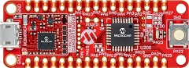

# PIC32CM MC00 Curiosity Nano Evaluation Kit
<h4 align="left">  </h4>

This folder contains the MPLAB® Harmony 3 reference applications developed on [PIC32CM MC00 Curiosity Nano Evaluation Kit](https://www.microchip.com/DevelopmentTools/ProductDetails/PartNO/EV10N93A).   

|SI No| Demo Name | Download Link |
| --- | --- | -- |
| 1 | [Getting Started](./pic32cmmc_getting_started/readme.md) | [Click Here](https://github.com/Microchip-MPLAB-Harmony/reference_apps/releases/latest/download/pic32cmmc_getting_started.zip) |
| 2 | [Smart Appliance Control](./pic32cmmc_smart_appliance_control/readme.md) | [Click Here](https://github.com/Microchip-MPLAB-Harmony/reference_apps/releases/latest/download/pic32cmmc_smart_appliance_control.zip) |
| 3 | [Smart Tag Google Clound IoT Core Application](./pic32cmmc_smart_tag_google_cloud_iot_core/readme.md) | [Click Here](https://github.com/Microchip-MPLAB-Harmony/reference_apps/releases/latest/download/pic32cmmc_smart_tag_google_cloud_iot_core.zip) |

### More Application Demos

For more application demos on **PIC32CM MC00 Curiosity Nano Evaluation Kit** and other Development Boards/Kits having the same part number **(PIC32CM1216MC00032)** <a href="https://mplab-discover.microchip.com/v1/itemtype/com.microchip.ide.project?s0=PIC32CM1216MC00032" target="_blank"> CLICK HERE </a>
