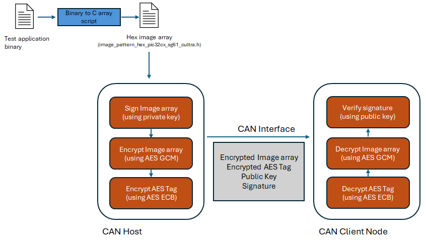
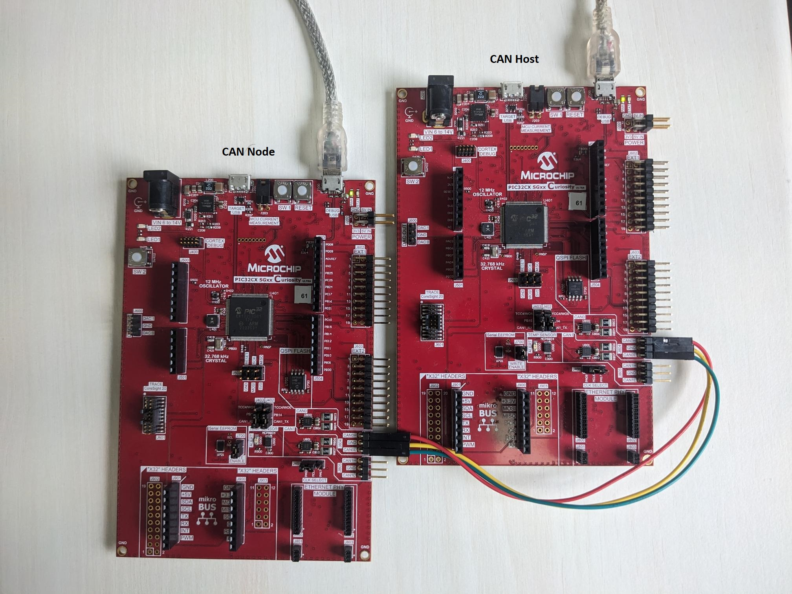
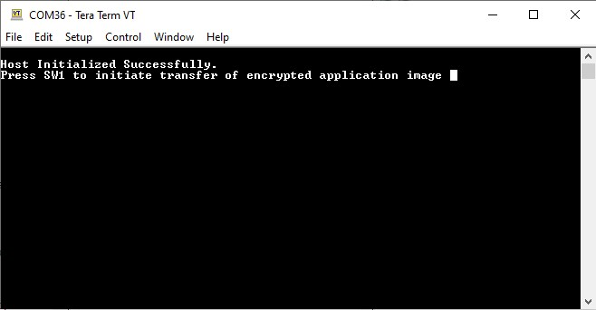
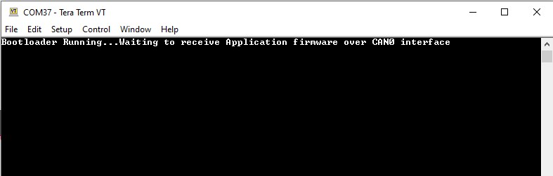
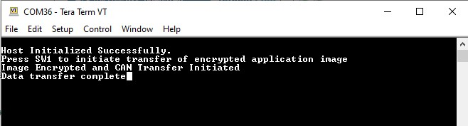
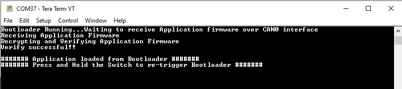
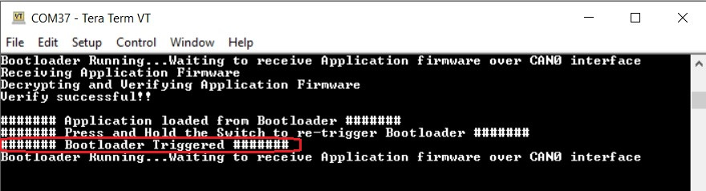

# Secure CAN Bootloader with PIC32CX SG61 Curiosity Ultra Evaluation Board
<h2 align="center"> <a href="https://github.com/Microchip-MPLAB-Harmony/reference_apps/releases/latest/download/pic32cx_sg61_secure_can_bootloader.zip" > Download </a> </h2>

-----
## Description

This application demonstrates usage of the internal Hardware Security Module (HSM) of the PIC32CX SG61 for securely transferring application firmware between Host and Client over a CAN bus

The package contains two projects:
   - pic32cx_sg61_secure_can_host
		> Signs and encrypts a test application firmware. The encrypted firmware and  is sent over CAN interface to the client node
   - pic32cx_sg61_secure_can_node_bootloader
        > Receives the encrypted application firmware on a temporary RAM buffer, decrypts and verifies the signature. Up on successfull verification, the firmware is programmed to the device flash.
		   A device reset is triggered automatically, and the received test application starts executing after the reset.

### Loading Test application firmware:

The pic32cx_sg61_secure_can_host project in this release already has a LED blinking test application Hex array included -> [image_pattern_hex_pic32cx_sg61_cultra.h](./firmware/pic32cx_sg61_secure_can_host/firmware/src/image_pattern_hex_pic32cx_sg61_cultra.h)

 To use any application other than this

- Generate binary file for the application referring to [Application Configurations](https://github.com/Microchip-MPLAB-Harmony/bootloader_apps_can/blob/master/docs/GUID-DBAD37CB-BA5E-414D-A3EC-AA6555B345EA.md)

- Convert binary to a C style array containing Hex output. The [Binary to C Array script](https://github.com/Microchip-MPLAB-Harmony/bootloader_apps_can/blob/master/docs/GUID-AA3E00A3-26EF-40CA-8811-8E1D00F4C227.md) can be used to perform this. The output Hex header file from this can be included directly to the secure_can_host project and compiled.

### Flow Chart

## Modules/Technology Used:

- Peripheral Modules      
	- SERCOM (USART)
	- SERCOM (SPI)
	- NVMCTRL

## Hardware Used:

- [PIC32CX SG61 Curiosity Ultra Evaluation Board](https://www.microchip.com/en-us/development-tool/EV09H35A)

## Software/Tools Used:
 This project has been verified to work with the following versions of software tools:  

Refer [Project Manifest](./firmware/pic32cx_sg61_secure_can_host/firmware/src/config/pic32cxsg61_cultra_can_host/harmony-manifest-success.yml) present in harmony-manifest-success.yml under the project folder *firmware/src/config/default*  
- Refer the [Release Notes](../../../release_notes.md#development-tools) to know the **MPLAB X IDE** and **MCC** Plugin version. Alternatively, [Click Here](https://github.com/Microchip-MPLAB-Harmony/reference_apps/blob/master/release_notes.md#development-tools).
- Any Serial Terminal application like Tera Term terminal application.

 Because Microchip regularly update tools, occasionally issue(s) could be discovered while using the newer versions of the tools. If the project doesn’t seem to work and version incompatibility is suspected, It is recommended to double-check and use the same versions that the project was tested with.  To download original version of MPLAB Harmony v3 packages, refer to document [How to Use the MPLAB Harmony v3 Project Manifest Feature](https://ww1.microchip.com/downloads/en/DeviceDoc/How-to-Use-the-MPLAB-Harmony-v3-Project-Manifest-Feature-DS90003305.pdf)

## Hardware Setup:
-   [PIC32CX SG61 Curiosity Ultra Evaluation](https://www.microchip.com/en-us/development-tool/EV09H35A) is used for both **Host Development kit** and **Client Node Development kit**
   
    

-   Connect PIC32CX SG61 Curiosity Ultra Evaluation board to another PIC32CX SG61 Curiosity Ultra Evaluation board as per the pin connections shown below

    |PIC32CX SG61 Curiosity Ultra Evaluation board - 1|PIC32CX SG61 Curiosity Ultra Evaluation board - 2|
    |--------------------------------------|--------------------------------------|
    |CANH, CAN0|CANH, CAN0|
    |CANL, CAN0|CANL, CAN0|
    |GND, CAN0|GND, CAN0
    | |

-   Connect the Debug USB port on the evaluation boards to the computer using a micro USB cable

## Running the Demo:

1. Open a Terminal application \(Ex.:Tera Term\) on the computer and configure the serial port settings for **Host Development kit** as follows:

    -   Baud : 115200

    -   Data : 8 Bits

    -   Parity : None

    -   Stop : 1 Bit

    -   Flow Control : None
    
    Open another instance of the terminal and configure it with the same settings as above, for the **Client Node Development kit**.

2.  Open the host application project *\pic32cx_sg61_secure_can_host\firmware\pic32cx_sg61_secure_can_host.X* in the IDE

3.  Build and program the firmware using the IDE on to the Host development kit

    -   You should see the following output in the console corresponding to the   **Host Development kit**
    

4.   Open the bootloader project *pic32cx_sg61_secure_bootloader\firmware\pic32cx_sg61_secure_can_node_bootloader\firmware\pic32cx_sg61_secure_can_node_bootloader.X* in the IDE

5.  Build and program the application using the IDE on to the **Client Node development kit**

    -   **LED1** will be turned-on to indicate that bootloader code is running on the target
    -   You should also be able to see the following output in the console corresponding to the **Client Node development kit**
    

6.  Press the Switch **SW1** on the Host development kit to trigger programming of the application binary

7.  Once the programming is complete,

    -   **LED1** on the Host development kit will be turned on indicating success

    -   The Client Node development kit will be automatically reset. Upon re-start, the boot-loader will jump to the user application

    -   If the test application is programmed then **LED1** should start blinking
    
    - The below output can be seen on the respective consoles of the **Host and Client development kit** 
	>Host
    
    >    
        
	 
	
	>Client Node
        
    >    

6.  Press and hold the Switch **SW1** to trigger Bootloader from test application and you should see below output

    

7.  Press Reset button on the Host development kit followed by **SW1** to reprogram the application binary

## Comments:
- This application demo builds and works out of box by following the instructions above in "Running the Demo" section. If you need to enhance/customize this application demo, you need to use the MPLAB Harmony v3 Software framework. Refer links below to setup and build your applications using MPLAB Harmony.
	- [How to Setup MPLAB Harmony v3 Software Development Framework](https://ww1.microchip.com/downloads/en/DeviceDoc/How_to_Setup_MPLAB_%20Harmony_v3_Software_Development_Framework_DS90003232C.pdf)
	- [How to Build an Application by Adding a New PLIB, Driver, or Middleware to an Existing MPLAB Harmony v3 Project](http://ww1.microchip.com/downloads/en/DeviceDoc/How_to_Build_Application_Adding_PLIB_%20Driver_or_Middleware%20_to_MPLAB_Harmony_v3Project_DS90003253A.pdf)
	-  **MPLAB Harmony v3 is also configurable through MPLAB Code Configurator (MCC). Refer to the below links for specific instructions to use MPLAB Harmony v3 with MCC.**
		- [Create a new MPLAB Harmony v3 project using MCC](https://microchipdeveloper.com/harmony3:getting-started-training-module-using-mcc)
		- [Update and Configure an Existing MHC-based MPLAB Harmony v3 Project to MCC-based Project](https://microchipdeveloper.com/harmony3:update-and-configure-existing-mhc-proj-to-mcc-proj)
		- [Getting Started with MPLAB Harmony v3 Using MPLAB Code Configurator](https://www.youtube.com/watch?v=KdhltTWaDp0)
		- [MPLAB Code Configurator Content Manager for MPLAB Harmony v3 Projects](https://www.youtube.com/watch?v=PRewTzrI3iE)	

## Revision:
- v1.7.0 released demo application
