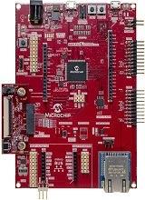

# PIC32CZ CA80 Curiosity Ultra Development Board
<h4 align="left">  </h4>

This repository contains the MPLAB® Harmony 3 reference applications developed on [PIC32CZ CA80 Curiosity Ultra Development Board](https://www.microchip.com/en-us/development-tool/EA61X20A)   

|SI No| Demo Name | Download Link |
| --- | --- | -- |
| 1 | [Getting Started Extended](./pic32cz_ca80_getting_started_ext/readme.md) | [Click Here](https://github.com/Microchip-MPLAB-Harmony/reference_apps/releases/latest/download/pic32cz_ca80_getting_started_ext.zip) |

### More Application Demos

For more application demos on **PIC32CZ CA80 Curiosity Ultra Development Board** and other Development Boards/Kits having the same part number **(PIC32CZ8110CA80208)** <a href=" https://mplab-discover.microchip.com/v1/itemtype/com.microchip.ide.project?s0=PIC32CZ8110CA80208" target="_blank"> CLICK HERE </a>
