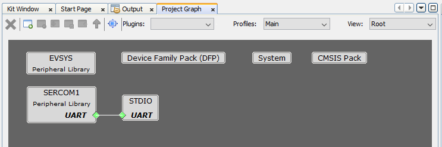
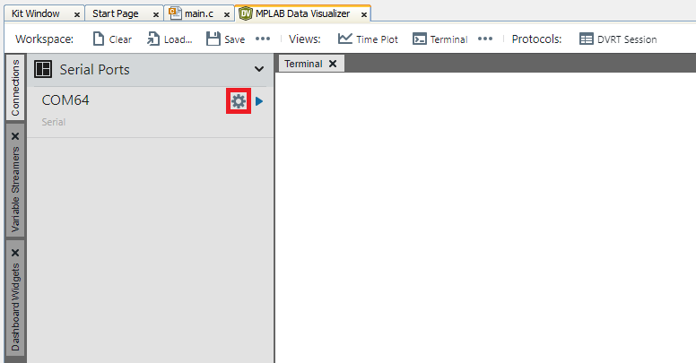
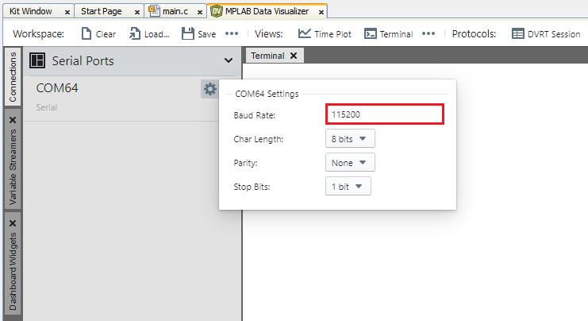
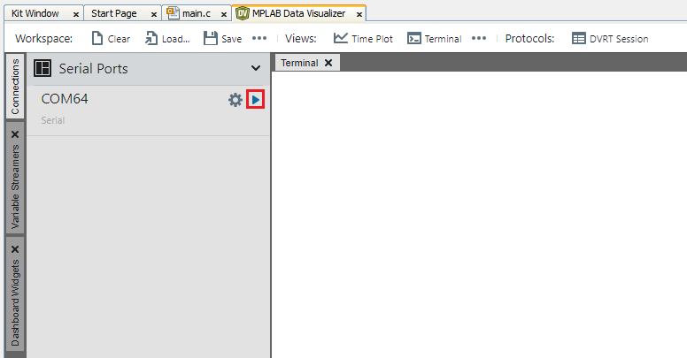
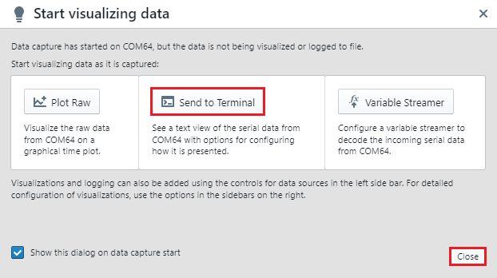
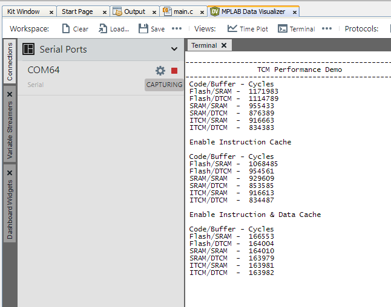

# TCM Performance on PIC32CZ CA90 Curiosity Ultra Evaluation Board
<h2 align="center"> <a href="https://github.com/Microchip-MPLAB-Harmony/reference_apps/releases/latest/download/pic32cz_ca90_tcm_performance.zip" > Download </a> </h2>

-----
## Description:

> The application demonstrate code execution from various memory locations and compares the time taken to execute the code from Flash Memory, SRAM, and TCM with and without the Instruction Cache and Data Cache. The result is displayed MPLAB® Data Visualizer Serial Console.

## Modules/Technology Used:
- Peripheral Modules  
	- PORT
	- EVSYS
	- SERCOM - UART

- System Services
  - STDIO

	 

## Hardware Used:

- [PIC32CZ CA90 Curiosity Ultra Evaluation Board](https://www.microchip.com/en-us/development-tool/EV16W43A)

## Software/Tools Used:
 This project has been verified to work with the following versions of software tools:  

Refer [Project Manifest](./firmware/src/config/pic32cz_ca90_cult/harmony-manifest-success.yml) present in harmony-manifest-success.yml under the project folder *firmware/src/config/pic32cz_ca90_cult*  
- Refer the [Release Notes](../../../release_notes.md#development-tools) to know the **MPLAB® X IDE** and **MCC** Plugin version. Alternatively, [Click Here](https://github.com/Microchip-MPLAB-Harmony/reference_apps/blob/master/release_notes.md#development-tools).  
- Any Serial Terminal application like Tera Term terminal application.

 Because Microchip regularly update tools, occasionally issue(s) could be discovered while using the newer versions of the tools. If the project doesn’t seem to work and version incompatibility is suspected, It is recommended to double-check and use the same versions that the project was tested with.  

To download original version of MPLAB® Harmony v3 packages, refer to document [How to Use the MPLAB® Harmony v3 Project Manifest Feature](https://ww1.microchip.com/downloads/en/DeviceDoc/How-to-Use-the-MPLAB-Harmony-v3-Project-Manifest-Feature-DS90003305.pdf)

## Setup:
- Connect the Type-A male to micro-B USB cable to the micro-B DEBUG USB port to power and debug the PIC32CZ CA90 Curiosity Ultra Evaluation Board. Connect the External Power Supply (6.5v to 14v) to the J100 connector. 

  
 	

## Programming hex file:
The pre-built hex file can be programmed by following the below steps

### Steps to program the hex file
- Open MPLAB® X IDE
- Close all existing projects in IDE, if any project is opened.
- Go to File -> Import -> Hex/ELF File
- In the "Import Image File" window, Step 1 - Create Prebuilt Project, click the "Browse" button to select the prebuilt hex file.
- Select Device has "PIC32CZ8110CA90208"
- Ensure the proper tool is selected under "Hardware Tool"
- Click on "Next" button
- In the "Import Image File" window, Step 2 - Select Project Name and Folder, select appropriate project name and folder
- Click on "Finish" button
- In MPLAB® X IDE, click on "Make and Program Device" Button. The device gets programmed in sometime.
- Follow the steps in "Running the Demo" section below

## Programming/Debugging Application Project:
- Open the project (pic32cz_ca90_tcm_performance\firmware\pic32cz_ca90_cult.X) in MPLAB® X IDE
- Ensure "PIC32CZ CA90 Curiosity Ultra" is selected as hardware tool to program/debug the application
- Build the code and program the device by clicking on the "Make and Program Device" button in MPLAB® X IDE tool bar
- Follow the steps in "Running the Demo" section below

## Running the Demo:
- After building the application and completing the programming, open the MPLAB® Data Visualizer by clicking the highlighted icon below 

  
 	

- Configure the serial port setup of the **PIC32CZ CA90 Curiosity Ultra Evaluation Board** by clicking the Gear icon shown below.

  
 	

- Set the 115200 as baudrate in the COM setting. 

  
 	

  
- Open the Serial Port of the **PIC32CZ CA90 Curiosity Ultra Evaluation Board** by clicking the Play icon as follows.

  
 	

- Select the Sent to Terminal to visualize the TCM Performance Test Results and click Close.  

  
 	

- Press the RESET push button on the Evaluation Board to reset the device.

  
 	

- Observe the console message TCM Performance Comparison on the MPLAB® Data Visualizer.

  
 	

## Comments:
- Reference Training Module: [Creating the First Application on PIC32CZ CAx Microcontrollers Using MPLAB Harmony v3 with MPLAB Code Configurator (MCC)](https://ww1.microchip.com/downloads/aemDocuments/documents/MCU32/ProductDocuments/SupportingCollateral/Creating-the-First-Application-on-PIC32CZ-CAx-Microcontrollers-Using-MPLAB-Harmony-v3-with-MPLAB-Code-Configurator-DS90003348.pdf)
- This application demo builds and works out of box by following the instructions above in "Running the Demo" section. If you need to enhance/customize this application demo, you need to use the MPLAB® Harmony v3 Software framework. Refer links below to setup and build your applications using MPLAB® Harmony.
	- [How to Setup MPLAB® Harmony v3 Software Development Framework](https://ww1.microchip.com/downloads/en/DeviceDoc/How_to_Setup_MPLAB_%20Harmony_v3_Software_Development_Framework_DS90003232C.pdf)
	- [How to Build an Application by Adding a New PLIB, Driver, or Middleware to an Existing MPLAB® Harmony v3 Project](http://ww1.microchip.com/downloads/en/DeviceDoc/How_to_Build_Application_Adding_PLIB_%20Driver_or_Middleware%20_to_MPLAB_Harmony_v3Project_DS90003253A.pdf)  
	-  **MPLAB® Harmony v3 is also configurable through MPLAB® Code Configurator (MCC). Refer to the below links for specific instructions to use MPLAB® Harmony v3 with MCC.**
		- [Create a new MPLAB Harmony v3 project using MCC](https://microchipdeveloper.com/harmony3:getting-started-training-module-using-mcc)
		- [Update and Configure an Existing MHC-based MPLAB® Harmony v3 Project to MCC-based Project](https://microchipdeveloper.com/harmony3:update-and-configure-existing-mhc-proj-to-mcc-proj)
		- [Getting Started with MPLAB® Harmony v3 Using MPLAB® Code Configurator](https://www.youtube.com/watch?v=KdhltTWaDp0)
		- [MPLAB® Code Configurator Content Manager for MPLAB® Harmony v3 Projects](https://www.youtube.com/watch?v=PRewTzrI3iE)	

## Revision:
- v1.7.0 - Released demo application
