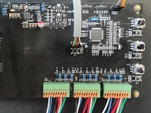

# PIC32MK MCM Multi Motor Control Board
<h4 align="left">  </h4>

This folder contains the MPLAB® Harmony 3 reference applications developed on [PIC32MK MCM multi-motor control board](./pic32mk_mcm_multi_motor_foc/readme.md#hardware-used).  

|SI No| Demo Name | Download Link |
| --- | --- | -- |
| 1 | [Encoder-based FOC for 3 Permanent Magnet Synchronous Motors](./pic32mk_mcm_multi_motor_foc/readme.md) | [Click Here](https://github.com/Microchip-MPLAB-Harmony/reference_apps/releases/latest/download/pic32mk_mcm_multi_motor_foc.zip) |

### More Application Demos

For more application demos on **PIC32MK MCM Multi Motor Control Board** and other Development Boards/Kits having the same part number **(PIC32MK1024MCM100)** <a href="https://mplab-discover.microchip.com/v1/itemtype/com.microchip.ide.project?s0=PIC32MK1024MCM100" target="_blank"> CLICK HERE </a>
