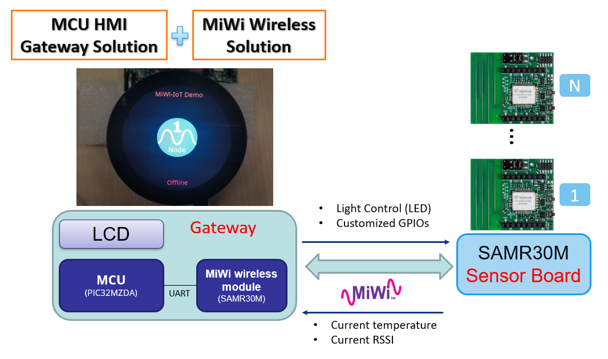
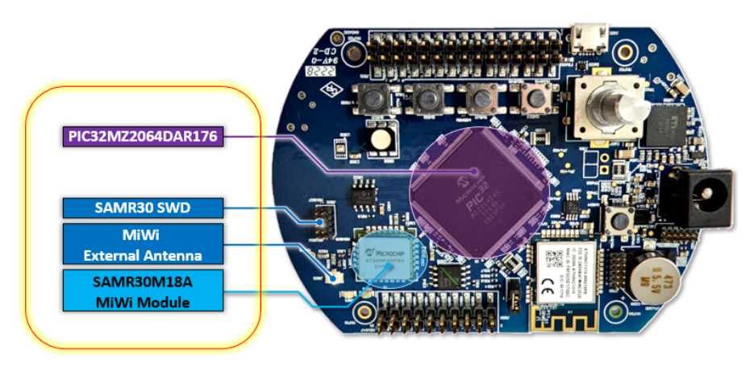
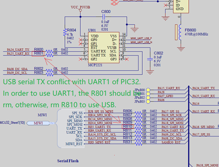
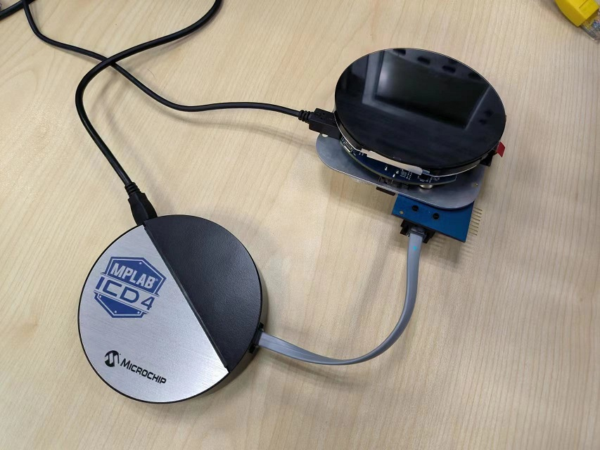
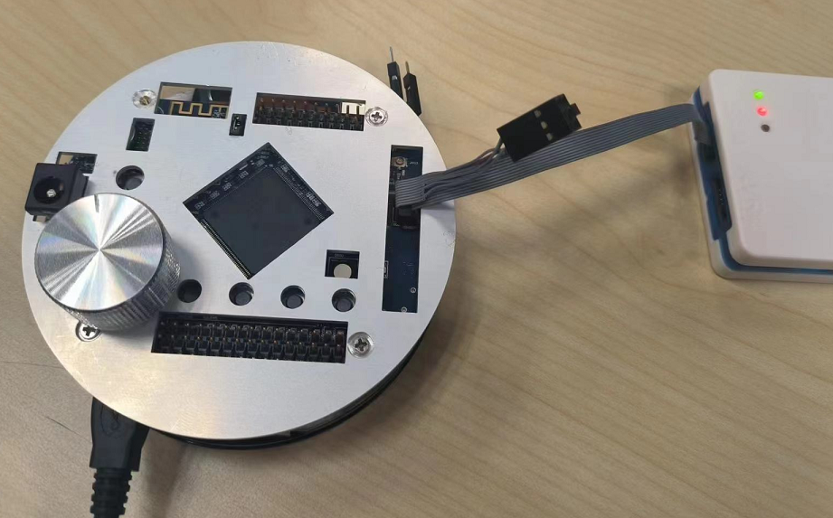
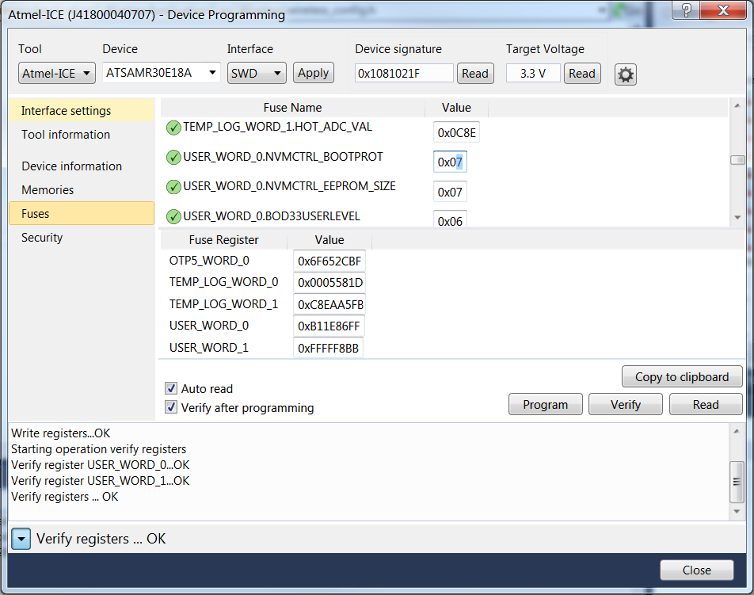
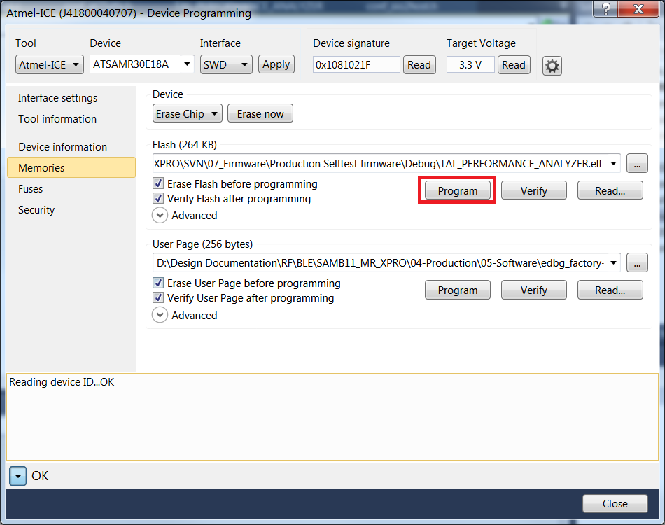
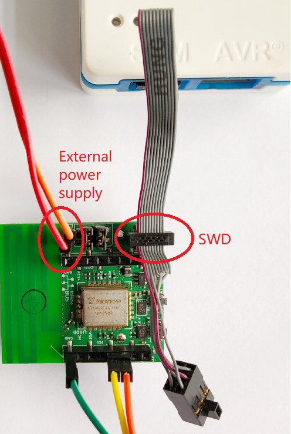
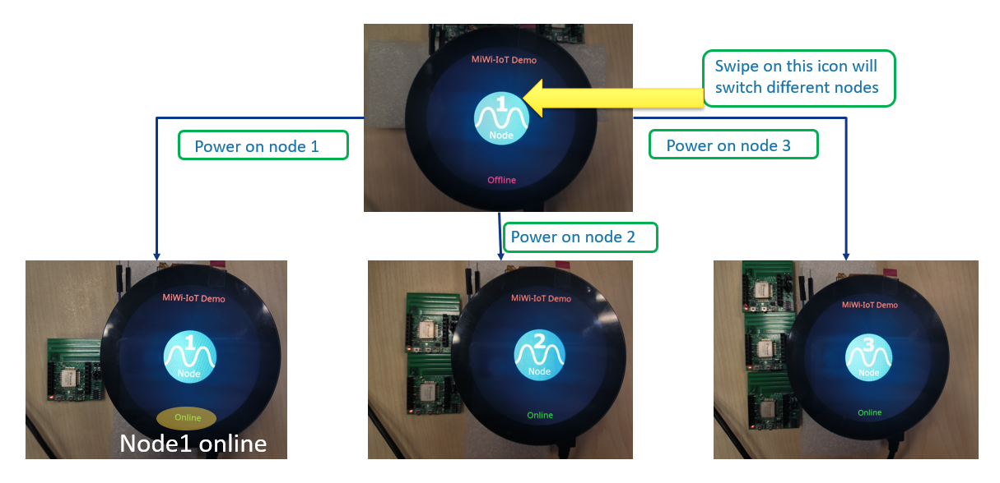
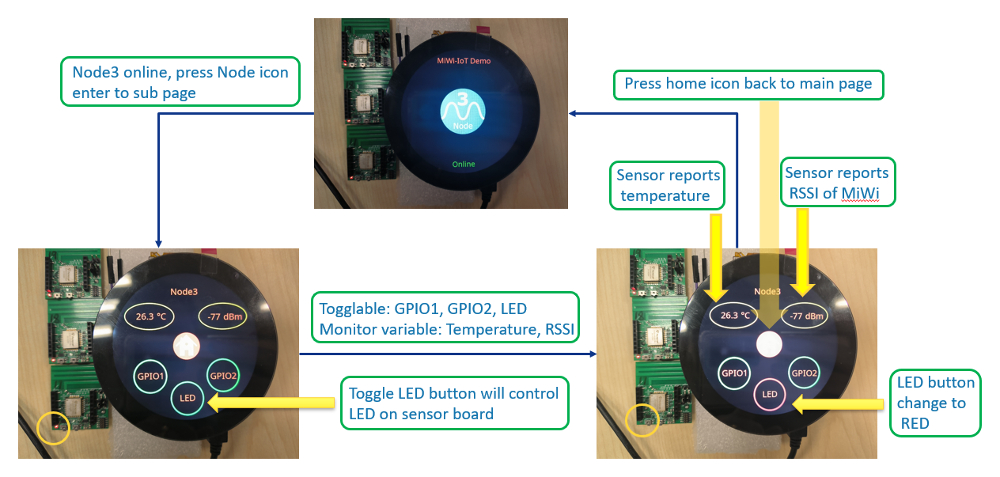

# MiWi IoT gateway on PIC32MZ DA Radial Graphics Develop Board using Legato Graphics
<h2 align="center"> <a href="https://github.com/Microchip-MPLAB-Harmony/reference_apps/releases/latest/download/pic32mzda_rgdb_miwi_iot.zip" > Download </a> </h2>

-----

## Description

> This application builds up a gateway for IoT network using MiWi. The application sends to and receives messages from SAMR3018A MiWi module which embedded on RGDB. The SAMR3018A module handles the communication with the SAMR30M sensor boards over MiWi.

  

&nbsp;

### MiWi Module on the RGDB
> The PIC32MZ2064DAR176 chip and SAMR3018A MiWi module on the RGDB PCB:

  

&nbsp;

## Modules/Technology Used:

- Peripheral Modules
	- UART
- Drivers
	- UART Driver
- Middleware
	- Legato Graphics

## Hardware Used:

- Radial Graphics Develop Board
- [SAMR30M SENSOR BOARD](https://www.microchip.com/en-us/development-tool/DT100130)
- [MPLAB® ICD 4 In-Circuit Debugger](https://www.microchip.com/en-us/development-tool/DV164045)
- [Atmel-ICE Debugger](https://www.microchip.com/en-us/education/developer-help/learn-tools-software/programmers-debuggers/atmel-ice)

## Hardware changes:

Before starting this demo, you need to rework the RGDB by removing two resistors: R800 & R801. Because USB serial TX conflict with UART1 of PIC32. In order to use UART1 communication between PIC32 and SAMR30 module embedded on RGDB, the USB serial port should be disabled to avoid the conflict.

  

&nbsp;

## Software/Tools Used:
 This project has been verified to work with the following versions of software tools:

Refer [Project Manifest](./firmware/src/config/glcd_rgba8888_mxt_mzda_intddr_round/harmony-manifest-success.yml) present in harmony-manifest-success.yml under the project folder *firmware/src/config/glcd_rgba8888_mxt_mzda_intddr_round*
- Refer the [Release Notes](../../../release_notes.md#development-tools) to know the **MPLAB X IDE** and **MCC** Plugin version. Alternatively, [Click Here](https://github.com/Microchip-MPLAB-Harmony/reference_apps/blob/master/release_notes.md#development-tools)

 Because Microchip regularly update tools, occasionally issue(s) could be discovered while using the newer versions of the tools. If the project doesn’t seem to work and version incompatibility is suspected, It is recommended to double-check and use the same versions that the project was tested with.  To download original version of MPLAB Harmony v3 packages, refer to document [How to Use the MPLAB Harmony v3 Project Manifest Feature](https://ww1.microchip.com/downloads/en/DeviceDoc/How-to-Use-the-MPLAB-Harmony-v3-Project-Manifest-Feature-DS90003305.pdf)

## Setup:
- Attach the ICD4 debugger Connector to the ICSP header J300 on the RGDB. This connection is used for programming and debugging.
- Connect a USB cable from the host computer or a 5VDC power adapter to the USB port J601 on the RGDB. This USB connection is used for power supply.

**Note** : A USB cable for UART console debug should be connected to RGDB if need capture printing information when debug.

  

&nbsp;

## Programming hex file:
The pre-built hex file can be programmed by following the below steps. There are 3 hex files should be programmed in this demo.
 - Program hex file for PIC32MZ
 - Program hex file for SAMR3018A module embedded on RGDB
 - Program hex file for SAMR30M sensor board

### Steps to program the hex file for PIC32MZ
- Open MPLAB X IDE
- Close all existing projects in IDE, if any project is opened.
- Go to File -> Import -> Hex/ELF File
- In the "Import Image File" window, Step 1 - Create Prebuilt Project, Click the "Browse" button to select the prebuilt hex file.
- Select Device has "PIC32MZ2064DAR176"
- Ensure the ICD4 tool is selected under "Hardware Tool"
- Click on Next button
- In the "Import Image File" window, Step 2 - Select Project Name and Folder, select appropriate project name and folder
- Click on Finish button
- In MPLAB X IDE, click on "Make and Program Device" Button. The device gets programmed in sometime
- Follow the steps in "Running the Demo" section below

### Steps to program the hex file for SAMR3018A module embedded on RGDB
- Connect Atmel-ICE Debugger with RGDB J800 header

  

- Power on RGDB
- Open Microchip Studio
- Go to Tools -> Device Programming
- In the Device Programming window, set the following
  - Tool – **Atmel-ICE** or **SAM-ICE**
  - Device – **ATSAMR30E18A**
  - Interface – **SWD**
- Click **Read** to read the device signature and target voltage
- Click the **Fuses** tab in the left pane and enter **0x7** in the USER_WORD_0.NVMCTRL_BOOTPROT field.
- Click **Program**

  

- Navigate to **Memories** tab
- In the **Flash** section, click the ellipsis to select the *SAMR3018A_Module_Xpro_Star_RN_cmd06fw04b.hex* in the [hex folder](./hex/)
- Click **Program**

  

&nbsp;

### Steps to program the hex file for SAMR30M sensor board
- Connect Atmel-ICE Debugger with SWD header J3 of sensor board
- Power on sensor board by external supply J5 or battery suppy by J4 selection

  

- Open Microchip Studio
- Go to Tools -> Device Programming
- In the Device Programming window, set the following
  - Tool – **Atmel-ICE** or **SAM-ICE**
  - Device – **ATSAMR30E18A**
  - Interface – **SWD**
- Click **Read** to read the device signature and target voltage. If there are issues in reading the signature or target voltage, ensure that the programming cable is firmly connected to the SWD header
- Navigate to **Memories** tab
- In the **Flash** section, click the ellipsis to select the *SAMR30M_Sensor_board_ED_v3_OQPSK250.hex* in the [hex folder](./hex/)
- Click **Program**

## Running the Demo:

### Power on devices and connecting automatically
- Power on RGDB, the first UI displays a round Sub-GHz icon with nubmer and 'node' identifier. On the top of screen shows the MiWi-IoT Demo title, and on the bottom there can be found the connection status of current node
- Swipe on the round icon, there is a list-wheel animation effect to show the switching of different node

  

- Power on the first sensor board, the Node 1 should change status from "Offline" to "Online", and so on

### Monitor and control a selected node
- When a node showing "Online", click on the icon will enter to the sub page which showing details information and control UI

  

- The sub page shows the node name on the top and the temperature & RSSI below the name. Sensor board reports temperature and RSSI with a fixed cycle. The home icon in the middle of screen is the button to return to main page to switch different nodes. The 3 round buttons on the bottom are the control widgets to toggle LED, GPIO1 and GPIO2 of the sensor board
- click on the LED button, we can see that the red LED would be toggled on the sensor board

## Comments:
- This application demo builds and works out of box by following the instructions above in "Running the Demo" section. If you need to enhance/customize this application demo, you need to use the MPLAB Harmony v3 Software framework. Refer links below to setup and build your applications using MPLAB Harmony.
	- [How to Setup MPLAB Harmony v3 Software Development Framework](https://ww1.microchip.com/downloads/en/DeviceDoc/How_to_Setup_MPLAB_%20Harmony_v3_Software_Development_Framework_DS90003232C.pdf)
	- [How to Build an Application by Adding a New PLIB, Driver, or Middleware to an Existing MPLAB Harmony v3 Project](http://ww1.microchip.com/downloads/en/DeviceDoc/How_to_Build_Application_Adding_PLIB_%20Driver_or_Middleware%20_to_MPLAB_Harmony_v3Project_DS90003253A.pdf)
	-  **MPLAB Harmony v3 is also configurable through MPLAB Code Configurator (MCC). Refer to the below links for specific instructions to use MPLAB Harmony v3 with MCC.**
		- [Create a new MPLAB Harmony v3 project using MCC](https://microchipdeveloper.com/harmony3:getting-started-training-module-using-mcc)
		- [Update and Configure an Existing MHC-based MPLAB Harmony v3 Project to MCC-based Project](https://microchipdeveloper.com/harmony3:update-and-configure-existing-mhc-proj-to-mcc-proj)
		- [Getting Started with MPLAB Harmony v3 Using MPLAB Code Configurator](https://www.youtube.com/watch?v=KdhltTWaDp0)
		- [MPLAB Code Configurator Content Manager for MPLAB Harmony v3 Projects](https://www.youtube.com/watch?v=PRewTzrI3iE)

## Revision:
- v1.0.0 released demo application
