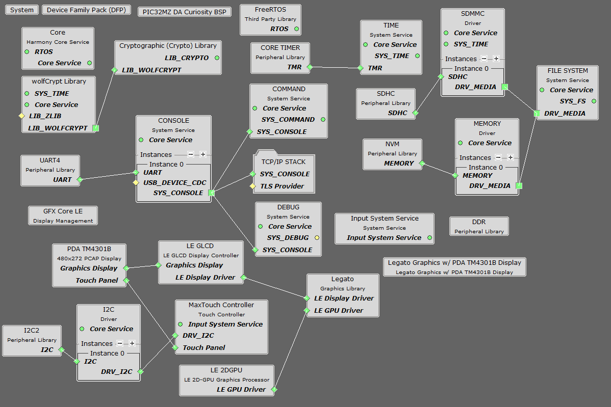
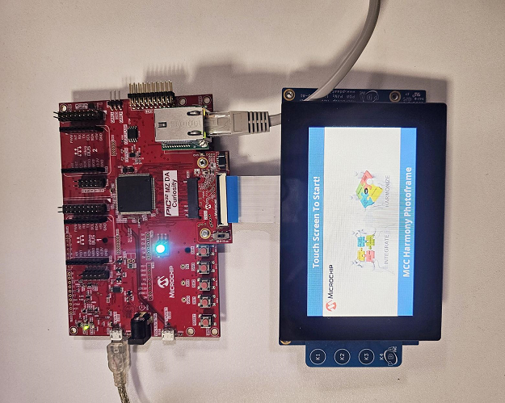
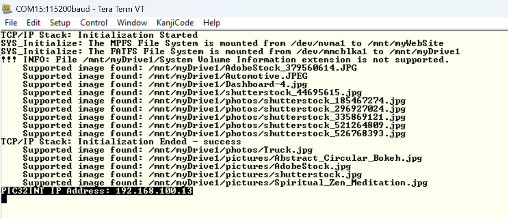
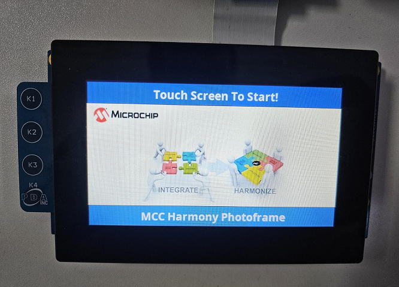
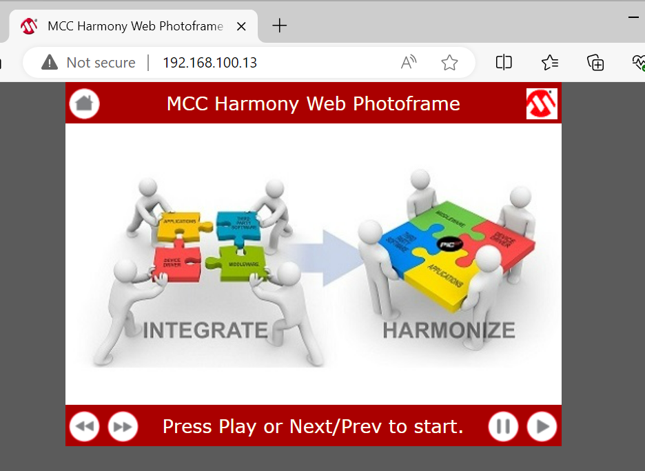
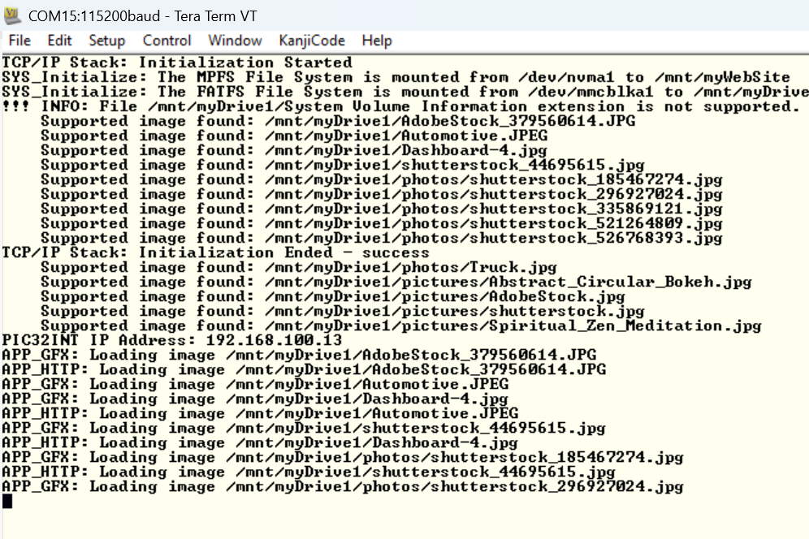

# Web Photo Frame Application on PIC32MZ DA Curiosity Development Kit
<h2 align="center"> <a href="https://github.com/Microchip-MPLAB-Harmony/reference_apps/releases/latest/download/pic32mzda_web_photo_frame.zip" > Download </a> </h2>

----

## Description:
> This application shows how to create a web-enabled digital photo frame using Harmony under MPLAB Code Configurator (MCC).
> The application uses:
> Legato Graphics library to display images from an SD Card to a WQVGA display
> TCP/IP Stack to enable a Web Server to show images into a Web Browser.

## Modules/Technology Used:
- Board Support Package (BSP)
	- PIC32MZ DA Curosity BSP
- Peripheral Modules
	- UART
	- I2C
	- DDR
	- NVM
	- SDHC
	- Core Timer
- Driver Modules
	- SDMMC Driver
	- I2C Driver
- Display Drivers
	- LE GLCD Display Controller
	- Max Touch Controller
	- PDA TM4301B Display Driver
	- GFX Core LE
	- LE 2DGPU
- System Services
	- Time
	- File System
	- Debug
	- Command
	- Console
- Harmony Libraries
	- TCP/IP Stack
	- Legato Graphics Library
	- Cryptographic Library
- Third Party Libraries
	- FreeRTOS
	- WolfCrypt Library
- Display Template
	- Legato Graphics w/ PDA TM4301B Display

  The MCC Harmony project graph with all the components would look like this;
 
  
 
 

## Hardware Used:
- [PIC32MZ DA Curiosity Development Kit (EV87D54A)]( https://www.microchip.com/en-us/development-tool/EV87D54A )   
- [24-BIT pass through Graphics Card (AC320213)]( https://www.microchip.com/en-us/development-tool/ac320213 )
- [High-Performance 4.3" WQVGA Display Module with maXTouch® Technology (AC320005-4)]( https://www.microchip.com/developmenttools/ProductDetails/AC320005-4 )
- [LAN8720A PHY Daughter Board (AC320004-3)]( https://www.microchip.com/en-us/development-tool/ac320004-3 )
- SD Card

## Software/Tools Used:
 This project has been verified to work with the following versions of software tools:  

- Refer [Project Manifest](./firmware/src/config/pic32mzda_curiosity/harmony-manifest-success.yml) present in mcc-manifest-generated-success.yml under the project folder *./firmware/src/config/pic32mzda_curiosity*

## Development Tools
- [MPLAB® X IDE v6.20](https://www.microchip.com/en-us/tools-resources/develop/mplab-x-ide)
- [MPLAB® XC32 C/C++ Compiler v4.45](https://www.microchip.com/en-us/tools-resources/develop/mplab-xc-compilers/xc32)
- MPLAB® X IDE plug-ins:
  - [MPLAB Code Configurator (MCC) v5.5.1](https://www.microchip.com/en-us/tools-resources/configure/mplab-code-configurator)

 Because Microchip regularly update tools, occasionally issue(s) could be discovered while using the newer versions of the tools. If the project doesn’t seem to work and version incompatibility is suspected, It is recommended to double-check and use the same versions that the project was tested with.  To download original version of MPLAB Harmony v3 packages, refer to document [How to Use the MPLAB Harmony v3 Project Manifest Feature](https://ww1.microchip.com/downloads/en/DeviceDoc/How-to-Use-the-MPLAB-Harmony-v3-Project-Manifest-Feature-DS90003305.pdf)

## Setup:
- Mount the LAN8720A PHY Ethernet Daughter Board to Ethernet PHY Module connector
- Connect the 24-Bit pass through Graphics Card to the Graphics Interface (J502) of PIC32MZ DA Curiosity Development Kit
- Connect the WQVGA LCD Display Module ribbon to the connector(J2) of the 24-Bit pass through Graphics Card   
- Connect the Micro USB cable to the Debug USB of the Curiosity PIC32MZ DA Curiosity Development Kit  
- Connect and Ethernet Cable between the LAN8720A PHY Ethernet Daughter Board and your Router / PC

    

## Programming hex file:
The pre-built hex file can be programmed by following the below steps.

### Steps to program the hex file
- Open MPLAB X IDE
- Close all existing projects in IDE, if any project is opened
- Go to File -> Import -> Hex/ELF File
- In the "Import Image File" window, Step 1 - Create     Prebuilt Project, Click the "Browse" button to select the     prebuilt hex file from **pic32mzda_web_photo_frame/hex** folder and load the hex file available
- Select Device has "PIC32MZ2064DAR176"
- Ensure the proper tool is selected under "Hardware Tool"
- Click on Next button
- In the "Import Image File" window, Step 2 - Select Project     Name and Folder, select appropriate project name and folder
- Click on Finish button
- In MPLAB X IDE, click on "Make and Program Device" Button.     The device gets programmed in sometime
- Follow the steps in "Running the Demo" section below

## Programming/Debugging Application Project:
- Open the project (**pic32mzda_web_photo_frame/firmware/pic32mz_da_curiosity.X**) in MPLAB X IDE
- Ensure "Curiosity/Starter Kits (PKOB4)" is selected as hardware tool to program/debug the application
- Build the code and program the device by clicking on the "Make and Program Device" button in MPLAB X IDE tool bar
- Follow the steps in "Running the Demo" section below

## Running the Demo:

### Preparation
- Take a micro SD Card and copy the resource files and folders provided into the **pic32mzda_web_photo_frame/sdcard_files** to the SD Card
- Plug the SD Card into the  Micrco SD card socket (J500) of PIC32MZ DA Curiosity Development Kit
- Plug an Ethernet Cable into the Ethernet Adapter and a Router in the same network with the PC, or directly to the PC. If plugged directly to the PC, the Ethernet Adapter on the PC should be configured for Static IP with the IP address 192.168.100.2 and Net Mask 255.255.255.0
- Open a terminal like Tera Term and connect it to the COM port assigned to the Debug USB. Select the baud rate of 115200 for the COM port. 
- Reset the board to start by pressing the reset button on the PIC32MZ DA Curiosity Development Kit.

### Serial Terminal
- After the device reset, wait for the initialization of the file system, IP address generation for the Web Browser

    

### Graphics Display
- After the board powers up, a splash screen should appear on the graphics display
- Wait for the text to say **Touch Screen To Start**

    

- Touch the screen, the images should load one after the other at about 3-5 seconds interval
- Observe the serial terminal, it will show the loaded image directory.

    

- In the terminal, an IP address should be provided in the case the Ethernet Cable is pluged, see above screenshot
- Open a browser on the PC and browse to the provided IP address in the Terminal
- The following Web Page should load

    

- Use the provided buttons to navigate the images.
- Observe the terminal, it will output what file will be displayed.

    

- Note: The loaded image is not synchronized between Graphics Display and HTTP application (webserver). Both tasks are running independently.

## Comments:
- This application demo builds and works out of box by following the instructions above in [Running the Demo](#running-the-demo) section. If you need to enhance/customize this application demo, you need to use the MPLAB Harmony v3 Software framework. Refer links below to setup and build your applications using MPLAB Harmony.
- [How to Setup MPLAB Harmony v3 Software Development Framework](https://ww1.microchip.com/downloads/aemDocuments/documents/MCU32/ProductDocuments/SupportingCollateral/How-to-Setup-MPLAB-Harmony-v3-Software-Development-Framework-DS90003232.pdf)
- [Video - How to Set up the Tools Required to Get Started with MPLAB® Harmony v3 and MCC](https://www.youtube.com/watch?v=0rNFSlsVwVw)
- [Create a new MPLAB Harmony v3 project using MCC](https://developerhelp.microchip.com/xwiki/bin/view/software-tools/harmony/getting-started-training-module-using-mcc/)
- [Update and Configure an Existing MHC-based MPLAB Harmony v3 Project to MCC-based Project](https://developerhelp.microchip.com/xwiki/bin/view/software-tools/harmony/update-and-configure-existing-mhc-proj-to-mcc-proj/)
- [How to Build an Application by Adding a New PLIB, Driver, or Middleware to an Existing MPLAB Harmony v3 Project](https://ww1.microchip.com/downloads/aemDocuments/documents/MCU32/ProductDocuments/SupportingCollateral/How-to-Build-an-Application-by-Adding-a-New-PLIB-Driver-or-Middleware-to-an-Existing-MPLAB-Harmony-v3-Project-DS90003253.pdf)

## Revision:
- v1.7.0 Released demo application
