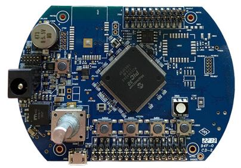

# PIC32MZ DA Radial Graphics Development Board (RGDB)
<h4 align="left">  </h4>

This folder contains the MPLAB® Harmony 3 reference applications developed on [PIC32MZ DA Radial Graphics Development Board (RGDB)](https://ww1.microchip.com/downloads/aemDocuments/documents/MCU32/ProductDocuments/UserGuides/PIC32MZ-DA-Radial-Graphics-Board-User-Guide-DS70005515.pdf).

|SI No| Demo Name | Download Link |
| --- | --- | -- |
| 1 | [MiWi IoT Gateway](./pic32mzda_miwi_iot/readme.md) | [Click Here](https://github.com/Microchip-MPLAB-Harmony/reference_apps/releases/latest/download/pic32mzda_miwi_iot.zip) |

### More Application Demos

For more application demos on **PIC32MZ DA Radial Graphics Development Board (RGDB)** and other Development Boards/Kits having the same part number **(PIC32MZ2064DAR176)** <a href="https://mplab-discover.microchip.com/v1/itemtype/com.microchip.ide.project?s0=PIC32MZ2064DAR176" target="_blank"> CLICK HERE </a>
