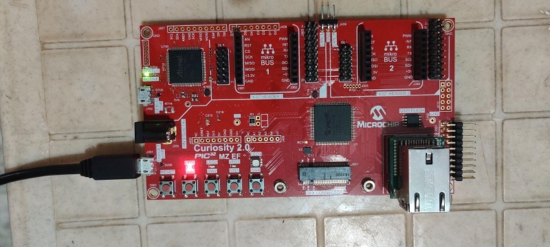
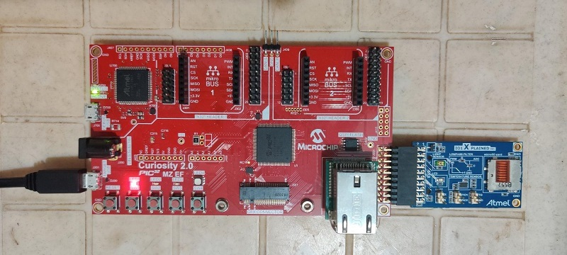

# Getting Started Extended Application on Curiosity PIC32MZ EF 2.0 Development Board
-----
## Description

>  This application demonstrates an LED (LED0) toggle on timeout basis and print the LED 
	toggling rate on the serial terminal. The periodicity of the timeout will change from 
	500 milliseconds to one second, two seconds, four seconds and back to 500 milliseconds 
	every time you press the switch SW0 on the Curiosity PIC32MZ EF 2.0 Development Board.
	
>  The demo application has extended functionality to print the current room temperature
	periodically when the XPRO connector is plugged with I/O1 Xplained Pro Extension Kit.
    

## Modules/Technology Used:

- Peripheral Modules      
	- I2C
	- Timer
	- GPIO
	- UART
	- DMA

## Hardware Used:

- [Curiosity PIC32MZ EF 2.0 Development Board](https://www.microchip.com/Developmenttools/ProductDetails/DM320209)   
- [I/O1 Xplained Pro Extension Kit](https://www.microchip.com/Developmenttools/ProductDetails/ATIO1-XPRO)

## Software/Tools Used:
 *This project has been verified to work with the following versions of software tools:*  
 - [MPLAB Harmony v3 "csp" repo v3.5.2](https://github.com/Microchip-MPLAB-Harmony/csp/releases/tag/v3.5.2)
 - [MPLAB Harmony v3 "dev_packs" repo v3.5.0](https://github.com/Microchip-MPLAB-Harmony/dev_packs/releases/tag/v3.5.0)  
 - [MPLAB Harmony v3 "mhc" repo v3.3.3](https://github.com/Microchip-MPLAB-Harmony/mhc/releases/tag/v3.3.3)   
 -  MPLAB Harmony Configurator Plugin v3.4.0
 - [MPLAB X IDE v5.30](https://www.microchip.com/mplab/mplab-x-ide)
 - [MPLAB XC32 Compiler v2.30](https://www.microchip.com/mplab/compilers)
 - [MPLAB X IPE v5.30](https://www.microchip.com/mplab/mplab-integrated-programming-environment)  
 - Any Serial Terminal application like Tera Term terminal application.  
  *Because Microchip regularly update tools, occasionally issue(s) could be discovered while using the newer versions of the tools. If the project doesn’t seem to work and version incompatibility is suspected, It is recommended to double-check and use the same versions that the project was tested with.*   

## Setup 1:
- Connect the Curiosity PIC32MZ EF 2.0 Development Board to the Host PC as a USB Device 
  through a Type-A male to micro-B USB cable connected to Micro-B USB (Debug USB) port 
  

## Setup 2:  
- Connect the Curiosity PIC32MZ EF 2.0 Development Board to the Host PC as a USB Device 
  through a Type-A male to micro-B USB cable connected to Micro-B USB (Debug USB) port 
- To test the extended functionality, connect the I/O1 Xplained Pro Extension Kit 
  (Temperature Sensor) to J501 (Extension Header 1 (EXT1)) on the Curiosity PIC32MZ EF 2.0 Development Board
  

## Programming binary/hex file:
- If you are not interested in installing development tools. The pre-built binary/hex file can be programmed to the target
	### Steps to program the hex file using MPLAB X IPE
	- Open MPLAB X IPE
	- Select Device has "PIC32MZ2048EFM144"
	- Power the Curiosity PIC32MZ EF 2.0 Development Board from a Host PC through a Type-A male to Micro-B USB cable connected to Micro-B port (J105)
	- Once Power cable is connected, "Curiosity/Starter Kits PKOB4" hardware tool is identified as a programmer
	- Browse to hex file (getting_started_ext_hex_file.hex)
	- Click on program button. The device gets programmed in sometime
	- Follow the steps in "Running the Demo" section below

## Programming/Debugging Application Project:
- Open the project (getting_started_ext\firmware\pic32mz_ef_curiosity_v2.X) in MPLAB X IDE
- Ensure "Curiosity/Starter Kits PKOB4" is selected as hardware tool to program/debug the application
- Build the code and program the device by clicking on the "make and program" button in MPLAB X IDE tool bar
- Follow the steps in "Running the Demo" section below

## Running the Demo:
- Reset or power cycle the device
- An LED (LED0) on the Curiosity PIC32MZ EF 2.0 Development Board toggles on every timeout 
  basis and the default periodicity of the timeout is 500 milliseconds
- And also, the LED toggling rate is displayed on the serial terminal
- Press the switch SW0 on the Curiosity PIC32MZ EF 2.0 Development Board to change the 
  periodicity of the timeout to one second
- Every subsequent pressing of the switch SW0 on the Curiosity PIC32MZ EF 2.0 Development 
  Board changes the periodicity of the timeout to 2 seconds, 4 seconds, 500 milliseconds, 
  and back to 1 second in cyclic order
- **Testing Extended functionality:**
	- Press the switch SW1 on the Curiosity PIC32MZ EF 2.0 Development Board to read and print the 
	- Temperature from the Temperature Sensor.
	- The temperature read is displayed on a serial console on a periodical basis
	- Press the switch SW0 on the Curiosity PIC32MZ EF 2.0 Development Board to change the 
	  periodicity of the temperature values displayed on the serial console. The periodicity will be 
      changed between 500 milliseconds, one second, two seconds, four seconds and back to 500 milliseconds 
      on every time user press the switch SW0 on the Curiosity PIC32MZ EF 2.0 Development Board.

## Comments:
- Reference Training Module: [Getting Started with Harmony v3 Peripheral Libraries on PIC32MZ EF MCUs](https://microchipdeveloper.com/harmony3:pic32mzef-getting-started-training-module)
- This application demo builds and works out of box by following the instructions above in "Running the Demo" section. If you need to enhance/customize this application demo, you need to use the MPLAB Harmony v3 Software framework. Refer links below to setup and build your applications using MPLAB Harmony. 
	- [How to Setup MPLAB Harmony v3 Software Development Framework](https://www.microchip.com/mymicrochip/filehandler.aspx?ddocname=en1000821) 
	- [How to Build an Application by Adding a New PLIB, Driver, or Middleware to an Existing MPLAB Harmony v3 Project](http://ww1.microchip.com/downloads/en/DeviceDoc/How_to_Build_Application_Adding_PLIB_%20Driver_or_Middleware%20_to_MPLAB_Harmony_v3Project_DS90003253A.pdf)  
- The application is available on MPLAB Harmony v3 GitHub repository [reference_apps](https://github.com/Microchip-MPLAB-Harmony/reference_apps/tree/master/apps/pic32mz_ef_curiosity_v2/getting_started_ext)
              
## Revision: 
- v1.0 released demo application
