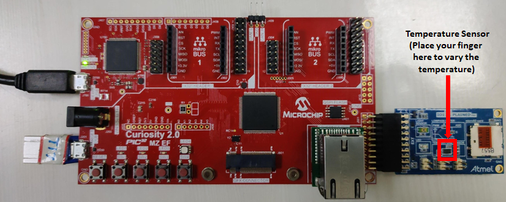

# Getting Started Application using Harmony v3 Drivers, System Services, Middleware and FreeRTOS on Curiosity PIC32MZ EF 2.0 Development Board
-----
## Description

>  The application reads the current room temperature from the temperature sensor on the I/O1 Xplained Pro Extension Kit. 
   The temperature reading is displayed on a serial console periodically every second. Further, the application writes the 
   temperature readings to EEPROM and to a file in a USB thumb drive whenever the USB thumb drive is connected. Also, an 
   LED LED1 is toggled every time the temperature is displayed on the serial console and an LED (LED2) is in ON state when 
   a USB thumb drive is connected.	   

## Modules/Technology Used:

- Peripheral Modules      
	- I2C
	- Timer
	- GPIO
	- UART
	- DMA
- Drivers
	- USB High-Speed Driver
	- USART Synchronous Drive
	- I²C Synchronous Driver	
- System Services
	- File System Services
- Middleware
	- USB Host
- Third Party Libraries
	- FreeRTOS

## Hardware Used:

- [Curiosity PIC32MZ EF 2.0 Development Board](https://www.microchip.com/Developmenttools/ProductDetails/DM320209)   
- [I/O1 Xplained Pro Extension Kit](https://www.microchip.com/Developmenttools/ProductDetails/ATIO1-XPRO)

## Software/Tools Used:
 *This project has been verified to work with the following versions of software tools:*  

 - [MPLAB Harmony v3 "csp" repo v3.6.1](https://github.com/Microchip-MPLAB-Harmony/csp/releases/tag/v3.6.1)
 - [MPLAB Harmony v3 "dev_packs" repo v3.6.1](https://github.com/Microchip-MPLAB-Harmony/dev_packs/releases/tag/v3.6.1)  
 - [MPLAB Harmony v3 "core" repo v3.6.1](https://github.com/Microchip-MPLAB-Harmony/core/releases/tag/v3.6.1)  
 - [MPLAB Harmony v3 "usb" repo v3.4.0](https://github.com/Microchip-MPLAB-Harmony/usb/releases/tag/v3.4.0)
 - [MPLAB Harmony v3 "bsp" repo v3.6.1](https://github.com/Microchip-MPLAB-Harmony/bsp/releases/tag/v3.6.1)
 - [MPLAB Harmony v3 "mhc" repo v3.3.5](https://github.com/Microchip-MPLAB-Harmony/mhc/releases/tag/v3.3.5)   
 - MPLAB Harmony Configurator Plugin v3.4.0
 - [CMSIS-FreeRTOS v10.2.0](https://github.com/Microchip-MPLAB-Harmony/CMSIS-FreeRTOS/releases/tag/v10.2.0)
 - [MPLAB X IDE v5.35](https://www.microchip.com/mplab/mplab-x-ide)
 - [MPLAB XC32 Compiler v2.40](https://www.microchip.com/mplab/compilers)
 - [MPLAB X IPE v5.35](https://www.microchip.com/mplab/mplab-integrated-programming-environment)  
 - Any Serial Terminal application like Tera Term terminal application.  

  *Because Microchip regularly update tools, occasionally issue(s) could be discovered while using the newer versions of the tools. If the project doesn’t seem to work and version incompatibility is suspected, It is recommended to double-check and use the same versions that the project was tested with.*   

## Setup:  
- Connect the Curiosity PIC32MZ EF 2.0 Development Board to the Host PC as a USB Device 
  through a Type-A male to micro-B USB cable connected to Micro-B USB (Debug USB) port 
- Connect the I/O1 Xplained Pro Extension Kit (Temperature Sensor) to J501 (Extension Header 1 (EXT1)) 
  on the Curiosity PIC32MZ EF 2.0 Development Board
- Connect USB OTG Thumb Drive (Pendrive having mirco USB connector) or connect any pen drive using Type-A female to micro-B USB converter cable to Target USB (J201) on the Curiosity PIC32MZ EF 2.0 Development Board  

## Programming binary/hex file:
If you are not interested in installing development tools. The pre-built binary/hex file can be programmed to the target
### Steps to program the hex file using MPLAB X IPE
- Open MPLAB X IPE
- Select Device has "PIC32MZ2048EFM144"
- Power the Curiosity PIC32MZ EF 2.0 Development Board from a Host PC through a Type-A male to Micro-B USB cable connected to Micro-B port (J105)
- Once Power cable is connected, "Curiosity/Starter Kits PKOB4" hardware tool is identified as a programmer
- Browse to hex file (getting_started_middleware_hex_file.hex)
- Click on program button. The device gets programmed in sometime
- Follow the steps in "Running the Demo" section below

## Programming/Debugging Application Project:
- Open the project (getting_started_middleware\firmware\middleware_drivers_freertos_pic32mz_ef_curiosity2.X) in MPLAB X IDE
- Ensure "Curiosity/Starter Kits PKOB4" is selected as hardware tool to program/debug the application
- Build the code and program the device by clicking on the "make and program" button in MPLAB X IDE tool bar
- Follow the steps in "Running the Demo" section below

## Running the Demo:
- Open the Tera Term terminal application on your PC (from the Windows® Start menu by pressing the Start button)
- Change the baud rate to 115200
- You should see the temperature values (in °F) being displayed on the terminal every 500 milliseconds, as shown below  
  
- Also, notice the LED1 blinking at a one second rate
- Press any character on the terminal to display the last five values written to the EEPROM  
  
- You should see the LED2 is in "ON" state whenever you connect a USB thumb drive and the application
  creates a text file "Temperature_Sensor_Data.txt" if it is not already present in the USB thumb drive. 
  The latest room temperature samples are written to the text file at a one-second rate. To view the 
  data in the text file, connect the USB Thumb drive to a PC USB port and open the Temperature_Sensor_Data.txt file  
  
      
- You may vary the temperature by placing your finger on the temperature sensor (for a few seconds)  
  

## Comments:
- Reference Training Module: [Getting Started with Harmony v3 Drivers and Middleware on PIC32MZ EF MCUs using FreeRTOS](TBD)
- This application demo builds and works out of box by following the instructions above in "Running the Demo" section. If you need to enhance/customize this application demo, you need to use the MPLAB Harmony v3 Software framework. Refer links below to setup and build your applications using MPLAB Harmony. 
	- [How to Setup MPLAB Harmony v3 Software Development Framework](https://www.microchip.com/mymicrochip/filehandler.aspx?ddocname=en1000821) 
	- [How to Build an Application by Adding a New PLIB, Driver, or Middleware to an Existing MPLAB Harmony v3 Project](http://ww1.microchip.com/downloads/en/DeviceDoc/How_to_Build_Application_Adding_PLIB_%20Driver_or_Middleware%20_to_MPLAB_Harmony_v3Project_DS90003253A.pdf)  

## Revision: 
- v1.0 released demo application
