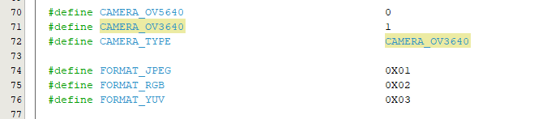
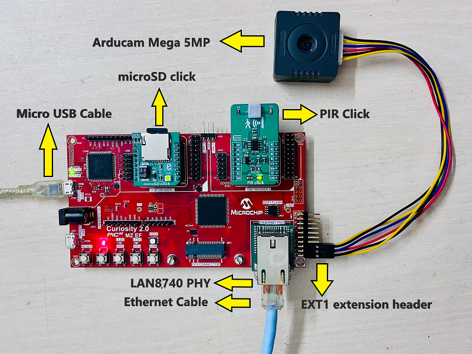
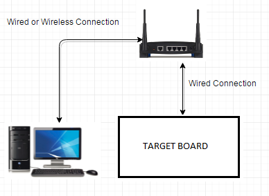
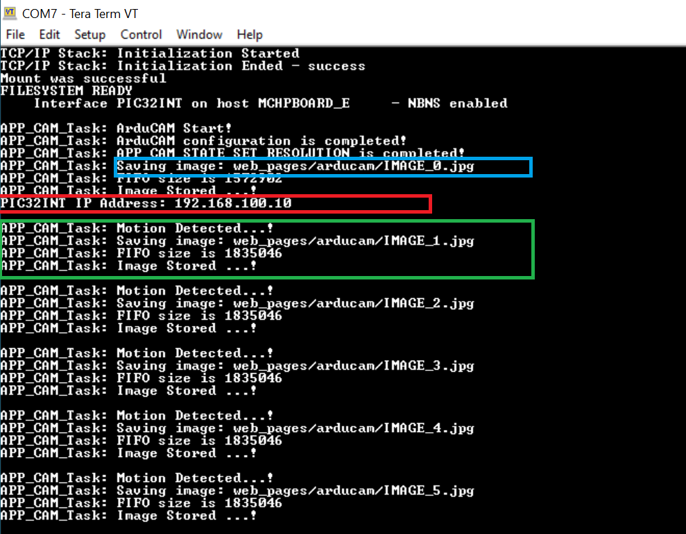
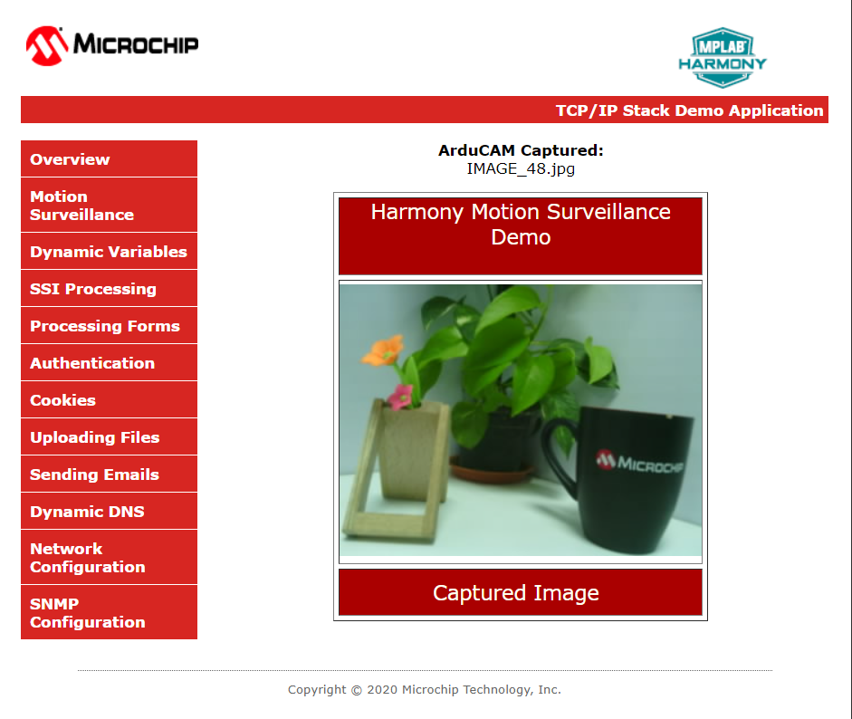

# Motion Surveillance Application on Curiosity PIC32MZ EF 2.0 Development Board
<h2 align="center"> <a href="github zip link here" > Download </a> </h2>

-----

## Description:

> The Motion Surveillance application detects a motion in front of the ArduCAM (camera) using the PIR Click (motion sensor) board. ArduCAM captures an image with resolution 320x240 and stores the image in an external storage device (microSD Card). Additionally, the application demonstrates a live preview of captured images.

> The live preview of captured images is demonstrated by running an HTTP web server on the development board. The user connects to the webserver through an internet browser and view the live preview of the captured images.

## Modules/Technology Used:

- Peripheral Modules
	- UART
	- I2C
	- SPI
	- RTCC
	- SD CARD ( SPI )
	- CORE TIMER
	- CRYPTO
- System Services
	- Debug
	- Command
	- File System
	- Time
	- Console
	- DMA
- Middleware libraries
	- TCP/IP Stack
	- Harmony Core
	- FreeRTOS

## Hardware Used:

- [Curiosity PIC32MZ EF 2.0 Development Board](https://www.microchip.com/en-us/development-tool/dm320209)
- [microSD click](https://www.mikroe.com/microsd-click)
- [MikroElektronika PIR Click](https://www.mikroe.com/pir-click)
- microSD Card
- [LAN8740 PHY daughter board](https://www.microchip.com/DevelopmentTools/ProductDetails/PartNO/AC320004-3)  
	**Note:** The link above points to **LAN8720A PHY Daughter Board**.
	You can procure the [PIC32MZ Embedded Connectivity with FPU (EF) Starter Kit](https://www.microchip.com/DevelopmentTools/ProductDetails/dm320007) and remove the LAN8740 PHY Daughter board on it and use it for this demo.

- [Arducam Mega 5MP Rolling Shutter camera](https://www.arducam.com/product/presale-mega-5mp-color-rolling-shutter-camera-module-with-autofocus-lens-for-any-microcontroller/) or [Arducam Mega 3MP Rolling Shutter camera](https://www.arducam.com/product/presale-mega-3mp-color-rolling-shutter-camera-module-with-solid-camera-case-for-any-microcontroller/)  
	**Note:**  The project is by default configured to function with the Arducam Mega 5MP camera. However, if you wish to use the Arducam Mega 3MP camera instead, you can do so by modifying the CAMERA_TYPE to CAMERA_OV3640 in the "arducam.h" file of the project, as shown below.

## Software/Tools Used:
 This project has been verified to work with the following versions of software tools:  

Refer [Project Manifest](./firmware/src/config/default/harmony-manifest-success.yml) present in harmony-manifest-success.yml under the project folder *firmware/src/config/default*  
- Refer the [Release Notes](../../../release_notes.md#development-tools) to know the **MPLAB X IDE** and **MCC/MCC** Plugin version. Alternatively, [Click Here](https://github.com/Microchip-MPLAB-Harmony/reference_apps/blob/master/release_notes.md#development-tools).  
- [MPLAB XC32 C/C++ Compiler v4.30](https://www.microchip.com/en-us/tools-resources/archives/mplab-ecosystem)  
- Any Serial Terminal application like Tera Term terminal application.  

 Because Microchip regularly update tools, occasionally issue(s) could be discovered while using the newer versions of the tools. If the project doesn’t seem to work and version incompatibility is suspected, It is recommended to double-check and use the same versions that the project was tested with.  

## Hardware Setup:
- Mount the [MikroElektronika PIR Click](https://www.mikroe.com/pir-click) and the [microSD click](https://www.mikroe.com/microsd-click) on to the mikroBUS interfaces of the [Curiosity PIC32MZ EF 2.0 Development Board](https://www.microchip.com/en-us/development-tool/dm320209), as shown in the image.
- Connect the pins of [Arducam Mega 5MP Rolling Shutter camera](https://www.arducam.com/product/presale-mega-5mp-color-rolling-shutter-camera-module-with-autofocus-lens-for-any-microcontroller/) 
to the Xplained Pro Extension Standard Header of the [Curiosity PIC32MZ EF 2.0 Development Board](https://www.microchip.com/en-us/development-tool/dm320209) as described below.

    - VCC -> VCC_P3V3 pin (3.3V)
    - GND -> GND
    - SCK -> SPI3 SCK -> RB14
    - MISO -> SPI3 MISO -> RB5
    - MOSI -> SPI3 MOSI -> RB3
    - CE -> GPIO OUT -> RB15

    
- Mount LAN8740 PHY daughter board on Ethernet PHY header

## TCP/IP Network Setup:
> To run the webserver component in the demo application, the target development board and the host computer should be in the same network. The host computer can be connected to a router via an ethernet cable or Wi-Fi. The target board should be connected to the router via an ethernet cable. Please refer to the following connection diagram.

1. The application is configured and build with [LAN8740 PHY](https://www.microchip.com/wwwproducts/en/LAN8740A) driver. To use a different PHY, use MPLAB® Code Configurator (MCC) to select and configure the PHY. Make sure that correct PHY address and configuration flags are used for the particular PHY daughter board. The MII/RMII and I/O configuration flags should match the hardware for the PHY board. This application demonstration assumes that IPv4 is enabled. If IPv4 is not enabled in MCC, the code in app.c will not build and needs to be updated to remove the IPv4 dependencies.

2. The demo has DHCP enabled, and expect a DHCP server to be available. If there is no DHCP server, then the default static IP address will be used: **192.168.100.10**. If this static address does not match your network settings, use MPLAB® Code Configurator (MCC) to modify the static IP address of the network interface.

3. The NetBIOS name of the application is specified during the initialization of TCP/IP stack. It is the hostName member of TCPIP_HOSTS_CONFIGURATION structure. The NetBIOS service must be enabled in demonstration configuration, for the demonstration to respond to NetBIOS queries. Alternatively, use the IPv4 or IPv6 address (if IPv6 is enabled) of the board directly.

4. The IPv4 and IPv6 addresses can be obtained by running the TCP/IP Discovery utility on the computer. Ex: ipconfig

## Programming hex file:
The pre-built hex file can be programmed by following the below steps.

### Steps to program the hex file
- Open MPLAB X IDE
- Close all existing projects in IDE, if any project is opened.
- Go to File -> Import -> Hex/ELF File
- In the "Import Image File" window, Step 1 - Create Prebuilt Project, Click the "Browse" button to select the prebuilt hex file.
- Select Device has "PIC32MZ2048EFM144"
- Ensure the proper tool is selected under "Hardware Tool"
- Click on Next button
- In the "Import Image File" window, Step 2 - Select Project Name and Folder, select appropriate project name and folder
- Click on Finish button
- In MPLAB X IDE, click on "Make and Program Device" Button. The device gets programmed in sometime
- Follow the steps in "Running the Demo" section below

## Programming/Debugging Application Project:
- Open the project **(pic32mzefc_motion_surveillance\firmware\pic32mz_ef_curiosity_v2_freertos.X)** in MPLAB X IDE
- Ensure "Curiosity PIC32 MZ EF 2.0" is selected as hardware tool to program/debug the application
- Build the code and program the device by clicking on the "Make and Program Device" button in MPLAB X IDE tool bar
- Follow the steps in "Running the Demo" section below

## Running the Surveillance application demo:
- Perform **"Hardware Setup"** steps mentioned above, if not done already.
- Ensure a microSD Card is formatted and loaded with the **web_pages** provided within the **pic32mzefc_motion_surveillance\firmware\src\web_pages** directory.
    - Insert the microSD Card in the [microSD click](https://www.mikroe.com/microsd-click) board mounted on the mikroBUS interface of the [Curiosity PIC32MZ EF 2.0 Development Board](https://www.microchip.com/en-us/development-tool/dm320209).
- Build and download the demonstration project on the target board.

- **Serial Terminal Configuration:**
    - Open a standard terminal application on the computer (like Hyper-terminal or Tera Term) and configure the virtual COM port.
    - Set the serial baud rate to **115200** baud in the terminal application.
    - Before motion detection begins, an initial image (IMAGE_0.jpg) of the field of view is captured and stored for future reference as shown in the terminal logs below. 
    - Further capturing and storing of images is only performed if motion is detected, as depicted in the image.

    

    - When the DHCP client is enabled in the demonstration, wait for the DHCP server to assign an IP address for the development board. This will be printed on the serial port terminal (shown inside red box in the above image).

    - Alternatively: Use **ipconfig** to get the IP address of the board and ping to test if the device is reachable.
- An LED "LED2" on the [Curiosity PIC32MZ EF 2.0 Development Board](https://www.microchip.com/en-us/development-tool/dm320209) toggles when a motion is detected in front of the motion sensor (PIR click).
- An JPEG format image with **320x240** resolution is captured and stored on the microSD Card. Check the logs in the terminal for the motion detection, start capture and saved image events.

- **Steps to preview the captured images:**
    - **Step 1: Live streaming of captured images:**
        - An HTTP server is hosted by the demonstration application. Open a web browser and direct it to the board running the HTTP server by typing the URL in the address bar (for example, https://mchpboard_e or by entering the assigned IP address i.e. http://192.168.100.10/ in the URL bar), and then press Enter key.
        - On the loaded page, Go to the **Motion Surveillance** under the left **Menu**.
        - The following image shows how the **Motion Surveillance** page looks. When the motion sensor detects a motion, the captured images will be live previewed on this page.

        

        - **Note:**
            - When the motion sensor detects a motion, the ArduCAM captures an image (resolution **320x240**) and stores in **web_pages/arducam** folder on the microSD Card.
            - The maximum number of images that the application stores on the microSD Card is **255**. If the number of images captured exceeds **255**, the application overwrites the images from the beginning. User can increase the storage size based on the available free size of the microSD Card by changing the **MAX_FILE_NAMES** macro in the **app_fs_tcp.h** header file.
            - If any error (check logs in the terminal), reset the device, simply reload the page, click **Motion Surveillance** menu option, or clear the web browser cache and then reload the page.

    - **Step 2: Preview the images stored on the microSD Card using Windows Photo Viewer application:**
        - Remove the microSD Card from the [microSD click](https://www.mikroe.com/microsd-click) board mounted on the mikroBUS interface of the [Curiosity PIC32MZ EF 2.0 Development Board](https://www.microchip.com/en-us/development-tool/dm320209) and insert into personal computer.
        - Goto **web_pages/arducam** folder and preview the captured images using any photo preview application.

## Comments:
- Reference Training Module:
	1. [Getting Started with Harmony v3 Peripheral Libraries on PIC32MZ EF MCUs](https://microchipdeveloper.com/harmony3:pic32mzef-getting-started-training-module)

- This application demo builds and works out of box by following the instructions above in "Running the Demo" section. 

## Revision:
- v1.6.0 - Created demo application

