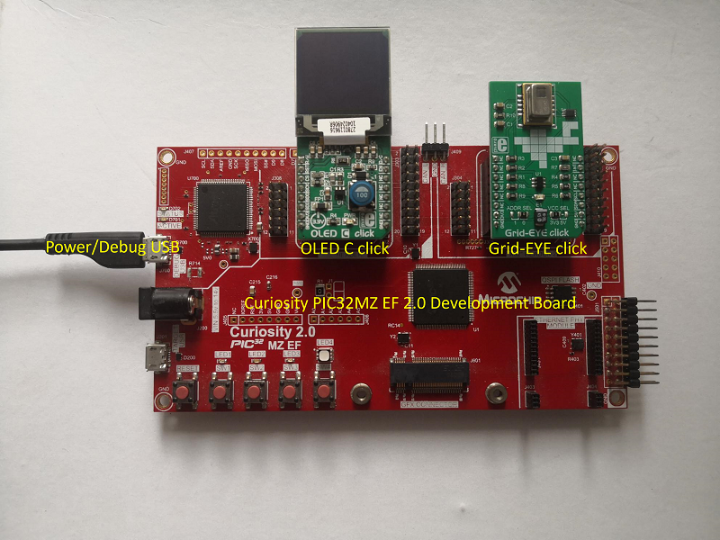

# Thermal Camera based Heat Map Application on Curiosity PIC32MZ EF 2.0 Development Board + OLED C click + Grid-EYE click
<h2 align="center"> <a href="https://github.com/Microchip-MPLAB-Harmony/reference_apps/releases/latest/download/pic32mzef_thermal_camera_heat_map.zip" > Download </a> </h2>

----

## Description:
> This application demonstrates a thermal camera based object heat map. The application senses the surface temperature of an object and display it as a colorful heat map. Temperatures are rendered in real-time and displayed as different colors to form a heat map.  
The application uses MPLAB Harmony v3 Legato Graphics library to display on OLED C click, the thermal frame data measured with Grid-EYE click. The application have two major tasks: one to acquire and process the data from the Grid-EYE click and the other one to display a frame of colors based on the temperature values measured at the previous task.

## Modules/Technology Used:
- Legato Grahpics library
- TIME System Service
- I2C driver
- SPI driver
- LE External Controller driver
- Core Timer

## Hardware Used:
- [Curiosity PIC32MZ EF 2.0 Development Board](https://www.microchip.com/Developmenttools/ProductDetails/DM320209)   
- [OLED C click](https://www.mikroe.com/oled-c-click)
- [Grid-EYE click](https://www.mikroe.com/grid-eye-click)

## Software/Tools Used:
 This project has been verified to work with the following versions of software tools:  

Refer [Project Manifest](./firmware/src/config/default/harmony-manifest-success.yml) present in harmony-manifest-success.yml under the project folder *firmware/src/config/default*  
- Refer the [Release Notes](../../../release_notes.md#development-tools) to know the **MPLAB X IDE** and **MHC/MCC** Plugin version.  

 Because Microchip regularly update tools, occasionally issue(s) could be discovered while using the newer versions of the tools. If the project doesn’t seem to work and version incompatibility is suspected, It is recommended to double-check and use the same versions that the project was tested with.  To download original version of MPLAB Harmony v3 packages, refer to document [How to Use the MPLAB Harmony v3 Project Manifest Feature](https://ww1.microchip.com/downloads/en/DeviceDoc/How-to-Use-the-MPLAB-Harmony-v3-Project-Manifest-Feature-DS90003305.pdf)

## Setup:
- Mount the OLED C click on the mikro BUS 1 of the Curiosity PIC32MZ EF 2.0 Development Board
- Mount the Grid-EYE click on the mikro BUS 2 of the Curiosity PIC32MZ EF 2.0 Development Board
- Power the Curiosity PIC32MZ EF 2.0 Development Board from a Host PC through a Type-A male to micro-B USB cable connected to Micro-B port (J700)

## Programming hex file:
The pre-built hex file can be programmed by following the below steps.  

### Steps to program the hex file
- Open MPLAB X IDE
- Close all existing projects in IDE, if any project is opened.
- Go to File -> Import -> Hex/ELF File
- In the "Import Image File" window, Step 1 - Create Prebuilt Project, Click the "Browse" button to select the prebuilt hex file.
- Select Device has "PIC32MZ2048EFM144"
- Ensure the proper tool is selected under "Hardware Tool"
- Click on Next button
- In the "Import Image File" window, Step 2 - Select Project Name and Folder, select appropriate project name and folder
- Click on Finish button
- In MPLAB X IDE, click on "Make and Program Device" Button. The device gets programmed in sometime
- Follow the steps in "Running the Demo" section below

## Programming/Debugging Application Project:
- Open the project (pic32mzef_thermal_camera_heat_map/firmware/pic32mz_ef_curiosity_v2.X) in MPLAB X IDE
- Ensure "Curiosity/Starter Kits PKOB4" is selected as hardware tool to program/debug the application
- Build the code and program the device by clicking on the "make and program" button in MPLAB X IDE tool bar
- Follow the steps in "Running the Demo" section below

## Running the Demo:
- Reset or power cycle the device.
- After the board powers up, the MPLAB Harmony Logo should appear and remain on the screen for 2 seconds. After the time elapsed, the screen should change, showing small rectangles with different colors
- Place a finger above the sensor, and on display, the user can observe a figure of the finger  in a color different than the background (red or orange)

## Comments:
- Reference Training Module: [Getting Started with Harmony v3 Drivers and Middleware on PIC32MZ EF MCUs using FreeRTOS](https://microchipdeveloper.com/harmony3:pic32mz-get-start-tm-drvr-middlware-freertos)
- This application demo builds and works out of box by following the instructions above in "Running the Demo" section. If you need to enhance/customize this application demo, you need to use the MPLAB Harmony v3 Software framework. Refer links below to setup and build your applications using MPLAB Harmony.
	- [How to Setup MPLAB Harmony v3 Software Development Framework](https://www.microchip.com/mymicrochip/filehandler.aspx?ddocname=en1000821)
	- [How to Build an Application by Adding a New PLIB, Driver, or Middleware to an Existing MPLAB Harmony v3 Project](http://ww1.microchip.com/downloads/en/DeviceDoc/How_to_Build_Application_Adding_PLIB_%20Driver_or_Middleware%20_to_MPLAB_Harmony_v3Project_DS90003253A.pdf)  

## Revision:
- v1.5.0 - Updated the application to use Grid-EYE and OLED-C Click routines, regenerated and tested application.
- v1.4.0 - Released demo application
