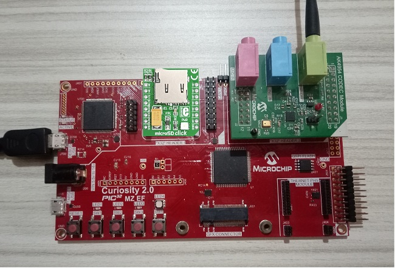

# SD Card Audio Player Application on Curiosity PIC32MZ EF 2.0 Development Board
-----
## Description:

>    The demonstration application creates an audio player that reads audio files
     (.WAV format only) from an SD card mounted on the click interface. The audio
     is played through the CODEC placed on the X32 header interface. It also provides
     feature to switch to the next track on the media.    

>    The sdcard_player application plays .wav files from the SD Card. The SD Card
     driver uses the SPI driver to interact with the SD Card. The application uses
     the File System Service to read/write data on the SD Card. The audio data read
     from the SD card is decoded by passing it to the WAV decoder. The decoded output
     is saved in the output buffers 1 and 2 which are used in ping pong manner. The
     output buffers 1 and 2 are submitted to the Codec driver for playing.
     The Codec is configured for 16-bit data and 48 kHz sampling frequency.
     The Codec driver sends the audio data to the AK4954 Codec using the I2S driver,
     which in turn uses DMA to transfer the audio data. The Codec driver uses the
     I2C driver to send commands to the AK4954 Codec.

## Modules/Technology Used:

- Peripheral Modules      
	- Core Timer
	- DMA
- Driver Modules
    - I2S driver
    - SDSPI driver
    - AK4954 Codec driver
- System Service Libraries
	- File System
- WAV Audio decoder

## Hardware Used:

- [Curiosity PIC32MZ EF 2.0 Development Board](https://www.microchip.com/Developmenttools/ProductDetails/DM320209)   
- [MICROSD CLICK from MikroElektronika](http://www.mikroe.com/click/microsd)
- [PIC32 Audio Codec Daughter Card - AK4954](https://www.microchip.com/DevelopmentTools/ProductDetails/PartNO/AC324954)
- Micro SD Card

## Software/Tools Used:
 *This project has been verified to work with the following versions of software tools:*  

 - [MPLAB Harmony v3 "csp" repo v3.8.3](https://github.com/Microchip-MPLAB-Harmony/csp/releases/tag/v3.8.3)  
 - [MPLAB Harmony v3 "core" repo v3.8.1](https://github.com/Microchip-MPLAB-Harmony/core/releases/tag/v3.8.1)  
 - [MPLAB Harmony v3 "dev_packs" repo v3.8.0](https://github.com/Microchip-MPLAB-Harmony/dev_packs/releases/tag/v3.8.0)  
 - [MPLAB Harmony v3 "mhc" repo v3.6.5](https://github.com/Microchip-MPLAB-Harmony/mhc/releases/tag/v3.6.5)  
 - [MPLAB Harmony v3 "bsp" repository v3.8.2](https://github.com/Microchip-MPLAB-Harmony/bsp/releases/tag/v3.8.2)  
 - [MPLAB Harmony v3 "audio” repository v3.5.0](https://github.com/Microchip-MPLAB-Harmony/audio/tag/v3.5.0)  
 - MPLAB Harmony 3 Launcher Plugin v3.6.2  
 - [MPLAB X IDE v5.45](https://www.microchip.com/mplab/mplab-x-ide)  
 - [MPLAB XC32 Compiler v2.41](https://www.microchip.com/mplab/compilers)

  *Because Microchip regularly update tools, occasionally issue(s) could be discovered while using the newer versions of the tools. If the project doesn’t seem to work and version incompatibility is suspected, It is recommended to double-check and use the same versions that the project was tested with.* 

## Setup:
- Mount the microSD click board on the mikro bus 1 interface (J301, J302) on Curiosity PIC32MZ EF 2.0 Development Board
- Insert a micro SD card into the microSD click board card slot. Ensure that the SD card contains WAV audio files
- Mount the PIC32 Audio Codec Daughter Card - AK4954 on X32 HEADER 2 on Curiosity PIC32MZ EF 2.0 Development Board
- Connect speaker or headphone to the headphone out (HP OUT) connector (Yellow colour)  on top of the PIC32 Audio Codec Daughter Card - AK4954
- Power the Curiosity PIC32MZ EF 2.0 Development Board from a Host PC through a Type-A male to micro-B USB cable connected to Micro-B port (J700)

## Programming hex file:
The pre-built hex file can be programmed by following the below steps.  

### Steps to program the hex file
- Open MPLAB X IDE
- Close all existing projects in IDE, if any project is opened.
- Go to File -> Import -> Hex/ELF File
- In the "Import Image File" window, Step 1 - Create Prebuilt Project, Click the "Browse" button to select the prebuilt hex file.
- Select Device has "PIC32MZ2048EFM144"
- Ensure the proper tool is selected under "Hardware Tool"
- Click on Next button
- In the "Import Image File" window, Step 2 - Select Project Name and Folder, select appropriate project name and folder
- Click on Finish button
- In MPLAB X IDE, click on "Make and Program Device" Button. The device gets programmed in sometime
- Follow the steps in "Running the Demo" section below

## Programming/Debugging Application Project:
- Open the project (sdcard_player\firmware\pic32mz_ef_curiosity_v2.X) in MPLAB X IDE
- Ensure "Curiosity/Starter Kits PKOB4" is selected as hardware tool to program/debug the application
- Build the code and program the device by clicking on the "make and program" button in MPLAB X IDE tool bar
- Follow the steps in "Running the Demo" section below

## Running the Demo:
- Reset or power cycle the device.
- After the board powers up, the first WAV audio track on the media is played, indicated by
  the glowing of LED1 on the Curiosity PIC32MZ EF 2.0 Development Board. (If no audio is heard,
  power cycle the board by pressing the "RESET" switch)
- Put on the headphone. You should be able to hear the audio track being played from the SD card.
- Switch to the next track on the media by pressing button SW1. The changing of the track is
  indicated by the toggling of LED3 on the Curiosity PIC32MZ EF 2.0 Development Board

## Comments:
- This application demo builds and works out of box by following the instructions above in "Running the Demo" section. If you need to enhance/customize this application demo, you need to use the MPLAB Harmony v3 Software framework. Refer links below to setup and build your applications using MPLAB Harmony.
	- [How to Setup MPLAB Harmony v3 Software Development Framework](https://www.microchip.com/mymicrochip/filehandler.aspx?ddocname=en1000821)
	- [How to Build an Application by Adding a New PLIB, Driver, or Middleware to an Existing MPLAB Harmony v3 Project](http://ww1.microchip.com/downloads/en/DeviceDoc/How_to_Build_Application_Adding_PLIB_%20Driver_or_Middleware%20_to_MPLAB_Harmony_v3Project_DS90003253A.pdf)                

## Revision:
- v1.2.0 - Regenerated and tested application
- v1.1.0 regenerated and tested the demo application
- v1.0.0 released demo application
