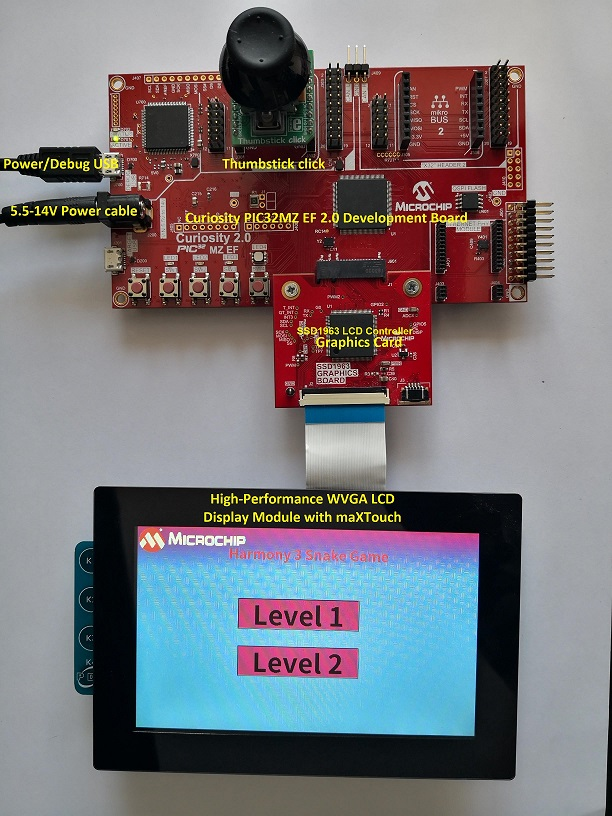

# Snake Game Application on Curiosity PIC32MZ EF 2.0 Development Board + High-Performance WVGA LCD Display Module with maXTouch Technology using Legato Graphics
----

## Description:
> This demonstration represents the classic snake game wherein the player maneuvers the snake and tries to eat the mice (food), which eventually grows the length of the snake. The player needs to protect the snake from hitting the boundary.  
> The application uses the Legato Graphics libray to implement the user interface. The template of each screen is made using the Legato Graphics Composer, while the snake was created using a rectangle widgets used inside a double chained list. The control for the thumbstick was implemented using the SPI driver library from Harmony 3.

## Modules/Technology Used:
- Legato Graphics Library
- SSD1936 driver
- SPI Driver Library
- Time System Service Library
- Core Timer

## Hardware Used:
- [Curiosity PIC32MZ EF 2.0 Development Board]( https://www.microchip.com/Developmenttools/ProductDetails/DM320209 )   
- [Thumbstick click from MikroElektronika]( https://www.mikroe.com/thumbstick-click )
- [SSD1963 LCD Controller Graphics Card]( https://www.microchip.com/Developmenttools/ProductDetails/AC320214)
- [High-Performance WVGA LCD Display Module with maXTouch ® Technology]( https://www.microchip.com/developmenttools/ProductDetails/AC320005-5#additional-summary )

## Software/Tools Used:
 - [MPLAB Harmony v3 "csp" repo v3.7.1](https://github.com/Microchip-MPLAB-Harmony/csp/releases/tag/v3.7.1)
 - [MPLAB Harmony v3 "core" repo v3.7.1](https://github.com/Microchip-MPLAB-Harmony/core/releases/tag/v3.7.1)          
 - [MPLAB Harmony v3 "dev_packs" repo v3.7.0](https://github.com/Microchip-MPLAB-Harmony/dev_packs/releases/tag/v3.7.0)  
 - [MPLAB Harmony v3 "mhc" repo v3.4.0](https://github.com/Microchip-MPLAB-Harmony/mhc/releases/tag/v3.4.0)   
 - [MPLAB Harmony v3 "bsp" repository v3.7.0](https://github.com/Microchip-MPLAB-Harmony/bsp/releases/tag/v3.7.0)
- [MPLAB Harmony v3 "gfx" repository v3.6.0](https://github.com/Microchip-MPLAB-Harmony/gfx/releases/tag/v3.6.0)
- MPLAB Harmony Configurator Plugin v3.5.0    
 - [MPLAB X IDE v5.40](https://www.microchip.com/mplab/mplab-x-ide)
 - [MPLAB XC32 Compiler v2.41](https://www.microchip.com/mplab/compilers)

## Setup:
- Mount SSD1963 LCD Controller Graphics Card on the Graphics connector(J601) of Curiosity PIC32MZ EF 2.0 Development Board
- Mount Thumbstick click board on mikro bus click 1 connector of Curiosity PIC32MZ EF 2.0 Development Board
- Connect the WVGA LCD Display Module ribbon to the connector(J2) of the  SSD1963 LCD Controller Graphics Card    
- Plug the 5.5-14V power cable to the power connecter(J200) of the Curiosity PIC32MZ EF 2.0 Development Board

## Programming hex file:
The pre-built hex file can be programmed by following the below steps.  

### Steps to program the hex file
- Open MPLAB X IDE
- Close all existing projects in IDE, if any project is opened.
- Go to File -> Import -> Hex/ELF File
- In the "Import Image File" window, Step 1 - Create Prebuilt Project, Click the "Browse" button to select the prebuilt hex file.
- Select Device has "PIC32MZ2048EFM144"
- Ensure the proper tool is selected under "Hardware Tool"
- Click on Next button
- In the "Import Image File" window, Step 2 - Select Project Name and Folder, select appropriate project name and folder
- Click on Finish button
- In MPLAB X IDE, click on "Make and Program Device" Button. The device gets programmed in sometime
- Follow the steps in "Running the Demo" section below

## Programming/Debugging Application Project:
- Open the project (snake_game\firmware\pic32mz_ef_curiosity_v2.X) in MPLAB X IDE
- Ensure "PKOB4" is selected as hardware tool to program/debug the application
- Build the code and program the device by clicking on the "make and program" button in MPLAB X IDE tool bar
- Follow the steps in "Running the Demo" section below

## Running the Demo:
- Perform a reset by pressing RESET button on the Curiosity PIC32MZ EF 2.0 Development Board
- After the board powers up, a splash screen should appear followed by the Menu screen.
- By using the Thumbstick, select the desired level to play and press the thumbstick to enter the level.
- Use the thumbstick to change the snake direction in order to reach the food.
- By pressing the Thumbstick button the user can go back to the Menu.  
<video width="550" height="400" autoplay controls> <source src="./images/snake_game.mp4" type="video/mp4"> Your browser does not support the video tag. </video>

## Comments:
- The game should end when the snake hit an obstacle when it doesn't have any remaining lives or when it eats food 10 times
- This application demo builds and works out of box by following the instructions above in "Running the Demo" section. If you need to enhance/customize this application demo, you need to use the MPLAB Harmony v3 Software framework. Refer links below to setup and build your applications using MPLAB Harmony.
	- [How to Setup MPLAB Harmony v3 Software Development Framework](https://www.microchip.com/mymicrochip/filehandler.aspx?ddocname=en1000821)
	- [How to Build an Application by Adding a New PLIB, Driver, or Middleware to an Existing MPLAB Harmony v3 Project](http://ww1.microchip.com/downloads/en/DeviceDoc/How_to_Build_Application_Adding_PLIB_%20Driver_or_Middleware%20_to_MPLAB_Harmony_v3Project_DS90003253A.pdf)      

## Revision:
- v1.0 Released application demo

## History
- None
