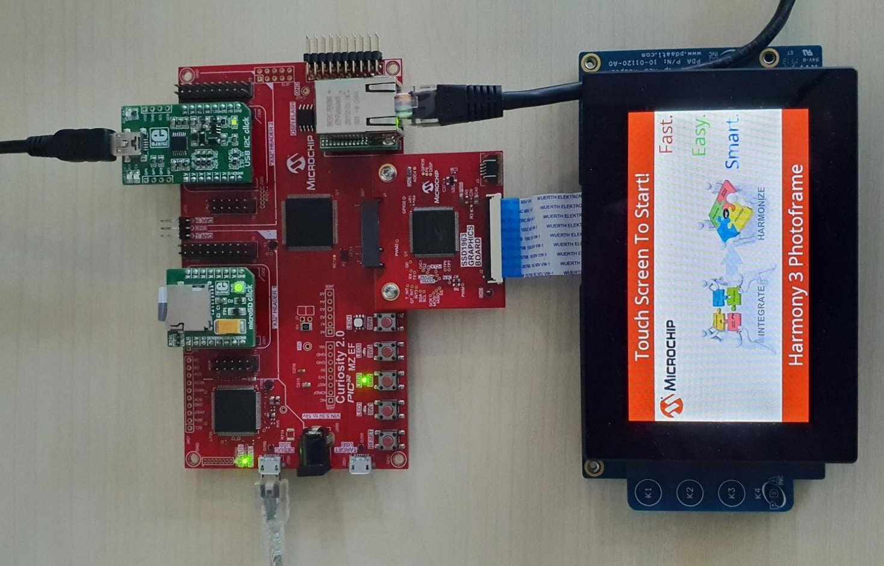
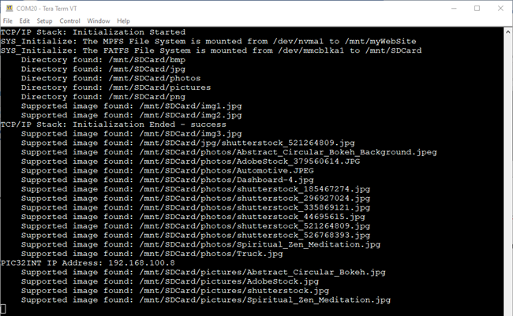
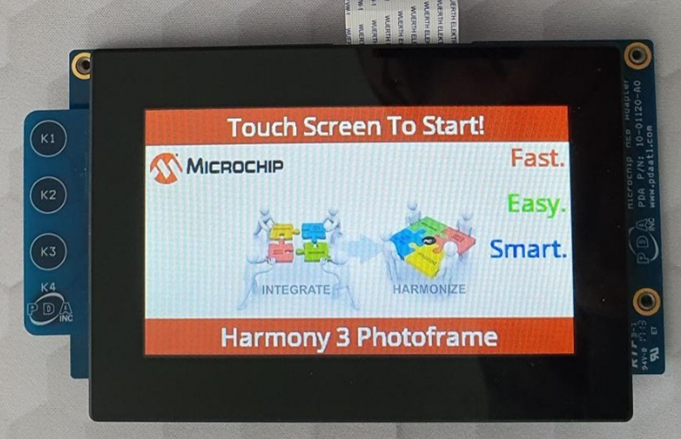
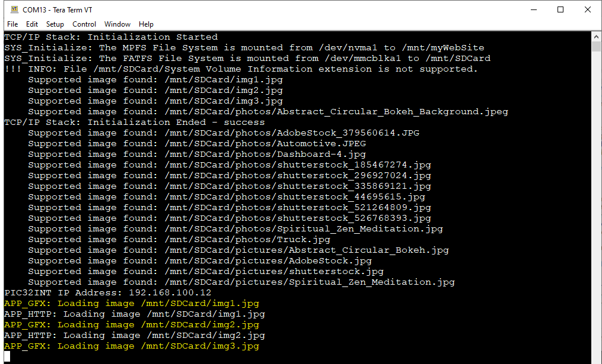
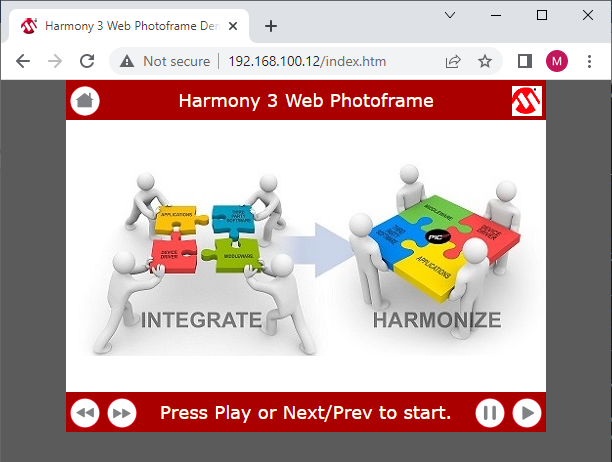

# Web Photo Frame Application on Curiosity PIC32MZ EF 2.0 Development Board
<h2 align="center"> <a href="https://github.com/Microchip-MPLAB-Harmony/reference_apps/releases/latest/download/web_photo_frame.zip" > Download </a> </h2>

----

## Description:
> This tutorial is intended to show how to create a web-enabled digital photo frame from scratch using MPLAB Harmony 3 and the MPLAB Code Configurator (MCC) with Harmony 3.
> The application uses:
> Legato Graphics library to display images from an SD Card to a WQVGA display
> TCP/IP Stack to enable a Web Server to show images into a Web Browser

## Modules/Technology Used:
- FreeRTOS
- Time and Core Timer
- File System Library using two files systems, FATFS on SD Card and MPFS inside NVM
- TCP/IP Stack
- Legato Graphics Library
- SSD1936 driver
- PDA TM4301B Display - 480x272 resolution
- MaxTouch for Touch Screen

## Hardware Used:
- [Curiosity PIC32MZ EF 2.0 Development Board (DM320209)]( https://www.microchip.com/Developmenttools/ProductDetails/DM320209 )   
- [SSD1963 LCD Controller Graphics Card (AC320214)]( https://www.microchip.com/Developmenttools/ProductDetails/AC320214)
- [High-Performance 4.3" WQVGA Display Module with maXTouch® Technology (AC320005-4)]( https://www.microchip.com/developmenttools/ProductDetails/AC320005-4 )
- [KSZ8061 Daughter Board (AC320004-6)]( https://www.microchip.com/en-us/development-tool/ac320004-6 )
- [microSD Click from Mikro (MIKROE-924)]( https://www.mikroe.com/microsd-click )
- [USB I2C Click from Mikro (MIKROE-1985)]( https://www.mikroe.com/usb-i2c-click )

## Software/Tools Used:
 This project has been verified to work with the following versions of software tools:  

- Refer [Project Manifest](./firmware/src/config/wpf_mzef_cu_tm4301b/harmony-manifest-success.yml) present in harmony-manifest-success.yml under the project folder *firmware/src/config/wpf_mzef_cu_tm4301b*  

## Development Tools
- [MPLAB® X IDE v6.05](https://www.microchip.com/mplabx)
- [MPLAB® XC32 C/C++ Compiler v4.21](https://www.microchip.com/XC32)
- MPLAB® X IDE plug-ins:
  - [MPLAB Code Configurator (MCC) v5.3.0](https://www.microchip.com/mcc)

 Because Microchip regularly update tools, occasionally issue(s) could be discovered while using the newer versions of the tools. If the project doesn’t seem to work and version incompatibility is suspected, It is recommended to double-check and use the same versions that the project was tested with.  To download original version of MPLAB Harmony v3 packages, refer to document [How to Use the MPLAB Harmony v3 Project Manifest Feature](https://ww1.microchip.com/downloads/en/DeviceDoc/How-to-Use-the-MPLAB-Harmony-v3-Project-Manifest-Feature-DS90003305.pdf)

## Setup:
- Mount the SSD1963 LCD Controller Graphics Card on the Graphics connector(J601) of Curiosity PIC32MZ EF 2.0 Development Board
- Mount the microSD click board on the microBUS 1 connector of Curiosity PIC32MZ EF 2.0 Development Board
- Mount the USB I2C click board on the microBUS 2 connector of Curiosity PIC32MZ EF 2.0 Development Board
- Mount the KSZ8061 Ethernet Daughter Board to Ethernet PHY Module connector
- Connect the WVGA LCD Display Module ribbon to the connector(J2) of the SSD1963 LCD Controller Graphics Card    
- Plug the 5.5-14V power cable to the power connecter(J200) of the Curiosity PIC32MZ EF 2.0 Development Board  
- Connect a microUSB Cable to the Debug USB plug (J700) of Curiosity PIC32MZ EF 2.0 Development Board
- Connect and Ethernet Cable between the KSZ8061 Ethernet Board and your Router / PC
- Connect a miniUSBcable between the USB I2C Click board and one of your PC USB ports

    

## Programming hex file:
The pre-built hex file can be programmed by following the below steps.

### Steps to program the hex file
- Open MPLAB X IPE
- Device: PIC32MZ2048EFM144
- Select the Tool: Curiosity/Stater Kits (PKOB) and click on Connect
- Hex File: Browse to **web_photo_frame\hex** folder and load the hex file available
- Use the Main Menu: Settings->Release from reset
- Click on the Program button and allow programming time
- Follow the steps in "Running the Demo" section below

## Programming/Debugging Application Project:
- Open the project (**web_photo_frame/firmware/wpf_mzef_cu_tm4301b.X**) in MPLAB X IDE
- Ensure "Curiosity/Starter Kits (PKOB4)" is selected as hardware tool to program/debug the application
- Build the code and program the device by clicking on the "Make and Program Device" button in MPLAB X IDE tool bar
- Follow the steps in "Running the Demo" section below

## Running the Demo:

### Preparation
- Take a micro SD Card and copy the resource files and folders provided into the **web_photo_frame\sdcard_files** to the SD Card
- Plug the SD Card into the mikroSD Click board
- Plug an Ethernet Cable into the Ethernet Adapter and a Router in the same network with the PC, or directly to the PC. If plugged directly to the PC, the Ethernet Adapter on the PC should be configured for Static IP with the IP address 192.168.100.2 and Net Mask 255.255.255.0
- Open a terminal like Tera Term and connect it to the COM port assigned to the USB I2C click
- Reset the board to start.

### Serial Terminal
- Observe the output on the Terminal
- Observe the IP address of the board, needed for the Web Browser

    

### Graphics Display
- After the board powers up, a splash screen should appear on the graphics display
- Wait for the text to say **Touch Screen To Start**

    

- Touch the screen, the images should load one after the other at about 3-5 seconds interval
- Observe the terminal, it will output what file will be displayed.

    

- In the terminal, an IP address should be provided in the case the Ethernet Cable is pluged, see above screenshot
- Open a browser on the PC and browse to the provided IP address in the Terminal
- The followin Web Page should load

    

- Use the provided buttons to navigate the images.
- Observe the terminal, it will output what file will be displayed.

    

### Observations
- The image display is not synchronized between the Graphics and the HTTP application, each has its own cursor.

## Comments:
- Reference Training Module: [Getting Started with Harmony v3 Peripheral Libraries on PIC32MZ EF MCUs](https://microchipdeveloper.com/harmony3:pic32mzef-getting-started-training-module)
- This application demo builds and works out of box by following the instructions above in "Running the Demo" section. If you need to enhance/customize this application demo, you need to use the MPLAB Harmony v3 Software framework. Refer links below to setup and build your applications using MPLAB Harmony.
	- [How to Setup MPLAB Harmony v3 Software Development Framework](https://ww1.microchip.com/downloads/en/DeviceDoc/How_to_Setup_MPLAB_%20Harmony_v3_Software_Development_Framework_DS90003232C.pdf)
	- [How to Build an Application by Adding a New PLIB, Driver, or Middleware to an Existing MPLAB Harmony v3 Project](http://ww1.microchip.com/downloads/en/DeviceDoc/How_to_Build_Application_Adding_PLIB_%20Driver_or_Middleware%20_to_MPLAB_Harmony_v3Project_DS90003253A.pdf)
	-  **MPLAB Harmony v3 is also configurable through MPLAB Code Configurator (MCC). Refer to the below links for specific instructions to use MPLAB Harmony v3 with MCC.**
		- [Create a new MPLAB Harmony v3 project using MCC](https://microchipdeveloper.com/harmony3:getting-started-training-module-using-mcc)
		- [Update and Configure an Existing MHC-based MPLAB Harmony v3 Project to MCC-based Project](https://microchipdeveloper.com/harmony3:update-and-configure-existing-mhc-proj-to-mcc-proj)
		- [Getting Started with MPLAB Harmony v3 Using MPLAB Code Configurator](https://www.youtube.com/watch?v=KdhltTWaDp0)
		- [MPLAB Code Configurator Content Manager for MPLAB Harmony v3 Projects](https://www.youtube.com/watch?v=PRewTzrI3iE)

## Revision:
- v1.6.0 released demo application
