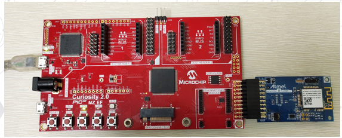
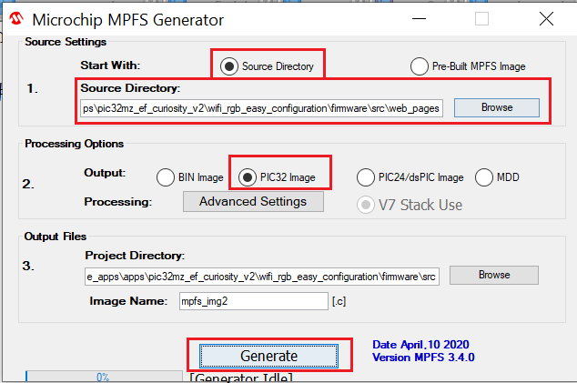

# WiFi based RGB LED Control Application on Curiosity PIC32MZ EF 2.0 Development Board
<h2 align="center"> <a href="https://github.com/Microchip-MPLAB-Harmony/reference_apps/releases/latest/download/wifi_rgb_easy_configuration.zip" > Download </a> </h2>

-----
## Description:

>  The WiFi RGB Easy Configuration demo showcases how to configure an embedded WiFi device that does not have a
    natural keyboard and screen. By using the internal Web server that accompanies the Microchip TCP/IP stack,
    end-users can use their browser to control the RGB(RedGreenBlue) Led.

> The Curiosity PIC32MZ EF 2.0 Development Board provides an XPRO connector. The XPRO connector is plugged with the
    ATWINC1500-XPRO board to configure WiFi connectivity. Also, the demo features changing the color of the on-board
    RGB LED using the webpage hosted by the Curiosity board.

## Modules/Technology Used:

- Peripheral Modules      
	- Output compare
	- Core Timer
	- NVM
- Driver Modules
	- Memory Driver
- Middleware Libraries
	- TCP/IP Stack
- System Service Libraries
	- File System
	- SYS Console
	- SYS Command
- STDIO Library
- WINC1500 Driver

## Hardware Used:

- [Curiosity PIC32MZ EF 2.0 Development Board](https://www.microchip.com/Developmenttools/ProductDetails/DM320209)   
- [ATWINC1500-XPRO](https://www.microchip.com/DevelopmentTools/ProductDetails/ATWINC1500-XPRO)

## Software/Tools Used:
 This project has been verified to work with the following versions of software tools:  

Refer [Project Manifest](./firmware/src/config/default/harmony-manifest-success.yml) present in harmony-manifest-success.yml under the project folder *firmware/src/config/default*  
- Refer the [Release Notes](../../../release_notes.md#development-tools) to know the **MPLAB X IDE** and **MCC** Plugin version. Alternatively, [Click Here](https://github.com/Microchip-MPLAB-Harmony/reference_apps/blob/master/release_notes.md#development-tools)   

 Because Microchip regularly update tools, occasionally issue(s) could be discovered while using the newer versions of the tools. If the project doesn’t seem to work and version incompatibility is suspected, It is recommended to double-check and use the same versions that the project was tested with.  To download original version of MPLAB Harmony v3 packages, refer to document [How to Use the MPLAB Harmony v3 Project Manifest Feature](https://ww1.microchip.com/downloads/en/DeviceDoc/How-to-Use-the-MPLAB-Harmony-v3-Project-Manifest-Feature-DS90003305.pdf)

**Note:** : This demo uses wireless WINC v19.6.1 stack and driver.

## Setup:
 - Connect ATWINC1500-XPRO to Extension header (J501) on Curiosity PIC32MZ EF 2.0 Development Board
 - Power the Curiosity PIC32MZ EF 2.0 Development Board from a Host PC through a Type-A male to micro-B USB cable connected to Micro-B port (J700)  

## Programming hex file:
The pre-built hex file can be programmed by following the below steps.  

### Steps to program the hex file
- Open MPLAB X IDE
- Close all existing projects in IDE, if any project is opened.
- Go to File -> Import -> Hex/ELF File
- In the "Import Image File" window, Step 1 - Create Prebuilt Project, Click the "Browse" button to select the prebuilt hex file.
- Select Device has "PIC32MZ2048EFM144"
- Ensure the proper tool is selected under "Hardware Tool"
- Click on Next button
- In the "Import Image File" window, Step 2 - Select Project Name and Folder, select appropriate project name and folder
- Click on Finish button
- In MPLAB X IDE, click on "Make and Program Device" Button. The device gets programmed in sometime
- Follow the steps in "Running the Demo" section below

## Programming/Debugging Application Project:
- Open the project (wifi_rgb_easy_configuration\firmware\pic32mz_ef_curiosity_v2.X) in MPLAB X IDE
- Ensure "Curiosity/Starter Kits PKOB4" is selected as hardware tool to program/debug the application
- Navigate to "../reference_apps/apps/pic32mz_ef_curiosity_v2/wifi_rgb_easy_configuration/firmware/src/utilities" folder
- Double click on "mpfs2" jar file (Note : Make sure java is installed)
- Select Source Directory and browse to the folder ""../reference_apps/apps/pic32mz_ef_curiosity_v2/wifi_rgb_easy_configuration/firmware/src/web_pages" as shown in below image
- Select "PIC32 Image" and click on **Generate** button to generate mpfs_img2.c file as shown in below image  
	
- Build the code and program the device by clicking on the "make and program" button in MPLAB X IDE tool bar
- Follow the steps in "Running the Demo" section below

## Running the Demo:
- Open Tera Term, connect to serial console. If there is any connection issue on tera terminal, unplug the USB cable connected to Micro-B port, and reconnect it back.
- Change the baud rate to 115200
- Perform a reset by pressing the "RESET" switch
- The serial terminal displays the below message  
"TCP/IP Stack: Initialization Started  
TCP/IP Stack: Initialization Ended - success  
SYS_Initialize: The MPFS2 File System is mounted  
WINC IP Address: 192.168.1.1"  
- When the demonstration runs, the WINC1500 goes into SoftAP mode (it behaves as an access point) and displays itself as "MCHPSoftAP" network		
- From a smartphone or personal computer, connect to the "MCHPSoftAP" network, which is the SoftAP network started by the demonstration. Then, bring up a web page by entering the IP address(e.g., 192.168.1.1) of the SoftAP network into the smartphone browser
- When the web page is displayed, On the right top corner of the page, there is a widget through which you can change the color of the RGB LED on the Curiosity board
- Click the text box to display a pop-up for selecting the color of the RGB LED. Click the Submit button to set the color of the RGB LED on the Curiosity board

## Comments:
- This application demo builds and works out of box by following the instructions above in "Running the Demo" section. If you need to enhance/customize this application demo, you need to use the MPLAB Harmony v3 Software framework. Refer links below to setup and build your applications using MPLAB Harmony.
	- [How to Setup MPLAB Harmony v3 Software Development Framework](https://ww1.microchip.com/downloads/en/DeviceDoc/How_to_Setup_MPLAB_%20Harmony_v3_Software_Development_Framework_DS90003232C.pdf)
	- [How to Build an Application by Adding a New PLIB, Driver, or Middleware to an Existing MPLAB Harmony v3 Project](http://ww1.microchip.com/downloads/en/DeviceDoc/How_to_Build_Application_Adding_PLIB_%20Driver_or_Middleware%20_to_MPLAB_Harmony_v3Project_DS90003253A.pdf)  
	-  **MPLAB Harmony v3 is also configurable through MPLAB Code Configurator (MCC). Refer to the below links for specific instructions to use MPLAB Harmony v3 with MCC.**
		- [Create a new MPLAB Harmony v3 project using MCC](https://microchipdeveloper.com/harmony3:getting-started-training-module-using-mcc)
		- [Update and Configure an Existing MHC-based MPLAB Harmony v3 Project to MCC-based Project](https://microchipdeveloper.com/harmony3:update-and-configure-existing-mhc-proj-to-mcc-proj)
		- [Getting Started with MPLAB Harmony v3 Using MPLAB Code Configurator](https://www.youtube.com/watch?v=KdhltTWaDp0)
		- [MPLAB Code Configurator Content Manager for MPLAB Harmony v3 Projects](https://www.youtube.com/watch?v=PRewTzrI3iE)	

## Revision:
- v1.5.0 Removed MHC support, Regenerated and tested application.
- v1.4.0 Added MCC support, Regenerated and tested application.
- v1.3.0 Regenerated and tested application.
- v1.2.0 Regenerated and tested application.
- v1.1.0 released demo application
