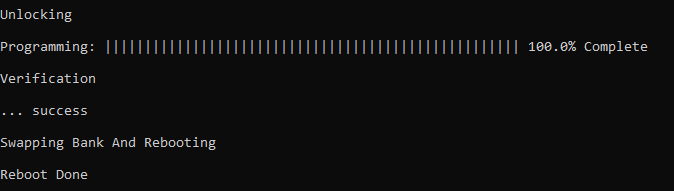
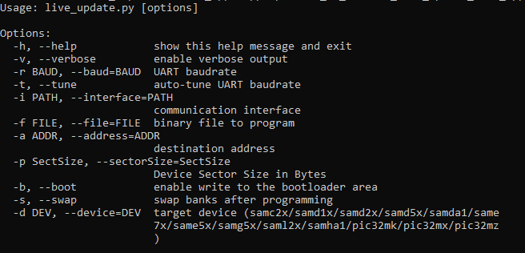
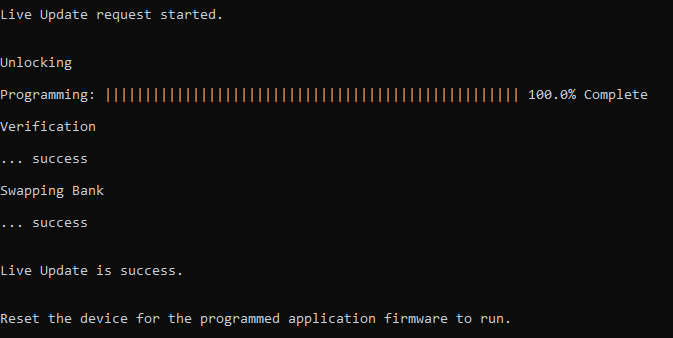

# Live update Application on PIC32MZ Embedded Connectivity with FPU (EF) Starter Kit
<h2 align="center"> <a href="https://github.com/MicrochipTech/MPLAB-Harmony-Reference-Apps/releases/latest/download/pic32mz_uart_live_update.zip" > Download </a> </h2>

-----

## Description:

> The Live update application uses the dual bank flash feature available on the PIC32MZ Microcontrollers (MCUs).
The banks on PIC32MZ MCU are named as BANK1 and BANK2. At any point of time, the application considers the bank on which it is currently executing from as active bank while the other bank is marked as inactive bank. The dual bank flash enables programming the inactive bank with a new version of the firmware while running the current version of the firmware from the active bank.

> The application updates the new version of the firmware to the inactive bank while the current version of the firmware runs from the active bank.

> The application identifies the flash bank which has the latest version of the firmware (active bank) and toggles a specific LED at a periodic rate. For example, it starts with toggling LED1 and when there is bank swap (active bank changed following successful upgrade), it toggles LED2. Similarly, the process repeats for every successful application firmware update.

## Modules/Technology Used:

- Peripheral Modules
	- NVM
	- CORE TIMER
	- UART
	- Harmony Core

## Hardware Used:

- [PIC32MZ Embedded Connectivity with FPU (EF) Starter Kit ](https://www.microchip.com/Developmenttools/ProductDetails/Dm320007)

## Software/Tools Used:
 This project has been verified to work with the following versions of software tools:  

Refer [Project Manifest](./firmware/src/config/pic32mz_ef_sk/harmony-manifest-success.yml) present in harmony-manifest-success.yml under the project folder *firmware/src/config/{configurtion name}*  
- Refer the [Release Notes](../../../release_notes.md#development-tools) to know the **MPLAB X IDE** and **MHC/MCC** Plugin version.  
- Any Serial Terminal application like Tera Term terminal application.
- Windows command prompt
- Python 2.7

 Because Microchip regularly update tools, occasionally issue(s) could be discovered while using the newer versions of the tools. If the project doesn’t seem to work and version incompatibility is suspected, It is recommended to double-check and use the same versions that the project was tested with.  To download original version of MPLAB Harmony v3 packages, refer to document [How to Use the MPLAB Harmony v3 Project Manifest Feature](https://microchip.com/DS90003305)

## Setup:
- Connect a mini USB cable to the UART-USB port J11
- For programming, connect a mini USB cable to the USB Debug port J3

## Programming/Debugging Application Project:
- Open the project (getting_started_ext/firmware/pic32mz_ef_curiosity_v2.X) in MPLAB X IDE
- Ensure "Starter Kits (PKOB)" is selected as hardware tool to program/debug the application
- Build the code and program the device by clicking on the "Make and Program Device" button in MPLAB X IDE tool bar
- Follow the steps in "Running the Demo" section below

## Running the Bootloader application:

**For the first time, the Live update application is programmed by using either Harmony basic bootloader or Harmony fail-safe bootloader.**

1. Download the MPLAB Harmony [Bootloader](https://github.com/Microchip-MPLAB-Harmony/bootloader) and [Bootloader UART Apps](https://github.com/Microchip-MPLAB-Harmony/bootloader_apps_uart) packages.
2. Connect a mini USB cable to the DEBUG port of the PIC32MZ Embedded Connectivity with FPU (EF) Starter Kit.
3. Build and program the UART fail safe bootloader (Dual bank bootloader) which is in (path: `<Your Harmony Framework download folder>/bootloader_apps_uart/apps/uart_fail_safe_bootloader/bootloader/firmware/pic32mz_ef_sk.X`) using the MPLAB X IDE.
4. Build the Live update application (path: `<Live Update application folder>/firmware/pic32mz_ef_sk.X`) using the MPLAB X IDE **but do not program**.
5. From the command prompt, run the bootloader host script "**btl_host.py**" available at `<Your Harmony Framework download folder>/bootloader/tools_archive` to program the application binary.
 - `python <Your Harmony Framework download folder>/bootloader/tools_archive/btl_host.py -v -s -i <COM PORT> -d pic32mz  -a 0x9D100000 -f <Live Update application folder>/hex/pic32mz_ef_sk.X.production.bin`
  - **Note:** If you need to know more information on the bootloader host script, refer Help for setting up the host script available at `<Your Harmony Framework download folder>/bootloader/doc/help_bootloader.chm`
6. Following screenshot shows successful programming of the application binary.
7. The messages "Swapping Bank And Rebooting and Reboot Done" in below screenshot signifies that bootloading is successful.

    

## Running the Live update application:
1. Perform "Running the Bootloader application" steps mentioned above, if not done already.
2. If the above step is successful, then LED1 or LED2 on the PIC32MZ Embedded Connectivity with FPU (EF) Starter Kit should start blinking which indicates the application is running from BANK 1 or BANK 2 based on from where the program is running.
3. Reset or Power cycle the device.
4. Run the host script "**live_update.py**" for live update application from command prompt available at `<Live Update application folder>/scripts` to program the new version of the firmware to an inactive panel while the current version of the application is being run from the active panel.
   - `python <Live Update application folder>/scripts/live_update.py -v -s -i <COM PORT> -d pic32mz  -a 0x9D100000 -f <Live Update application folder>/hex/pic32mz_ef_sk.X.production.bin`
   - The following screenshot shows the Live update script help.

    

5. The following screenshot shows the example for output of successful firmware programming.

    

6. If the Live update is success then LED3 should turn ON.
   * This indicates that the Live update is successful
7. In case of any error during the Live update i.e. in Step 4, the LED3 turns OFF. Follow the below steps recover from the error:
   * Press and hold the Switch SW1 to reset the system then repeat the step 4 to program the Live update application.
   * or
   * Reset or Power cycle the device and repeat from the step 4 to program the Live update application.
8. If the Live update is success then LED1 or LED2 should start blinking which indicates the application is running from BANK 1 or BANK 2 based on from where the program is running.
   * LED1 for BANK 1
   * LED2 for BANK 2
9. Reset or Power Cycle the device for the newly programmed application to run.
   * Observe the change in LED toggling compared to the LED which was toggling in the previous step. This indicates that the newly updated image is running properly.

## Comments:
- Reference Application Note: [Live Update application on PIC32MZ MCUs using MPLAB Harmony v3](http://ww1.microchip.com/downloads/en/Appnotes/Live_Update_Application_on_PIC32MZ_MCUs_Using_MPLAB_Harmonyv3_DS00003703A.pdf)
- This application demo builds and works out of box by following the instructions above in "Running the Demo" section. If you need to enhance/customize this application demo, you need to use the MPLAB Harmony v3 Software framework. Refer links below to setup and build your applications using MPLAB Harmony.
	- [How to Setup MPLAB Harmony v3 Software Development Framework](https://www.microchip.com/mymicrochip/filehandler.aspx?ddocname=en1000821)
	- [How to Build an Application by Adding a New PLIB, Driver, or Middleware to an Existing MPLAB Harmony v3 Project](http://ww1.microchip.com/downloads/en/DeviceDoc/How_to_Build_Application_Adding_PLIB_%20Driver_or_Middleware%20_to_MPLAB_Harmony_v3Project_DS90003253A.pdf)

## Revision:
- v1.3.0 regenerated and tested the application
- v1.2.0 regenerated and tested the application
- v1.1.0 regenerated and tested the application
- v1.0.0 released demo application
