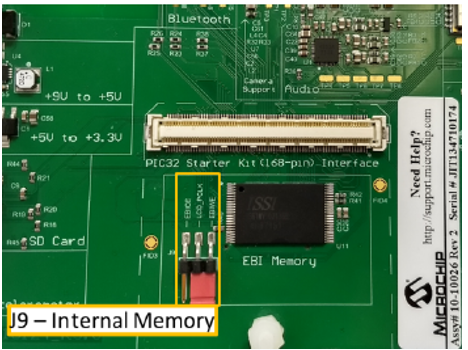
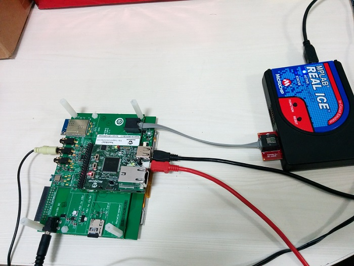
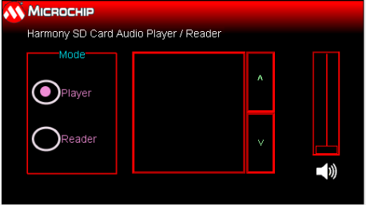

# SD Card Audio Player/Reader with Aria Graphics on PIC32MZ Embedded Connectivity with FPU Starter Kit + Multimedia Expansion Board II
-----

## Description

> This application reads a WAV audio file from the SD card on the PIC32 Multimedia Expansion Board (MEB) II and streams
  it over the PIC32 I²S interface through the audio CODEC. The application implements the functionality of an audio player
  (for WAV files only).
> The application displays audio tracks from the SD card in a list box. It allows to navigate the list to select and play a track.
  It also provides a volume increase/decrease scroll bar and a mute on/off button.

## Modules/Technology Used:

- Peripheral Modules
	- I2C
	- I2S
	- Timer
	- Core Timer
- Drivers
	- I2S Driver
	- I2C Driver
	- AK4953 Driver
	- SDCARD (SPI) Driver
	- USB High Speed Driver
	- MSD Function Driver
	- Aria Graphis Display driver w/ PDA TM4301B
	- Max Touch Controller Driver
- BSP Library
	- PIC32MZ EF Starter Kit BSP
- Audio Decoder Libraries
	- WAV Decoder Library
- System Services
	- File System
	- Input System
- Middleware
	- USB device layer
	- Aria Graphics

## Hardware Used:

- [PIC32MZ Embedded Connectivity with FPU (EF) Starter Kit](http://www.microchip.com/Developmenttools/ProductDetails.aspx?PartNO=DM320007)
- [PIC32 Multimedia Expansion Board II](https://www.microchip.com/DevelopmentTools/ProductDetails/DM320005-5)

**Note:** This application is a reference only to the existing users of Multimedia Expansion Board II (MEB II) to port/develop their
application(s) using MPLAB Harmony v3 as the Multimedia Expansion Board II (MEB II) is now a matured product and the same is not
available for purchase from Microchip Direct.

## Software/Tools Used:
 *This project has been verified to work with the following versions of software tools:*

- [MPLAB Harmony v3 "csp" repo v3.8.3](https://github.com/Microchip-MPLAB-Harmony/csp/releases/tag/v3.8.3)
- [MPLAB Harmony v3 "core" repo v3.8.1](https://github.com/Microchip-MPLAB-Harmony/core/releases/tag/v3.8.1)
- [MPLAB Harmony v3 "dev_packs" repo v3.8.0](https://github.com/Microchip-MPLAB-Harmony/dev_packs/releases/tag/v3.8.0)
- [MPLAB Harmony v3 "bsp" repository v3.8.1](https://github.com/Microchip-MPLAB-Harmony/bsp/releases/tag/v3.8.1)
- [MPLAB Harmony v3 "audio" repository v3.5.0](https://github.com/Microchip-MPLAB-Harmony/audio/releases/tag/v3.5.0)
- [MPLAB Harmony v3 "usb" repository v3.6.1](https://github.com/Microchip-MPLAB-Harmony/usb/releases/tag/v3.6.1)
- [MPLAB Harmony v3 "mhc" repo v3.5.1](https://github.com/Microchip-MPLAB-Harmony/mhc/releases/tag/v3.5.1)
- [MPLAB Harmony v3 "gfx_aria" repository v3.7.1](https://github.com/Microchip-MPLAB-Harmony/gfx_aria/releases/tag/v3.7.1)
    - **Note:**
    - Aria Graphics support from **gfx** v3.9.0 onwards is deprecated and archived in a separate **gfx_aria** v3.7.1 repo.
    - If you have a **gfx** repo already downloaded,
        - Move it outside your Harmony download location
    - Download **gfx_aria** repo (if not done already)
    - Rename **gfx_aria** to **gfx** repo
- [MPLAB Harmony v3 "touch" repository v3.8.0](https://github.com/Microchip-MPLAB-Harmony/touch/releases/tag/v3.8.0)
-  MPLAB Harmony Configurator Plugin v3.6.0
- [MPLAB X IDE v5.40](https://www.microchip.com/mplab/mplab-x-ide)
- [MPLAB XC32 Compiler v2.41](https://www.microchip.com/mplab/compilers)

 *Because Microchip regularly update tools, occasionally issue(s) could be discovered while using the newer versions of the tools. If the project doesn’t seem to work and version incompatibility is suspected, It is recommended to double-check and use the same versions that the project was tested with.* 

## Setup:
- Connect the PIC32MZ Embedded Connectivity with FPU (EF) Starter Kit to the Host PC as a USB Device
  through a Type-A male to micro-B USB cable connected to Micro-B USB (Debug USB) port.
- On the MEB II, the EBIWE and LCD_PCLK (J9) must be jumpered to use the internal SRAM for graphics frame buffer. The J9 jumper is located on the bottom of the MEB II board, beneath where the starter kit is plugged into the board. Refer to the following figure for the exact location.
    - 
- Connect the wired stereo headphone to the audio jack
    - 

**Note:**
It is not necessary to have an MPLAB Real ICE™ to program/debug the code. The PIC32MZ EF Starter Kit
includes a PICkit™ on-board (PKOB) debugger. The PKOB debugger can be connected to a host PC through
the USB Mini-B connector on the PIC32MZ EF Starter Kit for programming/debugging
(see the red cable in the hardware setup).

## Programming hex file:
The pre-built hex file can be programmed by following the below steps.

### Steps to program the hex file
- Open MPLAB X IDE
- Close all existing projects in IDE, if any project is opened.
- Go to File -> Import -> Hex/ELF File
- In the "Import Image File" window, Step 1 - Create Prebuilt Project, Click the "Browse" button to select the prebuilt hex file.
- Select Device has "PIC32MZ2048EFH144"
- Ensure the proper tool is selected under "Hardware Tool"
- Click on Next button
- In the "Import Image File" window, Step 2 - Select Project Name and Folder, select appropriate project name and folder
- Click on Finish button
- In MPLAB X IDE, click on "Make and Program Device" Button. The device gets programmed in sometime
- Follow the steps in "Running the Demo" section below

## Programming/Debugging Application Project:
- Open the project (audio_player_lab5/firmware/audio_player_lab5.X) in MPLAB X IDE
- Ensure "PKOB" is selected as hardware tool to program/debug the application
- Build the code and program the device by clicking on the "make and program" button in MPLAB X IDE tool bar
- Follow the steps in "Running the Demo" section below

## Running the Demo:
- Make sure that the micro SD card has at least one audio file saved on it.
- You can copy audio files: Go to the folder "audio_player_lab5\firmware\sample_audio" and copy a few sample WAV files to the micro SD card
- Insert the micro SD card into the micro SD card slot (J8) on the MEB II
- You should see a display as shown below
    - 
- Connect a headphone to the HP Out connector on the MEB II and listen to your favorite music. Notice the track list will scroll as the tracks get played out one after the other.
- If everything worked well, you should see a graphical user interface on the MEB II display, populated with a list of tracks read from the SD card along with volume and mute control.
- The user interface should respond to touch events and you should be able to select random tracks for playing, increase or decrease volume level, and mute the audio output.
- You should be able to put the application either into audio player mode or SD card reader mode by selecting the appropriate radio button on the UI.
- You may load more WAV audio files from PC by switching to the USB SD card reader mode (by touching Reader mode radio button on the UI).
- Load new WAV audio files to SD Card
- After loading, switch back to the player mode (by touching Player mode radio button on the UI) and you should hear the newly added audio tracks to the SD card

## Comments:
- Reference Training Module: [Lab 5: Display Graphics Support to Select and Play Audio File](https://microchipdeveloper.com/harmony3:audio-player-lab5)
- This application demo builds and works out of box by following the instructions above in "Running the Demo" section. If you need to enhance/customize this application demo, you need to use the MPLAB Harmony v3 Software framework. Refer links below to setup and build your applications using MPLAB Harmony.
	- [How to Setup MPLAB Harmony v3 Software Development Framework](https://www.microchip.com/mymicrochip/filehandler.aspx?ddocname=en1000821)
	- [How to Build an Application by Adding a New PLIB, Driver, or Middleware to an Existing MPLAB Harmony v3 Project](http://ww1.microchip.com/downloads/en/DeviceDoc/How_to_Build_Application_Adding_PLIB_%20Driver_or_Middleware%20_to_MPLAB_Harmony_v3Project_DS90003253A.pdf)

## Revision:
- v1.2.0 regenerated and tested the application
- v1.1.0 regenerated and tested the application
- v1.0.0 released demo application
