# Reference Application Repository

This repository contains the MPLAB® Harmony 3 reference applications developed on Microchip 32-bit SAM and PIC development boards/kits.   

## Reference Applications

The following reference applications are provided to evaluate solutions on 32-bit SAM and PIC MCUs.

| Board/Kit | Link |
| ---   | --- |
| 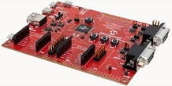 | [PIC32MK MCM Curiosity Pro Development Board](./pic32mk_mcm_curiosity_pro/readme.md) |
|  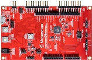  | [PIC32CM MC00 Curiosity Pro Development Board](./pic32cm_mc00_curiosity_pro/readme.md) |
|    | [PIC32CM MC00 Curiosity Nano Evaluation Kit](./pic32cm_mc00_cnano/readme.md) |
|  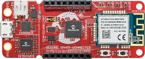  | [SAM D21 IoT Development Board](./sam_d21_iot/readme.md) |
|  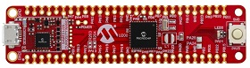  | [SAM E51 Curiosity Nano Evaluation Kit](./sam_e51_cnano/readme.md) |
|  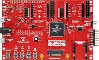  | [PIC32MZ DA Curiosity Development Kit](./pic32mz_da_curiosity/readme.md) |
|    | [SAM D21 Curiosity Nano Evaluation Kit](./sam_d21_cnano/readme.md) |
|  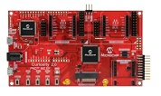  | [Curiosity PIC32MZ EF 2.0 Development Board](./pic32mz_ef_curiosity_v2/readme.md) |
|  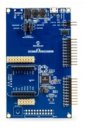  | [SAM L10 Xplained Pro Evaluation Kit](./sam_l10_xpro/readme.md) |
|  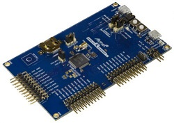  | [SAM L21 Xplained Pro Evaluation Kit](./sam_l21_xpro/readme.md) |
|    | [SAM C21 Xplained Pro evaluation kit](./sam_c21_xpro/readme.md) |
|  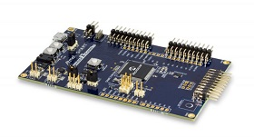  | [SAMC21N Xplained Pro Evaluation Kit](./sam_c21n_xpro/readme.md) |
|  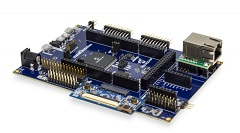  | [SAM E70 Xplained Ultra Evaluation Kit](./sam_e70_xult/readme.md) |
|  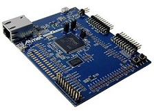  | [SAM E70 Xplained Evaluation Kit](./sam_e70_xpld/readme.md) |
|  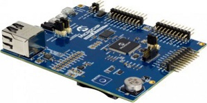  | [SAM E54 Xplained Pro Evaluation Kit](./sam_e54_xpro/readme.md) |
|  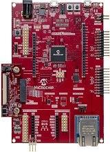  | [SAM E54 Curiosity Ultra Development Board](./sam_e54_cult/readme.md) |
|  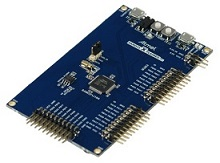  | [SAM D21 Xplained Pro Evaluation Kit](./sam_d21_xpro/readme.md) |
|  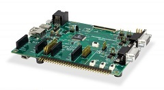  | [PIC32MK General Purpose (GP) Development Kit](./pic32mk_gp_db/readme.md) |
|  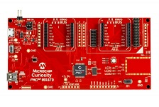  | [Curiosity PIC32MX470 Development Board](./pic32mx470_curiosity/readme.md) |
|  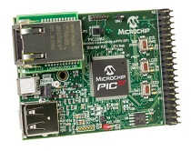  | [PIC32MZ Embedded Connectivity with FPU (EF) Starter Kit](./pic32mz_ef_sk/readme.md) |
|  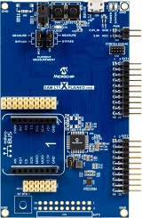  | [SAM L11 Xplained Pro Evaluation Kit](./sam_l11_xpro/readme.md) |
|  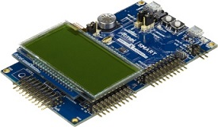  | [SAM L22 Xplained Pro Evaluation Kit](./sam_l22_xpro/readme.md) |
|    | [SAM D21 IoT v2 Development Board](./sam_d21_iot_v2/readme.md) |

### **Note:**
The applications in this repository are an alternative source of reference involving integration of multiple technologies, extending hardware capabilities and demonstrating specific MCU features.
Peripheral/Technology specific applications are available in technology repositories like [csp](https://github.com/Microchip-MPLAB-Harmony/csp), [core](https://github.com/Microchip-MPLAB-Harmony/core), [usb](https://github.com/Microchip-MPLAB-Harmony/usb), [net](https://github.com/Microchip-MPLAB-Harmony/net), [audio](https://github.com/Microchip-MPLAB-Harmony/audio), [gfx_apps](https://github.com/Microchip-MPLAB-Harmony/gfx_apps), etc
