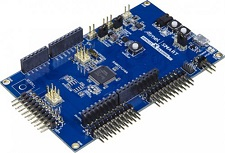

# SAM C21 Xplained Pro Evaluation Kit
<h4 align="left">  </h4>

This folder contains the MPLAB® Harmony 3 reference applications developed on [SAM C21 Xplained Pro evaluation kit](https://www.microchip.com/developmenttools/ProductDetails/atsamc21-xpro).   

|SI No| Demo Name | Download Link |
| --- | --- | -- |
| 1 | [Getting Started with Drivers using FreeRTOS](./samc21_getting_started_freertos/readme.md) | [Click Here](https://github.com/Microchip-MPLAB-Harmony/reference_apps/releases/latest/download/samc21_getting_started_freertos.zip) |
| 2 | [Low Power](./samc21_low_power/readme.md) | [Click Here](https://github.com/Microchip-MPLAB-Harmony/reference_apps/releases/latest/download/samc21_low_power.zip) |

### More Application Demos

For more application demos on **SAM C21 Xplained Pro Evaluation Kit** and other Development Boards/Kits having the same part number **(ATSAMC21J18A)** <a href="https://mplab-discover.microchip.com/v1/itemtype/com.microchip.ide.project?s0=ATSAMC21J18A" target="_blank"> CLICK HERE </a>
