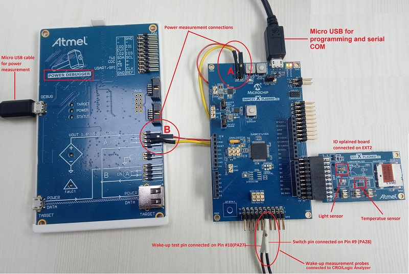
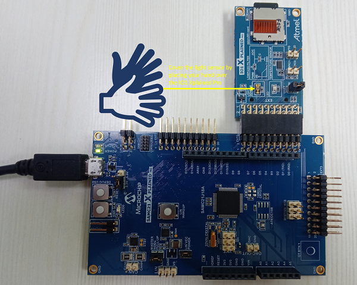
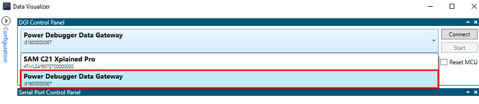
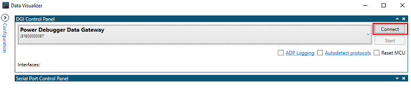
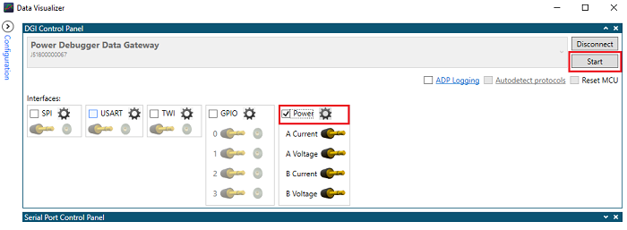
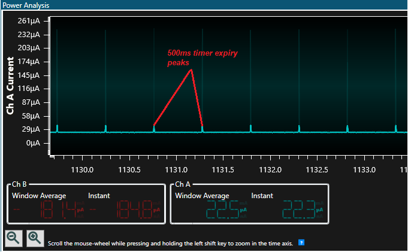

# Low Power Application on SAM C21 Xplained Pro Evaluation Kit
<h2 align="center"> <a href="https://github.com/Microchip-MPLAB-Harmony/reference_apps/releases/latest/download/samc21_low_power.zip" > Download </a> </h2>

-----
## Description

> The application demonstrates low power application on SAM C21 Xplained Pro evaluation kit. On power-up, the application is in sleep (standby) mode. The application wakes up
  from the sleep mode and enters active mode when you cover the light sensor (by placing a hand over it) on the
  I/O1 Xplained Pro extension kit. The application periodically prints room temperature on a serial terminal while
  the light sensor is covered. The application goes back to sleep (standby) mode when you uncover the light sensor.
  LED0 in the SAM C21 evaluation kit is toggled every time the temperature is displayed on the serial console.

## Modules/Technology Used:

- Peripheral Modules
	- I2C
	- RTC
	- USART
	- DMAC
	- ADC
	- PM
	- SUPC
	- EIC
	- EVSYS

## Hardware Used:

- [SAM C21 Xplained Pro Evaluation Kit](https://www.microchip.com/developmenttools/ProductDetails/atsamc21-xpro)
- [I/O1 Xplained Pro Extension Kit](https://www.microchip.com/Developmenttools/ProductDetails/ATIO1-XPRO)  
- [Power Debugger](https://www.microchip.com/Developmenttools/ProductDetails/ATPOWERDEBUGGER)

## Software/Tools Used:
 This project has been verified to work with the following versions of software tools:  

Refer [Project Manifest](./firmware/src/config/sam_c21_xpro/harmony-manifest-success.yml) present in harmony-manifest-success.yml under the project folder *firmware/src/config/sam_c21_xpro*  
- Refer the [Release Notes](../../../release_notes.md#development-tools) to know the {}MPLAB X IDE{} and {}MCC{} Plugin version. Alternatively, [Click Here](https://github.com/Microchip-MPLAB-Harmony/reference_apps/blob/master/release_notes.md#development-tools)   
- Any Serial Terminal application like Tera Term terminal application.

 Because Microchip regularly update tools, occasionally issue(s) could be discovered while using the newer versions of the tools. If the project doesn’t seem to work and version incompatibility is suspected, It is recommended to double-check and use the same versions that the project was tested with.  To download original version of MPLAB Harmony v3 packages, refer to document [How to Use the MPLAB Harmony v3 Project Manifest Feature](https://ww1.microchip.com/downloads/en/DeviceDoc/How-to-Use-the-MPLAB-Harmony-v3-Project-Manifest-Feature-DS90003305.pdf)

## Setup:
- Connect the I/O1 Xplained Pro extension kit to Extension Header 2 (EXT2) of the SAMC21 Xplained Pro evaluation kit
- Remove the current measurement jumper on the SAMC21 (highlighted in hardware setup with letter A) and connect to channel
  A of power debugger using burg connectors (highlighted in hardware setup with letter B) as shown in the Hardware Setup figure
- Probe Pin #9 (PA28 - Switch pin) and Pin #10 (PA27 - wake-up test pin) on Extension Header 3 (EXT3) as highlighted in the
  Hardware Setup figure to measure wake-up time
- Connect a USB cable to the DEBUG USB port for programming.
- Connect a USB cable to the power debugger DEBUG USB port for current measurement.

**Note** :
- Make sure common ground is connected with the board while using logic analyzer/CRO.
- SAMC21 supports both 3.3 V and 5 V. The SAMC21 Xplained Pro kit operates at 3.3 V since the VCC-SEL jumper on board is set to 3.3 V  

## Programming hex file:
The pre-built hex file can be programmed by following the below steps.  

### Steps to program the hex file
- Open MPLAB X IDE
- Close all existing projects in IDE, if any project is opened.
- Go to File -> Import -> Hex/ELF File
- In the "Import Image File" window, Step 1 - Create Prebuilt Project, Click the "Browse" button to select the prebuilt hex file.
- Select Device has "ATSAMC21J18A"
- Ensure the proper tool is selected under "Hardware Tool"
- Click on Next button
- In the "Import Image File" window, Step 2 - Select Project Name and Folder, select appropriate project name and folder
- Click on Finish button
- In MPLAB X IDE, click on "Make and Program Device" Button. The device gets programmed in sometime
- Follow the steps in "Running the Demo" section below

## Programming/Debugging Application Project:
- Open the project (low_power\firmware\sam_c21_xpro.X) in MPLAB X IDE.
- Ensure "SAMC21 Xplained Pro (EDBG)" is selected as hardware tool to program/debug the application.
- Build the code and program the device by clicking on the "make and program" button in MPLAB X IDE tool bar.
- Follow the steps in "Running the Demo" section below.  

## Running the Demo:
- Open Tera Term, connect to serial console. If there is any connection issue on tera terminal, unplug the USB cable
connected to Micro-B port, and reconnect it back.
- Change the baud rate to 115200
- Perform a reset by pressing the "RESET" switch
- Cover the light sensor on the I/O Xplained Pro board by placing your hand over it (or another element to put the light sensor in a dark environment) to print the temperature and message on the terminal. You should see the following messages (containing the temperature value in °F) on the terminal every 500 milliseconds for the duration the light sensor is covered  
  
- You should see the temperature values (in °F) getting printed on the terminal every 500 milliseconds for the duration the light sensor is covered
  
- Observe Current Consumption on Data Visualizer  
**Note**:The Data Visualizer is a program to process and visualize data. The Data Visualizer can receive data from various sources such as the Embedded Debugger Data Gateway Interface (EDBG DGI) and COM ports. It is possible to track an application in run-time using a terminal graph or oscilloscope. It analyzes the power consumption of an application through correlation of code execution and power consumption when used together with a supported probe or board.
	- Open Data Visualizer application from your PC and select Power Debugger Data Gateway on DGI Control Panel  
	
	- Click on the Connect button to have the Data Visualizer ready to receive information from the Power Debugger Data Gateway  
	
	- After the Data Visualizer is connected to the Power Debugger Data Gateway, select the Power interface and click on the Start button  
	
	- On the right-hand side of the Power Analysis window, click on the Control Panel tab and Disable Channel B  
	Below image shows the device in Standby mode, smaller peaks are the 500ms timer expiry peaks  
	  
	- Cover the light sensor on the IO Xplained Pro board (by placing your hand over it) to print the temperature on the terminal. The following image shows the power consumption values in Standby mode and CPU Active mode  
	  
	- Press Switch SW0 to switch from Standby mode to Idle mode. The following image shows the transition power consumption values from Standby to Idle mode. Idle mode consumes more power compared to Standby mode  
	
	- Place your hand over the light sensor. The device will wake up on the next ADC window monitor interrupt, read and print data on serial and then re-enter Standby mode. The following image shows the transition of the power consumption by switching from Idle mode to Standby mode  
	  
	**Note** that the above results highlight the power consumption is lower in Standby mode than in Idle mode.
- Wake-up Time Measurement Using Logic Analyzer/ Cathode-Ray Oscilloscope (CRO)  
To demonstrate the CPU wake up time, switch SW0 is configured to generate an interrupt. A General Purpose Input/Output (GPIO) is toggled in the Interrupt Service Routine (ISR) of the switch press event. The MCU comes out of Sleep mode when an interrupt occurs (in this case, the switch press interrupt). The time between the switch press and the GPIO toggle in the ISR is the wake up time.
	- Press the SW0 switch and capture the signals to measure the wake-up time in Standby and Idle mode. The following image shows the wake-up time from Standby mode  
	  
	- The following image shows the wake-up time from Idle mode  
	  
	By observing the outputs, you can conclude that the wake-up time is greater in Standby mode than in Idle mode

## Comments:
- This application is developed by modifying the generated **"eic.c"** file. If you need to reconfigure or regenerate this demo using the MCC, make sure you don't replace this file. This change is required to measure the instant wakeup time of the device.
- Reference Training Module: [Low Power Application on SAMC2x (Cortex M0+) MCUs Using MPLAB Harmony v3 Peripheral Libraries](https://microchipdeveloper.com/harmony3:low-power-application-on-samc21)
- This application demo builds and works out of box by following the instructions above in "Running the Demo" section. If you need to enhance/customize this application demo, you need to use the MPLAB Harmony v3 Software framework. Refer links below to setup and build your applications using MPLAB Harmony.
	- [How to Setup MPLAB Harmony v3 Software Development Framework](https://ww1.microchip.com/downloads/en/DeviceDoc/How_to_Setup_MPLAB_%20Harmony_v3_Software_Development_Framework_DS90003232C.pdf)
	- [How to Build an Application by Adding a New PLIB, Driver, or Middleware to an Existing MPLAB Harmony v3 Project](http://ww1.microchip.com/downloads/en/DeviceDoc/How_to_Build_Application_Adding_PLIB_%20Driver_or_Middleware%20_to_MPLAB_Harmony_v3Project_DS90003253A.pdf)  
	-  **MPLAB Harmony v3 is also configurable through MPLAB Code Configurator (MCC). Refer to the below links for specific instructions to use MPLAB Harmony v3 with MCC.**
		- [Create a new MPLAB Harmony v3 project using MCC](https://microchipdeveloper.com/harmony3:getting-started-training-module-using-mcc)
		- [Update and Configure an Existing MHC-based MPLAB Harmony v3 Project to MCC-based Project](https://microchipdeveloper.com/harmony3:update-and-configure-existing-mhc-proj-to-mcc-proj)
		- [Getting Started with MPLAB Harmony v3 Using MPLAB Code Configurator](https://www.youtube.com/watch?v=KdhltTWaDp0)
		- [MPLAB Code Configurator Content Manager for MPLAB Harmony v3 Projects](https://www.youtube.com/watch?v=PRewTzrI3iE)	

## Revision:
- v1.5.0 - Removed MHC support, regenerated and tested application.
- v1.4.0 - Added MCC support, Regenerated and tested application.
- v1.3.0 - Regenerated and tested application.
- v1.2.0 - Regenerated and tested application.
- v1.1.0 regenerated and tested the demo application
- v1.0.0 released demo application
