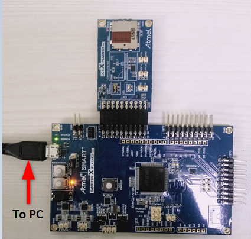
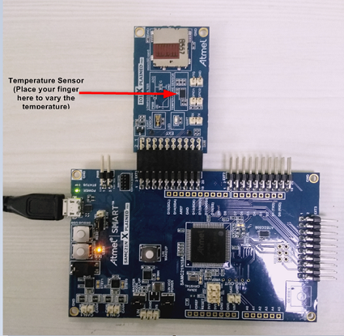
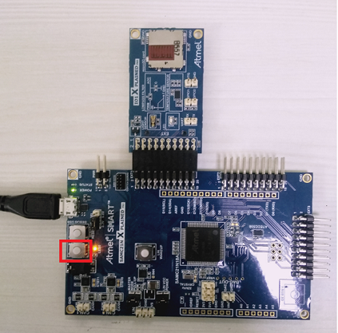
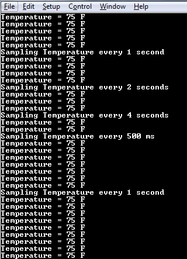

# Getting Started Application on SAMC21N Xplained Pro Evaluation Kit
<h2 align="center"> <a href="https://github.com/Microchip-MPLAB-Harmony/reference_apps/releases/latest/download/samc21n_getting_started.zip" > Download </a> </h2>

-----
## Description:

> This application reads the current room temperature from the temperature sensor on the I/O1 Xplained Pro Extension.
  The temperature read is displayed on a serial console periodically every 500 milliseconds. The periodicity of the
  temperature values displayed on the serial console is changed to 1 second, 2 seconds, 4 seconds and back to 500
  milliseconds every time you press the switch SW0 on the SAMC21N Xplained Pro Evaluation Kit. Also, an LED LED0
  is toggled every time temperature is displayed on the serial console.

## Modules/Technology Used:
- Peripheral Modules
	- RTC
	- PORTS
	- SERCOM(I2C)
	- SERCOM(USART)

## Hardware Used:

- [SAMC21N Xplained Pro Evaluation Kit](https://www.microchip.com/developmenttools/ProductDetails/atsamc21n-xpro)
- [I/O1 Xplained Pro Extension Kit](https://www.microchip.com/Developmenttools/ProductDetails/ATIO1-XPRO)

## Software/Tools Used:
 This project has been verified to work with the following versions of software tools:  

Refer [Project Manifest](./firmware/src/config/sam_c21n_xpro/harmony-manifest-success.yml) present in harmony-manifest-success.yml under the project folder *firmware/src/config/sam_c21n_xpro*  
- Refer the [Release Notes](../../../release_notes.md#development-tools) to know the **MPLAB X IDE** and **MCC** Plugin version. Alternatively, [Click Here](https://github.com/Microchip-MPLAB-Harmony/reference_apps/blob/master/release_notes.md#development-tools).  
- Any Serial Terminal application like Tera Term terminal application.

 Because Microchip regularly update tools, occasionally issue(s) could be discovered while using the newer versions of the tools. If the project doesn’t seem to work and version incompatibility is suspected, It is recommended to double-check and use the same versions that the project was tested with.  To download original version of MPLAB Harmony v3 packages, refer to document [How to Use the MPLAB Harmony v3 Project Manifest Feature](https://ww1.microchip.com/downloads/en/DeviceDoc/How-to-Use-the-MPLAB-Harmony-v3-Project-Manifest-Feature-DS90003305.pdf)

## Setup:
- Verify that the temperature sensor (I/O1 Xplained Pro Extension Kit) is connected to
  Extension Header 1 (EXT1) on the SAMC21N Xplained Pro Evaluation Kit
- The SAMC21N Xplained Pro Evaluation Kit allows using the Embedded Debugger (EDBG ) for
  debugging. Connect the Type-A male to micro-B USB cable to micro-B
  DEBUG USB port to power and debug the SAMC21N Xplained Pro Evaluation Kit.

  

## Programming hex file:
The pre-built hex file can be programmed by following the below steps

### Steps to program the hex file
- Open MPLAB X IDE
- Close all existing projects in IDE, if any project is opened.
- Go to File -> Import -> Hex/ELF File
- In the "Import Image File" window, Step 1 - Create Prebuilt Project, click the "Browse" button to select the prebuilt hex file.
- Select Device has "ATSAMC21N18A"
- Ensure the proper tool is selected under "Hardware Tool"
- Click on "Next" button
- In the "Import Image File" window, Step 2 - Select Project Name and Folder, select appropriate project name and folder
- Click on "Finish" button
- In MPLAB X IDE, click on "Make and Program Device" Button. The device gets programmed in sometime.
- Follow the steps in "Running the Demo" section below

## Programming/Debugging Application Project:
- Open the project (getting_started\firmware\sam_c21n_xpro.X) in MPLAB X IDE
- Ensure "SAM C21n Xplained Pro" is selected as hardware tool to program/debug the application
- Build the code and program the device by clicking on the "Make and Program Device" button in MPLAB X IDE tool bar
- Follow the steps in "Running the Demo" section below

## Running the Demo:
- Open the Tera Term terminal application on your PC (from the Windows® Start menu by pressing the Start button)
- Change the baud rate to 115200
- You should see the temperature values (in °F) being displayed on the terminal every 500 milliseconds, as shown below  

    
- Also, notice the LED0 blinking at 500 millisecond rate
- You may vary the temperature by placing your finger on the temperature sensor (for a few seconds)  
  
- Press the switch SW0 on SAMC21N Xplained Pro Evaluation Kit to change the default sampling rate to 1 second  

	  
    
- Every subsequent pressing of switch SW0 on SAMC21N Xplained Pro Evaluation Kit changes the default sampling
  rate to 2 seconds, 4 seconds and 500 ms and back to 1 second in cyclic order as shown below  
  
- While the temperature sampling rate changes on every switch SW0 press, notice the LED0 toggling at the same sampling rate

## Comments:
- Reference Training Module: [Getting Started with Harmony v3 Peripheral Libraries on SAMC2x MCUs](https://microchipdeveloper.com/harmony3:samc21-getting-started-training-module)
- This application demo builds and works out of box by following the instructions above in "Running the Demo" section. If you need to enhance/customize this application demo, you need to use the MPLAB Harmony v3 Software framework. Refer links below to setup and build your applications using MPLAB Harmony.
	- [How to Setup MPLAB Harmony v3 Software Development Framework](https://ww1.microchip.com/downloads/en/DeviceDoc/How_to_Setup_MPLAB_%20Harmony_v3_Software_Development_Framework_DS90003232C.pdf)
	- [How to Build an Application by Adding a New PLIB, Driver, or Middleware to an Existing MPLAB Harmony v3 Project](http://ww1.microchip.com/downloads/en/DeviceDoc/How_to_Build_Application_Adding_PLIB_%20Driver_or_Middleware%20_to_MPLAB_Harmony_v3Project_DS90003253A.pdf)  
	-  **MPLAB Harmony v3 is also configurable through MPLAB Code Configurator (MCC). Refer to the below links for specific instructions to use MPLAB Harmony v3 with MCC.**
		- [Create a new MPLAB Harmony v3 project using MCC](https://microchipdeveloper.com/harmony3:getting-started-training-module-using-mcc)
		- [Update and Configure an Existing MHC-based MPLAB Harmony v3 Project to MCC-based Project](https://microchipdeveloper.com/harmony3:update-and-configure-existing-mhc-proj-to-mcc-proj)
		- [Getting Started with MPLAB Harmony v3 Using MPLAB Code Configurator](https://www.youtube.com/watch?v=KdhltTWaDp0)
		- [MPLAB Code Configurator Content Manager for MPLAB Harmony v3 Projects](https://www.youtube.com/watch?v=PRewTzrI3iE)	

## Revision:
- v1.6.0 - Regenerated and tested the application
- v1.5.0 - Removed MHC support, regenerated and tested application.
- v1.4.0 - Added MCC support, regenerated and tested application.
- v1.3.0 - Regenerated and tested application.
- v1.2.0 - Regenerated and tested application.
- v1.1.0 - Regenerated and tested application.
- v1.0.0 - Released demo application
