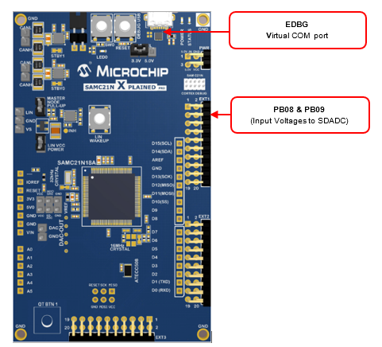
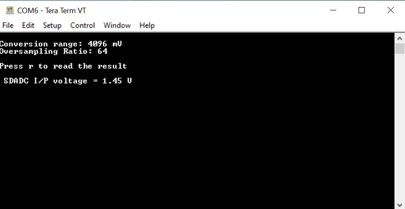

# SDADC Conversion Polling Mode Application on SAMC21N Xplained Pro Evaluation Kit
<h2 align="center"> <a href="https://github.com/MicrochipTech/MPLAB-Harmony-Reference-Apps/releases/latest/download/sdadc_conversion_polling.zip" > Download </a> </h2>

-----
## Description:

> This application demonstrates SDADC Conversion in Polling mode. The application uses internal bandgap reference as the input voltage source.

## Modules/Technology Used:
- Peripheral Modules
	- SDADC
	- SUPC
	- EVSYS
	- SERCOM(USART)

## Hardware Used:

- [SAMC21N Xplained Pro Evaluation Kit](https://www.microchip.com/developmenttools/ProductDetails/atsamc21n-xpro)

## Software/Tools Used:
 *This project has been verified to work with the following versions of software tools:*  

- [MPLAB Harmony v3 "csp" repo v3.8.3](https://github.com/Microchip-MPLAB-Harmony/csp/releases/tag/v3.8.3)  
- [MPLAB Harmony v3 "dev_packs" repo v3.8.0](https://github.com/Microchip-MPLAB-Harmony/dev_packs/releases/tag/v3.8.0)  
- [MPLAB Harmony v3 "mhc" repo v3.6.5](https://github.com/Microchip-MPLAB-Harmony/mhc/releases/tag/v3.6.5)  
- MPLAB Harmony 3 Launcher Plugin v3.6.2  
- [MPLAB X IDE v5.45](https://www.microchip.com/mplab/mplab-x-ide)  
- [MPLAB XC32 Compiler v2.41](https://www.microchip.com/mplab/compilers)  
- Any Serial Terminal application like Tera Term terminal application.  

 *Because Microchip regularly update tools, occasionally issue(s) could be discovered while using the newer versions of the tools. If the project doesn’t seem to work and version incompatibility is suspected, It is recommended to double-check and use the same versions that the project was tested with.* 

## Setup:
-  Ensure that both the positive (INP) and negative (INN) pins on SAMC21N Xplained Pro Evaluation Kit are connected to a voltage source
- The SAMC21N Xplained Pro Evaluation Kit allows using the Embedded Debugger (EDBG ) for debugging. Connect the Type-A male to micro-B USB cable to micro-B DEBUG USB port to power and debug the SAMC21N Xplained Pro Evaluation Kit.  

	

## Programming hex file:
The pre-built hex file can be programmed by following the below steps

### Steps to program the hex file
- Open MPLAB X IDE
- Close all existing projects in IDE, if any project is opened.
- Go to File -> Import -> Hex/ELF File
- In the "Import Image File" window, Step 1 - Create Prebuilt Project, click the "Browse" button to select the prebuilt hex file.
- Select Device has "ATSAMC21N18A"
- Ensure the proper tool is selected under "Hardware Tool"
- Click on "Next" button
- In the "Import Image File" window, Step 2 - Select Project Name and Folder, select appropriate project name and folder
- Click on "Finish" button
- In MPLAB X IDE, click on "Make and Program Device" Button. The device gets programmed in sometime.
- Follow the steps in "Running the Demo" section below

## Programming/Debugging Application Project:
- Open the project (sdadc_conversion_interrupt\firmware\sam_c21n_xpro.X) in MPLAB X IDE
- Ensure "EDBG" is selected as hardware tool to program/debug the application
- Build the code and program the device by clicking on the "make and program" button in MPLAB X IDE tool bar
- Follow the steps in "Running the Demo" section below

## Running the Demo:
- Open the Tera Term terminal application on your PC (from the Windows® Start menu by pressing the Start button)
- Change the baud rate to 115200
- SDADC is configured to use the internal VREF and the range is set to 4.096 V full scale and the default setting of OSR is 64  
- Pressing the ‘r’ key will read the result and display it, in a form scaled to mV  
    

## Comments:
- Reference Application Note: [Using Sigma-Delta Analog-to-Digital Converter on SAMC MCU with MPLAB Harmony v3](https://www.microchip.com/wwwappnotes/appnotes.aspx?appnote=en1003095)
- Reference Training Module: [Getting Started with Harmony v3 Peripheral Libraries on SAMC2x MCUs](https://microchipdeveloper.com/harmony3:samc21-getting-started-training-module)
- This application demo builds and works out of box by following the instructions above in "Running the Demo" section. If you need to enhance/customize this application demo, you need to use the MPLAB Harmony v3 Software framework. Refer links below to setup and build your applications using MPLAB Harmony.
	- [How to Setup MPLAB Harmony v3 Software Development Framework](https://www.microchip.com/mymicrochip/filehandler.aspx?ddocname=en1000821)
	- [How to Build an Application by Adding a New PLIB, Driver, or Middleware to an Existing MPLAB Harmony v3 Project](http://ww1.microchip.com/downloads/en/DeviceDoc/How_to_Build_Application_Adding_PLIB_%20Driver_or_Middleware%20_to_MPLAB_Harmony_v3Project_DS90003253A.pdf)  

## Revision:
- v1.2.0 - Regenerated and tested application.
- v1.1.0 - Regenerated and tested application.
- v1.0.0 - Released demo application
