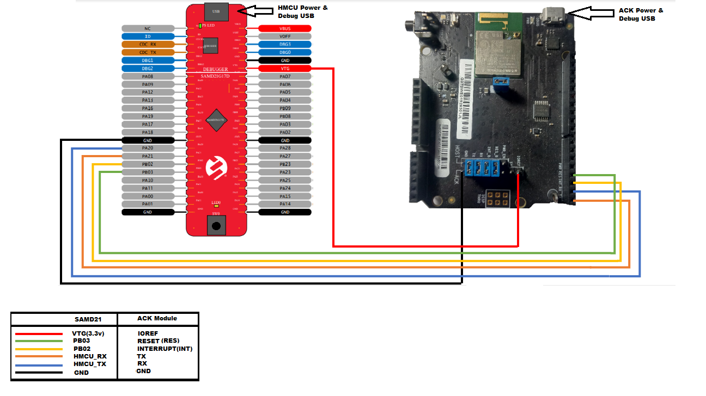

# Amazon Alexa Connect Kit (ACK) Hello World Application on SAM D21 Curiosity Nano

-----

## Description:

> The application demonstrates an integration of Amazon Alexa connect kit (ACK) SDK with host microcontroller SAM D21 and controlling ON/OFF development kit(LED0) on SAM D21 Curiosity Nano Evaluation Kit.  

This following bullet points provides links to the detailed topics:  
- [Modules/Technology Used](#Modules-Technology-Used)  
- [Hardware Used](#Hardware-Used)  
- [Software/Tools Used](#software-Tools-Used)  
- [Hardware Setup](#Hardware-setup)  
- [Setting up the build platform](#setting-up-the-build-platform)  
- [Project file structure](#project-structure)  
- [Steps to program the hex file](#steps-to-program-the-hex-file)  
- [Programming/Debugging HelloWorld Application Project](#programming-HelloWorld-application-project)  
- [Register your device](#register-your-device)  
- [Running the demo](#running-the-demo)  
- [Comments](#comments)

## 
## Modules/Technology Used:
- Peripheral Modules      
	- SERCOM
	- Systick
	- Port
	- NVMCTRL

## 
## Hardware Used:

- [SAM D21 Curiosity Nano Evaluation Kit](https://www.microchip.com/Developmenttools/ProductDetails/DM320119)   
- [USI MT7697H Development Kit for Alexa Connect Kit - ACK Module](https://www.amazon.com/dp/B07WJGSCH2)
- Connection wires

## 
## Software/Tools Used:
 *This project has been verified to work with the following versions of software tools:*  

 - [MPLAB Harmony v3 "csp" repo v3.7.1](https://github.com/Microchip-MPLAB-Harmony/csp/releases/tag/v3.7.1)        
 - [MPLAB Harmony v3 "dev_packs" repo v3.7.0](https://github.com/Microchip-MPLAB-Harmony/dev_packs/releases/tag/v3.7.0)  
 - [MPLAB Harmony v3 "mhc" repo v3.4.0](https://github.com/Microchip-MPLAB-Harmony/mhc/releases/tag/v3.4.0)
 - MPLAB Harmony Configurator Plugin v3.5.0
 - [MPLAB X IDE v5.40](https://www.microchip.com/mplab/mplab-x-ide)
 - [MPLAB XC32 Compiler v2.41](https://www.microchip.com/mplab/compilers)

 *Because Microchip regularly update tools, occasionally issue(s) could be discovered while using the newer versions of the tools. If the project doesn't seem to work and version incompatibility is suspected, It is recommended to double-check and use the same versions that the project was tested with.* 

## 
## Hardware Setup:
### Hardware connections with ACK	Module
- Connect Pin "PB02(ACK HOST INTERRUPT Pin)" of *SAM D21 Curiosity Nano Evaluation Kit* to "INT"(INST) pin of *ACK Module*
- Connect Pin "PB03(ACK MODULE RESET Pin)" of *SAM D21 Curiosity Nano Evaluation Kit* to "RESET"(RES) pin of *ACK Module*  
- Connect Pin "PA20(Host MCU TX)" of *SAM D21 Curiosity Nano Evaluation Kit* to "ACK RX" pin of *ACK Module*  
- Connect Pin "PA21(Host MCU RX)" of *SAM D21 Curiosity Nano Evaluation Kit* to "ACK TX" pin of *ACK Module*
- Connect Pin "VTG(Voltage Target)" of *SAM D21 Curiosity Nano Evaluation Kit* to "IOREF" pin of *ACK Module*
- Connect common ground between *SAM D21 Curiosity Nano Evaluation Kit* and *ACK Module*
- Power the *SAM D21 Curiosity Nano Evaluation Kit* Evaluation Kit from a Host PC through a Type-A male to Micro-B USB cable connected to Micro-B port (J105)
- Power the *ACK Module* from a Host PC through a Type-A male to Micro-B USB cable connected to Micro-B port (DEBUG)  
	

## 
## Setting up the build platform
- Download and extract [ACK Device SDK 3.1](https://developer.amazon.com/alexa/console/ack/resources) from Amazon developer website.
- Copy and paste extracted  SAM D21 ACK port folder "samd21_amazon_ack" into ACK device SDK's user platform folder  
  `<Your ACK SDK Downloaded folder>\ACK_Device_SDK_3.1.202002192328\user\platform`

## 
## Project file structure
- ACK SDK file/directory structure, refer "Readme.txt" in  
`<Your ACK SDK Downloaded folder>\ACK_Device_SDK_3.1.202002192328\`
- SAM D21 ACK port file/directory is as follows
  - user/platform/samd21_amazon_ack/
    - **applications**                : Contains all the ACK host sample applications built on MPLABX Tools and xc32 compiler
    - **bootloader**                  : Contains bootloader for over-the-air(OTA) firmware upgrade feature
    - **hmcu_port**                   : Contains shared host specific platform and OTA files
    - **ota**                         : Contains OTA source, config and header files
    - **ack_samd21_cutom_loader.c**   : Contains bootloader specific code
    - **ack_samd21_platform.c**       : Contains SAMD21 platform specific code    

## Programming hex file:
The pre-built hex file can be programmed by following the below steps.  
## 
### Steps to program the hex file
- Open MPLAB X IDE
- Close all existing projects in IDE, if any project is opened.
- Go to File -> Import -> Hex/ELF File
- In the "Import Image File" window, Step 1 - Create Prebuilt Project, Click the "Browse" button to select the prebuilt hex file.
- Select Device has "ATSAMD21G17D"
- Ensure the proper tool is selected under "Hardware Tool"
- Click on Next button
- In the "Import Image File" window, Step 2 - Select Project Name and Folder, select appropriate project name and folder
- Click on Finish button
- In MPLAB X IDE, click on "Make and Program Device" Button. The device gets programmed in sometime
- Follow the steps in "Running the Demo" section below

## 
## Programming/Debugging Hello World Application Project:

  *Before proceeding with this step complete "Setting up the build platform" step.* 
- Open the project (`samd21_amazon_ack\applications\Helloworld\firmware\sam_d21_cnano.X`) in MPLAB X IDE
- Ensure "PKOB nano" is selected as hardware tool to program/debug the application
- Build the code and program the device by clicking on the "make and program" button in MPLAB X IDE tool bar

## 
## Register your device
- [Register ACK Module](https://developer.amazon.com/en-US/docs/alexa/ack/dev-kit-device-registration.html) with Amazon by following the procedure
- If you successfully registered your device. you should see the status LED on your ACK development board change from white to green.

## 
## Running the Demo:
- Open Amazon Alexa App from smart phone.
- Reset/power cycle the *SAM D21 Curiosity Nano Evaluation Kit* device and wait till status LED on *ACK Module* to green.
- When you say "Alexa, turn on development device" or tap the power button in the Alexa app GUI. A LED0 on the *SAM D21 Curiosity Nano Evaluation Kit* board turns ON.
- When you say "Alexa, turn off development device" or tap the power button in the Alexa app GUI. A LED0 on the *SAM D21 Curiosity Nano Evaluation Kit* turns Off.

 **Note**
	- To open Alexa app GUI for development device, In Amazon Alexa app navigate to Devices > All devices and select Development device. it will provide the options to control the LED

## Comments:
- **HelloWorld application is built as standalone project, if you wish to use OTA feature, follow instructions in bootloader application's readme file**
- Reference Training Module: [Getting Started with Harmony v3 Peripheral Libraries on SAM D21 MCUs](https://microchipdeveloper.com/harmony3:samd21-getting-started-training-module)
- This application demo builds and works out of box by following the instructions above in "Running the Demo" section. If you need to enhance/customize this application demo, you need to use the MPLAB Harmony v3 Software framework. Refer links below to setup and build your applications using MPLAB Harmony.
- This solution is currently available only in US, Canada, and Mexico. Other regions contact Amazon.
	- [How to Setup MPLAB Harmony v3 Software Development Framework](https://www.microchip.com/mymicrochip/filehandler.aspx?ddocname=en1000821)
	- [How to Build an Application by Adding a New PLIB, Driver, or Middleware to an Existing MPLAB Harmony v3 Project](http://ww1.microchip.com/downloads/en/DeviceDoc/How_to_Build_Application_Adding_PLIB_%20Driver_or_Middleware%20_to_MPLAB_Harmony_v3Project_DS90003253A.pdf)  

### Revision:
- v1.0 released demo application
