# BLE based Weather Station and Motion Sensor Application on SAM D21 Curiosity Nano and Nano Base for Click boards
<h2 align="center"> <a href="https://github.com/Microchip-MPLAB-Harmony/reference_apps/releases/latest/download/ble_weather_station.zip" > Download </a> </h2>


-----

## Description:

> The application demonstrates a solution based on Microchip products for environmental or weather industry products. The application demonstrates posting of weather and motion sensor data collected from the various sensors to android mobile application via BLE (Bluetooth Low Energy). The PTH (Pressure, Temperature and Humidity) collected from the Mikro elektronika weather click board and motion sensor data collected from the Mikro elektronika 10DOF Click are posted to the android application via BM71 Bluetooth module.   

> The host microcntroller (SAM D21) is interfaced to the weather click and  10DOF click over the I2C interface and BM71 XPRO over UART.

## Modules/Technology Used:
- Peripheral Modules      
	- Timer
	- SERCOM
- Driver Modules
	- BM71 Driver
- STDIO Library

## Hardware Used:

- [SAM D21 Curiosity Nano Evaluation Kit](https://www.microchip.com/Developmenttools/ProductDetails/DM320119)
- [Curiosity Nano Base for click boards](https://www.microchip.com/Developmenttools/ProductDetails/AC164162)
- [WEATHER CLICK](https://www.mikroe.com/weather-click)
- [10DOF Click](https://www.mikroe.com/10dof-click)
- [BM71-XPRO](https://www.microchip.com/Developmenttools/ProductDetails/DM164146)

## Software/Tools Used:
<span style="color:blue"> This project has been verified to work with the following versions of software tools:</span>  

Refer [Project Manifest](./firmware/src/config/samd21_cnano/harmony-manifest-success.yml) present in harmony-manifest-success.yml under the project folder *firmware/src/config/samd21_cnano*  
- Refer the [Release Notes](../../../release_notes.md#development-tools) to know the **MPLAB X IDE** and **MCC** Plugin version. Alternatively, [Click Here](https://github.com/Microchip-MPLAB-Harmony/reference_apps/blob/master/release_notes.md#development-tools)  
- [Microchip Bluetooth Data Android App](https://play.google.com/store/apps/details?id=com.microchip.bluetooth.data&hl=en_IN&gl=US) in your android mobile

<span style="color:blue"> Because Microchip regularly update tools, occasionally issue(s) could be discovered while using the newer versions of the tools. If the project doesn’t seem to work and version incompatibility is suspected, It is recommended to double-check and use the same versions that the project was tested with. </span> To download original version of MPLAB Harmony v3 packages, refer to document [How to Use the MPLAB Harmony v3 Project Manifest Feature](https://ww1.microchip.com/downloads/en/DeviceDoc/How-to-Use-the-MPLAB-Harmony-v3-Project-Manifest-Feature-DS90003305.pdf)


## Adding private characteristics to BM71:
#### Hardware Setup
- In BM71-XPRO, Change jumper J2 to select USB
- In BM71-XPRO, Configure DIP switch SW2 with below configurations
 - All DIP switch ON
- Power the BM71-XPRO from a Host PC through a Type-A male to Micro-B USB cable connected to Micro-B port (J1)
- Perform reset by pressing switch SW1 on BM71-XPRO and check blue LD1 is ON  
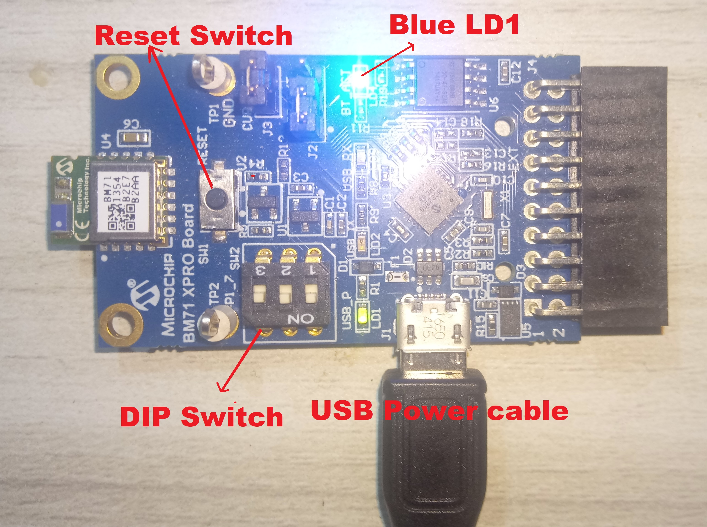

#### Programming private characteristics
- Download the manual configuration tool from [BM70/71 Firmware & Software Tools v1.11](https://ww1.microchip.com/downloads/en/DeviceDoc/Firmware%20&%20Software%20Tools%20v1.11.zip)
- Extract and locate configuration tool from below location
 	- Your_downloaded_folder ```\Firmware & Software Tools v1.11\ConfigurationTool\IS187x_102_BLEDK3v1.11_UI1.00```
- Double click on ```IS187x_102_BLEDK3v1.11_UI1.00.exe```
- Click on "Load" button and select "Load Text File"  
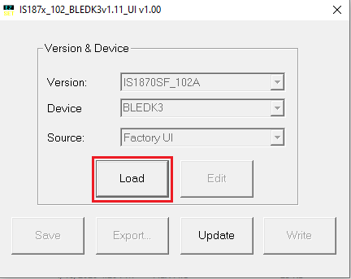 
- Select “**bm71_environmental_private_service.txt**” from **bm71_configuration** folder present in **firmware** folder  
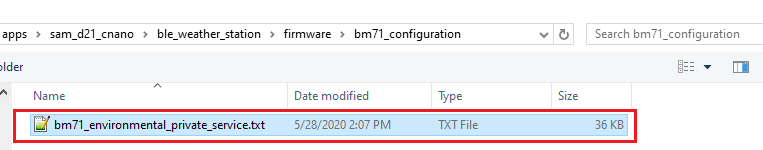  
- Click on "EDIT" option  


- Select “0x01: BM71” in BLEDK and click ok

  

- Click on "Finish"  
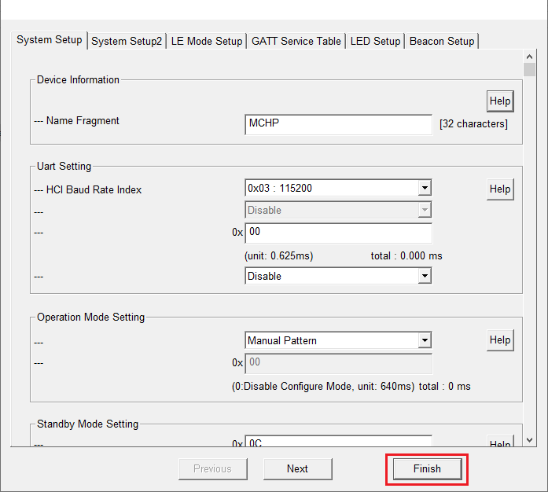

- Click on “Write”  
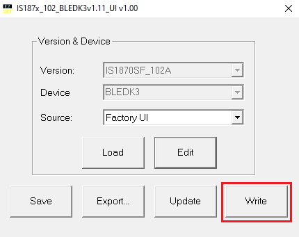

- Select respective COM Port and set baud rate to 115200 then click on Write  


- Click on Yes to successfully update the private characteristics on to BM71 module.  


- After successful update, click ok and remove the power from BM71-XPRO and change jumper J2 to select EXT  
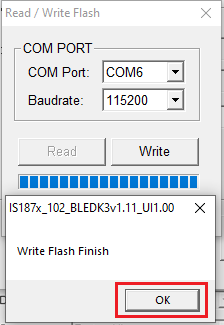

- Turn OFF DIP 1 switch

## Setup:
- Mount SAM D21 Curiosity Nano Evaluation Kit on "CNANO56_HOST_CONN"(U3) connector of Curiosity Nano Base board
- Mount Weather click board on mikro bus click 1 connector of Curiosity Nano Base board
- Mount the 10DOF Click on the mikro bus 2 connector of Curiosity Nano Base board
- Connect the BM71-XPRO on to EXT 1 connector of Curiosity Nano Base board
- Power the SAM D21 Curiosity Nano Evaluation Kit from a Host PC through a Type-A male to Micro-B USB cable connected to Micro-B port (J105)  
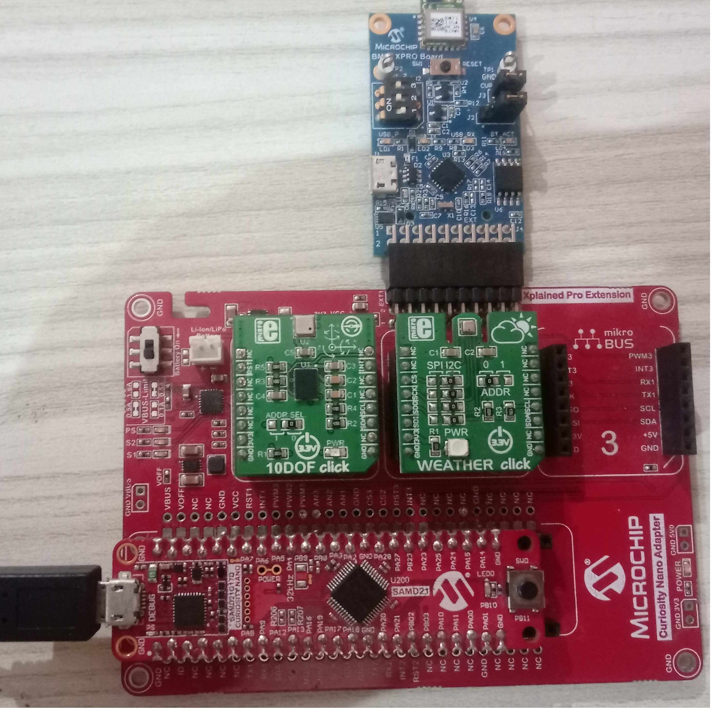

## Programming hex file:
The pre-built hex file can be programmed by following the below steps.  

### Steps to program the hex file
<span style="color:blue"> *Before proceeding with this step complete "Adding private characteristics to BM71" step.* </span>
- Open MPLAB X IDE
- Close all existing projects in IDE, if any project is opened.
- Go to File -> Import -> Hex/ELF File
- In the "Import Image File" window, Step 1 - Create Prebuilt Project, Click the "Browse" button to select the prebuilt hex file.
- Select Device has "ATSAMD21G17D"
- Ensure the proper tool is selected under "Hardware Tool"
- Click on Next button
- In the "Import Image File" window, Step 2 - Select Project Name and Folder, select appropriate project name and folder
- Click on Finish button
- In MPLAB X IDE, click on "Make and Program Device" Button. The device gets programmed in sometime
- Follow the steps in "Running the Demo" section below

## Programming/Debugging Application Project:

 <span style="color:blue"> *Before proceeding with this step complete "Adding private characteristics to BM71" step.* </span>
- Open the project (ble_weather_station\firmware\sam_d21_cnano.X) in MPLAB X IDE
- Ensure "SAM D21 Curiosity Nano" is selected as hardware tool to program/debug the application
- Build the code and program the device by clicking on the "make and program" button in MPLAB X IDE tool bar
- Follow the steps in "Running the Demo" section below

## Running the Demo:
<span style="color:blue"> *Before proceeding install Microchip Bluetooth Data android app in an Android Smartphone.* </span>
- Enable Bluetooth and location from Smatphone settings
- Perform reset by unplugging and re-plugging the power cable of SAM D21 Curiosity Nano
- After power up, open "**Microchip Bluetooth Data (MBD)**" android app from your smartphone and tap on "BLE Sensor Node" icon on the dashboard. If prompted, allow the application to turn on Bluetooth.  
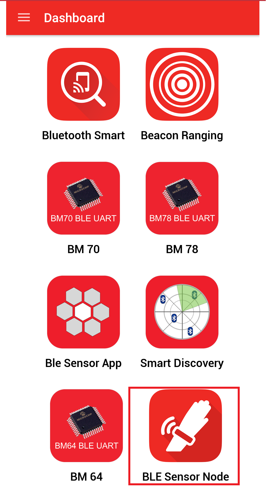

-  Scan for Bluetooth devices by tapping START SCAN option. The BM71
device should appear as MCHP in the list of Bluetooth devices.  
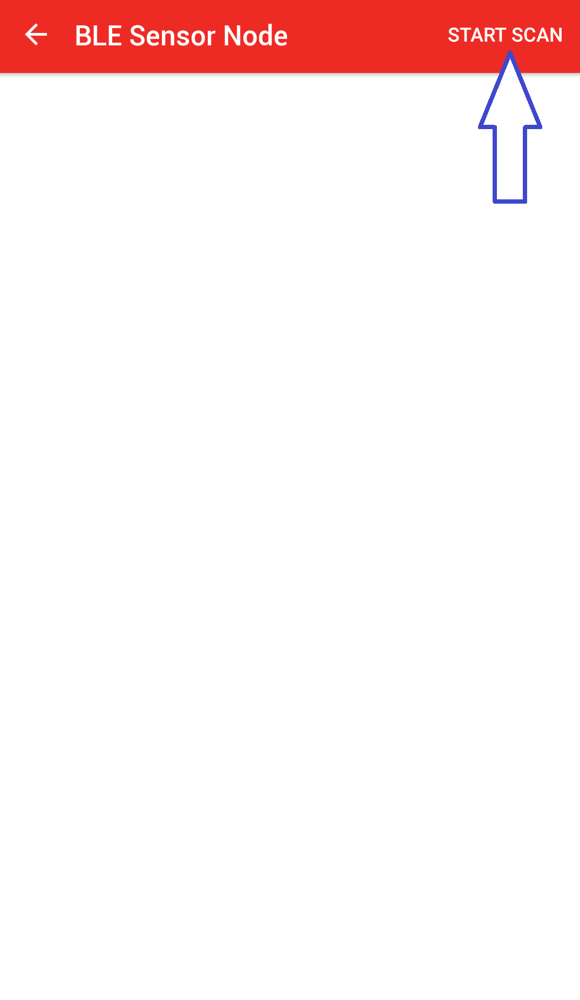

- Stop the scan and connect using the **MCHP BLE device**.  This will establish a connection between the MBD BLE application and the BM71 BLE device.  
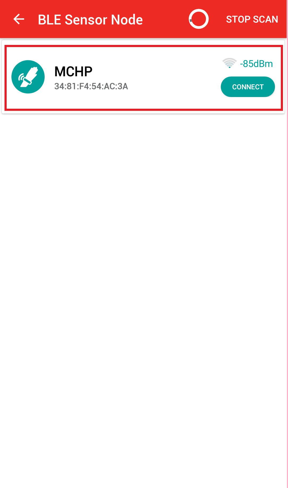 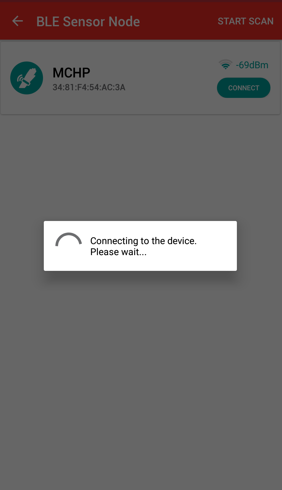

- Once connected, the application shows the proximity screen and displays the Status of the Bluetooth link and using RSSI, the approximate range between the Android device and the SAM D21 Curiosity Nano Evaluation Kit  
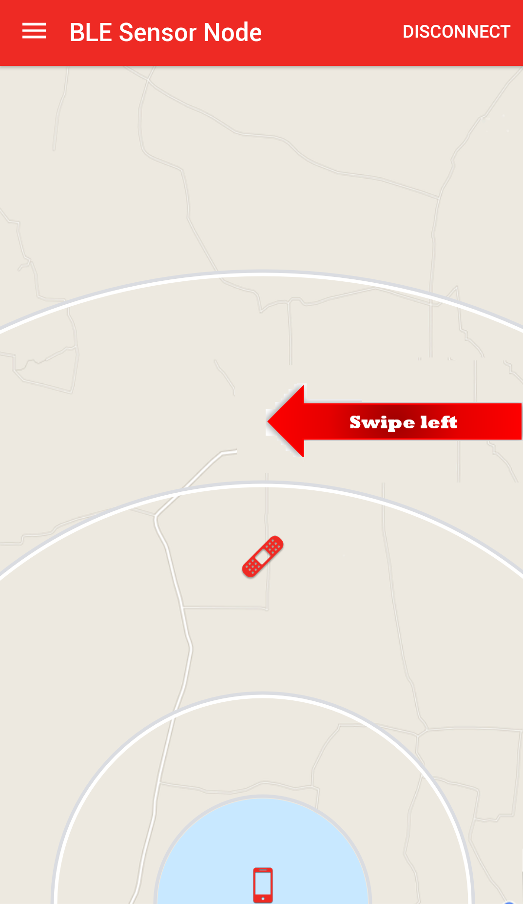

-  Navigate to the Environment Sensor screen by swiping left on the proximity screen as shown in above figure  
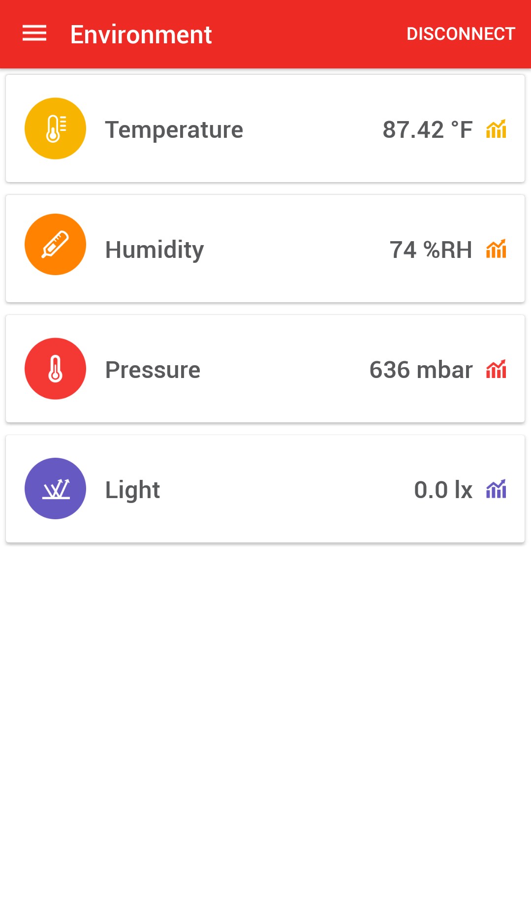

- Tap on the Graph button next to the Temperature, Humidity and Pressure to see the PTH values plotted on graphs  
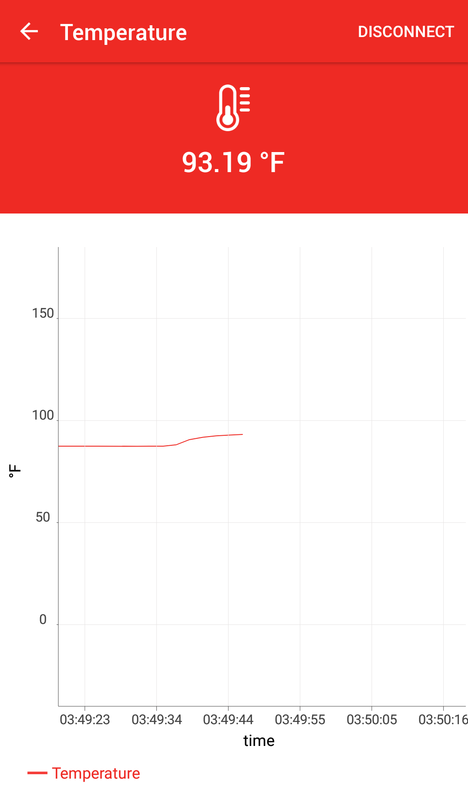  
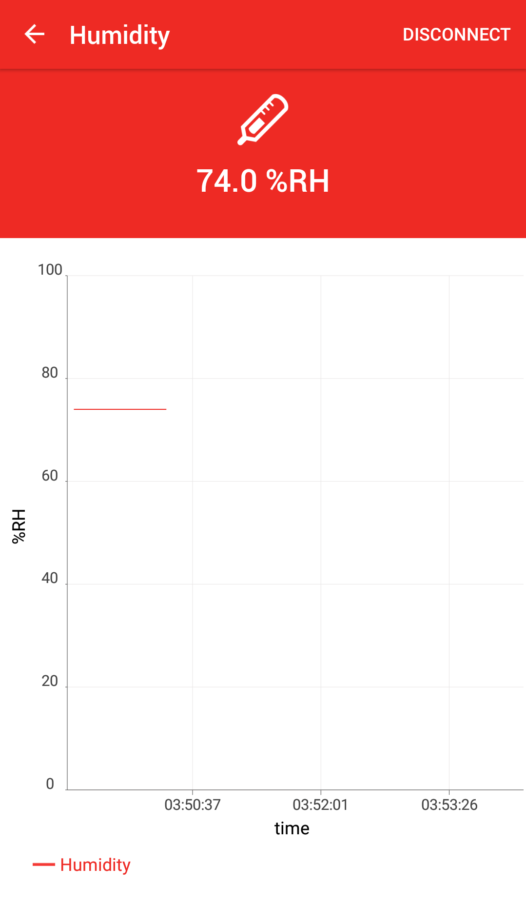  
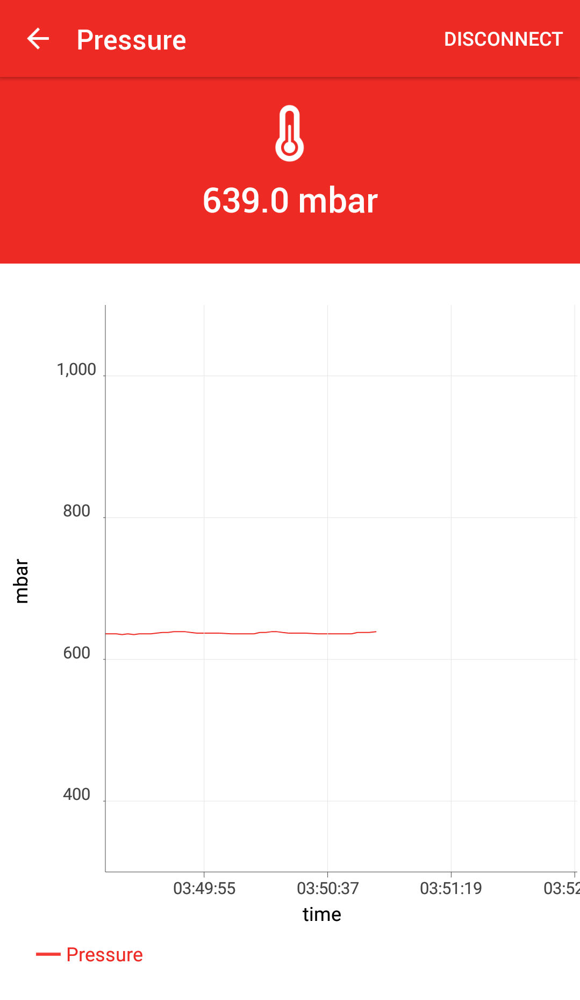

- Navigate to the Accelerometer Sensor screen by swiping twice on to left from Environment screen  
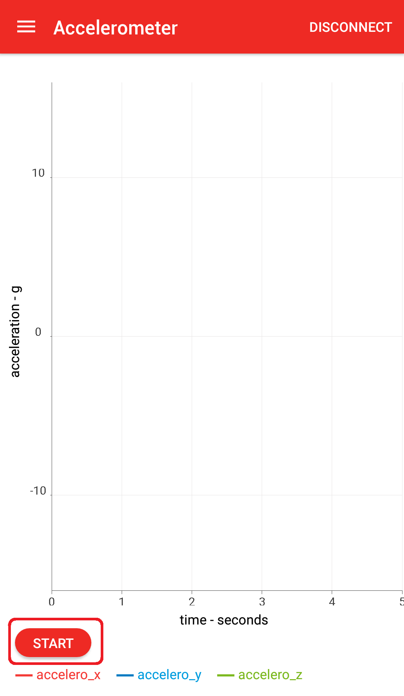

- Click on start button to see the Accelerometer values plotted on graph  
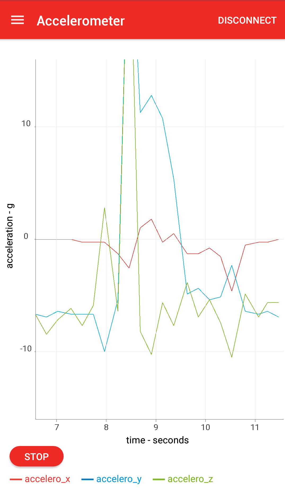

- Navigate to the Gyroscope Sensor screen by swiping left on the Accelerometer screen  
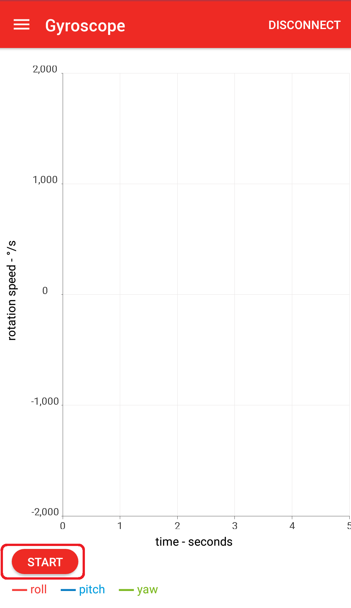

- Click on start button to see the Gyroscope values plotted on graph  
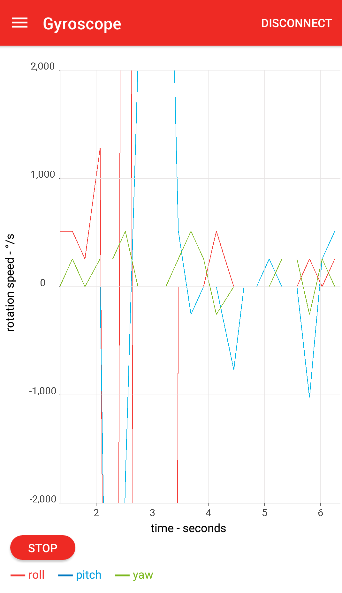

- Navigate to the 3D Plot screen by swiping left on the Gyroscope screen  
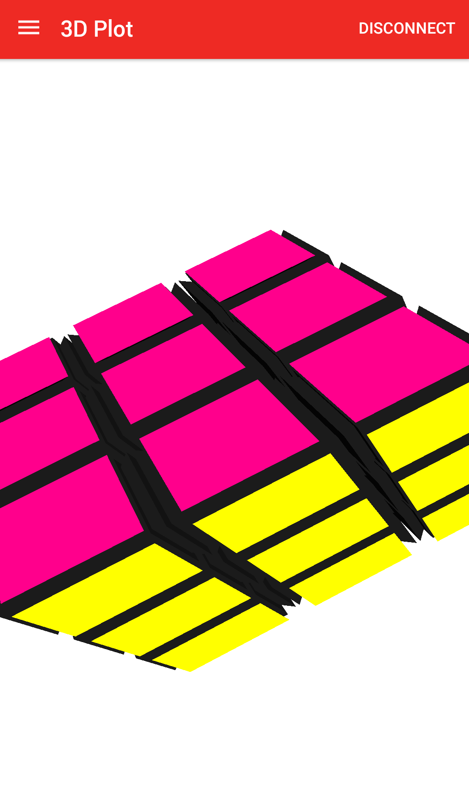

- Keep finger on weather click board to see PTH values changing and move the 10DOF click board to see accelerometer and gyroscope values changing.

## Comments:
-  Other features on the application like the Step Count and Light are not supported by this demo. Navigating to these screens may lead to an undefined behavior.
- Code related for custom private services are added manually, harmony v3 framework doesn't generate code related to it.
- Reference Training Module: [Getting Started with Harmony v3 Peripheral Libraries on SAM D21 MCUs](https://microchipdeveloper.com/harmony3:samd21-getting-started-training-module)
- This application demo builds and works out of box by following the instructions above in "Running the Demo" section. If you need to enhance/customize this application demo, you need to use the MPLAB Harmony v3 Software framework. Refer links below to setup and build your applications using MPLAB Harmony.
	- [How to Setup MPLAB Harmony v3 Software Development Framework](https://ww1.microchip.com/downloads/en/DeviceDoc/How_to_Setup_MPLAB_%20Harmony_v3_Software_Development_Framework_DS90003232C.pdf)
	- [How to Build an Application by Adding a New PLIB, Driver, or Middleware to an Existing MPLAB Harmony v3 Project](http://ww1.microchip.com/downloads/en/DeviceDoc/How_to_Build_Application_Adding_PLIB_%20Driver_or_Middleware%20_to_MPLAB_Harmony_v3Project_DS90003253A.pdf)  
	- <span style="color:blue"> **MPLAB Harmony v3 is also configurable through MPLAB Code Configurator (MCC). Refer to the below links for specific instructions to use MPLAB Harmony v3 with MCC.**</span>
		- [Create a new MPLAB Harmony v3 project using MCC](https://microchipdeveloper.com/harmony3:getting-started-training-module-using-mcc)
		- [Update and Configure an Existing MHC-based MPLAB Harmony v3 Project to MCC-based Project](https://microchipdeveloper.com/harmony3:update-and-configure-existing-mhc-proj-to-mcc-proj)
		- [Getting Started with MPLAB Harmony v3 Using MPLAB Code Configurator](https://www.youtube.com/watch?v=KdhltTWaDp0)
		- [MPLAB Code Configurator Content Manager for MPLAB Harmony v3 Projects](https://www.youtube.com/watch?v=PRewTzrI3iE)	

### Revision:

- v1.5.0 - Removed MHC support, regenerated and tested application.
- v1.4.0 - Updated the demo application with click routines and added mcc support.
- v1.3.0 - Regenerated and tested application.
- v1.2.0 regenerated and tested the demo application
- v1.1.0 regenerated and tested the demo application
- v1.0.0 released demo application
