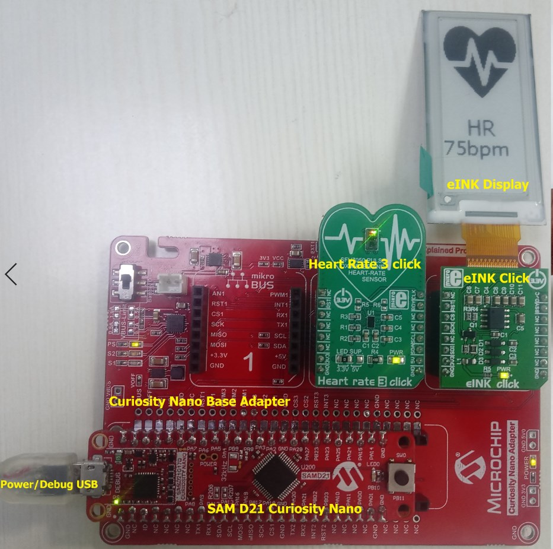
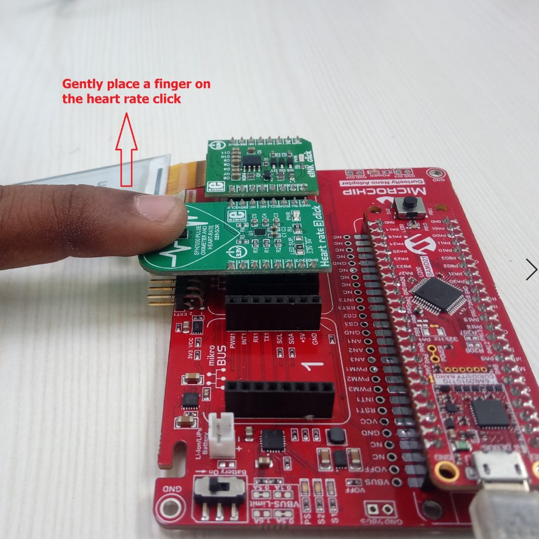

# Fitness Tracker Application on SAM D21 Curiosity Nano and Nano Base for Click boards
-----

## Description:

> The application demonstrates a solution based on Microchip products for health care industry
  and wearable products. The application displays heart rate readings (in beats per minute - bpm) 
  on a very low power consuming display. The Mikroelektronika Heart Rate 3 click board is used 
  to read the heart pulse. Mikroelektronika eINK click bundle is used for displaying heart rate. 
  The eINK click bundle contains the eINK click adapter board and the eINK display. 
    
> The Heart Rate 3 click contains two integrated LEDs, a photosensitive element and advanced low 
    noise analog front end to provide clean and accurate heart rate readings. It is enough to place 
    an index finger on a top of the sensor to get the heart rate via I2C interface. The eINK display 
    is a very low power consumption and the ability to retain the information, even after disconnecting 
    from the power source. The host MCU SAM D21 is interfaced with the Heart Rate 3 click over the I2C 
    interface and eINK click over SPI Interface. 

## Modules/Technology Used:

- Peripheral Modules      
	- Timer
	- EIC
- Driver Modules	
	- SPI Driver
	- I2C Driver
- STDIO Library

## Hardware Used:

- [SAM D21 Curiosity Nano Evaluation Kit](https://www.microchip.com/Developmenttools/ProductDetails/DM320119)   
- [Curiosity Nano Base for click boards](https://www.microchip.com/Developmenttools/ProductDetails/AC164162)
- [Heart Rate 3 click](https://www.mikroe.com/heart-rate-3-click)
- [EINK CLICK BUNDLE](https://www.mikroe.com/eink-click)

## Software/Tools Used:
 *This project has been verified to work with the following versions of software tools:*  

 - [MPLAB Harmony v3 "csp" repo v3.5.2](https://github.com/Microchip-MPLAB-Harmony/csp/releases/tag/v3.5.2)
 - [MPLAB Harmony v3 "core" repo v3.5.2](https://github.com/Microchip-MPLAB-Harmony/core/releases/tag/v3.5.2)          
 - [MPLAB Harmony v3 "dev_packs" repo v3.5.0](https://github.com/Microchip-MPLAB-Harmony/dev_packs/releases/tag/v3.5.0)  
 - [MPLAB Harmony v3 "mhc" repo v3.3.3](https://github.com/Microchip-MPLAB-Harmony/mhc/releases/tag/v3.3.3)    
 - MPLAB Harmony Configurator Plugin v3.4.0
 - [MPLAB X IDE v5.30](https://www.microchip.com/mplab/mplab-x-ide)
 - [MPLAB XC32 Compiler v2.30](https://www.microchip.com/mplab/compilers)
 - [MPLAB X IPE v5.30](https://www.microchip.com/mplab/mplab-integrated-programming-environment)  

  *Because Microchip regularly update tools, occasionally issue(s) could be discovered while using the newer versions of the tools. If the project doesn’t seem to work and version incompatibility is suspected, It is recommended to double-check and use the same versions that the project was tested with.*  

## Setup:
- Mount SAM D21 Curiosity Nano Evaluation Kit on "CNANO56_HOST_CONN"(U3) connector of Curiosity Nano Base board
- Mount Heart Rate 3 click board on mikro bus click 2 connector of Curiosity Nano Base board
- Mount the eINK click bundle (eINK click + eINK dispaly) on the mikro bus 3 connector of Curiosity Nano Base board
- Power the SAM D21 Curiosity Nano Evaluation Kit from a Host PC through a Type-A male to Micro-B USB cable connected to Micro-B port (J105)  

## Programming binary/hex file:
If you are not interested in installing development tools. The pre-built binary/hex file can be programmed to the target

### Steps to program the hex file using MPLAB X IPE
- Open MPLAB X IPE
- Select Device has "ATSAMD21G17D"
- Power the SAM D21 Curiosity Nano Evaluation Kit from a Host PC through a Type-A male to Micro-B USB cable connected to Micro-B port (J105)
- Once Power cable is connected, "PKOB nano" hardware tool is identified as a programmer
- Browse to hex file (fitness_tracker_hex_file.hex)
- Click on program button. The device gets programmed in sometime
- Follow the steps in "Running the Demo" section below

## Programming/Debugging Application Project:
- Open the project (fitness_tracker\firmware\sam_d21_cnano.X) in MPLAB X IDE
- Ensure "PKOB nano" is selected as hardware tool to program/debug the application
- Build the code and program the device by clicking on the "make and program" button in MPLAB X IDE tool bar
- Follow the steps in "Running the Demo" section below

## Running the Demo:
- Perform a reset by unplugging and re-plugging the power cable of SAM D21 Curiosity Nano
- After power up, the application displays the "microchip logo" on the eINK display displays and initializes the heart rate sensor
- After successful initialization of heart rate sensor, two integrated LEDs on the heart rate 3 click lights up
- Then press switch "SW0" on SAM D21 Curiosity Nano board, LED "LED0" on SAM D21 Curiosity Nano board glows on
- Place your index finger gently on the heart rate 3 click sensor (refer the fitness_tracker_demo_setup.jpg)
- Wait till the LED "LED0" on SAM D21 Curiosity Nano board goes off and then lift your finger
- The heart rate value (in bpm - beats per minute) gets displayed on the eINK display  

## Comments:
- Place your index finger gently on the heart rate 3 click sensor, don’t push or put pressure on the sensor (the heart rate values may not be accurate)
- Reference Training Module: [Getting Started with Harmony v3 Peripheral Libraries on SAM D21 MCUs](https://microchipdeveloper.com/harmony3:samd21-getting-started-training-module)
- This application demo builds and works out of box by following the instructions above in "Running the Demo" section. If you need to enhance/customize this application demo, you need to use the MPLAB Harmony v3 Software framework. Refer links below to setup and build your applications using MPLAB Harmony. 
	- [How to Setup MPLAB Harmony v3 Software Development Framework](https://www.microchip.com/mymicrochip/filehandler.aspx?ddocname=en1000821) 
	- [How to Build an Application by Adding a New PLIB, Driver, or Middleware to an Existing MPLAB Harmony v3 Project](http://ww1.microchip.com/downloads/en/DeviceDoc/How_to_Build_Application_Adding_PLIB_%20Driver_or_Middleware%20_to_MPLAB_Harmony_v3Project_DS90003253A.pdf)  
               
## Revision: 
- v1.0 released demo application
