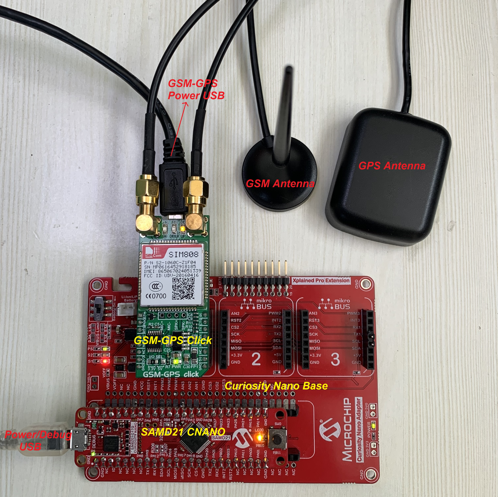
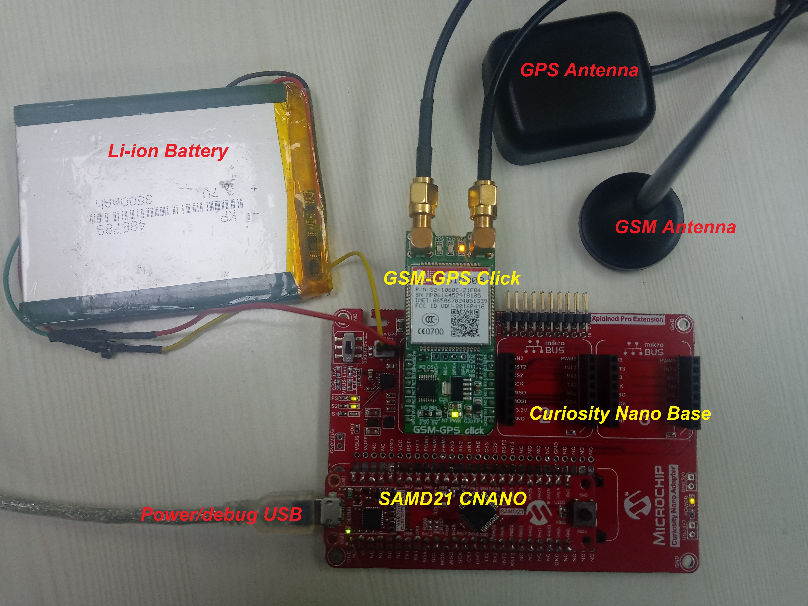

# Location Tagged SOS Application on SAM D21 Curiosity Nano and Nano Base for Click boards
<h2 align="center"> <a href="https://github.com/MicrochipTech/MPLAB-Harmony-Reference-Apps/releases/latest/download/location_sos.zip" > Download </a> </h2>

-----

## Description:

> The application demonstrates the solution based on Microchip products in a personal emergency or to communicate a distress signal by sending out a location-tagged SOS SMS. The Mikroelektronika GSM-GPS click board, used in this application, contains a hardware module that combines the GSM/GPRS and GPS functionality used to track the device and send out the emergency or distress signal. The MCU is interfaced with the GPS module over the UART interface to perform the GPS coordinates' acquisition and tracking. It registers the event callbacks for location tracking of the GPS receiver.

> The application arranges the GSM/GPRS module for sending SMS to a configured mobile phone number. Once the GPS position is available, the application sends the following location-tagged SOS SMS to the configured mobile phone number when the emergency switch is pressed..

> SAM D21 Curiosity Nano Location tagged SOS.  
    Please attend emergency at:  
    Latitude : xx.xxxxxx  
    Longitude : xx.xxxxxx  
    Altitude : xx.xxxxxx

## Modules/Technology Used:

- Peripheral Modules      
	- Timer
	- EIC
	- NVM
- Driver Modules
	- USART Driver
- STDIO Library

## Hardware Used:

- [SAM D21 Curiosity Nano Evaluation Kit](https://www.microchip.com/Developmenttools/ProductDetails/DM320119)   
- [Curiosity Nano Base for click boards](https://www.microchip.com/Developmenttools/ProductDetails/AC164162)
- [GSM-GPS click](https://www.mikroe.com/gsm-gps-click)
- Li-ion or Lipo Battery (optional)

## Software/Tools Used:
 *This project has been verified to work with the following versions of software tools:*  

 - [MPLAB Harmony v3 "csp" repo v3.9.1](https://github.com/Microchip-MPLAB-Harmony/csp/releases/tag/v3.9.1)
 - [MPLAB Harmony v3 "core" repo v3.9.1](https://github.com/Microchip-MPLAB-Harmony/core/releases/tag/v3.9.1)
 - [MPLAB Harmony v3 "dev_packs" repo v3.9.0](https://github.com/Microchip-MPLAB-Harmony/dev_packs/releases/tag/v3.9.0)  
 - [MPLAB Harmony v3 "mhc" repo v3.7.2](https://github.com/Microchip-MPLAB-Harmony/mhc/releases/tag/v3.7.2)
 - MPLAB Harmony 3 Launcher Plugin v3.6.4
 - [MPLAB X IDE v5.50](https://www.microchip.com/mplab/mplab-x-ide)
 - [MPLAB XC32 Compiler v3.00](https://www.microchip.com/mplab/compilers)  

 *Because Microchip regularly update tools, occasionally issue(s) could be discovered while using the newer versions of the tools. If the project doesn’t seem to work and version incompatibility is suspected, It is recommended to double-check and use the same versions that the project was tested with.* 

## Setup 1: Uses Separate power supplies for SAMD21 Curiosity Nano and GSM-GPS Click
- Mount SAM D21 Curiosity Nano Evaluation Kit on "CNANO56_HOST_CONN"(U3) connector of Curiosity Nano Base board
- Mount GSM-GPS click board on mikro bus click 1 connector of Curiosity Nano Base and connect the GPS and GSM antennas on GSM-GPS click board connectors
- Power the SAM D21 Curiosity Nano Evaluation Kit from a Host PC through a Type-A male to Micro-B USB cable connected to Micro-B port (J105)
- Wait for about 60 seconds
- Power the GSM-GPS click board from a Host PC through a Type-A male to Micro-B USB cable connected to Micro-B port of GSM-GPS click

## Setup 2: Uses Li-ion battery
- Mount SAM D21 Curiosity Nano Evaluation Kit on "CNANO56_HOST_CONN"(U3) connector of Curiosity Nano Base board.
- Mount GSM-GPS click board on mikro bus click 1 connector of Curiosity Nano Base and connect the GPS and GSM antennas on GSM-GPS click board connectors.
- Connect Li-ion or Lipo Battery on J1 connector and make sure SW1 slider switch is moved to Battery on position in Curiosity Nano Base board.   
- Power the SAM D21 Curiosity Nano Evaluation Kit from a Host PC through a Type-A male to Micro-B USB cable connected to Micro-B port (J105).  

## Programming hex file:
The pre-built hex file can be programmed by following the below steps.  

### Steps to program the hex file
- Open MPLAB X IDE
- Close all existing projects in IDE, if any project is opened.
- Go to File -> Import -> Hex/ELF File
- In the "Import Image File" window, Step 1 - Create Prebuilt Project, Click the "Browse" button to select the prebuilt hex file.
- Select Device has "ATSAMD21G17D"
- Ensure the proper tool is selected under "Hardware Tool"
- Click on Next button
- In the "Import Image File" window, Step 2 - Select Project Name and Folder, select appropriate project name and folder
- Click on Finish button
- In MPLAB X IDE, click on "Make and Program Device" Button. The device gets programmed in sometime
- Follow the steps in "Running the Demo" section below

## Programming/Debugging Application Project:
- Open the project (location_sos\firmware\sam_d21_cnano.X) in MPLAB X IDE
- Ensure "PKOB nano" is selected as hardware tool to program/debug the application
- Build the code and program the device by clicking on the "make and program" button in MPLAB X IDE tool bar
- Follow the steps in "Running the Demo" section below

## Running the Demo:
- Open Tera Term, connect to serial console. If there is any connection issue on tera terminal, unplug
  the USB cable connected to Micro-B port and reconnect it back
- Change the baud rate to 115200
- Perform a reset by unplugging the power cable of SAM D21 Curiosity Nano
- After power up, The LEDs on GSM-GPS click boards gives the following indications:
	- LED marked STA is on; this indicates the GSM module is switching on
	- LED marked TXA is blinking, this indicates the GPS acquisition and position data is exchanged by the receiver
	- LED marked PPS is off. The PPS LED indicates pulse-per-second signal for precise timing. It glows on, after successful positioning
- After one minute, the GPS achieves successful position as indicated by the blinking of LED PPS.
### Note:
- The GPS on the GSM-GPS click has a one second Time-To-First-Fix (TTFF) from a hot start and 30 seconds from cold start
- If the position is not achieved after 1 minute, then:
	- It could be because of non-availability of GPS signals. Make sure that you have placed
	  the GPS antenna such that it can receive the signals from the GPS satellites. Try placing
      it under the open sky to be able to receive signals
	- After using the option above, if the device is still not receiving the position indication,
      try resetting the board by unplugging the power cable of SAM D21 Curiosity Nano board and
      turn off and turn on the battery supply by sliding SW1 switch on Curiosity Nano Base or unplug
      the power cable of GSM-GPS Click board
- Once the GPS position is achieved, user can press switch SW0 on SAM D21 Curiosity Nano board to send SMS to configured mobile number with GPS location.
- GSM module sends below message to configured mobile number
      SAM D21 Curiosity Nano Location tagged SOS  
      Please attend emergency at:  
      Latitude : xx.xxxxxx  
      Longitude : xx.xxxxxx  
      Altitude : xx.xxxxxx    
      http://maps.google.com/maps?q=loc:xx.xxxxxx(Latitude),xx.xxxxxx(Longitude)          
- User can change the mobile number by long pressing (more than 4 seconds) switch SW0 on SAM D21
   Curiosity Nano board. An option will be displayed on serial terminal to update the cell phone number
- Updated cell phone number is stored in NVM memory, updated number will be used further to send SMS,
   even after power reset
- If GPS position is not achieved, short pressing SW0 on SAM D21 Curiosity Nano board sends a blank SMS
   without GPS location.

## Comments:
- Reference Training Module: [Getting Started with Harmony v3 Peripheral Libraries on SAM D21 MCUs](https://microchipdeveloper.com/harmony3:samd21-getting-started-training-module)
- This application demo builds and works out of box by following the instructions above in "Running the Demo" section. If you need to enhance/customize this application demo, you need to use the MPLAB Harmony v3 Software framework. Refer links below to setup and build your applications using MPLAB Harmony.
	- [How to Setup MPLAB Harmony v3 Software Development Framework](https://www.microchip.com/mymicrochip/filehandler.aspx?ddocname=en1000821)
	- [How to Build an Application by Adding a New PLIB, Driver, or Middleware to an Existing MPLAB Harmony v3 Project](http://ww1.microchip.com/downloads/en/DeviceDoc/How_to_Build_Application_Adding_PLIB_%20Driver_or_Middleware%20_to_MPLAB_Harmony_v3Project_DS90003253A.pdf)  

## Revision:
- v1.3.0 - Regenerated and tested application.
- v1.2.0 - Regenerated and tested application.
- v1.1.0 regenerated and tested the demo application
- v1.0.0 released demo application
