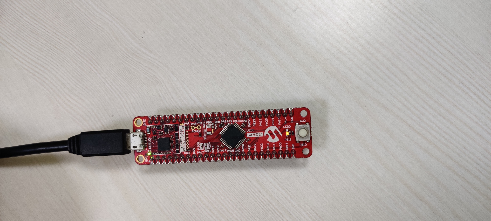
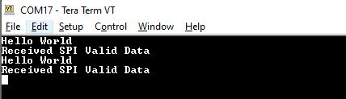
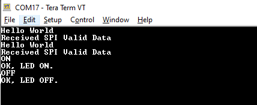

# Application migration from 8-bit PIC18F to 32-bit SAM D21 on SAM D21 Curiosity Nano
<h2 align="center"> <a href="https://github.com/Microchip-MPLAB-Harmony/reference_apps/releases/latest/download/pic18f_to_samd21_migration.zip" > Download </a> </h2>

-----
## Description:

> This Applications acts as reference for migrating applications from 8-bit PIC Microcontroller (MCU) to 32- bit MCU. This example shows how to migrate an application from PIC18F47Q10 MCU to SAMD21G17D MCU.

> This application uses the PIC18 application which helps in [Getting Started with UART Using EUSART on PIC18](https://github.com/microchip-pic-avr-examples/pic18f47q10-cnano-eusart-commands-fs).  

> The PIC18 application shows how to implement a command line interface. This way, the microcontroller can receive control commands via the EUSART. In this use case, an LED is controlled using commands sent from the MPLAB Data Visualizer.  

> The application shows steps to get started migrating to SAMD21 and later extend the functionality by adding more peripherals.

>The migration application makes use of SAM D21 Curiosity Nano Evaluation Kit and MPLAB® Harmony v3 framework. The application sends "Hello World" message to serial terminal using (SERCOM) USART and utilizes STDIO library to receive the command from the serial terminal to control the LED0 on SAMD21 Curiosity Nano Evaluation Kit. Switch SW0 is configured with External Interrupt controller (EIC) to toggle the LED0, when switch is pressed. It allows demonstrates Serial Peripheral Interface(SPI) self loop back mode and Direct memory Address (DMA) to send SPI self loopback status to the serial terminal.

## Modules/Technology Used:
- Peripheral Modules
	- PORT
	- EIC       
	- SERCOM(SPI)
	- SERCOM(USART)
	- DMA
	- Systick

## Hardware Used:

- [SAM D21 Curiosity Nano Evaluation Kit](https://www.microchip.com/Developmenttools/ProductDetails/DM320119)   
- Connection wires

## Software/Tools Used:
 This project has been verified to work with the following versions of software tools:  

Refer [Project Manifest](./firmware/src/config/sam_d21_cnano/harmony-manifest-success.yml) present in harmony-manifest-success.yml under the project folder *firmware/src/config/sam_d21_cnano*  
- Refer the [Release Notes](../../../release_notes.md#development-tools) to know the **MPLAB X IDE** and **MCC** Plugin version. Alternatively, [Click Here](https://github.com/Microchip-MPLAB-Harmony/reference_apps/blob/master/release_notes.md#development-tools).
- Any Serial Terminal application like Tera Term terminal application.

 Because Microchip regularly update tools, occasionally issue(s) could be discovered while using the newer versions of the tools. If the project doesn’t seem to work and version incompatibility is suspected, It is recommended to double-check and use the same versions that the project was tested with.  To download original version of MPLAB Harmony v3 packages, refer to document [How to Use the MPLAB Harmony v3 Project Manifest Feature](https://ww1.microchip.com/downloads/en/DeviceDoc/How-to-Use-the-MPLAB-Harmony-v3-Project-Manifest-Feature-DS90003305.pdf)

## Setup:
- Connect the SAM D21 Curiosity Nano Development Board to the Host PC as a USB Device through a Type-A male to micro-B USB cable connected to Micro-B USB (Debug USB) port
- Connect a wire from **PA16 to PA19** on SAM D21 Curiosity Nano Development Kit for SPI Self Loopback testing.

## Programming hex file:
The pre-built hex file can be programmed by following the below steps.  

### Steps to program the hex file
- Open MPLAB X IDE
- Close all existing projects in IDE, if any project is opened.
- Go to File -> Import -> Hex/ELF File
- In the "Import Image File" window, Step 1 - Create Prebuilt Project, Click the "Browse" button to select the prebuilt hex file.
- Select Device has "ATSAMD21G17D"
- Ensure the proper tool is selected under "Hardware Tool"
- Click on Next button
- In the "Import Image File" window, Step 2 - Select Project Name and Folder, select appropriate project name and folder
- Click on Finish button
- In MPLAB X IDE, click on "Make and Program Device" Button. The device gets programmed in sometime
- Follow the steps in "Running the Demo" section below

## Programming/Debugging Application Project:
- Open the project (pic18f_to_samd21_migration\firmware\pic18f_to_samd21_migration.X) in MPLAB X IDE
- Ensure "SAM D21 Curiosity Nano" is selected as hardware tool to program/debug the application
- Build the code and program the device by clicking on the "make and program" button in MPLAB X IDE tool bar
- Follow the steps in "Running the Demo" section below

## Running the Demo:
- Open Tera Term and configure it to 9600 baud rate and the standard 8-N-1 frame format
- Enable **Local echo** and select **carriage return + line feed** for transmit
- In Tera Term you should see **Hello World** message displayed
- Below you will see a message **Received SPI Valid Data** indicating SPI self loopback test success  

- Type **ON** in serial terminal and press **Enter** to turn on LED0 on SAMD21 Curiosity Nano kit
- Type **OFF** in serial terminal and press **Enter** to turn off LED0 on SAMD21 Curiosity Nano kit  

- Press Switch **SW0** on the SAMD21 Curiosity Nano kit to toggle the LED0 twice with 500ms of delay.

## Comments:
- Reference Migration Guide: [Application migration from 8-bit PIC18F to 32-bit SAM D21 on SAM D21 Curiosity Nano](https://microchip-mplab-harmony.github.io/quick_docs/source/migration/pic18f_to_samd21_migration/readme.html)
- Reference Training Module: [Getting Started with Harmony v3 Peripheral Libraries on SAM D21 MCUs](https://microchipdeveloper.com/harmony3:samd21-getting-started-training-module)
- [Getting Started with UART Using EUSART on PIC18](http://ww1.microchip.com/downloads/en/Appnotes/Getting-Started-with-UART-Using-EUSART-on-PIC18-90003282A.pdf)
- This application demo builds and works out of box by following the instructions above in "Running the Demo" section. If you need to enhance/customize this application demo, you need to use the MPLAB Harmony v3 Software framework. Refer links below to setup and build your applications using MPLAB Harmony.
	- [How to Setup MPLAB Harmony v3 Software Development Framework](https://ww1.microchip.com/downloads/en/DeviceDoc/How_to_Setup_MPLAB_%20Harmony_v3_Software_Development_Framework_DS90003232C.pdf)
	- [How to Build an Application by Adding a New PLIB, Driver, or Middleware to an Existing MPLAB Harmony v3 Project](http://ww1.microchip.com/downloads/en/DeviceDoc/How_to_Build_Application_Adding_PLIB_%20Driver_or_Middleware%20_to_MPLAB_Harmony_v3Project_DS90003253A.pdf)  
	-  **MPLAB Harmony v3 is also configurable through MPLAB Code Configurator (MCC). Refer to the below links for specific instructions to use MPLAB Harmony v3 with MCC.**
		- [Create a new MPLAB Harmony v3 project using MCC](https://microchipdeveloper.com/harmony3:getting-started-training-module-using-mcc)
		- [Update and Configure an Existing MHC-based MPLAB Harmony v3 Project to MCC-based Project](https://microchipdeveloper.com/harmony3:update-and-configure-existing-mhc-proj-to-mcc-proj)
		- [Getting Started with MPLAB Harmony v3 Using MPLAB Code Configurator](https://www.youtube.com/watch?v=KdhltTWaDp0)
		- [MPLAB Code Configurator Content Manager for MPLAB Harmony v3 Projects](https://www.youtube.com/watch?v=PRewTzrI3iE)	

## Revision:
- v1.5.0 - Removed MHC support, Regenerated and tested application.
- v1.4.0 - Added MCC support, Regenerated and tested application.
- v1.3.0 - Regenerated and tested application.
- v1.2.0 - Regenerated and tested application.
- v1.1.0 released demo application
