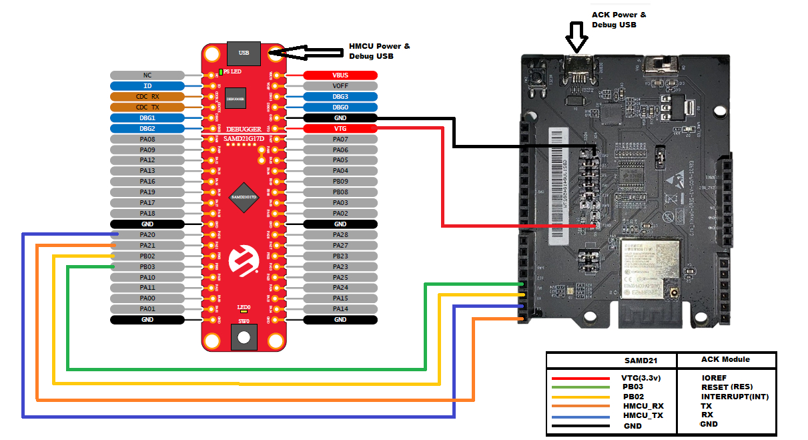
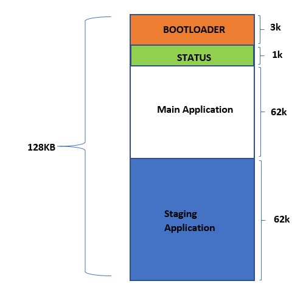
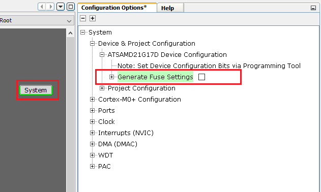

# Amazon Alexa Connect Kit (ACK) OTA Bootloader Application on SAM D21 Curiosity Nano
<h2 align="center"> <a href="https://github.com/Microchip-MPLAB-Harmony/reference_apps/releases/latest/download/samd21_amazon_ack.zip" > Download </a> </h2>

-----

## Description:

> The Application demonstrates the usage OTA upgrade feature on SAMD21 Curiosity Nano evaluation kit using Amazon Alexa connect kit(ACK) SDK. The communication between SAM D21 Curiosity Nano and ACK Module is through UART interface.  

This following bullet points provides links to the detailed topics:  
- [Modules/Technology Used](#Modules-Technology-Used)  
- [Hardware Used](#Hardware-Used)  
- [Software/Tools Used](#software-Tools-Used)  
- [Hardware Setup](#Hardware-setup)  
- [Setting up the build platform](#setting-up-the-build-platform)  
- [Project file structure](#project-structure)  
- [Steps to program the hex file](#steps-to-program-the-hex-file)  
- [OTA Architecture](#ota-architecture)  
- [Setting up environment for OTA update](#setting-up-environment-for-OTA-update)  
- [Building and upgrading the latest application firmware](#building-the-ota-application)  
- [Comments](#comments)

## 
## Modules/Technology Used:
- Peripheral Modules      
	- SERCOM
	- Systick
	- Port
	- NVMCTRL

## 
## Hardware Used:

- [SAM D21 Curiosity Nano Evaluation Kit](https://www.microchip.com/Developmenttools/ProductDetails/DM320119)   
- [Espressif Alexa Connect Kit - ACK Module](https://developer.amazon.com/en-US/docs/alexa/ack/get-ack-development-kit.html)
- Connection wires

## 
## Software/Tools Used:

 This project has been verified to work with the following versions of software tools:  

Refer [Project Manifest](./firmware/src/config/default/harmony-manifest-success.yml) present in harmony-manifest-success.yml under the project folder *firmware/src/config/default*  
- Refer the [Release Notes](../../../../release_notes.md#development-tools) to know the **MPLAB X IDE** and **MCC** Plugin version. Alternatively, [Click Here](https://github.com/Microchip-MPLAB-Harmony/reference_apps/blob/master/release_notes.md#development-tools) 
- Python 3.8

 Because Microchip regularly update tools, occasionally issue(s) could be discovered while using the newer versions of the tools. If the project doesn’t seem to work and version incompatibility is suspected, It is recommended to double-check and use the same versions that the project was tested with.  To download original version of MPLAB Harmony v3 packages, refer to document [How to Use the MPLAB Harmony v3 Project Manifest Feature](https://ww1.microchip.com/downloads/en/DeviceDoc/How-to-Use-the-MPLAB-Harmony-v3-Project-Manifest-Feature-DS90003305.pdf)

## 
## Hardware Setup:
### Hardware connections for Validation
- Connect Pin "PB02(ACK HOST INTERRUPT Pin)" of *SAM D21 Curiosity Nano Evaluation Kit* to "INT"(INST) pin of *ACK Module*
- Connect Pin "PB03(ACK MODULE RESET Pin)" of *SAM D21 Curiosity Nano Evaluation Kit* to "RESET"(RES) pin of *ACK Module*  
- Connect Pin "PA20(Host MCU TX)" of *SAM D21 Curiosity Nano Evaluation Kit* to "ACK RX" pin of *ACK Module*  
- Connect Pin "PA21(Host MCU RX)" of *SAM D21 Curiosity Nano Evaluation Kit* to "ACK TX" pin of *ACK Module*
- Connect Pin "VTG(Voltage Target)" of *SAM D21 Curiosity Nano Evaluation Kit* to "IOREF" pin of *ACK Module*
- Connect common ground between *SAM D21 Curiosity Nano Evaluation Kit* and *ACK Module*
- Power the *SAM D21 Curiosity Nano Evaluation Kit* Evaluation Kit from a Host PC through a Type-A male to Micro-B USB cable connected to Micro-B port (J105)
- Power the *ACK Module* from a Host PC through a Type-A male to Micro-B USB cable connected to Micro-B port (DEBUG)  
	

## 
## Setting up the build platform
- Download and extract [ACK Device SDK 4.2](https://developer.amazon.com/alexa/console/ack/resources) from Amazon developer website.
- Copy and paste extracted  SAM D21 ACK port folder "samd21_amazon_ack" into ACK device SDK's user platform folder  
  `<Your ACK SDK Downloaded folder>/ACK_Device_SDK_4.2.202201251359/user/platform`

**Note**
- Make sure you create **amazon.com** account for downloading the SDK. You would use your Amazon credentials to register your development device (amazon.com account provides an option to register your development device.)
- "ACK Module with Espressif chipset" is used in these demo's. make sure you download proper ACK SDK from the Amazon website
- [Create Product](https://developer.amazon.com/alexa/console/ack/products) and add device capablities to the product once product is created.
- Download the product configuration file from created product and provision the Ack module using [CLI command](https://developer.amazon.com/en-US/docs/alexa/ack/provision-module-tutorials.html)

## 
## Project file structure
- ACK SDK file/directory structure, refer "Readme.txt" in  
`<Your ACK SDK Downloaded folder>\ACK_Device_SDK_4.2.202201251359\`
- SAM D21 ACK port file/directory is as follows
  - user/platform/samd21_amazon_ack/
    - **applications**                : Contains all the ACK host sample applications built on MPLABX Tools and xc32 compiler
    - **bootloader**                  : Contains bootloader for over-the-air(OTA) firmware upgrade feature
    - **hmcu_port**                   : Contains shared host specific platform and OTA files
    - **ota**                         : Contains OTA source, config and header files
    - **ack_samd21_cutom_loader.c**   : Contains bootloader specific code
    - **ack_samd21_platform.c**       : Contains SAMD21 platform specific code 

## Programming hex file:
The pre-built hex file can be programmed by following the below steps.  
## 
### Steps to program the hex file
- Open MPLAB X IDE
- Close all existing projects in IDE, if any project is opened.
- Go to File -> Import -> Hex/ELF File
- In the "Import Image File" window, Step 1 - Create Prebuilt Project, Click the "Browse" button to select the prebuilt hex file.
- Select Device has "ATSAMD21G17D"
- Ensure the proper tool is selected under "Hardware Tool"
- Click on Next button
- In the "Import Image File" window, Step 2 - Select Project Name and Folder, select appropriate project name and folder
- Click on Finish button
- In MPLAB X IDE, click on "Make and Program Device" Button. The device gets programmed in sometime
- Follow the steps in "Running the Demo" section below

## 
### OTA architecture
- The *SAM D21 Curiosity Nano Evaluation Kit* has SAMD21G17D microcontroller mounted on it.
- The SAMD21G17D has 128 KB of flash memory. For the implementation of OTA, the flash memory is divided into 4 sections/regions namely Bootloader, Status , Primary and Staging partition
	 - **Bootloader** : This section starts from the top of the flash and has a size of 3KB. It is used to store the bootloader application. The bootloader checks whether a new version of the application firmware is present or not in the staging region. if present, the bootloader upgrades the application firmware from the staging region to primary memory region and runs the latest application firmware from the primary memory region; if not present, the bootloader runs the existing application firmware in the primary memory region.
	 - **Status** : This section starts from end of the bootloader region and has a size of 1KB. It stores known pattern to indicate that a new version of application firmware is present in staging region.
	 - **Primary** : It starts from end of the status region and has a size of 62KB. The primary region holds the application firmware.  
	 - **Staging**: It starts from end of the primary partition and has a size of 62KB. The staging region holds a new version of the application firmware which needs to be upgraded.  

	   

## 
### Setting up environment for OTA update
- Open the project (`samd21_amazon_ack\bootloader\firmware\sam_d21_cnano.X`) in MPLAB X IDE
- Build the code by clicking on the "*Clean and Build project*" button in MPLAB X IDE tool bar, but **do not program**
- Open the project (`samd21_amazon_ack/applications/HelloWorld/firmware/sam_d21_cnano.X`) in MPLAB X IDE
- Open the MPLAB Harmony 3 Configurator (MHC) from **Tools > MPLAB Harmony 3 Configurator** for HelloWorld project
- After successful opening of MHC, in **Project Graph** select **System** and disable **Generate Fuse Settings** as shown below and generate the code  
	 
- Change the memory configuration in project properties **(Right click on HelloWorld_sam_d21_cnano project > select properties > select xc32-ld > Symbols & Macros)**
- Change the **Preprocessor macro definitions** as below to place the code in primary region  
`ROM_ORIGIN=0x1000; ROM_LENGTH=0xF800`
- Define "**ACK_HOST_FIRMWARE_UPDATE**" in HelloWorld application file "ack_user_config.h"
- Increase Memory pool size macro "**ACK_MEMORY_POOL_SIZE**" value to 684 in ack_user_configh.h
- Build the code by clicking on the "Clean and Build project" button in MPLAB X IDE tool bar, but **do not program**.
- Navigate to **ota > utility** folder inside 'Your ACK SDK Downloaded folder' and run "hexmerge.py" script to merge bootloader and HelloWorld project's hex file

		python hexmerge.py -o bootloader_helloworld_combined.hex -f your_sdk_folder/user/platform/samd21_amazon_ack/bootloader/firmware/sam_d21_cnano.X/dist/default/production/sam_d21_cnano.X.production.hex your_sdk_folder/user/platform/samd21_amazon_ack/applications/HelloWorld/firmware/sam_d21_cnano.X/dist/default/production/sam_d21_cnano.X.production.hex
- Program "bootloader_helloworld_combined.hex" to *SAM D21 Curiosity Nano Evaluation Kit* by following steps in [Steps to program the hex file](#steps-to-program-the-hex-file) section.

**Note**
- Output file "bootloader_helloworld_combined.hex" will be present in utility folder if specific path is not specified while running script.
- The fuse settings are not programmable through firmware and enabling the fuse settings increases the size of the binary when generated through the Hex file, So disabling it.

## 
### Building and upgrading the latest application firmware

- Open the project (`samd21_amazon_ack/applications/HelloWorld/firmware/sam_d21_cnano.X`) in MPLAB X IDE
- Change the firmware version from 1 to 2 in "ACKUser_GetFirmwareVersion" function in file 'ack_user_device.c'
- Build the code by clicking on the "Clean and Build project" button in MPLAB X IDE tool bar, but **do not program**
- Navigate to **ota > utility** folder inside 'Your ACK SDK Downloaded folder' and run "hex2ota.py" script to create a file suitable for uploading as latest application image from a hex file that was created by building the HelloWorld application.

		python hex2ota.py --device-type ACKTESTDEVICE <Your ACK SDK Downloaded folder>/user/platform/samd21_amazon_ack/applications/HelloWorld/firmware/sam_d21_cnano.X/dist/default/production/sam_d21_cnano.X.production.hex SecondOtaFirmware.ota

  * "--device-type" : USER Device Type should be enterted, for example here it is used as "ACKTESTDEVICE"
- Upgrade the firmware using amazon portal
- once successfully completed, click on Switch SW0 on SAMD21 Curiosity Nano to reset the device.

**Note**
- The Switch SW0 is implemented to reset the device on press.

## Comments:
- If you wish to remove the firmware update feature from your application undefine "ACK_HOST_FIRMWARE_UPDATE" Macro in "ack_user_config.h" and change **Preprocessor macro definitions** settings to default.
- Reference Training Module: [Getting Started with Harmony v3 Peripheral Libraries on SAM D21 MCUs](https://microchipdeveloper.com/harmony3:samd21-getting-started-training-module)
- This application demo builds and works out of box by following the instructions above in "Running the Demo" section. If you need to enhance/customize this application demo, you need to use the MPLAB Harmony v3 Software framework. Refer links below to setup and build your applications using MPLAB Harmony.
	- [How to Setup MPLAB Harmony v3 Software Development Framework](https://ww1.microchip.com/downloads/en/DeviceDoc/How_to_Setup_MPLAB_%20Harmony_v3_Software_Development_Framework_DS90003232C.pdf)  
	- [How to Build an Application by Adding a New PLIB, Driver, or Middleware to an Existing MPLAB Harmony v3 Project](http://ww1.microchip.com/downloads/en/DeviceDoc/How_to_Build_Application_Adding_PLIB_%20Driver_or_Middleware%20_to_MPLAB_Harmony_v3Project_DS90003253A.pdf)  
	-  **MPLAB Harmony v3 is also configurable through MPLAB Code Configurator (MCC). Refer to the below links for specific instructions to use MPLAB Harmony v3 with MCC.**
		- [Create a new MPLAB Harmony v3 project using MCC](https://microchipdeveloper.com/harmony3:getting-started-training-module-using-mcc)
		- [Update and Configure an Existing MHC-based MPLAB Harmony v3 Project to MCC-based Project](https://microchipdeveloper.com/harmony3:update-and-configure-existing-mhc-proj-to-mcc-proj)
		- [Getting Started with MPLAB Harmony v3 Using MPLAB Code Configurator](https://www.youtube.com/watch?v=KdhltTWaDp0)
		- [MPLAB Code Configurator Content Manager for MPLAB Harmony v3 Projects](https://www.youtube.com/watch?v=PRewTzrI3iE)

### Revision:
- v1.5.0 Updated to support Amazon ACK SDK 4.2 and ACK module with Espressif chipset
- v1.4.0 Added MCC support, Regenerated and tested application.
- v1.3.0 Updated to support Amazon ACK SDK 4.1
- v1.2.0 Updated to support Amazon ACK SDK 3.2
- v1.1.0 released demo application
