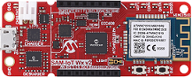

# SAM D21 IoT v2 Development Board
<h4 align="left">  </h4>

This folder contains the MPLAB® Harmony 3 reference applications developed on [SAM D21 IoT Wx v2 Development Board](https://www.microchip.com/DevelopmentTools/ProductDetails/).

|SI No| Demo Name | Download Link |
| --- | --- | -- |
| 1 | [Google Cloud IoT Core](./samiot2_google_cloud_core/readme.md) | [Click Here](https://github.com/Microchip-MPLAB-Harmony/reference_apps/releases/latest/download/samiot2_google_cloud_core.zip) |
| 2 | [AWS Cloud IoT Core](./samiot2_aws_cloud_core/readme.md) | [Click Here](https://github.com/Microchip-MPLAB-Harmony/reference_apps/releases/latest/download/samiot2_aws_cloud_core.zip) |
| 3 | [Microsoft Azure Cloud IoT Core](./samiot2_azure_cloud_core/readme.md) | [Click Here](https://github.com/Microchip-MPLAB-Harmony/reference_apps/releases/latest/download/samiot2_azure_cloud_core.zip) |

For more application demos on [SAM D21 IoT Wx v2 Development Board](https://www.microchip.com/DevelopmentTools/ProductDetails/) and other Development Boards/Kits having the same part number **(ATSAMD21G18A)** <a href="https://mplab-discover.microchip.com/v1/itemtype/com.microchip.ide.project?s0=ATSAMD21G18A" target="_blank"> CLICK HERE </a>
